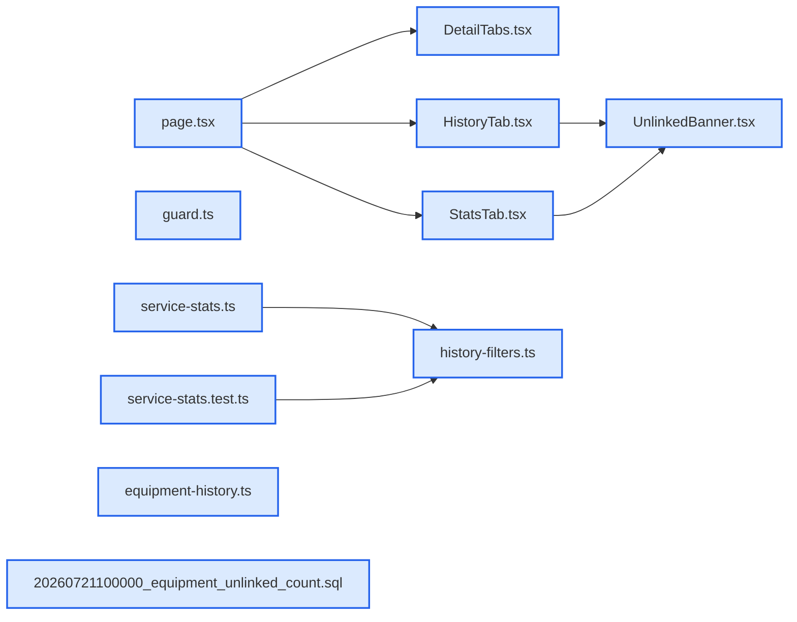

# jhtechSaaS — Dev Note: AS-History-Part2-3-Equipment-Detail-Stats

> **📅 Date:** 2026-07-22 · **🗂️ Project:** jhtechSaaS · **🏷️ Main Task:** AS-History-Part2-3-Equipment-Detail-Stats
> **👤 Author:** — · **🔖 Tags:** as-history, equipment-detail, stats, autoplan, dual-voice, rls, supabase, nextjs

---

## TL;DR

AS 히스토리 Part 2(#243 장비 상세+모델별 AS 이력 탭)와 Part 3(#244 모델별 통계 탭)을 하루에 연속으로 autoplan(dual-voice)→TDD 구현→diff 리뷰→PR 머지→prod 배포까지 완료. codex 복구 후 첫 실전 dual-voice가 이슈 스펙의 치명 결함(권한 키 오인, 조회 경로 단일원본 위반, 무효 리포트의 300 표본 잠식)을 구현 전에 잡아냄.

---

## Code Structure

오늘 변경된 파일 간 의존 관계 (자동 분석):



---

## Today's Work

### ✨ `feat(admin/equipment)`: 장비 상세 페이지 + 모델별 AS 이력 탭 (#243, PR#250)

**Status:** `completed`  
**Files changed:** `apps/web/src/app/admin/equipment/[id]/page.tsx`, `apps/web/src/app/admin/equipment/[id]/_components/DetailTabs.tsx`, `apps/web/src/app/admin/equipment/[id]/_components/HistoryTab.tsx`, `apps/web/src/lib/equipment/history-filters.ts`, `apps/web/src/lib/service-reports/equipment-history.ts`, `apps/web/src/lib/auth/guard.ts`, `supabase/migrations/20260721100000_equipment_unlinked_count.sql`

#### 📋 Context (왜)

장비 카탈로그에 상세 페이지가 없어 모델 단위 AS 이력을 볼 자리가 없었다. 영업 전원이 들어갈 수 있는 장비 허브가 Part 3 통계의 껍데기.

#### 🔨 Implementation (무엇을 어떻게)

가드 = 리포트 조회 3키(write/view/view_all) ∪ equipment.manage(이슈의 view_all 단독은 영업 전원 403이었을 결함 — autoplan이 사전 포착). 이력 조회 = service_reports.catalog_equipment_id 직접 + status 명시(company_equipment 조인이면 영업 RLS로 타 담당 고객 이력이 조용히 반쪽). 필터(고장 OR·기간 KST·유무상·고객명·무효)는 전부 URL 쿼리를 shallow replaceState로 갱신. 미연결 안내 = SECURITY DEFINER 카운트 RPC(match_catalog_equipment 재사용·내부 권한검사). 기존 목록 무가드·new/edit 가드 반환값 미검사 결함도 동시 수정.

#### 💻 Key Code

**`apps/web/src/lib/service-reports/equipment-history.ts`**

```typescript
.eq("catalog_equipment_id", equipmentId)
.in("status", ["issued", "voided"])
.order("issued_at", { ascending: false, nullsFirst: false })
```

_단일 원본 직접 조회 — 조인 경로의 RLS 반쪽 화면 원천 차단_

#### 📐 Architecture Decisions (ADR)

**Decision:** 프리미스 게이트 C안: 원문 스코프 전체(필터 3종·미연결 안내) + 결함만 수정


**Decision:** 미연결 안내 = RPC 정확 집계(DB 무변경 포기, 마이그 1건)


**Decision:** PDF = 기존 admin 패턴 재사용하되 클릭 제스처 내 창 확보


#### 🐛 Problems & Solutions

**Problem:** 


**Problem:** 


#### 💡 Learnings

- URL 단일원본 필터 UI는 router.replace 금지(키 입력마다 RSC 풀 재조회) — shallow replaceState
- await 뒤 window.open은 모바일 팝업 차단 — 제스처 안에서 창 먼저 확보

---

### ✨ `feat(admin/equipment)`: 모델별 AS 통계 탭 (#244, PR#251)

**Status:** `completed`  
**Files changed:** `apps/web/src/lib/equipment/service-stats.ts`, `apps/web/src/lib/equipment/service-stats.test.ts`, `apps/web/src/app/admin/equipment/[id]/_components/StatsTab.tsx`, `apps/web/src/app/admin/equipment/[id]/_components/UnlinkedBanner.tsx`

#### 📋 Context (왜)

개별 리포트로는 안 보이는 패턴(무엇이 자주, 얼마 만에 고장나는가)을 모델 단위로. prod 표본 4건이라 표본 정직성(참고용 꼬리표)이 설계 핵심.

#### 🔨 Implementation (무엇을 어떻게)

순수함수 4종(고장 Top10·간격 평균/중앙값·월별 KST 버킷·유무상) — 전처리 내재화 계약(voided 필터·null 드롭·그룹 내 ASC 재정렬을 함수 내부가 책임) + 모델 무관 시그니처(횡단 뷰 재사용 대비). StatsTab은 서버 컴포넌트(계산은 테스트된 viewmodel, 카드는 바보 컴포넌트). 통계 조회는 issued 전용 301-fetch + 무효 count 분리 — 이력 쿼리 공유 시 최근 무효가 300 표본을 잠식. 단위 블록 차트(1블록=1건, 비례 막대 금지 하우스 룰 계승).

#### 💻 Key Code

**`apps/web/src/lib/equipment/service-stats.ts`**

```typescript
function kstYearMonth(ms: number): string {
  const d = new Date(ms + KST_OFFSET_MS);
  return `${d.getUTCFullYear()}-${String(d.getUTCMonth() + 1).padStart(2, "0")}`;
}
```

_KST 월 앵커 — periodCutoffKst(일 앵커) 재사용 시 부분월 버그_

#### 📐 Architecture Decisions (ADR)

**Decision:** 프리미스 게이트: Codex '파일럿 먼저·데이터 품질 패널' 중단 권고 vs Claude 조건부 진행 → 사용자 A안(진행·파일럿 병행)


**Decision:** 중앙값 = 주 지표(제목도 '고장 주기(중앙값 기준)'로 정직화)


**Decision:** RTL 컴포넌트 테스트 미도입 — 바보 컴포넌트+순수함수 패턴 유지


**Decision:** e2e = 0건 빈 상태로 재정의(발행 리포트는 시드 불가 — 트리거가 service_role에도 draft 강제)


#### 🐛 Problems & Solutions

**Problem:** 


**Problem:** 


#### 💡 Learnings

- 집계 함수의 일반화 본체는 시그니처가 아니라 전처리 내재화 — 호출부 필터 의존이면 재사용 시 그대로 터짐
- 월별 통계는 발행 시각 기준 KST 달력 월 앵커 — TZ 비의존 unit(KST 자정 ±1h) 필수(로컬 KST·Vercel UTC 괴리)

---

## 🎯 Prompt Library

> 오늘 Claude Code에게 보낸 프롬프트 중 학습 가치가 있는 것들.

### ✅ 잘 통한 프롬프트: autoplan 이슈 리뷰 위임

```
start → (메모리 기반) #243 /autoplan 검토부터 진행
```

**교훈:** 이슈 번호+선행 맥락(Part 1 머지 상태)만 args로 넘기면 dual-voice가 스펙의 사실 전제를 코드로 전수 검증한다. 스펙 결함은 구현 전에 잡는 게 10배 싸다.

### ✅ 잘 통한 프롬프트: 연속 세션 지시

```
다음 세션 바로 진행하자
```

**교훈:** 같은 파이프라인(autoplan→TDD→diff 리뷰→머지)이 확립돼 있으면 한 줄 지시로 두 번째 기능이 동일 품질로 완주된다. 게이트(프리미스·최종 승인)만 사용자 결정으로 남긴다.

---

## 📚 References & 외부 학습

- **[PR #250 — 장비 상세+AS 이력](https://github.com/jhtechsmart-cloud/jhtechSaaS/pull/250)** `pr`
    - 가드 3키·catalog 직접 조회·기존 가드 결함 동시 수정
- **[PR #251 — 모델별 통계 탭](https://github.com/jhtechsmart-cloud/jhtechSaaS/pull/251)** `pr`
    - 순수함수 4종·issued 전용 301-fetch·DB 무변경
- **[#243 스펙 오버라이드 코멘트](https://github.com/jhtechsmart-cloud/jhtechSaaS/issues/243#issuecomment-5029026271)** `spec`
    - 이슈 본문 대비 확정 수정사항(세션26 확립 패턴)
- **[#244 스펙 오버라이드 코멘트](https://github.com/jhtechsmart-cloud/jhtechSaaS/issues/244#issuecomment-5029452138)** `spec`
    - 27건 결정·Testing Plan 자기모순 해소

---

## 📋 Changes Summary

### Added

- /admin/equipment/[id] 상세 페이지(개요/AS 이력/통계 3탭)
- service-stats.ts 집계 순수함수 4종(unit 24)
- count_unlinked_company_equipment RPC(마이그 20260721100000)
- history-filters.ts 필터 순수 로직(unit 18)
- RLS db-tests equipment_history 9종
- e2e equipment-detail 6종

### Changed

- 장비 목록 행클릭 = 상세(수정은 연필 아이콘 manage만)
- 사이드바 장비 메뉴 = 리포트 조회 3키 ∪ manage
- EquipmentReportRow에 company_equipment_id·free_reason 추가
- 무효화 액션이 장비 상세 경로도 revalidate

### Fixed

- equipment 목록 무가드·new/edit 가드 반환값 미검사(forbidden에도 폼 렌더)
- 무효 리포트의 300 표본 잠식(통계 issued 전용 fetch 분리)
- null issued_at의 NULLS FIRST 300 슬롯 잠식(nullsFirst:false)

---

## ⏭️ Next Steps

- [ ] #243+#244 실동작 확인(admin 3탭·영업 읽기전용·기사 파일럿 실데이터)
- [ ] #245 Part 4(장비 옵션) → #246
- [ ] 기사 파일럿 1건(Seonje — 기술부 계정 /field)
- [ ] 이월: as.jhtech.co.kr DNS·HIWORKS 토큰·알림톡 심사·횡단 통계 대시보드(백로그 1순위)

---

## 🤖 Claude Code Hints

> **For future Claude Code sessions reading this note:**
> 장비 상세의 리포트 데이터는 이력 탭(issued+voided 300)과 통계 탭(issued 전용 301-fetch+voided count)이 별도 계약이다 — 합치면 무효가 표본을 잠식한다. 집계 순수함수는 service-stats.ts의 전처리 내재화 계약(voided·null·정렬 내부 책임)을 지켜 재사용하고, URL 필터 UI는 router.replace가 아니라 shallow window.history.replaceState를 쓴다.

**Reusable patterns introduced today:**

- `전처리 내재화 집계 함수` — row[] 입력 순수함수가 voided 필터·null 드롭·정렬을 내부에서 책임지고 제외 건수를 반환 — 호출부가 어떤 순서/상태로 줘도 안전, 횡단 뷰 재사용 가능
    - 파일: `apps/web/src/lib/equipment/service-stats.ts`
- `shallow URL 필터 상태` — 필터 상태 = URL 단일 원본 + window.history.replaceState(서버 재조회 없는 shallow 갱신, useSearchParams 연동)
    - 파일: `apps/web/src/lib/equipment/history-filters.ts`
- `표본 정직성 카드` — StatsCard 셸(카드별 표본 단위 뱃지+참고용 코랄 칩+무효 제외 표기) — 적은 표본을 숨기지 않고 꼬리표
    - 파일: `apps/web/src/app/admin/equipment/[id]/_components/StatsTab.tsx`
