# jhtechSaaS — Dev Note: AS-Staff-Create-281-Department-Branding

> **📅 Date:** 2026-08-19 · **🗂️ Project:** jhtechSaaS · **🏷️ Main Task:** AS-Staff-Create-281-Department-Branding
> **👤 Author:** — · **🔖 Tags:** service-requests, staff-create, autoplan, dual-voice, permissions, department, branding, favicon, supabase-rls, security-definer, storage-policy, wordpress

---

## TL;DR

세션32: ①관리콘솔·고객센터 브랜드 로고/파비콘을 홈페이지 재현테크 사각 마크로 교체(PR#279) ②사용자 부서(영업부/기술부/관리부) 필드 + 직책 문자열 백필 + 의뢰 담당자 배정 목록 영업부만(PR#280) ③A/S 대행 접수(직원 전용) 풀사이클 — /spec(#281) → /autoplan(Claude+Codex 3단 듀얼 보이스, User Challenge로 배정 규칙 변경) → TDD 구현(DEFINER RPC 고객 스코프 검사·스토리지 EXISTS 읽기·멱등·권한 백필 26명) → PR#282 머지·prod db push·라이브. 조사 3건(홈페이지 XTRA 3300 메뉴 404 원인 = 수제 876·SaaS 4603 둘 다 draft / WP 5단 상세페이지·모듈 라이브러리 계획 / 홈페이지 잉크주문·A/S신청 폼 메일 수신자 실측)은 메모리에 저장.

---

## Code Structure

오늘 변경된 파일 간 의존 관계 (자동 분석):

```mermaid
flowchart LR
    N0["devnote_data.json"]
    N1["service-requests-staff.spec.ts"]
    N2["jhtech-mark.png"]
    N3["PortalHeader.tsx"]
    N4["nav.ts"]
    N5["AdminSidebar.tsx"]
    N6["Icon.tsx"]
    N7["MobileNav.tsx"]
    N8["SidebarNav.tsx"]
    N9["UserAvatar.tsx"]
    N10["AssignControl.tsx"]
    N11["CustomerMatchPanel.tsx"]
    N12["DeleteApplicationButton.tsx"]
    N13["RegisterCustomerButton.tsx"]
    N14["StatusControl.tsx"]
    N15["ApplicantInfo.tsx"]
    N16["DeleteQuoteButton.tsx"]
    N17["InstallSurvey.tsx"]
    N18["OptionLists.tsx"]
    N19["Placeholders.tsx"]
    N20["QuoteHero.tsx"]
    N21["QuoteSummaryPanel.tsx"]
    N22["SelectedEquipment.tsx"]
    N23["SitePhotos.tsx"]
    N24["VersionDiff.tsx"]
    N25["VersionHistory.tsx"]
    N26["VersionInfoModal.tsx"]
    N27["page.tsx"]
    N28["CopyBizNoButton.tsx"]
    N29["CustomerHeader.tsx"]
    N30["CustomerKpiStrip.tsx"]
    N31["CreatedToast.tsx"]
    N32["MarkReadOnView.tsx"]
    N33["StatusControl.tsx"]
    N34["page.tsx"]
    N35["ServiceListShell.tsx"]
    N36["StatusBadge.tsx"]
    N37["CompanyPicker.tsx"]
    N38["StaffServiceRequestForm.tsx"]
    N39["page.tsx"]
    N40["DepartmentSelect.tsx"]
    N41["apple-icon.png"]
    N42["favicon.ico"]
    N43["icon.png"]
    N44["BrandMark.tsx"]
    N45["assign-options.ts"]
    N46["actions.ts"]
    N47["history.ts"]
    N48["list-table.ts"]
    N49["queries.ts"]
    N50["channel.ts"]
    N51["schema.ts"]
    N52["staff-actions.ts"]
    N53["staff-schema.ts"]
    N54["actions.ts"]
    N55["delete-blockers.ts"]
    N56["department.ts"]
    N57["password.ts"]
    N58["permissions-ui.ts"]
    N59["seed-admin.ts"]
    N60["helpers.ts"]
    N61["service_requests_staff_create.test.ts"]
    N62["permissions.ts"]
    N63["20260818120000_profiles_department.sql"]
    N64["20260818150000_service_requests_staff_create.sql"]
    N65["20260818150000_service_requests_staff_create_down.sql"]
    N61 --> N60
    N52 --> N53
    N53 --> N51
    N53 --> N50
    N39 --> N38
    N38 --> N37
    N35 --> N36
    N34 --> N36
    N34 --> N33
    N34 --> N32
    N34 --> N31
    N29 --> N28
    N29 --> N30
    N54 --> N58
    N54 --> N57
    N54 --> N55
    N54 --> N56
    N49 --> N47
    N49 --> N48
    N27 --> N14
    N27 --> N10
    N27 --> N13
    N27 --> N20
    N27 --> N25
    N27 --> N24
    N27 --> N26
    N27 --> N16
    N27 --> N12
    N27 --> N15
    N27 --> N11
    N27 --> N17
    N27 --> N23
    N27 --> N22
    N27 --> N18
    N27 --> N21
    N27 --> N19
    N5 --> N6
    N5 --> N9
    N5 --> N8
    N7 --> N6
    N7 --> N8
    N3 --> N4
    style N0 fill:#dbeafe,stroke:#2563eb,stroke-width:2px
    style N2 fill:#dbeafe,stroke:#2563eb,stroke-width:2px
    style N61 fill:#dbeafe,stroke:#2563eb,stroke-width:2px
    style N49 fill:#dbeafe,stroke:#2563eb,stroke-width:2px
    style N41 fill:#dbeafe,stroke:#2563eb,stroke-width:2px
    style N64 fill:#dbeafe,stroke:#2563eb,stroke-width:2px
    style N35 fill:#dbeafe,stroke:#2563eb,stroke-width:2px
    style N7 fill:#dbeafe,stroke:#2563eb,stroke-width:2px
    style N53 fill:#dbeafe,stroke:#2563eb,stroke-width:2px
    style N50 fill:#dbeafe,stroke:#2563eb,stroke-width:2px
    style N34 fill:#dbeafe,stroke:#2563eb,stroke-width:2px
    style N43 fill:#dbeafe,stroke:#2563eb,stroke-width:2px
    style N65 fill:#dbeafe,stroke:#2563eb,stroke-width:2px
    style N62 fill:#dbeafe,stroke:#2563eb,stroke-width:2px
    style N52 fill:#dbeafe,stroke:#2563eb,stroke-width:2px
    style N63 fill:#dbeafe,stroke:#2563eb,stroke-width:2px
    style N54 fill:#dbeafe,stroke:#2563eb,stroke-width:2px
    style N42 fill:#dbeafe,stroke:#2563eb,stroke-width:2px
    style N46 fill:#dbeafe,stroke:#2563eb,stroke-width:2px
    style N1 fill:#dbeafe,stroke:#2563eb,stroke-width:2px
    style N3 fill:#dbeafe,stroke:#2563eb,stroke-width:2px
    style N38 fill:#dbeafe,stroke:#2563eb,stroke-width:2px
    style N56 fill:#dbeafe,stroke:#2563eb,stroke-width:2px
    style N29 fill:#dbeafe,stroke:#2563eb,stroke-width:2px
    style N27 fill:#dbeafe,stroke:#2563eb,stroke-width:2px
    style N45 fill:#dbeafe,stroke:#2563eb,stroke-width:2px
    style N37 fill:#dbeafe,stroke:#2563eb,stroke-width:2px
    style N44 fill:#dbeafe,stroke:#2563eb,stroke-width:2px
    style N59 fill:#dbeafe,stroke:#2563eb,stroke-width:2px
    style N40 fill:#dbeafe,stroke:#2563eb,stroke-width:2px
    style N5 fill:#dbeafe,stroke:#2563eb,stroke-width:2px
    style N39 fill:#dbeafe,stroke:#2563eb,stroke-width:2px
```



---

## Today's Work

### ✨ `feat(service-requests)`: A/S 대행 접수(직원 전용) — 콘솔에서 고객사 검색으로 전화·방문 A/S 직접 접수 (#281 → PR#282)

**Status:** `completed`  
**Files changed:** `supabase/migrations/20260818150000_service_requests_staff_create.sql`, `supabase/rollback/20260818150000_service_requests_staff_create_down.sql`, `packages/db-tests/src/service_requests_staff_create.test.ts`, `packages/shared/src/permissions.ts`, `apps/web/src/lib/service-requests/staff-actions.ts`, `apps/web/src/lib/service-requests/staff-schema.ts`, `apps/web/src/lib/service-requests/channel.ts`, `apps/web/src/app/admin/service-requests/new/page.tsx`, `apps/web/src/app/admin/service-requests/new/StaffServiceRequestForm.tsx`, `apps/web/src/app/admin/service-requests/new/CompanyPicker.tsx`, `apps/web/src/app/admin/service-requests/_components/ServiceListShell.tsx`, `apps/web/src/app/admin/service-requests/[id]/page.tsx`, `apps/web/src/app/admin/customers/[id]/_components/CustomerHeader.tsx`, `apps/web/src/lib/customers/actions.ts`, `apps/web/e2e/service-requests-staff.spec.ts`

#### 📋 Context (왜)

고객은 /support에서 사업자번호로 A/S를 접수하지만 상당수는 영업담당자에게 전화로 접수한다. 콘솔엔 A/S 목록·상세만 있고 '새 접수'가 없어 대신 등록할 길이 없었다. 공개 페이지에 회사명 검색을 여는 것은 고객 명부 유출(enumeration)이라 금지 → 로그인 직원 전용 대행 접수를 만든다.

#### 🔨 Implementation (무엇을 어떻게)

DB: service_requests에 channel(web/phone/visit/other)·created_by·privacy_consent_method(web/verbal)·submission_id(멱등) 추가, biz_no NOT NULL 해제 + 조건부 CHECK(웹은 biz_no 필수, 직원 접수는 company_id·created_by 필수), 트리거 UPDATE 분기에 감사 컬럼 4종 동결, RLS select에 created_by 열람 추가, 스토리지 직원 INSERT 정책 + 읽기는 '자기 배정/접수 건 사진만'(EXISTS, 버킷 전체 개방 금지), SECURITY DEFINER RPC create_service_request_by_staff(권한 + companies RLS와 동일 스코프 검사 + 값 강제 + submission_id 멱등), 기존 영업 계정 권한 백필(claim 보유자→create, prod 26명). 앱: /admin/service-requests/new[?company=] — 회사 피커(RLS 상속·debounce 250ms·2자·10건·키보드·0건 안내+고객 등록 return 복귀) → 우측 고정 고객 카드 → 통화자/회신번호(프리필) → 보유장비 → 증상(autofocus) → 희망일 → 사진(접이식) → 경로 라디오 → 구두 동의 체크 → [A/S 접수] → 상세(접수번호 토스트, 전화 접수·접수자 표시). 진입점 = 고객 상세 [A/S 접수] + 목록 [+ 대행 접수]. 배정 = 고객사 담당영업(웹 접수와 동일, 트리거 무변경) — /autoplan User Challenge에서 Seonje가 B로 결정.

#### 💻 Key Code

**`supabase/migrations/20260818150000_service_requests_staff_create.sql`**

```sql
-- 고객: 필수·실존 + companies RLS와 동일 스코프(본인 담당 OR customers.view_all). DEFINER가 RLS를 우회하므로 명시 검사.
select id, name, biz_no, ceo, phone, email, address into v_co
  from public.companies
 where id = v_company_id
   and (assignee_id = v_uid or public.has_permission(v_uid, 'customers.view_all'))
 for share;
if not found then raise exception '고객을 찾을 수 없습니다'; end if;
```

_SECURITY DEFINER RPC는 companies RLS를 우회하므로 정책과 동일한 스코프 조건을 함수 안에서 다시 검사한다(양쪽 모델 P0 지적)._

**`supabase/migrations/20260818150000_service_requests_staff_create.sql`**

```sql
-- 읽기: view_all 전체 + '자기 배정/접수 A/S 건에 연결된 사진'만(AS 슬롯 한정)
or (
  name ~ '^[0-9a-f-]{36}/(as_photo_1|as_photo_2|as_photo_3)\.(jpg|png|webp)$'
  and exists (
    select 1 from public.service_requests r
    cross join jsonb_each_text(coalesce(r.fields->'photos','{}'::jsonb)) p
    where p.value = storage.objects.name
      and (r.assignee_id = (select auth.uid()) or r.created_by = (select auth.uid()))
  )
)
```

_스토리지 읽기 정책을 권한 키 OR로 넓히지 않고 행 소유(EXISTS)로 스코프 — '자기 첨부를 못 보는 모순'만 정확히 메운다._

#### 📐 Architecture Decisions (ADR)

**Decision:** 공개 /support에 회사명 검색 금지(고객 명부 유출) → 콘솔 직원 전용 대행 접수(C안)

- **Chosen:** 공개 /support에 회사명 검색 금지(고객 명부 유출) → 콘솔 직원 전용 대행 접수(C안).

**Decision:** 담당자 배정 = 고객사 담당영업(웹 접수와 동일)

- **Chosen:** 담당자 배정 = 고객사 담당영업(웹 접수와 동일). /autoplan에서 Claude·Codex 모두 '접수자=담당자 자동 배정'을 반대(User Challenge U1) → Seonje가 B 선택. 트리거 무변경으로 단순화, 대신 RLS select에 created_by 열람 추가.

**Decision:** 등록 고객만 대상(전제 3 확인)

- **Chosen:** 등록 고객만 대상(전제 3 확인). 미등록은 '고객 등록' 링크 → 등록 후 ?company=<id>로 복귀(createCustomer returnTo 화이트리스트).

**Decision:** 구두 동의 = 체크박스 + privacy_consent_method='verbal' 별도 컬럼(웹 동의와 감사 구분)

- **Chosen:** 구두 동의 = 체크박스 + privacy_consent_method='verbal' 별도 컬럼(웹 동의와 감사 구분).

**Decision:** 사진 v1 유지(접이식·선택), 피커는 RLS 유지(영업=내 담당 고객만)+0건 안내 문구 — 취향 결정 2건 권장안 채택

- **Chosen:** 사진 v1 유지(접이식·선택), 피커는 RLS 유지(영업=내 담당 고객만)+0건 안내 문구 — 취향 결정 2건 권장안 채택.

**Decision:** 권한 백필 = service_requests

- **Chosen:** 권한 백필 = service_requests.claim 보유자→create(신규 키라 '의도적으로 뺀 계정' 없음, 선례의 미백필 사유 미해당). prod 26명 부여, 미보유 3(관리자=슈퍼, 박현석·조선제).

#### 🐛 Problems & Solutions

**Problem:** 

- **Solution:** 입력 핸들러로 초기화 이동, 제출 상태를 ref 객체 1개로 묶어 핸들러에서만 접근, handleSubmit(fn)은 onSubmit 프롭 안에서 호출.

**Problem:** 

- **Solution:** toast id 고정으로 dedupe. A/S 상세엔 Toaster가 없어 ?created= 있을 때만 마운트.

**Problem:** 

- **Solution:** exact:true. 피커 검색어 'E2E_대행'은 buildListSearchOr가 `_`를 제거해 ilike 미일치

**Problem:** 

- **Solution:** 1234567891. seq_no 접두는 AS-(SR- 아님).

#### 💡 Learnings

- SECURITY DEFINER RPC에서 다른 테이블을 조회할 때는 그 테이블 RLS 조건을 함수 안에서 재현해야 한다(실존 검사만으론 스코프 우회).
- 스토리지 읽기 확장은 권한 키 OR가 아니라 행 소유 EXISTS로 — 첨부가 있는 도메인은 테이블·스토리지 정책을 같이 본다(CLAUDE.md 원칙 재확인).
- /autoplan 듀얼 보이스가 P0 3건(RLS 우회·스토리지 과대·권한 롤아웃)을 양쪽 동일 지적 → 스펙에 못 박고 구현. User Challenge(배정 규칙)는 사용자 결정으로 뒤집혀 트리거 수정이 통째로 사라짐.

---

### ✨ `feat(users)`: 사용자 부서 필드(영업부/기술부/관리부) + 의뢰 담당자 배정 목록 영업부만 (PR#280)

**Status:** `completed`  
**Files changed:** `supabase/migrations/20260818120000_profiles_department.sql`, `apps/web/src/lib/users/department.ts`, `apps/web/src/lib/users/actions.ts`, `apps/web/src/app/admin/users/_components/DepartmentSelect.tsx`, `apps/web/src/lib/applications/assign-options.ts`, `apps/web/src/lib/customers/queries.ts`, `apps/web/src/app/admin/applications/[id]/page.tsx`, `apps/worker/src/seed-admin.ts`

#### 📋 Context (왜)

견적(의뢰) 담당자 지정 시 전 직원이 목록에 떠 불필요. 부서를 두고 영업부만 노출하기 위함.

#### 🔨 Implementation (무엇을 어떻게)

profiles.department(sales/tech/management/null CHECK) + 직책 문자열(영업부/기술부/관리부 포함) 1회 백필(직책은 유지). 라벨 단일 출처 department.ts, 신규·편집 폼 DepartmentSelect, 목록 부서 컬럼. listAssignableStaff({department}) → 의뢰 상세는 sales만, 현재 담당자는 부서 무관 옵션 보존(buildAssignOptions — 빠지면 '미배정'처럼 보이는 오해 방지). 로컬 시드 영업담당=영업부. prod 백필: 영업 3·기술 16·관리 2·공란 8.

#### 📐 Architecture Decisions (ADR)

**Decision:** 부서 값은 코드 키(sales/tech/management) 저장, 라벨은 앱 단일 출처

- **Chosen:** 부서 값은 코드 키(sales/tech/management) 저장, 라벨은 앱 단일 출처. 고객·데모예약 담당자 목록은 요청 범위 밖이라 무변경.

#### 💡 Learnings

- 배정 select 필터링 시 현재 값이 필터 밖이면 옵션에 보존해야 select가 실제 값을 보여준다.

---

### ✨ `feat(branding)`: 관리콘솔·고객센터 브랜드 로고 + 파비콘/앱 아이콘 (PR#279)

**Status:** `completed`  
**Files changed:** `apps/web/src/components/BrandMark.tsx`, `apps/web/src/app/admin/_components/AdminSidebar.tsx`, `apps/web/src/app/admin/_components/MobileNav.tsx`, `apps/web/src/app/(portal)/_components/PortalHeader.tsx`, `apps/web/src/app/icon.png`, `apps/web/src/app/apple-icon.png`, `apps/web/src/app/favicon.ico`, `apps/web/public/brand/jhtech-mark.png`

#### 📋 Context (왜)

관리자 사이드바·고객센터 상단바 아이콘과 브라우저 탭/주소표시줄 아이콘이 Next 기본 N·인디고 대시보드 아이콘 그대로였다.

#### 🔨 Implementation (무엇을 어떻게)

홈페이지 jhtech.co.kr의 파비콘용 사각 로고(512)와 워드마크(logo280)를 public/brand에 저장, 공용 BrandMark(next/image) 컴포넌트로 3곳 교체. Next 파일 규칙 app/icon.png·apple-icon.png + favicon.ico(PIL로 16/32/48 재생성).

#### 📐 Architecture Decisions (ADR)

**Decision:** 이름 앞 아이콘 자리엔 사각 마크(파비콘과 동일 자산), 워드마크는 보관만

- **Chosen:** 이름 앞 아이콘 자리엔 사각 마크(파비콘과 동일 자산), 워드마크는 보관만.

#### 🐛 Problems & Solutions

**Problem:** 

- **Solution:** 파일 복사/커밋은 스크립트 파일로 우회 실행.

#### 💡 Learnings

- Next App Router는 app/icon.png·apple-icon.png 파일만 두면 <link rel=icon>을 자동 주입, favicon.ico도 함께 두면 48x48 우선.

---

### 📝 `docs(investigation)`: 조사·계획 3건(코드 무변경, 메모리 저장)

**Status:** `completed`  
**Files changed:** _(미지정)_

#### 📋 Context (왜)

홈페이지 XTRA 3300 메뉴 404, WP 상세페이지 5단 구조 요구, 홈페이지 폼 메일 수신자 확인 요청.

#### 🔨 Implementation (무엇을 어떻게)

①메뉴 링크가 ?p=876(수제 플로라 XTRA 3300S)인데 8/11 실공개 때 임시글로 내렸고 SaaS 글 4603도 8/12 발행 취소 → 둘 다 draft가 원인. A안(876 재공개, WP 관리자 조작)을 순서대로 안내. ②JU-1361H(post 4233) 실측 5단 구조 + 모듈 라이브러리(jh-slot-feature-NN·jh-slot-tagline·jh-if-no-video 슬롯 확장) 가능 판정 → memory wp-feature-modules-plan(보류). ③Elementor 폼 이메일 설정 실측: 잉크주문=lsm·hbr·kij / A/S=26명, 문제 2건(수신자 쉼표 누락 kks·jhkim, 죽은 이메일2) → memory jhtech-homepage-forms-mail(운영 사이트라 날 잡아 수정).

#### 📐 Architecture Decisions (ADR)

**Decision:** SaaS unpublish는 WP 메뉴를 건드리지 않음 — 수제 글을 draft로 내린 뒤 SaaS 글까지 내리면 메뉴가 끊긴다

- **Chosen:** SaaS unpublish는 WP 메뉴를 건드리지 않음 — 수제 글을 draft로 내린 뒤 SaaS 글까지 내리면 메뉴가 끊긴다.

#### 💡 Learnings

- Elementor 폼 설정은 로그인 후 편집기 콘솔 `elementor.elements.toJSON()`의 widgetType==='form' settings(email_to/…)로 읽을 수 있다.

---

## 🎯 Prompt Library

> 오늘 Claude Code에게 보낸 프롬프트 중 학습 가치가 있는 것들.

### ✅ 잘 통한 프롬프트: 보안 우려를 먼저 던진 기능 요청(회사명 검색)

```
영업담당자가 직접 as신청 페이지를 작성을 해서 바로 접수가 되게 만들고 싶은데… 고객들이 들어가는 페이지에서 고객사명으로 검색을 하면 … 이름이 비슷한 다른 회사들까지 모두 노출이 되기 때문에 보안상 문제가 생길것 같아. 어떻게 구현하는게 좋을까?
```

**교훈:** 요구 + 우려를 함께 주면 대안 비교표(공개 검색 vs 2중 확인 vs 콘솔 전용)로 바로 수렴한다. '누가 검색하느냐'로 갈라 콘솔 전용 결론.

### ✅ 잘 통한 프롬프트: 결정 2개를 번호로 즉답

```
1번은 접수한 직원 본인, 2번은 둘 다로 진행해줘
```

**교훈:** 결정 항목을 번호로 제시하면 한 줄 답으로 스펙이 잠긴다. (단 이 결정은 /autoplan 듀얼 보이스가 뒤집을 근거를 냈고 최종 게이트에서 B로 변경됨 — 리뷰 게이트가 실제로 작동.)

### ✅ 잘 통한 프롬프트: 백필 규칙까지 포함한 필드 추가 요청

```
사용자 등록시 부서도 넣을 수 있게 만들어줘. 부서는 영업부/기술부/관리부로 선택… 지금 직책에 영업부라고 들어가 있는 사람들은 영업부… 다른 부서명이 없거나 부서가 없는 사람은 그냥 부서항목을 공란으로 해줘. 이렇게 하는 이유는 견적페이지에서 담당자를 지정할 때 필요없는 사람들까지 모두 리스트에 보이는걸 막기위해서야.
```

**교훈:** 값 목록 + 백필 규칙 + 공란 규칙 + 이유(사용처)를 한 번에 주면 마이그·폼·필터가 질문 없이 한 사이클에 끝난다.

---

## 📚 References & 외부 학습

- **[GitHub 이슈 #281 A/S 대행 접수 스펙 + /autoplan 확정 코멘트](https://github.com/jhtechsmart-cloud/jhtechSaaS/issues/281)** `spec` · `autoplan`
    - 코멘트가 본문 스펙을 오버라이드(배정 규칙 B·P0 보안 3건·UI 확정)
- **[PR #282 A/S 대행 접수](https://github.com/jhtechsmart-cloud/jhtechSaaS/pull/282)** `pr`
    - 게이트 결과·머지 후 db push 절차
- **[PR #280 사용자 부서 필드](https://github.com/jhtechsmart-cloud/jhtechSaaS/pull/280)** `pr`
    - prod 백필 결과
- **[PR #279 브랜드 로고/파비콘](https://github.com/jhtechsmart-cloud/jhtechSaaS/pull/279)** `pr`

---

## 📋 Changes Summary

### Added

- A/S 대행 접수 페이지 /admin/service-requests/new(회사 피커·고정 회사) + 진입 버튼 2곳 + 채널 배지·접수자 표시
- RPC create_service_request_by_staff, service_requests.channel/created_by/privacy_consent_method/submission_id, 권한 service_requests.create(+prod 백필 26명)
- profiles.department + 사용자 폼 부서 select + 의뢰 배정 목록 영업부 필터
- 재현테크 브랜드 마크(BrandMark)·favicon/icon/apple-icon

### Changed

- service_requests.biz_no NULL 허용(웹 접수는 CHECK로 필수 유지), RLS select에 created_by, 스토리지 읽기 정책 자기 건 EXISTS
- createCustomer(returnTo) 화이트리스트 복귀, requireServiceConsole·CONSOLE_CAPABILITIES에 create

---

## ⏭️ Next Steps

- [ ] 조선제·박현석 계정에 'A/S 대행 접수' 권한 필요 시 /admin/users에서 부여
- [ ] prod 영업 계정으로 대행 접수 1건 실사용 확인(고객 상세 [A/S 접수])
- [ ] CI gates 만성 실패 정리 — apps/worker test:ci 제외 목록에 wp-publish.integration.test.ts 추가
- [ ] 잔여 미커밋 문서(CLAUDE.md wp_brand 줄·devnote 08-11) 커밋
- [ ] 홈페이지 XTRA 3300 메뉴: Seonje가 WP에서 수제 876 재공개(A안)
- [ ] 이월: #245 AS 히스토리 Part 4 · WP 5단 모듈 계획(/spec부터) · 홈페이지 폼 메일 정리(날 잡아)

---

## 🤖 Claude Code Hints

> **For future Claude Code sessions reading this note:**
> SECURITY DEFINER RPC가 타 테이블을 읽으면 그 테이블 RLS 조건을 함수 안에서 재현하라(실존 검사만은 스코프 우회). 스토리지 읽기 확장은 권한 키 OR 금지, 행 소유 EXISTS로 스코프. 새 권한 키는 registry·SALES_PRESET·guard·console.ts·사이드바 5곳 동기화 + 기존 계정 백필 마이그(판별식 명시) 여부를 스펙에 적어라. 대행 접수는 배정=고객사 담당영업·created_by=접수자다.

**Reusable patterns introduced today:**

- `직원 대행 접수 RPC 골격` — 권한 검사 → 대상 행 RLS 동등 스코프 검사(for share) → 자식 소유 검증 → 화이트리스트 재구성 → INSERT(서버 스냅샷) → unique_violation 흡수 멱등 반환
    - 파일: `supabase/migrations/20260818150000_service_requests_staff_create.sql`
- `RLS 상속 회사 피커` — 서버 액션 검색(companies_list + buildListSearchOr, 2자·10건) + 클라 combobox(debounce·레이스 가드·키보드·0건 안내·return 복귀)
    - 파일: `apps/web/src/app/admin/service-requests/new/CompanyPicker.tsx`
- `배정 옵션 현재값 보존` — 필터된 목록에 현재 담당자가 없으면 맨 앞에 보존해 select가 실제 값을 보여주게
    - 파일: `apps/web/src/lib/applications/assign-options.ts`
