# jhtechSaaS — Dev Note: E1-Foundation-구현-Ship-원격적용

> **📅 Date:** 2026-05-29 · **🗂️ Project:** jhtechSaaS · **🏷️ Main Task:** E1-Foundation-구현-Ship-원격적용
> **👤 Author:** — · **🔖 Tags:** supabase, rls, tdd, next.js, monorepo, auth, spec

---

## TL;DR

E1 Foundation을 TDD로 구현→코드리뷰→ship→원격 Supabase 적용→첫 관리자 시드까지 완주(v0.1.0.1). 단일테넌트 스키마 6테이블+RLS+capability 권한+Storage, 57 테스트 GREEN. 이어서 E2(장비 admin+웹 인증) 스펙 확정. 2FA·사양템플릿 백로그화, /eod에 CLAUDE.md 점검 단계 보강.

---

## Code Structure

오늘 변경된 파일 간 의존 관계 (자동 분석):

```mermaid
flowchart LR
    N0["eod.md"]
    N1["MEMORY.md"]
    N2["jhtechsaas-project.md"]
    N3["eod.md"]
    N4[".gitignore"]
    N5["CHANGELOG.md"]
    N6["CLAUDE.md"]
    N7["package.json"]
    N8["package.json"]
    N9["seed-admin.ts"]
    N10["package.json"]
    N11["applications.test.ts"]
    N12["email_log.test.ts"]
    N13["equipment.test.ts"]
    N14["has_permission.test.ts"]
    N15["helpers.ts"]
    N16["profiles.test.ts"]
    N17["quotes.test.ts"]
    N18["schema.test.ts"]
    N19["storage.test.ts"]
    N20["tsconfig.json"]
    N21["vitest.config.ts"]
    N22["package.json"]
    N23["index.ts"]
    N24["permissions.test.ts"]
    N25["permissions.ts"]
    N26["seed.test.ts"]
    N27["seed.ts"]
    N28["supabase.test.ts"]
    N29["supabase.ts"]
    N30["types.ts"]
    N31["tsconfig.json"]
    N32["20260529150001_auth_profiles.sql"]
    N33["20260529150002_permissions.sql"]
    N34["20260529150003_equipment.sql"]
    N35["20260529150004_applications.sql"]
    N36["20260529150005_quotes.sql"]
    N37["20260529150006_email_log.sql"]
    N38["20260529150007_storage_buckets.sql"]
    N39["20260529150004_applications_down.sql"]
    N40["README.md"]
    N41["seed-local.sh"]
    N42["devnote_data_jhtech_0529.json"]
    N43["devnote_data_jhtech_0529b.json"]
    N44["CHANGELOG.md"]
    N45["CLAUDE.md"]
    N46["VERSION"]
    N47["seed-admin.ts"]
    N48["helpers.ts"]
    N49["permissions.ts"]
    N50["seed.ts"]
    N51["supabase.ts"]
    N52["types.ts"]
    N53["20260529150003_equipment.sql"]
    N54["20260529150004_applications.sql"]
    N24 --> N49
    N28 --> N51
    N30 --> N49
    N23 --> N49
    N23 --> N51
    N23 --> N50
    N23 --> N52
    N14 --> N48
    N18 --> N48
    N26 --> N50
    style N36 fill:#dbeafe,stroke:#2563eb,stroke-width:2px
    style N21 fill:#dbeafe,stroke:#2563eb,stroke-width:2px
    style N3 fill:#dbeafe,stroke:#2563eb,stroke-width:2px
    style N1 fill:#dbeafe,stroke:#2563eb,stroke-width:2px
    style N37 fill:#dbeafe,stroke:#2563eb,stroke-width:2px
    style N15 fill:#dbeafe,stroke:#2563eb,stroke-width:2px
    style N29 fill:#dbeafe,stroke:#2563eb,stroke-width:2px
    style N10 fill:#dbeafe,stroke:#2563eb,stroke-width:2px
    style N39 fill:#dbeafe,stroke:#2563eb,stroke-width:2px
    style N28 fill:#dbeafe,stroke:#2563eb,stroke-width:2px
    style N35 fill:#dbeafe,stroke:#2563eb,stroke-width:2px
    style N27 fill:#dbeafe,stroke:#2563eb,stroke-width:2px
    style N2 fill:#dbeafe,stroke:#2563eb,stroke-width:2px
    style N11 fill:#dbeafe,stroke:#2563eb,stroke-width:2px
    style N53 fill:#dbeafe,stroke:#2563eb,stroke-width:2px
    style N4 fill:#dbeafe,stroke:#2563eb,stroke-width:2px
    style N30 fill:#dbeafe,stroke:#2563eb,stroke-width:2px
    style N23 fill:#dbeafe,stroke:#2563eb,stroke-width:2px
    style N32 fill:#dbeafe,stroke:#2563eb,stroke-width:2px
    style N38 fill:#dbeafe,stroke:#2563eb,stroke-width:2px
    style N9 fill:#dbeafe,stroke:#2563eb,stroke-width:2px
    style N31 fill:#dbeafe,stroke:#2563eb,stroke-width:2px
    style N14 fill:#dbeafe,stroke:#2563eb,stroke-width:2px
    style N42 fill:#dbeafe,stroke:#2563eb,stroke-width:2px
    style N34 fill:#dbeafe,stroke:#2563eb,stroke-width:2px
    style N20 fill:#dbeafe,stroke:#2563eb,stroke-width:2px
    style N7 fill:#dbeafe,stroke:#2563eb,stroke-width:2px
    style N16 fill:#dbeafe,stroke:#2563eb,stroke-width:2px
    style N47 fill:#dbeafe,stroke:#2563eb,stroke-width:2px
    style N17 fill:#dbeafe,stroke:#2563eb,stroke-width:2px
    style N54 fill:#dbeafe,stroke:#2563eb,stroke-width:2px
    style N51 fill:#dbeafe,stroke:#2563eb,stroke-width:2px
    style N8 fill:#dbeafe,stroke:#2563eb,stroke-width:2px
    style N26 fill:#dbeafe,stroke:#2563eb,stroke-width:2px
    style N50 fill:#dbeafe,stroke:#2563eb,stroke-width:2px
    style N19 fill:#dbeafe,stroke:#2563eb,stroke-width:2px
    style N6 fill:#dbeafe,stroke:#2563eb,stroke-width:2px
    style N49 fill:#dbeafe,stroke:#2563eb,stroke-width:2px
    style N25 fill:#dbeafe,stroke:#2563eb,stroke-width:2px
    style N40 fill:#dbeafe,stroke:#2563eb,stroke-width:2px
    style N12 fill:#dbeafe,stroke:#2563eb,stroke-width:2px
    style N43 fill:#dbeafe,stroke:#2563eb,stroke-width:2px
    style N41 fill:#dbeafe,stroke:#2563eb,stroke-width:2px
    style N0 fill:#dbeafe,stroke:#2563eb,stroke-width:2px
    style N18 fill:#dbeafe,stroke:#2563eb,stroke-width:2px
    style N33 fill:#dbeafe,stroke:#2563eb,stroke-width:2px
    style N5 fill:#dbeafe,stroke:#2563eb,stroke-width:2px
    style N22 fill:#dbeafe,stroke:#2563eb,stroke-width:2px
    style N13 fill:#dbeafe,stroke:#2563eb,stroke-width:2px
    style N46 fill:#dbeafe,stroke:#2563eb,stroke-width:2px
    style N24 fill:#dbeafe,stroke:#2563eb,stroke-width:2px
    style N45 fill:#dbeafe,stroke:#2563eb,stroke-width:2px
    style N44 fill:#dbeafe,stroke:#2563eb,stroke-width:2px
```



---

## Today's Work

### ✨ `feat(db/shared)`: E1 Foundation — 스키마+Auth+capability RLS+Storage (TDD)

**Status:** `completed`  
**Files changed:** `supabase/migrations/2026052915000x_*.sql`, `packages/shared/src/permissions.ts`, `packages/shared/src/supabase.ts`, `packages/db-tests/src/*.test.ts`

#### 📋 Context (왜)

재현테크 견적 시스템 재구축의 토대. 평문 비번·무검증 백엔드·흩어진 시트 데이터를 단일테넌트 Postgres+RLS로 대체.

#### 🔨 Implementation (무엇을 어떻게)

마이그레이션 7종을 RLS 테스트 RED→마이그레이션 GREEN으로 구현. has_permission()(SECURITY DEFINER+search_path=''+InitPlan), profiles 트리거 자동생성, equipment_public 가격비노출 공개뷰, applications anon WITH CHECK, quotes UNIQUE(application_id,version), Storage 버킷(equipment-images public/quote-pdfs private). pg set role+jwt 하니스로 47 RLS 테스트.

#### 💻 Key Code

**`supabase/migrations/20260529150004_applications.sql`**

```sql
create or replace function public.applications_enforce_server_fields()
returns trigger language plpgsql set search_path = '' as $$
begin
  if tg_op = 'INSERT' then
    new.seq_no := public.next_application_seq_no();
    new.created_at := now();
  elsif tg_op = 'UPDATE' then
    new.seq_no := old.seq_no; new.created_at := old.created_at;
  end if;
  return new;
end; $$;
```

_RLS가 못 막는 컬럼 위조/변조를 BEFORE 트리거로 강제(seq_no·created_at 서버통제)_

#### 📐 Architecture Decisions (ADR)

**Decision:** RLS 테스트는 packages/db-tests(pg set role + request.jwt.claims, Supabase 로컬)

- **Rationale:** vi.mock으로 RLS를 검증할 수 없음 — 실 Postgres 권한 평가 필요

**Decision:** seq_no = 전역 Postgres sequence + KST 날짜

- **Rationale:** 앱 MAX+1 레이스 제거, 한국 접수번호는 KST 기준이어야

**Decision:** 가격 비노출은 equipment_public 공개뷰(security_invoker=false)

- **Rationale:** RLS는 행 단위라 컬럼(가격)을 못 가림 → definer 권한 뷰로

**Decision:** vitest fileParallelism=false

- **Rationale:** 공유 DB에서 고정 UUID fixture가 동시 트랜잭션 PK 락 충돌

#### 🐛 Problems & Solutions

**Problem:** anon은 SELECT 금지라 INSERT RETURNING 불가

- **Solution:** 접수번호 확인은 E3에서 SECURITY DEFINER RPC로 (이월)

**Problem:** 로컬 Supabase 포트 충돌(OngiDashboard 점유)

- **Solution:** OngiDashboard stop 후 jhtechSaaS 로컬 기동

#### 💡 Learnings

- 컬럼 단위 immutability는 컬럼 GRANT REVOKE로 안 됨(테이블 GRANT 있으면 무효) → BEFORE 트리거로 강제
- lpad는 길이 초과 시 잘림 → 10만 건 넘으면 seq_no 충돌. case문으로 비잘림 처리

---

### 🐛 `fix(db/worker)`: E1 코드리뷰 수정 — seq_no 채번·신뢰경계·시드 안전

**Status:** `completed`  
**Files changed:** `supabase/migrations/20260529150004_applications.sql`, `supabase/migrations/20260529150003_equipment.sql`, `apps/worker/src/seed-admin.ts`

#### 📋 Context (왜)

/review에서 독립 보안+적대적 에이전트 2종이 실버그 다수 발견.

#### 🔨 Implementation (무엇을 어떻게)

lpad 10만건 잘림→비잘림 채번함수, UTC→KST 날짜, seq_no/created_at 위조차단(트리거), equipment_public security_invoker=false 명시, 유령 export 제거, seed-admin 비로컬 프로덕션 가드.

#### 💡 Learnings

- 작성자 사각지대 → fresh-context 독립 리뷰 에이전트가 진짜 버그 잡음

---

### 🔧 `chore(release/infra)`: Ship + 원격 적용 + 첫 관리자 시드 (v0.1.0.0 → 0.1.0.1)

**Status:** `completed`  
**Files changed:** `VERSION`, `CHANGELOG.md`, `apps/worker/src/seed-admin.ts`, `packages/shared/src/seed.ts`

#### 📋 Context (왜)

E1을 main에 머지하고 원격 Supabase에 실제 반영.

#### 🔨 Implementation (무엇을 어떻게)

PR #9 머지(이슈#2 close), supabase link+db push로 원격(서울 리전) 7마이그레이션 적용, REST로 RLS 강제 검증, admin@jhtech.local 시드. seed-admin 프로덕션 비번 가드(PR#10, resolveSeedPassword)로 백도어 갭 제거.

#### 📐 Architecture Decisions (ADR)

**Decision:** /ship은 git까지만 — 원격 DB는 supabase db push 별도


**Decision:** 프로덕션 시드는 ALLOW_SEED_PROD=1 + 강한 env 비번 필수


#### 🐛 Problems & Solutions

**Problem:** tsx가 .env 자동로드 안 함

- **Solution:** 원격 시드 시 env 명시 주입(grep+cut, GMAIL 공백줄 source 회피)

---

### 📝 `docs(spec/process)`: E2 스펙 확정 + 백로그·/eod 보강

**Status:** `completed`  
**Files changed:** `.claude/commands/eod.md`, `CLAUDE.md`

#### 📋 Context (왜)

E1 종료 후 다음 단계 E2(장비 admin) 스펙. 세션 중 나온 결정·교훈을 프로세스에 반영.

#### 🔨 Implementation (무엇을 어떻게)

이슈#3을 'E2 장비admin+웹인증토대'로 정밀화(인증을 E2에 포함, specs=항목+값 jsonb, 공개페이지=E3, 이미지 다중·순서·대표). 2FA(#11)·사양템플릿(#12) 백로그화. /eod에 'CLAUDE.md 점검' 단계 추가+memory 경로 버그 수정. 프로젝트 CLAUDE.md에 RLS 컬럼불변·채번·RLS테스트·원격적용 항목 추가.

#### 📐 Architecture Decisions (ADR)

**Decision:** E2가 웹 첫 인증 surface → Supabase SSR 로그인·가드를 E2에 포함

- **Rationale:** E2가 E4보다 먼저 오는데 로그인 없으면 게이트된 admin을 테스트 불가. E4 콘솔이 재사용.

---

## 🎯 Prompt Library

> 오늘 Claude Code에게 보낸 프롬프트 중 학습 가치가 있는 것들.

### ✅ 잘 통한 프롬프트: 점진적 설명(인지부하 관리)

```
내용이 너무 많아서 힘드니까 1,2,3,4를 중요한 항목별로 하나씩 풀어서 알기쉽게 예를들어 설명해줘. 1부터 설명하고 내가 오케이하면 2설명하고..
```

**교훈:** 큰 결정 묶음은 한 번에 쏟지 말고 1개씩 예시와 함께 → OK 받고 다음. 피로·이해도 모두 개선.

### ✅ 잘 통한 프롬프트: 가정 의심

```
원격DB 적용을 아직 안한 이유와, 리뷰용으로 남겨둔 이유가 있는지 알려줘
```

**교훈:** AI가 '왜 안 했나/왜 그렇게 뒀나'를 명확히 답하게 하면 숨은 가정·갭(원격 미링크·계정 불일치)이 드러남.

### ✅ 잘 통한 프롬프트: 중간 점검

```
더 진행하기 전에 지금 어디까지 되었는지 중간 점검을 좀 하자
```

**교훈:** 긴 작업 중 주기적 상태 점검 → 실제 git/PR/원격 상태를 검증해 드리프트 방지.

### ✅ 잘 통한 프롬프트: 프로세스 자가점검

```
eod에 내가 어제 확인하라고 했던 내용이 들어가 있나?
```

**교훈:** 지시한 게 실제 커맨드/설정에 반영됐는지 확인 요청 → 누락(CLAUDE.md 점검 단계) 발견·보강.

---

## 📋 Changes Summary

### Added

- E1 Foundation: 6테이블+RLS+capability 권한+Storage
- @jhtechsaas/shared(registry·팩토리·타입·seed)
- packages/db-tests RLS 하니스
- E2 스펙(이슈#3)
- /eod CLAUDE.md 점검 단계

### Changed

- seed-admin 프로덕션 비번 가드
- 프로젝트 CLAUDE.md(RLS 컬럼불변·채번·원격적용 항목)

### Fixed

- seq_no lpad 10만건 잘림·UTC→KST
- seq_no/created_at 위조차단
- profiles RLS 테스트 격리
- /eod memory 경로 오타

### Removed

- seed-admin 약한 하드코딩 비번 백도어

---

## ⏭️ Next Steps

- [ ] E2 착수 전 UI-SPEC.md 게이트 (/gsd-ui-phase) — 목록/폼/업로더 5-state + 반응형(admin=desktop) + DESIGN.md 정합
- [ ] 그 후 E2 구현(brainstorming→TDD), seed.ts 8자 변경을 E2 브랜치에 묶기
- [ ] 원격 첫 관리자 admin@jhtech.local 로그인은 E2 로그인 UI 생긴 뒤 검증

---

## 🤖 Claude Code Hints

> **For future Claude Code sessions reading this note:**
> RLS 컬럼 불변(seq_no 등)은 컬럼 GRANT가 아니라 BEFORE 트리거로 강제한다. RLS 테스트는 packages/db-tests(pg set role+jwt, Supabase 로컬)로만 검증 — vi.mock 금지. 원격 DB 반영은 ship과 별개로 supabase db push. 이슈번호↔단계는 +1 오프셋(#2=E1,#3=E2,#4=E3).

**Reusable patterns introduced today:**

- `RLS 컬럼 불변 트리거` — 서버 통제 컬럼(seq_no·created_at)을 BEFORE INSERT/UPDATE 트리거로 강제 — 컬럼 GRANT REVOKE 무력 우회
    - 파일: `supabase/migrations/20260529150004_applications.sql`
- `프로덕션 시드 가드` — resolveSeedPassword: 로컬은 dev기본, 프로덕션은 강한 env 비번 강제(throw)
    - 파일: `packages/shared/src/seed.ts`
- `RLS pg 하니스` — inRollbackTx + set local role + request.jwt.claims로 권한별 RLS 단언
    - 파일: `packages/db-tests/src/helpers.ts`
