# jhtechSaaS — Dev Note: E2-P1인증토대-P2CRUD코어-완주

> **📅 Date:** 2026-05-30 · **🗂️ Project:** jhtechSaaS · **🏷️ Main Task:** E2-P1인증토대-P2CRUD코어-완주
> **👤 Author:** — · **🔖 Tags:** E2, Next16, supabase-ssr, RLS, subagent-driven, TDD, react-hook-form

---

## TL;DR

E2 장비 admin을 3개 sub-plan으로 분해해 P1(인증 토대)·P2(CRUD 코어)를 subagent-driven TDD로 완주. 시작은 'start가 왜 엉뚱한 소리하지?'에서 출발한 /eod 핸드오프 버그 수정.

---

## Code Structure

오늘 변경된 파일 간 의존 관계 (자동 분석):

```mermaid
flowchart LR
    N0["eod.md"]
    N1["MEMORY.md"]
    N2["jhtechsaas-project.md"]
    N3["eod.md"]
    N4["UI-SPEC.md"]
    N5["next.config.ts"]
    N6["package.json"]
    N7["page.tsx"]
    N8["EquipmentForm.tsx"]
    N9["EquipmentTable.tsx"]
    N10["actions.ts"]
    N11["error.tsx"]
    N12["loading.tsx"]
    N13["page.tsx"]
    N14["page.tsx"]
    N15["layout.tsx"]
    N16["page.tsx"]
    N17["globals.css"]
    N18["layout.tsx"]
    N19["LoginForm.tsx"]
    N20["actions.ts"]
    N21["page.tsx"]
    N22["access.test.ts"]
    N23["access.ts"]
    N24["guard.ts"]
    N25["queries.ts"]
    N26["schema.test.ts"]
    N27["schema.ts"]
    N28["browser.ts"]
    N29["server.ts"]
    N30["proxy.ts"]
    N31["vitest.config.ts"]
    N32["2026-05-30-e2-p1-auth-foundation.md"]
    N33["2026-05-30-e2-p2-equipment-crud.md"]
    N34["2026-05-30-e2-equipment-admin-design.md"]
    N35["equipment-crud.test.ts"]
    N36["index.ts"]
    N37["seed.test.ts"]
    N38["specs.test.ts"]
    N39["specs.ts"]
    N40["types.ts"]
    N41["devnote_data_0530.json"]
    N42["UI-SPEC.md"]
    N43["EquipmentForm.tsx"]
    N44["EquipmentTable.tsx"]
    N45["actions.ts"]
    N46["page.tsx"]
    N47["layout.tsx"]
    N48["globals.css"]
    N49["LoginForm.tsx"]
    N50["actions.ts"]
    N51["page.tsx"]
    N52["access.ts"]
    N53["guard.ts"]
    N54["queries.ts"]
    N55["schema.ts"]
    N56["browser.ts"]
    N57["server.ts"]
    N58["proxy.ts"]
    N59["2026-05-30-e2-p1-auth-foundation.md"]
    N60["2026-05-30-e2-p2-equipment-crud.md"]
    N61["2026-05-30-e2-equipment-admin-design.md"]
    N62["equipment-crud.test.ts"]
    N63["permissions.ts"]
    N64["seed.ts"]
    N65["specs.ts"]
    N66["supabase.ts"]
    N67["types.ts"]
    N51 --> N49
    N67 --> N63
    N67 --> N65
    N46 --> N44
    N22 --> N52
    N21 --> N49
    N14 --> N44
    N38 --> N65
    N40 --> N63
    N40 --> N65
    N36 --> N63
    N36 --> N65
    N36 --> N66
    N36 --> N64
    N36 --> N67
    N37 --> N64
    N18 --> N48
    N19 --> N50
    N26 --> N55
    N13 --> N43
    N7 --> N43
    style N38 fill:#dbeafe,stroke:#2563eb,stroke-width:2px
    style N5 fill:#dbeafe,stroke:#2563eb,stroke-width:2px
    style N36 fill:#dbeafe,stroke:#2563eb,stroke-width:2px
    style N55 fill:#dbeafe,stroke:#2563eb,stroke-width:2px
    style N37 fill:#dbeafe,stroke:#2563eb,stroke-width:2px
    style N27 fill:#dbeafe,stroke:#2563eb,stroke-width:2px
    style N25 fill:#dbeafe,stroke:#2563eb,stroke-width:2px
    style N13 fill:#dbeafe,stroke:#2563eb,stroke-width:2px
    style N52 fill:#dbeafe,stroke:#2563eb,stroke-width:2px
    style N60 fill:#dbeafe,stroke:#2563eb,stroke-width:2px
    style N35 fill:#dbeafe,stroke:#2563eb,stroke-width:2px
    style N10 fill:#dbeafe,stroke:#2563eb,stroke-width:2px
    style N65 fill:#dbeafe,stroke:#2563eb,stroke-width:2px
    style N17 fill:#dbeafe,stroke:#2563eb,stroke-width:2px
    style N43 fill:#dbeafe,stroke:#2563eb,stroke-width:2px
    style N20 fill:#dbeafe,stroke:#2563eb,stroke-width:2px
    style N3 fill:#dbeafe,stroke:#2563eb,stroke-width:2px
    style N9 fill:#dbeafe,stroke:#2563eb,stroke-width:2px
    style N40 fill:#dbeafe,stroke:#2563eb,stroke-width:2px
    style N2 fill:#dbeafe,stroke:#2563eb,stroke-width:2px
    style N14 fill:#dbeafe,stroke:#2563eb,stroke-width:2px
    style N62 fill:#dbeafe,stroke:#2563eb,stroke-width:2px
    style N48 fill:#dbeafe,stroke:#2563eb,stroke-width:2px
    style N61 fill:#dbeafe,stroke:#2563eb,stroke-width:2px
    style N39 fill:#dbeafe,stroke:#2563eb,stroke-width:2px
    style N12 fill:#dbeafe,stroke:#2563eb,stroke-width:2px
    style N28 fill:#dbeafe,stroke:#2563eb,stroke-width:2px
    style N46 fill:#dbeafe,stroke:#2563eb,stroke-width:2px
    style N45 fill:#dbeafe,stroke:#2563eb,stroke-width:2px
    style N31 fill:#dbeafe,stroke:#2563eb,stroke-width:2px
    style N23 fill:#dbeafe,stroke:#2563eb,stroke-width:2px
    style N0 fill:#dbeafe,stroke:#2563eb,stroke-width:2px
    style N44 fill:#dbeafe,stroke:#2563eb,stroke-width:2px
    style N19 fill:#dbeafe,stroke:#2563eb,stroke-width:2px
    style N58 fill:#dbeafe,stroke:#2563eb,stroke-width:2px
    style N42 fill:#dbeafe,stroke:#2563eb,stroke-width:2px
    style N56 fill:#dbeafe,stroke:#2563eb,stroke-width:2px
    style N21 fill:#dbeafe,stroke:#2563eb,stroke-width:2px
    style N4 fill:#dbeafe,stroke:#2563eb,stroke-width:2px
    style N30 fill:#dbeafe,stroke:#2563eb,stroke-width:2px
    style N29 fill:#dbeafe,stroke:#2563eb,stroke-width:2px
    style N16 fill:#dbeafe,stroke:#2563eb,stroke-width:2px
    style N54 fill:#dbeafe,stroke:#2563eb,stroke-width:2px
    style N11 fill:#dbeafe,stroke:#2563eb,stroke-width:2px
    style N47 fill:#dbeafe,stroke:#2563eb,stroke-width:2px
    style N33 fill:#dbeafe,stroke:#2563eb,stroke-width:2px
    style N7 fill:#dbeafe,stroke:#2563eb,stroke-width:2px
    style N26 fill:#dbeafe,stroke:#2563eb,stroke-width:2px
    style N41 fill:#dbeafe,stroke:#2563eb,stroke-width:2px
    style N24 fill:#dbeafe,stroke:#2563eb,stroke-width:2px
    style N8 fill:#dbeafe,stroke:#2563eb,stroke-width:2px
    style N15 fill:#dbeafe,stroke:#2563eb,stroke-width:2px
    style N18 fill:#dbeafe,stroke:#2563eb,stroke-width:2px
    style N57 fill:#dbeafe,stroke:#2563eb,stroke-width:2px
    style N53 fill:#dbeafe,stroke:#2563eb,stroke-width:2px
    style N32 fill:#dbeafe,stroke:#2563eb,stroke-width:2px
    style N22 fill:#dbeafe,stroke:#2563eb,stroke-width:2px
    style N6 fill:#dbeafe,stroke:#2563eb,stroke-width:2px
    style N67 fill:#dbeafe,stroke:#2563eb,stroke-width:2px
    style N1 fill:#dbeafe,stroke:#2563eb,stroke-width:2px
    style N34 fill:#dbeafe,stroke:#2563eb,stroke-width:2px
    style N51 fill:#dbeafe,stroke:#2563eb,stroke-width:2px
    style N59 fill:#dbeafe,stroke:#2563eb,stroke-width:2px
```



---

## Today's Work

### 🐛 `fix(workflow)`: /eod 핸드오프 버그 수정 — MEMORY.md 인덱스 갱신 단계

**Status:** `completed`  
**Files changed:** `.claude/commands/eod.md`, `memory/MEMORY.md`

#### 📋 Context (왜)

아침에 'start'를 쳤더니 어제 핸드오프(E2 UI-SPEC 게이트)가 아니라 낡은 'E1 Foundation'을 안내. 원인: start가 자동 로드하는 건 MEMORY.md 인덱스 한 줄뿐인데, /eod가 상세 memory 파일만 갱신하고 인덱스 꼬리말은 방치해 매일 stale해짐.

#### 🔨 Implementation (무엇을 어떻게)

/eod 4단계를 '상세 파일 + 인덱스 줄 둘 다 갱신'으로 강제. 인덱스 꼬리말 형식을 '완료 요약 + 다음: start 시 다음액션부터'로 규정하고, 마무리 보고 전 자가 확인 단계 추가.

#### 📐 Architecture Decisions (ADR)

**Decision:** 인덱스(MEMORY.md)가 start의 유일한 자동 로드 소스 → eod가 반드시 함께 갱신해야 연속성 보장


#### 💡 Learnings

- 세션 간 연속성은 '자동 로드되는 표면'에 달려 있다. 상세 기록을 잘 해도 진입점(인덱스)이 stale하면 무의미.

---

### 📝 `docs(E2)`: E2 UI-SPEC.md — 화면 레벨 디자인 계약

**Status:** `completed`  
**Files changed:** `UI-SPEC.md`

#### 📋 Context (왜)

E2 착수 게이트가 '/gsd-ui-phase 또는 /design-consultation'으로 UI-SPEC를 요구. 그러나 이 프로젝트는 GSD planning 인프라가 없고(gstack+GitHub 이슈 기반), DESIGN.md(시스템)는 이미 완성 → 두 도구 다 altitude 불일치.

#### 🔨 Implementation (무엇을 어떻게)

DESIGN.md(시스템 토큰)를 상속해 장비 admin 3화면(목록/폼/이미지 업로더)의 레이아웃·5-state(loading/empty/error/populated/partial)·반응형·컴포넌트 해부를 markdown 계약으로 직접 작성. status 2색·전량 로드·드래그+버튼 3개 결정 확정.

#### 📐 Architecture Decisions (ADR)

**Decision:** GSD 인프라 없음 + 시스템 디자인 완성 → 도구 강행 대신 텍스트 UI-SPEC 직접 작성


**Decision:** 장비 status는 신청 5색 스파인과 별개 2색(운영중 green/비활성 muted)


#### 💡 Learnings

- 스킬/도구가 명세에 적혀 있어도 프로젝트 실제 상태(인프라·완성도)와 안 맞으면 강행 말고 산출물 본질(화면 계약)을 직접 만든다.

---

### 📝 `docs(E2)`: E2 설계 + 3개 sub-plan 분해

**Status:** `completed`  
**Files changed:** `docs/superpowers/specs/2026-05-30-e2-equipment-admin-design.md`, `docs/superpowers/plans/2026-05-30-e2-p1-auth-foundation.md`, `docs/superpowers/plans/2026-05-30-e2-p2-equipment-crud.md`

#### 📋 Context (왜)

E2는 인증 토대+CRUD+이미지+에디터+E2E로 약 29h(human) 규모. 단일 계획은 리뷰·실행 부담이 큼.

#### 🔨 Implementation (무엇을 어떻게)

brainstorming으로 구현 접근 합의(Server Actions·브라우저 직접 Storage 업로드·RHF·best-effort 고아정리) → 설계 문서 → P1 인증/P2 CRUD/P3 리치로 순차 분해. 각 plan은 완전한 bite-sized TDD 코드.

#### 📐 Architecture Decisions (ADR)

**Decision:** 3개 순차 sub-plan(각각 동작·테스트 가능)


**Decision:** 이미지 업로드=브라우저 직접 Storage(E1이 equipment-images 쓰기를 equipment.manage로 게이트해둠)


**Decision:** 폼=react-hook-form+useFieldArray


#### 💡 Learnings

- 대형 phase는 just-in-time 분해 — P2/P3는 선행 plan의 실제 구현 형태를 반영해 그때 작성.

---

### ✨ `feat(web/auth)`: E2 P1 — 웹 인증 토대 (subagent-driven TDD)

**Status:** `completed`  
**Files changed:** `apps/web/src/lib/supabase/server.ts`, `apps/web/src/lib/supabase/browser.ts`, `apps/web/src/lib/auth/access.ts`, `apps/web/src/lib/auth/guard.ts`, `apps/web/src/proxy.ts`, `apps/web/src/app/login/page.tsx`, `apps/web/src/app/admin/layout.tsx`, `apps/web/src/app/globals.css`

#### 📋 Context (왜)

apps/web는 빈 Next.js 16 스캐폴드. E2가 웹의 첫 인증 surface라 Supabase SSR 인증 토대를 깔고 E4 콘솔이 재사용.

#### 🔨 Implementation (무엇을 어떻게)

@supabase/ssr 서버·브라우저 클라이언트, proxy.ts(세션 갱신+/admin 가드), resolveAccess(순수·단위테스트)+requirePermission(I/O), 로그인 페이지+액션, admin 콘솔 셸(403 분기), DESIGN.md 토큰을 globals.css @theme에 확립. 9 Task를 implementer→spec리뷰→코드품질리뷰로 진행.

#### 💻 Key Code

**`apps/web/src/proxy.ts`**

```typescript
// Next 16: 구 middleware가 proxy.ts로 rename. 세션 갱신 + /admin 미인증 가드.
export async function proxy(request) {
  let response = NextResponse.next({ request });
  const supabase = createServerClient(url, anonKey, { cookies: { getAll, setAll } });
  const { data: { user } } = await supabase.auth.getUser();
  if (!user && request.nextUrl.pathname.startsWith('/admin'))
    return NextResponse.redirect(new URL('/login', request.url));
  response.headers.set('Cache-Control', 'private, no-store');
  return response;
}
```

_proxy.ts — Next 16 rename + Set-Cookie 캐싱 방지_

#### 📐 Architecture Decisions (ADR)

**Decision:** proxy는 인증만, 권한(equipment.manage)은 layout+action이 DB로 강제


**Decision:** getUser() 사용(getSession은 미검증) — 보안


**Decision:** 권한 판정 순수 로직(resolveAccess) 분리 → 단위 테스트


#### 🐛 Problems & Solutions

**Problem:** Next 16에서 middleware.ts가 동작 안 함

- **Solution:** Next 16.0에서 middleware→proxy.ts로 rename(함수명도 proxy), cookies()는 async. node_modules/next/dist/docs로 검증.

**Problem:** guard가 프로필 조회 error를 무음 처리(원인불명 403)

- **Solution:** PGRST116(행없음)은 조용히 forbidden, 그 외는 console.error 후 fail-closed forbidden (통합리뷰 I1)

#### 💡 Learnings

- Next 16은 training data와 다르다(middleware→proxy, async cookies). 코드 전 로컬 docs 확인 필수.
- Vercel 배포 시 세션 갱신 응답(Set-Cookie)은 Cache-Control private/no-store 필수.

---

### ✨ `feat(web/equipment)`: E2 P2 — 장비 CRUD 코어 (subagent-driven TDD)

**Status:** `completed`  
**Files changed:** `packages/shared/src/specs.ts`, `packages/shared/src/types.ts`, `apps/web/src/lib/equipment/schema.ts`, `apps/web/src/lib/equipment/queries.ts`, `apps/web/src/app/admin/equipment/page.tsx`, `apps/web/src/app/admin/equipment/actions.ts`, `apps/web/src/app/admin/equipment/_components/EquipmentTable.tsx`, `apps/web/src/app/admin/equipment/_components/EquipmentForm.tsx`, `packages/db-tests/src/equipment-crud.test.ts`

#### 📋 Context (왜)

P1 인증 위에서 장비를 목록 조회·생성·수정·삭제(스칼라 필드). 리치 에디터(사양·옵션·이미지)는 P3.

#### 🔨 Implementation (무엇을 어떻게)

Equipment.specs를 Spec[]로 구체화+직렬화 헬퍼, 목록(서버읽기·EquipmentTable 5-state·검색/필터·카드뷰·loading/error 라우트), react-hook-form+zod 폼, create/update/delete Server Actions(각자 requireEquipmentManage 재검증), equipment CRUD RLS 통합테스트(권한별). 9 Task.

#### 💻 Key Code

**`apps/web/src/app/admin/equipment/actions.ts`**

```typescript
export async function createEquipment(id, values) {
  const access = await requireEquipmentManage(); // 직접 POST 도달 가능 → 재검증
  if (access.status === 'forbidden') return { error: '권한이 없습니다.' };
  const parsed = equipmentFormSchema.safeParse(values); // 서버 재검증
  // ... insert
}
```

_Server Action 3중 방어(proxy+layout+action 재검증) + RLS 최종강제_

#### 📐 Architecture Decisions (ADR)

**Decision:** specs jsonb 기본값 {}이지만 앱은 항상 배열 write + parseSpecs 방어(마이그레이션 없음)


**Decision:** update는 specs/photos 컬럼 미포함 → P3 데이터 비파괴


**Decision:** 목록 5-state: empty(items 0) vs partial(필터 0) 구조적 분리


#### 🐛 Problems & Solutions

**Problem:** RHF v5 + zod 4에서 useForm<EquipmentFormValues> 타입 불일치

- **Root cause:** .default() 때문에 input 타입과 output 타입이 다름
- **Solution:** useForm<input, unknown, output> 3제네릭으로 해결. 런타임 동일.

**Problem:** Task 단위 커밋이 빌드 깨질 위험(Table 미존재 상태 page 커밋)

- **Solution:** 목록 일체(queries·page·loading·error·Table·config)를 단일 Task·단일 커밋으로 병합해 매 커밋 빌드 통과

#### 💡 Learnings

- @hookform/resolvers v5는 zodResolver를 input/output 분리 타입으로 — useForm 3제네릭이 정답.
- subagent-driven에서 각 커밋이 빌드 통과하도록 Task 경계를 설계(빌드깨진 커밋 금지).

---

## 🎯 Prompt Library

> 오늘 Claude Code에게 보낸 프롬프트 중 학습 가치가 있는 것들.

### ✅ 잘 통한 프롬프트: 핸드오프 불일치를 근본 원인까지 추궁

```
어제 eod로 마무리 할 때 나한테 'E2 UI-SPEC 게이트부터'라고 했는데, 왜 start를 입력해도 다른 말을 하는거지?? + 내일 또 start하면 또 이상한 소리하는거 아니야? 이걸 어떻게 해결할꺼야?
```

**교훈:** 증상(엉뚱한 안내)을 넘어 '재발 방지'를 물은 덕에 일회성 수정이 아니라 /eod 절차 자체(인덱스 갱신 누락)를 고침. '어떻게 해결할거야'가 근본 수정을 유도.

### ✅ 잘 통한 프롬프트: Phase Gate 순서 명시

```
커밋 먼저하고 그 다음 /gsd-ui-phase를 시작하자
```

**교훈:** 작업 순서를 명시하면 미커밋 변경(seed.ts) 처리·브랜치 분리 같은 단계를 빠뜨리지 않음.

---

## 📚 References & 외부 학습

- **[Next 16 proxy.js 파일 컨벤션(구 middleware)](node_modules/next/dist/docs/01-app/03-api-reference/03-file-conventions/proxy.md)** `Next16`
    - middleware->proxy rename, async cookies, matcher

---

## 📋 Changes Summary

### Added

- 웹 인증 토대(@supabase/ssr·proxy.ts·가드·로그인·admin 셸)
- DESIGN.md 디자인 토큰 globals.css @theme
- 장비 목록(5-state)·생성/수정/삭제 폼·Server Actions
- Equipment.specs Spec[] 타입+직렬화
- equipment CRUD RLS 통합테스트
- UI-SPEC.md·E2 설계·P1/P2 계획 문서

### Changed

- /eod에 MEMORY.md 인덱스 갱신 단계
- seed minProdLength 16->8
- root layout lang=ko·Geist 제거

### Fixed

- start 핸드오프 stale 인덱스
- guard 프로필 조회 에러 fail-closed 로깅
- proxy Cache-Control no-store

### Removed

- Geist 폰트(미사용)

---

## ⏭️ Next Steps

- [ ] E2 P3 계획 작성(just-in-time) -> ImageUploader(브라우저 직접 Storage 업로드·드래그 순서·대표·삭제 동기)·SpecEditor·OptionEditor·고아 best-effort 정리·Playwright E2E(AC1~8)
- [ ] P3 이월: 폼 저장 spinner·dirty 이탈 확인·삭제 0행 에러 메시지
- [ ] E2 완료 후 PR -> 머지 -> 원격 DB는 마이그레이션 없어 앱만 배포

---

## 🤖 Claude Code Hints

> **For future Claude Code sessions reading this note:**
> Next 16은 middleware가 proxy.ts(함수명 proxy)·cookies() async — 코드 전 node_modules/next/dist/docs 확인. apps/web 폼은 react-hook-form v5 + zod 4라 useForm은 3제네릭(input, ctx, output). 모든 도메인 쓰기는 RLS(equipment.manage) + Server Action 내 requireEquipmentManage 재검증 둘 다. 다음 작업은 E2 P3(브랜치 feat/e2-equipment-admin).

**Reusable patterns introduced today:**

- `순수 판정 + I/O 분리` — 권한 판정을 순수 함수(resolveAccess)로 빼서 단위테스트, I/O(guard)는 그걸 조립
    - 파일: `apps/web/src/lib/auth/access.ts`
- `목록 5-state 구조적 분리` — empty(items.length===0 early return)와 partial(filtered.length===0)을 구조로 분리해 혼동 차단
    - 파일: `apps/web/src/app/admin/equipment/_components/EquipmentTable.tsx`
- `Server Action 3중 권한 방어` — proxy(인증)+layout(권한 403)+action(requireEquipmentManage 재검증)+RLS 최종강제
    - 파일: `apps/web/src/app/admin/equipment/actions.ts`
