# jhtechSaaS — Dev Note: E2-P3-리치에디터-리뷰-배포

> **📅 Date:** 2026-05-30 · **🗂️ Project:** jhtechSaaS · **🏷️ Main Task:** E2-P3-리치에디터-리뷰-배포
> **👤 Author:** — · **🔖 Tags:** E2, next16, supabase, rls, playwright, subagent-driven, ship

---

## TL;DR

E2 마지막 단계(P3 리치 에디터)를 subagent-driven으로 완주하고, /review·/ship 파이프라인을 거쳐 PR #15를 main에 머지 + 원격 DB 마이그레이션까지 적용. 기획→배포 한 사이클 종료(v0.2.0.0).

---

## Code Structure

오늘 변경된 파일 간 의존 관계 (자동 분석):

```mermaid
flowchart LR
    N0["MEMORY.md"]
    N1["jhtechsaas-project.md"]
    N2["eod.md"]
    N3[".gitignore"]
    N4["CHANGELOG.md"]
    N5["PROJECT-MAP.html"]
    N6["UI-SPEC.md"]
    N7["equipment.spec.ts"]
    N8["next.config.ts"]
    N9["package.json"]
    N10["playwright.config.ts"]
    N11["page.tsx"]
    N12["EquipmentForm.tsx"]
    N13["EquipmentTable.tsx"]
    N14["ImageUploader.tsx"]
    N15["OptionEditor.tsx"]
    N16["SpecEditor.tsx"]
    N17["actions.ts"]
    N18["error.tsx"]
    N19["loading.tsx"]
    N20["page.tsx"]
    N21["page.tsx"]
    N22["layout.tsx"]
    N23["page.tsx"]
    N24["globals.css"]
    N25["layout.tsx"]
    N26["LoginForm.tsx"]
    N27["actions.ts"]
    N28["page.tsx"]
    N29["access.test.ts"]
    N30["access.ts"]
    N31["guard.ts"]
    N32["arrays.test.ts"]
    N33["arrays.ts"]
    N34["images.test.ts"]
    N35["images.ts"]
    N36["options.test.ts"]
    N37["options.ts"]
    N38["queries.ts"]
    N39["schema.test.ts"]
    N40["schema.ts"]
    N41["browser.ts"]
    N42["server.ts"]
    N43["proxy.ts"]
    N44["vitest.config.ts"]
    N45["2026-05-30-e2-p1-auth-foundation.md"]
    N46["2026-05-30-e2-p2-equipment-crud.md"]
    N47["2026-05-30-e2-p3-rich-editors.md"]
    N48["2026-05-30-e2-equipment-admin-design.md"]
    N49["equipment-crud.test.ts"]
    N50["equipment-option.test.ts"]
    N51["storage.test.ts"]
    N52["index.ts"]
    N53["seed.test.ts"]
    N54["specs.test.ts"]
    N55["specs.ts"]
    N56["types.ts"]
    N57["20260530120000_equipment_images_limits.sql"]
    N58["20260530120000_equipment_images_limits_down.sql"]
    N59["devnote_data.json"]
    N60["devnote_data_0530.json"]
    N61["CHANGELOG.md"]
    N62["VERSION"]
    N63["equipment.spec.ts"]
    N64["playwright.config.ts"]
    N65["EquipmentForm.tsx"]
    N66["EquipmentTable.tsx"]
    N67["ImageUploader.tsx"]
    N68["OptionEditor.tsx"]
    N69["SpecEditor.tsx"]
    N70["actions.ts"]
    N71["globals.css"]
    N72["LoginForm.tsx"]
    N73["actions.ts"]
    N74["access.ts"]
    N75["arrays.ts"]
    N76["images.ts"]
    N77["options.ts"]
    N78["schema.ts"]
    N79["package.json"]
    N80["permissions.ts"]
    N81["seed.ts"]
    N82["specs.ts"]
    N83["supabase.ts"]
    N84["types.ts"]
    N85["20260530120000_equipment_images_limits.sql"]
    N65 --> N69
    N65 --> N68
    N65 --> N67
    N77 --> N78
    N29 --> N74
    N28 --> N72
    N21 --> N66
    N54 --> N82
    N56 --> N80
    N56 --> N82
    N52 --> N80
    N52 --> N82
    N52 --> N83
    N52 --> N81
    N52 --> N84
    N53 --> N81
    N25 --> N71
    N26 --> N73
    N39 --> N78
    N12 --> N69
    N12 --> N68
    N12 --> N67
    N20 --> N65
    N11 --> N65
    N32 --> N75
    N36 --> N77
    N37 --> N78
    style N48 fill:#dbeafe,stroke:#2563eb,stroke-width:2px
    style N1 fill:#dbeafe,stroke:#2563eb,stroke-width:2px
    style N67 fill:#dbeafe,stroke:#2563eb,stroke-width:2px
    style N55 fill:#dbeafe,stroke:#2563eb,stroke-width:2px
    style N62 fill:#dbeafe,stroke:#2563eb,stroke-width:2px
    style N31 fill:#dbeafe,stroke:#2563eb,stroke-width:2px
    style N53 fill:#dbeafe,stroke:#2563eb,stroke-width:2px
    style N61 fill:#dbeafe,stroke:#2563eb,stroke-width:2px
    style N0 fill:#dbeafe,stroke:#2563eb,stroke-width:2px
    style N26 fill:#dbeafe,stroke:#2563eb,stroke-width:2px
    style N12 fill:#dbeafe,stroke:#2563eb,stroke-width:2px
    style N5 fill:#dbeafe,stroke:#2563eb,stroke-width:2px
    style N4 fill:#dbeafe,stroke:#2563eb,stroke-width:2px
    style N59 fill:#dbeafe,stroke:#2563eb,stroke-width:2px
    style N43 fill:#dbeafe,stroke:#2563eb,stroke-width:2px
    style N29 fill:#dbeafe,stroke:#2563eb,stroke-width:2px
    style N79 fill:#dbeafe,stroke:#2563eb,stroke-width:2px
    style N40 fill:#dbeafe,stroke:#2563eb,stroke-width:2px
    style N52 fill:#dbeafe,stroke:#2563eb,stroke-width:2px
    style N13 fill:#dbeafe,stroke:#2563eb,stroke-width:2px
    style N11 fill:#dbeafe,stroke:#2563eb,stroke-width:2px
    style N49 fill:#dbeafe,stroke:#2563eb,stroke-width:2px
    style N34 fill:#dbeafe,stroke:#2563eb,stroke-width:2px
    style N46 fill:#dbeafe,stroke:#2563eb,stroke-width:2px
    style N77 fill:#dbeafe,stroke:#2563eb,stroke-width:2px
    style N19 fill:#dbeafe,stroke:#2563eb,stroke-width:2px
    style N35 fill:#dbeafe,stroke:#2563eb,stroke-width:2px
    style N58 fill:#dbeafe,stroke:#2563eb,stroke-width:2px
    style N2 fill:#dbeafe,stroke:#2563eb,stroke-width:2px
    style N41 fill:#dbeafe,stroke:#2563eb,stroke-width:2px
    style N65 fill:#dbeafe,stroke:#2563eb,stroke-width:2px
    style N15 fill:#dbeafe,stroke:#2563eb,stroke-width:2px
    style N25 fill:#dbeafe,stroke:#2563eb,stroke-width:2px
    style N6 fill:#dbeafe,stroke:#2563eb,stroke-width:2px
    style N32 fill:#dbeafe,stroke:#2563eb,stroke-width:2px
    style N54 fill:#dbeafe,stroke:#2563eb,stroke-width:2px
    style N56 fill:#dbeafe,stroke:#2563eb,stroke-width:2px
    style N16 fill:#dbeafe,stroke:#2563eb,stroke-width:2px
    style N21 fill:#dbeafe,stroke:#2563eb,stroke-width:2px
    style N9 fill:#dbeafe,stroke:#2563eb,stroke-width:2px
    style N78 fill:#dbeafe,stroke:#2563eb,stroke-width:2px
    style N64 fill:#dbeafe,stroke:#2563eb,stroke-width:2px
    style N33 fill:#dbeafe,stroke:#2563eb,stroke-width:2px
    style N28 fill:#dbeafe,stroke:#2563eb,stroke-width:2px
    style N7 fill:#dbeafe,stroke:#2563eb,stroke-width:2px
    style N70 fill:#dbeafe,stroke:#2563eb,stroke-width:2px
    style N8 fill:#dbeafe,stroke:#2563eb,stroke-width:2px
    style N37 fill:#dbeafe,stroke:#2563eb,stroke-width:2px
    style N50 fill:#dbeafe,stroke:#2563eb,stroke-width:2px
    style N38 fill:#dbeafe,stroke:#2563eb,stroke-width:2px
    style N22 fill:#dbeafe,stroke:#2563eb,stroke-width:2px
    style N18 fill:#dbeafe,stroke:#2563eb,stroke-width:2px
    style N17 fill:#dbeafe,stroke:#2563eb,stroke-width:2px
    style N10 fill:#dbeafe,stroke:#2563eb,stroke-width:2px
    style N42 fill:#dbeafe,stroke:#2563eb,stroke-width:2px
    style N47 fill:#dbeafe,stroke:#2563eb,stroke-width:2px
    style N24 fill:#dbeafe,stroke:#2563eb,stroke-width:2px
    style N20 fill:#dbeafe,stroke:#2563eb,stroke-width:2px
    style N3 fill:#dbeafe,stroke:#2563eb,stroke-width:2px
    style N63 fill:#dbeafe,stroke:#2563eb,stroke-width:2px
    style N45 fill:#dbeafe,stroke:#2563eb,stroke-width:2px
    style N76 fill:#dbeafe,stroke:#2563eb,stroke-width:2px
    style N30 fill:#dbeafe,stroke:#2563eb,stroke-width:2px
    style N23 fill:#dbeafe,stroke:#2563eb,stroke-width:2px
    style N27 fill:#dbeafe,stroke:#2563eb,stroke-width:2px
    style N39 fill:#dbeafe,stroke:#2563eb,stroke-width:2px
    style N85 fill:#dbeafe,stroke:#2563eb,stroke-width:2px
    style N68 fill:#dbeafe,stroke:#2563eb,stroke-width:2px
    style N14 fill:#dbeafe,stroke:#2563eb,stroke-width:2px
    style N51 fill:#dbeafe,stroke:#2563eb,stroke-width:2px
    style N36 fill:#dbeafe,stroke:#2563eb,stroke-width:2px
    style N60 fill:#dbeafe,stroke:#2563eb,stroke-width:2px
    style N57 fill:#dbeafe,stroke:#2563eb,stroke-width:2px
    style N69 fill:#dbeafe,stroke:#2563eb,stroke-width:2px
    style N44 fill:#dbeafe,stroke:#2563eb,stroke-width:2px
    style N75 fill:#dbeafe,stroke:#2563eb,stroke-width:2px
```



---

## Today's Work

### ✨ `feat(web)`: E2 P3 리치 에디터 — SpecEditor·OptionEditor·ImageUploader

**Status:** `completed`  
**Files changed:** `apps/web/src/app/admin/equipment/_components/SpecEditor.tsx`, `apps/web/src/app/admin/equipment/_components/OptionEditor.tsx`, `apps/web/src/app/admin/equipment/_components/ImageUploader.tsx`, `apps/web/src/app/admin/equipment/_components/EquipmentForm.tsx`, `apps/web/src/lib/equipment/images.ts`, `apps/web/src/lib/equipment/arrays.ts`, `apps/web/src/lib/equipment/options.ts`, `apps/web/src/lib/equipment/schema.ts`

#### 📋 Context (왜)

P1 인증 토대·P2 CRUD 코어 위에 동적 행 에디터(사양·옵션)와 브라우저 직접 Storage 업로드(이미지)를 얹어 장비 폼을 완성. AC3·4·6·7 충족.

#### 🔨 Implementation (무엇을 어떻게)

RHF useFieldArray(specs·options) + useController(photos). 순수 로직(이미지 검증/경로/URL, reorder moveItem, 옵션 직렬화)은 lib로 분리해 Vitest 단위 테스트. photos[]=Storage 객체 경로 저장, 렌더 시 publicImageUrl로 빌드. 11개 태스크를 subagent-driven-development으로 실행(태스크별 implementer→spec리뷰→코드품질리뷰 2단계 게이트).

#### 📐 Architecture Decisions (ADR)

**Decision:** photos[]에 full URL이 아닌 Storage 객체 경로(equipment/{id}/{uuid}.ext) 저장

- **Rationale:** 환경 비종속·이식성. 렌더 시 publicImageUrl로 빌드

**Decision:** 옵션 저장 = replace 전략(전량 삭제 후 재삽입)

- **Rationale:** 단일 admin 흐름이라 비트랜잭션 수용

**Decision:** 고아 이미지 = best-effort 정리

- **Rationale:** 저장 실패·취소 시 이번 세션 업로드분만 삭제

**Decision:** RTL 컴포넌트 테스트 미도입

- **Rationale:** 순수 로직만 단위, 통합은 E2E로 (P2 원칙 유지)

#### 💡 Learnings

- supabase-js storage.upload은 진행률 콜백이 없어 progress는 indeterminate로 표현
- RHF v7 useFieldArray는 move() 제공 → specs/options reorder는 RHF에 위임, photos만 useController+moveItem

---

### ✨ `feat(web)`: Server Actions 일괄 처리 + 삭제 정리 + 0행 감지

**Status:** `completed`  
**Files changed:** `apps/web/src/app/admin/equipment/actions.ts`

#### 📋 Context (왜)

P2 액션은 스칼라만 쓰고 specs/photos를 하드코딩했음. P3에서 동적 필드까지 일괄 저장 필요.

#### 🔨 Implementation (무엇을 어떻게)

create/update가 serializeSpecs·photos·옵션(replace)을 일괄 write. delete는 select로 0행 감지 + Storage 폴더 best-effort 정리. 세 액션 모두 requireEquipmentManage 재검증 + id UUID 검증(직접 POST 방어), RLS 최종 강제.

#### 📐 Architecture Decisions (ADR)

**Decision:** create 옵션 저장 실패 시 방금 만든 장비 row 보상 삭제

- **Rationale:** 고아 row 방지 + 동일 id 재시도가 duplicate-key로 막히지 않게

---

### 🧪 `test(web)`: Playwright E2E 첫 도입

**Status:** `completed`  
**Files changed:** `apps/web/playwright.config.ts`, `apps/web/e2e/equipment.spec.ts`

#### 📋 Context (왜)

AC1~7 자동 검증 + 회귀 안전망. 프로젝트 첫 E2E.

#### 🔨 Implementation (무엇을 어떻게)

AC1 미인증 리다이렉트, AC3·4·6·7 생성 플로우, AC5 inactive 토글(describe.serial). webServer가 dev 서버를 로컬 Supabase(127.0.0.1)로 강제(NEXT_PUBLIC 주입) — .env.local이 원격을 가리키므로 덮어씀. allowedDevOrigins 추가로 HMR 이벤트 핸들러 정상화.

#### 📐 Architecture Decisions (ADR)

**Decision:** E2E 환경은 로컬 Supabase로 강제

- **Rationale:** 원격 프로덕션 DB 오염 방지. e2e의 service_role 키는 로컬 demo 공개키(iss=supabase-demo)라 커밋 안전

#### 🐛 Problems & Solutions

**Problem:** db-tests 4건 실패(전역 카운트 단언)

- **Root cause:** E2E가 로컬 공유 DB에 커밋 데이터(equipment 행 + storage 객체)를 남겨 E1의 절대 카운트 단언이 어긋남
- **Solution:** E2E 잔여 데이터(장비 행·storage 객체) 정리 → 59 GREEN 복구. 코드 무관 확정
- **Prevention:** 새 RLS 테스트는 전역 카운트 대신 시드 고정 ID 부분집합 기준으로 작성

---

### 🐛 `fix(web,db)`: /review 보강 — 적대 리뷰 7건 수정

**Status:** `completed`  
**Files changed:** `apps/web/src/lib/equipment/schema.ts`, `apps/web/src/app/admin/equipment/actions.ts`, `apps/web/src/app/admin/equipment/_components/ImageUploader.tsx`, `supabase/migrations/20260530120000_equipment_images_limits.sql`

#### 📋 Context (왜)

Codex는 이 계정 gpt-5.4 미지원으로 스킵. Claude 적대 리뷰가 per-task 리뷰가 놓친 cross-cutting 이슈를 발견.

#### 🔨 Implementation (무엇을 어떻게)

youtube_url 호스트 제한(stored-XSS 예방), photos 경로 형식 강제(타 객체 삭제 차단), update/delete 0행 감지, create 원자성 보상삭제, ImageUploader 취소 중 업로드 고아 차단(업로드 전 등록+cleanup이 in-flight 대기), DB 에러메시지 일반화, equipment-images 버킷 서버측 5MB·MIME 제한 마이그레이션(+롤백+db-test).

#### 💡 Learnings

- per-task 리뷰는 파일 내 품질엔 강하나 cross-cutting(원자성·경로검증·번들 경계)은 전수/적대 리뷰가 잡는다

---

### 🔧 `chore(release)`: /ship → PR #15 머지 + 원격 마이그레이션 적용

**Status:** `completed`  
**Files changed:** `VERSION`, `package.json`, `CHANGELOG.md`

#### 📋 Context (왜)

E2 전체(49커밋)를 v0.2.0.0으로 배포.

#### 🔨 Implementation (무엇을 어떻게)

v0.1.0.1→0.2.0.0 MINOR 범프, CHANGELOG. SSH alias github-jhtech로 push, gh로 PR #15 생성→merge commit 방식 머지, 이슈 #3 CLOSE. supabase db push로 20260530120000 마이그레이션 원격(okxmeqrvtlvmxfltsara) 적용 후 Storage API로 5242880·[jpeg,png,webp] 검증.

#### 📐 Architecture Decisions (ADR)

**Decision:** bisectable 커밋 히스토리 보존 위해 squash 대신 merge commit

- **Rationale:** 태스크별 빌드 통과를 보장하며 쌓은 49커밋이라 git bisect에 유리

---

## 🎯 Prompt Library

> 오늘 Claude Code에게 보낸 프롬프트 중 학습 가치가 있는 것들.

### ✅ 잘 통한 프롬프트: start가 이상한 소리 하는 이유(메모리 인덱스 갭)

```
오늘 작업을 마치고 eod를 한후 내일 또 start를 하면 또 이상한 소리하는거 아니야? 이걸 어떻게 해결할꺼야?
```

**교훈:** start가 자동 로드하는 건 MEMORY.md 인덱스 한 줄뿐. 상세 파일만 갱신하면 낡은 인덱스를 읽어 엉뚱한 다음 액션을 말함 → eod에서 인덱스+상세 둘 다 갱신해야 함(이 교훈이 /eod 4단계에 반영됨).

### ✅ 잘 통한 프롬프트: 배포 후속 작업 방법 질문

```
직접 처리해야하는 1, 2, 3은 어떻게 하는거야?
```

**교훈:** 되돌리기 어려운 작업(main 머지·프로덕션 DB push)은 명령어를 제시하고 사용자 확인 후 실행. 머지→checkout main→db push 순서로 코드와 DB 정렬.

---

## 📋 Changes Summary

### Added

- E2 장비·옵션 admin: 웹 인증 토대(@supabase/ssr·proxy 가드·로그인) + 목록·폼 CRUD + 사양·옵션·이미지 리치 에디터
- Playwright E2E 첫 도입(미인증 리다이렉트·생성·inactive 토글)

### Changed

- Equipment.specs를 Spec[]로 구체화 + jsonb 직렬화 헬퍼
- equipment-images 버킷 서버측 업로드 제한(5MB·jpg/png/webp)

### Fixed

- youtube_url 호스트 제한·photos 경로형식 강제·update/delete 0행 감지·create 원자성·이미지 업로드 취소 고아 차단·DB 에러메시지 일반화

---

## ⏭️ Next Steps

- [ ] 수동 스모크(>5MB 거부 칩·드래그 reorder 대표배지·✕삭제 동기·dirty 이탈·inactive→equipment_public 제외)
- [ ] E3 공개 장비 카탈로그 /equipment/[id] 상세(SEO·반응형, 이슈 #4) 착수

---

## 🤖 Claude Code Hints

> **For future Claude Code sessions reading this note:**
> E2는 main에 머지·배포 완료(v0.2.0.0). 다음 세션 start는 E3(공개 카탈로그 /equipment/[id], 이슈 #4)부터다. 작업은 subagent-driven-development으로 태스크별 implementer→spec리뷰→코드품질리뷰 2단계 게이트를 유지하고, 각 커밋은 빌드 통과를 보장한다. db-tests는 전역 카운트 절대값 단언이 로컬 시드·E2E 오염에 취약하니 새 RLS 테스트는 시드 고정 ID 부분집합 기준으로 작성.

**Reusable patterns introduced today:**

- `순수 로직 분리 + 단위 테스트` — 컴포넌트 RTL 대신 검증/경로/직렬화/reorder를 lib 순수함수로 분리해 Vitest로 격리 검증
    - 파일: `apps/web/src/lib/equipment/`
- `Server Action 권한 3중 가드` — proxy 라우트 가드 + layout 가드 + 액션 내 requireEquipmentManage 재검증, RLS 최종 강제
    - 파일: `apps/web/src/app/admin/equipment/actions.ts`
- `E2E 로컬 DB 강제` — playwright webServer 커맨드에서 NEXT_PUBLIC_SUPABASE_URL을 로컬로 주입해 .env.local의 원격 설정을 덮어 프로덕션 오염 방지
    - 파일: `apps/web/playwright.config.ts`
