# jhtechSaaS — Dev Note: E3-P1-공개카탈로그-상세

> **📅 Date:** 2026-05-30 · **🗂️ Project:** jhtechSaaS · **🏷️ Main Task:** E3-P1-공개카탈로그-상세
> **👤 Author:** — · **🔖 Tags:** E3, public-catalog, SEO, Next16, SSR, subagent-driven, TDD

---

## TL;DR

E3(이슈 #4) 공개 surface 착수 — 브레인스토밍으로 2 sub-plan(P1 카탈로그/상세 → P2 폼+RPC) 분해 후, P1(읽기전용 공개 카탈로그·상세)을 subagent-driven 11태스크로 완주. 동적 SSR + per-equipment SEO 메타·sitemap·robots, equipment_public 뷰 경유(가격·옵션 영구 비노출). 게이트 GREEN(vitest 44·tsc·lint·build), 최종 전수리뷰 READY TO MERGE. P1+P2 한 PR 머지 전략이라 미머지·브랜치 push만.

---

## Code Structure

오늘 변경된 파일 간 의존 관계 (자동 분석):

```mermaid
flowchart LR
    N0[".env.example"]
    N1["MEMORY.md"]
    N2["jhtechsaas-project.md"]
    N3["eod.md"]
    N4[".env.example"]
    N5[".gitignore"]
    N6["CHANGELOG.md"]
    N7["PROJECT-MAP.html"]
    N8["UI-SPEC.md"]
    N9["equipment.spec.ts"]
    N10["public-catalog.spec.ts"]
    N11["next.config.ts"]
    N12["package.json"]
    N13["playwright.config.ts"]
    N14["CatalogButton.tsx"]
    N15["page.tsx"]
    N16["EquipmentForm.tsx"]
    N17["EquipmentTable.tsx"]
    N18["ImageUploader.tsx"]
    N19["OptionEditor.tsx"]
    N20["SpecEditor.tsx"]
    N21["actions.ts"]
    N22["error.tsx"]
    N23["loading.tsx"]
    N24["page.tsx"]
    N25["page.tsx"]
    N26["layout.tsx"]
    N27["page.tsx"]
    N28["PublicGallery.tsx"]
    N29["SpecTable.tsx"]
    N30["YoutubeEmbed.tsx"]
    N31["page.tsx"]
    N32["EquipmentCard.tsx"]
    N33["error.tsx"]
    N34["loading.tsx"]
    N35["page.tsx"]
    N36["globals.css"]
    N37["layout.tsx"]
    N38["LoginForm.tsx"]
    N39["actions.ts"]
    N40["page.tsx"]
    N41["page.tsx"]
    N42["robots.ts"]
    N43["sitemap.ts"]
    N44["env.ts"]
    N45["access.test.ts"]
    N46["access.ts"]
    N47["guard.ts"]
    N48["arrays.test.ts"]
    N49["arrays.ts"]
    N50["images.test.ts"]
    N51["images.ts"]
    N52["options.test.ts"]
    N53["options.ts"]
    N54["public-queries.ts"]
    N55["queries.ts"]
    N56["schema.test.ts"]
    N57["schema.ts"]
    N58["youtube.test.ts"]
    N59["youtube.ts"]
    N60["equipment-meta.test.ts"]
    N61["equipment-meta.ts"]
    N62["site.test.ts"]
    N63["site.ts"]
    N64["sitemap-entries.test.ts"]
    N65["sitemap-entries.ts"]
    N66["browser.ts"]
    N67["server.ts"]
    N68["proxy.ts"]
    N69["vitest.config.ts"]
    N70["2026-05-30-e2-p1-auth-foundation.md"]
    N71["2026-05-30-e2-p2-equipment-crud.md"]
    N72["2026-05-30-e2-p3-rich-editors.md"]
    N73["2026-05-30-e3-p1-public-catalog.md"]
    N74["2026-05-30-e2-equipment-admin-design.md"]
    N75["2026-05-30-e3-public-catalog-design.md"]
    N76["equipment-crud.test.ts"]
    N77["equipment-option.test.ts"]
    N78["storage.test.ts"]
    N79["index.ts"]
    N80["seed.test.ts"]
    N81["specs.test.ts"]
    N82["specs.ts"]
    N83["types.ts"]
    N84["20260530120000_equipment_images_limits.sql"]
    N85["20260530120000_equipment_images_limits_down.sql"]
    N86["devnote_data.json"]
    N87["devnote_data_0530.json"]
    N88["devnote_data_e3p1.json"]
    N89["devnote_data_e3p1b.json"]
    N90["public-catalog.spec.ts"]
    N91["CatalogButton.tsx"]
    N92["EquipmentForm.tsx"]
    N93["EquipmentTable.tsx"]
    N94["ImageUploader.tsx"]
    N95["OptionEditor.tsx"]
    N96["SpecEditor.tsx"]
    N97["PublicGallery.tsx"]
    N98["SpecTable.tsx"]
    N99["YoutubeEmbed.tsx"]
    N100["page.tsx"]
    N101["EquipmentCard.tsx"]
    N102["error.tsx"]
    N103["loading.tsx"]
    N104["page.tsx"]
    N105["globals.css"]
    N106["layout.tsx"]
    N107["LoginForm.tsx"]
    N108["actions.ts"]
    N109["page.tsx"]
    N110["robots.ts"]
    N111["sitemap.ts"]
    N112["env.ts"]
    N113["access.ts"]
    N114["arrays.ts"]
    N115["options.ts"]
    N116["public-queries.ts"]
    N117["schema.ts"]
    N118["youtube.ts"]
    N119["equipment-meta.ts"]
    N120["site.ts"]
    N121["sitemap-entries.ts"]
    N122["2026-05-30-e3-p1-public-catalog.md"]
    N123["2026-05-30-e3-public-catalog-design.md"]
    N124["permissions.ts"]
    N125["seed.ts"]
    N126["specs.ts"]
    N127["supabase.ts"]
    N128["types.ts"]
    N109 --> N91
    N104 --> N101
    N100 --> N97
    N100 --> N98
    N100 --> N99
    N106 --> N105
    N45 --> N113
    N40 --> N107
    N25 --> N93
    N81 --> N126
    N83 --> N124
    N83 --> N126
    N79 --> N124
    N79 --> N126
    N79 --> N127
    N79 --> N125
    N79 --> N128
    N80 --> N125
    N37 --> N105
    N38 --> N108
    N56 --> N117
    N16 --> N96
    N16 --> N95
    N16 --> N94
    N24 --> N92
    N15 --> N92
    N48 --> N114
    N52 --> N115
    N53 --> N117
    N62 --> N120
    N58 --> N118
    N60 --> N119
    N64 --> N121
    N41 --> N91
    N35 --> N101
    N31 --> N97
    N31 --> N98
    N31 --> N99
    style N97 fill:#dbeafe,stroke:#2563eb,stroke-width:2px
    style N78 fill:#dbeafe,stroke:#2563eb,stroke-width:2px
    style N42 fill:#dbeafe,stroke:#2563eb,stroke-width:2px
    style N29 fill:#dbeafe,stroke:#2563eb,stroke-width:2px
    style N100 fill:#dbeafe,stroke:#2563eb,stroke-width:2px
    style N61 fill:#dbeafe,stroke:#2563eb,stroke-width:2px
    style N57 fill:#dbeafe,stroke:#2563eb,stroke-width:2px
    style N32 fill:#dbeafe,stroke:#2563eb,stroke-width:2px
    style N21 fill:#dbeafe,stroke:#2563eb,stroke-width:2px
    style N26 fill:#dbeafe,stroke:#2563eb,stroke-width:2px
    style N88 fill:#dbeafe,stroke:#2563eb,stroke-width:2px
    style N104 fill:#dbeafe,stroke:#2563eb,stroke-width:2px
    style N33 fill:#dbeafe,stroke:#2563eb,stroke-width:2px
    style N73 fill:#dbeafe,stroke:#2563eb,stroke-width:2px
    style N12 fill:#dbeafe,stroke:#2563eb,stroke-width:2px
    style N86 fill:#dbeafe,stroke:#2563eb,stroke-width:2px
    style N37 fill:#dbeafe,stroke:#2563eb,stroke-width:2px
    style N23 fill:#dbeafe,stroke:#2563eb,stroke-width:2px
    style N28 fill:#dbeafe,stroke:#2563eb,stroke-width:2px
    style N9 fill:#dbeafe,stroke:#2563eb,stroke-width:2px
    style N43 fill:#dbeafe,stroke:#2563eb,stroke-width:2px
    style N56 fill:#dbeafe,stroke:#2563eb,stroke-width:2px
    style N75 fill:#dbeafe,stroke:#2563eb,stroke-width:2px
    style N69 fill:#dbeafe,stroke:#2563eb,stroke-width:2px
    style N11 fill:#dbeafe,stroke:#2563eb,stroke-width:2px
    style N91 fill:#dbeafe,stroke:#2563eb,stroke-width:2px
    style N14 fill:#dbeafe,stroke:#2563eb,stroke-width:2px
    style N4 fill:#dbeafe,stroke:#2563eb,stroke-width:2px
    style N101 fill:#dbeafe,stroke:#2563eb,stroke-width:2px
    style N89 fill:#dbeafe,stroke:#2563eb,stroke-width:2px
    style N65 fill:#dbeafe,stroke:#2563eb,stroke-width:2px
    style N16 fill:#dbeafe,stroke:#2563eb,stroke-width:2px
    style N3 fill:#dbeafe,stroke:#2563eb,stroke-width:2px
    style N121 fill:#dbeafe,stroke:#2563eb,stroke-width:2px
    style N66 fill:#dbeafe,stroke:#2563eb,stroke-width:2px
    style N17 fill:#dbeafe,stroke:#2563eb,stroke-width:2px
    style N63 fill:#dbeafe,stroke:#2563eb,stroke-width:2px
    style N49 fill:#dbeafe,stroke:#2563eb,stroke-width:2px
    style N13 fill:#dbeafe,stroke:#2563eb,stroke-width:2px
    style N54 fill:#dbeafe,stroke:#2563eb,stroke-width:2px
    style N98 fill:#dbeafe,stroke:#2563eb,stroke-width:2px
    style N62 fill:#dbeafe,stroke:#2563eb,stroke-width:2px
    style N112 fill:#dbeafe,stroke:#2563eb,stroke-width:2px
    style N25 fill:#dbeafe,stroke:#2563eb,stroke-width:2px
    style N18 fill:#dbeafe,stroke:#2563eb,stroke-width:2px
    style N52 fill:#dbeafe,stroke:#2563eb,stroke-width:2px
    style N20 fill:#dbeafe,stroke:#2563eb,stroke-width:2px
    style N85 fill:#dbeafe,stroke:#2563eb,stroke-width:2px
    style N27 fill:#dbeafe,stroke:#2563eb,stroke-width:2px
    style N87 fill:#dbeafe,stroke:#2563eb,stroke-width:2px
    style N34 fill:#dbeafe,stroke:#2563eb,stroke-width:2px
    style N59 fill:#dbeafe,stroke:#2563eb,stroke-width:2px
    style N116 fill:#dbeafe,stroke:#2563eb,stroke-width:2px
    style N50 fill:#dbeafe,stroke:#2563eb,stroke-width:2px
    style N19 fill:#dbeafe,stroke:#2563eb,stroke-width:2px
    style N120 fill:#dbeafe,stroke:#2563eb,stroke-width:2px
    style N46 fill:#dbeafe,stroke:#2563eb,stroke-width:2px
    style N44 fill:#dbeafe,stroke:#2563eb,stroke-width:2px
    style N83 fill:#dbeafe,stroke:#2563eb,stroke-width:2px
    style N45 fill:#dbeafe,stroke:#2563eb,stroke-width:2px
    style N30 fill:#dbeafe,stroke:#2563eb,stroke-width:2px
    style N0 fill:#dbeafe,stroke:#2563eb,stroke-width:2px
    style N55 fill:#dbeafe,stroke:#2563eb,stroke-width:2px
    style N80 fill:#dbeafe,stroke:#2563eb,stroke-width:2px
    style N71 fill:#dbeafe,stroke:#2563eb,stroke-width:2px
    style N106 fill:#dbeafe,stroke:#2563eb,stroke-width:2px
    style N8 fill:#dbeafe,stroke:#2563eb,stroke-width:2px
    style N22 fill:#dbeafe,stroke:#2563eb,stroke-width:2px
    style N103 fill:#dbeafe,stroke:#2563eb,stroke-width:2px
    style N41 fill:#dbeafe,stroke:#2563eb,stroke-width:2px
    style N77 fill:#dbeafe,stroke:#2563eb,stroke-width:2px
    style N51 fill:#dbeafe,stroke:#2563eb,stroke-width:2px
    style N68 fill:#dbeafe,stroke:#2563eb,stroke-width:2px
    style N24 fill:#dbeafe,stroke:#2563eb,stroke-width:2px
    style N58 fill:#dbeafe,stroke:#2563eb,stroke-width:2px
    style N72 fill:#dbeafe,stroke:#2563eb,stroke-width:2px
    style N48 fill:#dbeafe,stroke:#2563eb,stroke-width:2px
    style N109 fill:#dbeafe,stroke:#2563eb,stroke-width:2px
    style N5 fill:#dbeafe,stroke:#2563eb,stroke-width:2px
    style N60 fill:#dbeafe,stroke:#2563eb,stroke-width:2px
    style N90 fill:#dbeafe,stroke:#2563eb,stroke-width:2px
    style N123 fill:#dbeafe,stroke:#2563eb,stroke-width:2px
    style N67 fill:#dbeafe,stroke:#2563eb,stroke-width:2px
    style N1 fill:#dbeafe,stroke:#2563eb,stroke-width:2px
    style N118 fill:#dbeafe,stroke:#2563eb,stroke-width:2px
    style N15 fill:#dbeafe,stroke:#2563eb,stroke-width:2px
    style N36 fill:#dbeafe,stroke:#2563eb,stroke-width:2px
    style N82 fill:#dbeafe,stroke:#2563eb,stroke-width:2px
    style N76 fill:#dbeafe,stroke:#2563eb,stroke-width:2px
    style N7 fill:#dbeafe,stroke:#2563eb,stroke-width:2px
    style N119 fill:#dbeafe,stroke:#2563eb,stroke-width:2px
    style N111 fill:#dbeafe,stroke:#2563eb,stroke-width:2px
    style N99 fill:#dbeafe,stroke:#2563eb,stroke-width:2px
    style N39 fill:#dbeafe,stroke:#2563eb,stroke-width:2px
    style N102 fill:#dbeafe,stroke:#2563eb,stroke-width:2px
    style N53 fill:#dbeafe,stroke:#2563eb,stroke-width:2px
    style N84 fill:#dbeafe,stroke:#2563eb,stroke-width:2px
    style N31 fill:#dbeafe,stroke:#2563eb,stroke-width:2px
    style N38 fill:#dbeafe,stroke:#2563eb,stroke-width:2px
    style N79 fill:#dbeafe,stroke:#2563eb,stroke-width:2px
    style N81 fill:#dbeafe,stroke:#2563eb,stroke-width:2px
    style N110 fill:#dbeafe,stroke:#2563eb,stroke-width:2px
    style N6 fill:#dbeafe,stroke:#2563eb,stroke-width:2px
    style N35 fill:#dbeafe,stroke:#2563eb,stroke-width:2px
    style N70 fill:#dbeafe,stroke:#2563eb,stroke-width:2px
    style N40 fill:#dbeafe,stroke:#2563eb,stroke-width:2px
    style N2 fill:#dbeafe,stroke:#2563eb,stroke-width:2px
    style N64 fill:#dbeafe,stroke:#2563eb,stroke-width:2px
    style N122 fill:#dbeafe,stroke:#2563eb,stroke-width:2px
    style N74 fill:#dbeafe,stroke:#2563eb,stroke-width:2px
    style N10 fill:#dbeafe,stroke:#2563eb,stroke-width:2px
    style N47 fill:#dbeafe,stroke:#2563eb,stroke-width:2px
```



---

## Today's Work

### 📝 `docs(e3)`: E3 브레인스토밍 + 설계 확정 (P1 상세·P2 윤곽)

**Status:** `completed`  
**Files changed:** `docs/superpowers/specs/2026-05-30-e3-public-catalog-design.md`, `docs/superpowers/plans/2026-05-30-e3-p1-public-catalog.md`

#### 📋 Context (왜)

이슈 #4(E3)가 공개 surface 2개(장비 카탈로그/상세 + 견적요청 폼)를 묶고 있어 단일 PR이 비대해질 위험. 데이터 모델(equipment_public 뷰, applications anon INSERT)을 먼저 확인해 무엇이 P1/P2로 갈라지는지 판단.

#### 🔨 Implementation (무엇을 어떻게)

AskUserQuestion으로 핵심 결정만 수렴: 분해=카탈로그→폼 2 sub-plan / IA=/ 랜딩+/equipment 목록+/equipment/[id] 상세 / 상세→폼 동선=CTA로 ?equipment= 사전선택 / 렌더=동적 SSR+메타·sitemap. 사용자 피드백으로 카테고리 필터 제외(후속)·/ 는 미니멀+재사용 카탈로그 버튼으로 조정. 설계문서 작성→self-review→승인 후 11태스크 플랜 작성.

#### 📐 Architecture Decisions (ADR)

**Decision:** E2 선례대로 2 sub-plan 분해, 두 sub-plan 완료 후 한 PR로 E3 머지

- **Rationale:** 상세 CTA가 /request(P2)를 가리켜도 머지 시점엔 둘 다 존재해 깨진 링크 없음

**Decision:** 동적 SSR 채택(SSG+ISR 대신)

- **Rationale:** equipment_public 읽기가 요청시점이라 항상 최신, admin 편집 즉시 반영, 재검증 훅 불필요. B2B 저트래픽이라 캐시 최적화 후순위

**Decision:** 카테고리 필터·정식 랜딩은 YAGNI로 제외(후속)

- **Rationale:** / 는 미니멀 홈+재사용 CatalogButton(추후 랜딩 확장 시 활용)

#### 💡 Learnings

- equipment_public 뷰가 base_price·옵션을 구조적으로 제외 → 공개 surface는 이 뷰만 읽으면 가격 비노출이 코드가 아니라 스키마로 보장됨
- applications는 anon INSERT는 되지만 SELECT 정책이 없어 INSERT...RETURNING이 막힘 → P2에서 submit_application SECURITY DEFINER RPC로 접수번호 반환 필요(E1 이월 확인)

---

### ✨ `feat(web)`: E3 P1 공개 카탈로그·상세 구현 (subagent-driven 11태스크)

**Status:** `completed`  
**Files changed:** `apps/web/src/lib/seo/site.ts`, `apps/web/src/lib/equipment/youtube.ts`, `apps/web/src/lib/seo/equipment-meta.ts`, `apps/web/src/lib/seo/sitemap-entries.ts`, `apps/web/src/lib/equipment/public-queries.ts`, `apps/web/src/app/page.tsx`, `apps/web/src/app/_components/CatalogButton.tsx`, `apps/web/src/app/equipment/page.tsx`, `apps/web/src/app/equipment/_components/EquipmentCard.tsx`, `apps/web/src/app/equipment/loading.tsx`, `apps/web/src/app/equipment/error.tsx`, `apps/web/src/app/equipment/[id]/page.tsx`, `apps/web/src/app/equipment/[id]/_components/PublicGallery.tsx`, `apps/web/src/app/equipment/[id]/_components/SpecTable.tsx`, `apps/web/src/app/equipment/[id]/_components/YoutubeEmbed.tsx`, `apps/web/src/app/sitemap.ts`, `apps/web/src/app/robots.ts`, `apps/web/src/app/layout.tsx`, `apps/web/src/env.ts`, `.env.example`

#### 📋 Context (왜)

비로그인 고객이 active 장비를 카탈로그→상세(사진·스펙·YouTube)로 보고 견적 요청 동선으로 진입하는 공개 surface. SEO·반응형 필수. 가격·옵션은 절대 비노출.

#### 🔨 Implementation (무엇을 어떻게)

순수 로직 4종(site/youtube/equipment-meta/sitemap-entries)은 test-first TDD, 서버쿼리·UI 라우트는 구현+build/E2E 검증으로 분리(vitest.config가 node 순수로직만 포함하는 기존 컨벤션 준수). 각 태스크를 fresh subagent로 디스패치하고 spec 정합→코드품질 2단계 리뷰. 동적 SSR 서버컴포넌트가 equipment_public을 anon으로 읽고 presentational 컴포넌트로 렌더. 상세는 generateMetadata로 per-equipment title/description/OG 절대이미지/canonical, sitemap.ts/robots.ts/루트 metadataBase+title template.

#### 💻 Key Code

**`apps/web/src/lib/seo/site.ts`**

```typescript
// 모듈 로드 시점(layout metadata) 안전을 위해 getPublicEnv(필수 supabase 변수 parse) 대신
// process.env를 직접 읽는다. NEXT_PUBLIC_*는 Next 빌드 시 인라인.
export function resolveSiteUrl(raw: string | undefined): string {
  const v = (raw ?? "").trim();
  if (!v) return "http://localhost:3000";
  return v.replace(/\/+$/, "");
}
export function siteUrl(): string {
  return resolveSiteUrl(process.env.NEXT_PUBLIC_SITE_URL);
}
```

_metadataBase가 모듈 로드 시 평가되므로 getPublicEnv(필수변수 parse) 우회 — build-safe_

**`apps/web/src/lib/equipment/public-queries.ts`**

```typescript
// equipment_public 뷰 = active만, 가격·옵션 비노출. anon 읽기.
const PUBLIC_COLUMNS = "id, name, model, category, photos, specs, youtube_url, created_at";
export async function getPublicEquipment(id: string): Promise<EquipmentPublic | null> {
  const supabase = await createSupabaseServerClient();
  const { data, error } = await supabase
    .from("equipment_public").select(PUBLIC_COLUMNS).eq("id", id).maybeSingle();
  if (error) throw new Error(`공개 장비 조회 실패: ${error.message}`);
  if (!data) return null;
  return { ...data, specs: parseSpecs(data.specs) } as EquipmentPublic;
}
```

_공개 surface는 equipment_public 뷰만 읽음 → 가격·옵션 비노출이 스키마로 보장_

#### 📐 Architecture Decisions (ADR)

**Decision:** 신규 env NEXT_PUBLIC_SITE_URL(optional) 추가

- **Rationale:** metadataBase·OG·sitemap 절대 URL용. .env.example+Zod 동시 갱신(글로벌 규칙)

**Decision:** YouTube는 youtube-nocookie.com 임베드 + parseYoutubeId 11자 id 방어 검증

- **Rationale:** watch/youtu.be/embed/shorts 지원. DB youtube_url은 E2에서 이미 호스트 제한

**Decision:** P1 신규 RLS 테스트 불필요(DRY)

- **Rationale:** equipment_public RLS(anon active만·가격 미노출)는 E1 db-tests에 이미 존재 → 렌더 동작만 E2E로 커버

#### 🐛 Problems & Solutions

**Problem:** Next 16 params=Promise

- **Solution:** 기존 admin [id]/edit/page.tsx 패턴(await params) 그대로 재사용해 일관성 유지

**Problem:** proxy.ts가 전경로에 Cache-Control no-store를 실어 공개페이지 CDN 캐시 안됨

- **Root cause:** proxy는 /admin만 리다이렉트하지만 세션 갱신 위해 전경로 매칭
- **Solution:** 동적 SSR이라 기능 무방 — 후속 최적화로 메모(공개경로 matcher 축소)

#### 💡 Learnings

- vitest.config가 node 환경 + src/**/*.test.ts만 포함(.test.tsx 제외) → 순수 로직만 단위테스트, UI는 E2E로 검증하는 기존 분리를 그대로 따름
- subagent-driven에서 순수 로직 태스크는 haiku, 멀티파일·UI 통합 태스크는 sonnet으로 모델 차등 — 11태스크 전부 1패스 통과

---

### 🧪 `test(web)`: 공개 카탈로그·상세 E2E (active 노출·inactive 비노출·가격 미노출)

**Status:** `completed`  
**Files changed:** `apps/web/e2e/public-catalog.spec.ts`

#### 📋 Context (왜)

P1 핵심 불변식(active만 노출, inactive 비노출, 가격 미노출, 상세 진입, CTA 존재)을 렌더 레벨에서 실증.

#### 🔨 Implementation (무엇을 어떻게)

기존 equipment.spec.ts 패턴 재사용 — 로컬 Supabase service_role(표준 데모 키)로 active+inactive 장비 시드, anon으로 /equipment 진입→카드 클릭→상세 검증. afterAll 정리로 E1 전역카운트 RLS 테스트 오염 방지.

#### 🐛 Problems & Solutions

**Problem:** PostgREST 벌크 INSERT는 모든 행의 키셋이 동일해야 함(PGRST102)

- **Solution:** inactive 시드 행을 model:null·category:null·specs:[]로 패딩해 active 행과 키셋 일치

#### 💡 Learnings

- E2E afterAll 정리를 처음부터 넣어 E2 P3 때 발견한 '커밋데이터가 전역카운트 RLS 깨뜨림' 이슈를 사전 차단

---

## 🎯 Prompt Library

> 오늘 Claude Code에게 보낸 프롬프트 중 학습 가치가 있는 것들.

### ✅ 잘 통한 프롬프트: 스코프 결정 + 미래 재사용 신호

```
1.카테고리 필터는 추후에. 2. 임시로 카달로그 보기 버튼을 하나 만드는건 어떨까? 나중에도 필요할것 같으니. 3. 오케이
```

**교훈:** 브레인스토밍 옵션에 간결히 답하면서 '나중에도 필요'라는 재사용 신호를 줘 CatalogButton을 별도 재사용 컴포넌트로 뽑게 만듦. YAGNI(필터 제외)와 forward-looking(버튼 추출)을 한 문장으로 분리해 전달한 좋은 사례.

---

## 📋 Changes Summary

### Added

- 공개 라우트 /equipment(카탈로그)·/equipment/[id](상세·SEO 메타)
- / 미니멀 홈 + 재사용 CatalogButton
- sitemap.ts·robots.ts·루트 metadataBase+title template
- SEO/순수 헬퍼: lib/seo/site.ts·equipment-meta.ts·sitemap-entries.ts, lib/equipment/youtube.ts
- 공개 쿼리 lib/equipment/public-queries.ts (equipment_public)
- env NEXT_PUBLIC_SITE_URL (optional)
- E2E e2e/public-catalog.spec.ts

### Changed

- apps/web/src/app/layout.tsx 메타데이터(metadataBase·title template)
- apps/web/src/app/page.tsx 보일러플 → 미니멀 홈

### Removed

- Next.js 보일러플레이트 홈(next/vercel svg)

---

## ⏭️ Next Steps

- [ ] E3 P2(같은 브랜치 feat/e3-public-catalog): 별도 brainstorm→plan→execute. submit_application(payload jsonb) returns text SECURITY DEFINER·search_path=''·anon EXECUTE(접수번호 반환·anon SELECT 우회) + /request 폼(RHF+zod, ?equipment= 사전선택, 성공=접수번호·실패통지=silent-fail 제거) + 상세 CTA 배선
- [ ] P1+P2 완료 후 한 PR로 E3 머지(P1 단독 머지 금지 — CTA→/request 404)
- [ ] 머지 후 신규 마이그레이션(submit_application)을 supabase db push로 원격 적용

---

## 🤖 Claude Code Hints

> **For future Claude Code sessions reading this note:**
> E3는 feat/e3-public-catalog 브랜치에서 P1(완료)+P2(다음)를 한 PR로 머지한다 — P1만 단독 머지 금지(상세 CTA가 /request=P2를 가리켜 404). 모든 공개 surface는 equipment_public 뷰만 읽어 가격·옵션을 절대 노출하지 않는다(원본 equipment/.from·base_price/equipment_option 공개경로 사용 금지). 다음 세션 start는 E3 P2 브레인스토밍부터.

**Reusable patterns introduced today:**

- `공개 읽기 surface = equipment_public 전용` — anon 공개 페이지는 원본 테이블 대신 active-only·가격제외 뷰만 읽어 비노출을 스키마로 강제
    - 파일: `apps/web/src/lib/equipment/public-queries.ts`
- `build-safe siteUrl()` — 모듈 로드 시 평가되는 metadataBase용으로 getPublicEnv 우회하고 process.env.NEXT_PUBLIC_* 직접 읽기
    - 파일: `apps/web/src/lib/seo/site.ts`
- `순수로직 TDD + UI E2E 분리` — vitest는 node 순수 로직만(.test.ts), UI 렌더는 Playwright E2E로 — subagent 태스크도 이 경계로 모델 차등
    - 파일: `apps/web/vitest.config.ts`
