# jhtechSaaS — Dev Note: E3-P2-견적요청폼-RPC-머지배포

> **📅 Date:** 2026-05-31 · **🗂️ Project:** jhtechSaaS · **🏷️ Main Task:** E3-P2-견적요청폼-RPC-머지배포
> **👤 Author:** — · **🔖 Tags:** E3, 견적요청폼, SECURITY-DEFINER-RPC, subagent-driven, phase-gate, supabase, next16

---

## TL;DR

E3(공개 카탈로그·상세 + 견적요청 폼)를 P2까지 완성하고 brainstorm→plan→subagent-driven 실행→/review→/qa→/ship 전 Phase Gate를 통과해 PR #17을 main에 머지, 신규 마이그레이션 2건을 원격 DB에 반영했다. 다음은 상세페이지 재구성(요약 필드·유튜브 복수화·레이아웃).

---

## Code Structure

오늘 변경된 파일 간 의존 관계 (자동 분석):

```mermaid
flowchart LR
    N0["MEMORY.md"]
    N1["jhtechsaas-project.md"]
    N2["language-korean.md"]
    N3["CHANGELOG.md"]
    N4["UI-SPEC.md"]
    N5["request.spec.ts"]
    N6["page.tsx"]
    N7["RequestForm.tsx"]
    N8["actions.ts"]
    N9["error.tsx"]
    N10["page.tsx"]
    N11["page.tsx"]
    N12["sitemap.ts"]
    N13["schema.test.ts"]
    N14["schema.ts"]
    N15["public-queries.ts"]
    N16["2026-05-31-e3-p2-request-form.md"]
    N17["2026-05-31-e3-p2-request-form-design.md"]
    N18["applications_length_checks.test.ts"]
    N19["submit_application.test.ts"]
    N20["20260531120000_submit_application.sql"]
    N21["20260531120001_applications_length_checks.sql"]
    N22["20260531120000_submit_application_down.sql"]
    N23["20260531120001_applications_length_checks_down.sql"]
    N24["e3-detail-mockup.html"]
    N25["devnote_data.json"]
    N26["CHANGELOG.md"]
    N27["VERSION"]
    N28["request.spec.ts"]
    N29["PublicGallery.tsx"]
    N30["SpecTable.tsx"]
    N31["YoutubeEmbed.tsx"]
    N32["page.tsx"]
    N33["RequestForm.tsx"]
    N34["actions.ts"]
    N35["error.tsx"]
    N36["page.tsx"]
    N37["page.tsx"]
    N38["sitemap.ts"]
    N39["schema.ts"]
    N40["package.json"]
    N41["helpers.ts"]
    N42["submit_application.test.ts"]
    N43["20260531120000_submit_application.sql"]
    N44["20260531120001_applications_length_checks.sql"]
    N36 --> N33
    N33 --> N34
    N42 --> N41
    N32 --> N29
    N32 --> N30
    N32 --> N31
    N19 --> N41
    N10 --> N33
    N7 --> N34
    N6 --> N29
    N6 --> N30
    N6 --> N31
    N18 --> N41
    style N0 fill:#dbeafe,stroke:#2563eb,stroke-width:2px
    style N18 fill:#dbeafe,stroke:#2563eb,stroke-width:2px
    style N33 fill:#dbeafe,stroke:#2563eb,stroke-width:2px
    style N36 fill:#dbeafe,stroke:#2563eb,stroke-width:2px
    style N5 fill:#dbeafe,stroke:#2563eb,stroke-width:2px
    style N6 fill:#dbeafe,stroke:#2563eb,stroke-width:2px
    style N35 fill:#dbeafe,stroke:#2563eb,stroke-width:2px
    style N3 fill:#dbeafe,stroke:#2563eb,stroke-width:2px
    style N43 fill:#dbeafe,stroke:#2563eb,stroke-width:2px
    style N26 fill:#dbeafe,stroke:#2563eb,stroke-width:2px
    style N27 fill:#dbeafe,stroke:#2563eb,stroke-width:2px
    style N42 fill:#dbeafe,stroke:#2563eb,stroke-width:2px
    style N1 fill:#dbeafe,stroke:#2563eb,stroke-width:2px
    style N15 fill:#dbeafe,stroke:#2563eb,stroke-width:2px
    style N21 fill:#dbeafe,stroke:#2563eb,stroke-width:2px
    style N17 fill:#dbeafe,stroke:#2563eb,stroke-width:2px
    style N2 fill:#dbeafe,stroke:#2563eb,stroke-width:2px
    style N16 fill:#dbeafe,stroke:#2563eb,stroke-width:2px
    style N12 fill:#dbeafe,stroke:#2563eb,stroke-width:2px
    style N14 fill:#dbeafe,stroke:#2563eb,stroke-width:2px
    style N40 fill:#dbeafe,stroke:#2563eb,stroke-width:2px
    style N25 fill:#dbeafe,stroke:#2563eb,stroke-width:2px
    style N39 fill:#dbeafe,stroke:#2563eb,stroke-width:2px
    style N19 fill:#dbeafe,stroke:#2563eb,stroke-width:2px
    style N22 fill:#dbeafe,stroke:#2563eb,stroke-width:2px
    style N38 fill:#dbeafe,stroke:#2563eb,stroke-width:2px
    style N9 fill:#dbeafe,stroke:#2563eb,stroke-width:2px
    style N24 fill:#dbeafe,stroke:#2563eb,stroke-width:2px
    style N32 fill:#dbeafe,stroke:#2563eb,stroke-width:2px
    style N10 fill:#dbeafe,stroke:#2563eb,stroke-width:2px
    style N28 fill:#dbeafe,stroke:#2563eb,stroke-width:2px
    style N13 fill:#dbeafe,stroke:#2563eb,stroke-width:2px
    style N4 fill:#dbeafe,stroke:#2563eb,stroke-width:2px
    style N23 fill:#dbeafe,stroke:#2563eb,stroke-width:2px
    style N34 fill:#dbeafe,stroke:#2563eb,stroke-width:2px
    style N8 fill:#dbeafe,stroke:#2563eb,stroke-width:2px
    style N37 fill:#dbeafe,stroke:#2563eb,stroke-width:2px
    style N20 fill:#dbeafe,stroke:#2563eb,stroke-width:2px
    style N7 fill:#dbeafe,stroke:#2563eb,stroke-width:2px
    style N11 fill:#dbeafe,stroke:#2563eb,stroke-width:2px
    style N44 fill:#dbeafe,stroke:#2563eb,stroke-width:2px
```



---

## Today's Work

### ✨ `feat(web,db)`: E3 P2 견적요청 폼 + submit_application RPC

**Status:** `completed`  
**Files changed:** `apps/web/src/lib/applications/schema.ts`, `apps/web/src/app/request/actions.ts`, `apps/web/src/app/request/page.tsx`, `apps/web/src/app/request/_components/RequestForm.tsx`, `apps/web/src/app/request/success/page.tsx`, `apps/web/src/app/request/error.tsx`, `supabase/migrations/20260531120000_submit_application.sql`, `packages/db-tests/src/submit_application.test.ts`, `apps/web/e2e/request.spec.ts`

#### 📋 Context (왜)

비로그인 고객이 장비 상세에서 견적을 요청하고 접수번호를 받는 쓰기 경로가 필요했다. 기존 jhtechsmart quote.html은 저장 실패해도 성공처럼 보이는 silent-fail 버그가 있었다.

#### 🔨 Implementation (무엇을 어떻게)

anon은 applications INSERT는 되지만 SELECT 정책이 없어 INSERT...RETURNING seq_no가 막힌다. SECURITY DEFINER 함수(소유자 권한, RLS 우회)로 RETURNING을 가능케 해 접수번호를 반환. status='new'·assignee_id=null은 함수가 하드코딩 강제(payload 무시). 클라이언트 RHF+zod → 서버액션 재검증 → supabase.rpc → 접수번호 zod 검증 → /request/success redirect. 7개 태스크를 subagent-driven(태스크별 implementer→spec리뷰→코드품질리뷰)으로 실행.

#### 💻 Key Code

**`supabase/migrations/20260531120000_submit_application.sql`**

```sql
create or replace function public.submit_application(payload jsonb)
returns text language plpgsql security definer set search_path = '' as $$
declare v_company text := nullif(btrim(payload->>'company'), '');
begin
  if v_company is null then raise exception '회사명은 필수입니다'; end if;
  insert into public.applications (company, ..., status, assignee_id, submitted_at)
  values (v_company, ..., 'new', null, now())
  returning seq_no into v_seq;
  return v_seq;
end; $$;
```

_anon SELECT 우회 + 서버 강제값_

#### 📐 Architecture Decisions (ADR)

**Decision:** 필드: 코어 6필드 모두 필수 + 요청사항(fields jsonb) 선택, 유튜브는 단일(이번 범위)


**Decision:** 제출 경로: 서버액션 → RPC (클라 RHF는 UX 검증, 서버가 신뢰경계)


**Decision:** 성공 UX: /request/success?no= redirect (새로고침·중복제출 방지)


#### 💡 Learnings

- zod4 .uuid()는 RFC4122 strict — 합성 테스트 픽스처는 유효 v4 UUID를 써야 함
- RHF+zod input≠output(.default/.preprocess) → useForm<Raw,unknown,Output> 3제네릭으로 캐스트 제거(EquipmentForm 패턴)

---

### 🐛 `fix(web,db)`: /review 발견 6건 수정 (보안·엣지)

**Status:** `completed`  
**Files changed:** `apps/web/src/app/equipment/[id]/page.tsx`, `apps/web/src/app/request/page.tsx`, `apps/web/src/app/request/success/page.tsx`, `apps/web/src/app/sitemap.ts`, `supabase/migrations/20260531120001_applications_length_checks.sql`

#### 📋 Context (왜)

Phase Gate /review에서 Claude 적대 2-패스(보안+카오스)가 6건 발견. 사용자가 전부 수정 결정.

#### 🔨 Implementation (무엇을 어떻게)

잘못된 상세 id→500 대신 notFound(UUID 가드)+React.cache 중복조회 제거, ?equipment= UUID 검증, ?no= seqNoSchema 검증(접수번호 위조 방지), phone 정규식 숫자≥8, sitemap try/catch + force-dynamic, applications 길이 CHECK 제약(anon REST 직접 INSERT 우회 차단).

#### 🐛 Problems & Solutions

**Problem:** sitemap try/catch가 cookies() DynamicServerError를 삼켜 라우트가 정적으로 굳고 장비 URL 누락 위험 → export const dynamic='force-dynamic'로 해결(빌드서 ƒ /sitemap.xml 확인)


#### 💡 Learnings

- 오탐 검증: 리뷰어가 'proxy.ts는 죽은 코드'라 했으나 Next 16이 middleware→proxy 개명. 빌드 출력 'ƒ Proxy (Middleware)' + E2E 미인증 리다이렉트로 정상 작동 확정. 메모리/빌드로 교차검증 필수

---

### 🔧 `chore(release)`: E3 머지·배포 (PR #17 → main + 원격 DB push)

**Status:** `completed`  
**Files changed:** `VERSION`, `package.json`, `CHANGELOG.md`

#### 📋 Context (왜)

/qa 버그 0 확인 후 P1+P2를 한 PR로 머지.

#### 🔨 Implementation (무엇을 어떻게)

버전 0.2.0.0→0.3.0.0(MINOR), PR #17 merge commit, supabase db push로 마이그레이션 2건 원격 반영(migration list Local=Remote 검증).

#### 🐛 Problems & Solutions

**Problem:** gh PR 생성 시 active 계정이 개인 koreakingLab이라 'must be a collaborator' 실패 → gh auth switch --user jhtechsmart-cloud 후 성공


#### 💡 Learnings

- gh CLI는 jhtechsmart-cloud 계정 active로 둬야 PR/issue 가능

---

### 📝 `docs(web,db)`: 상세페이지 재구성 논의 (다음 작업)

**Status:** `in-progress`  
**Files changed:** _(미지정)_

#### 📋 Context (왜)

사용자가 XTRA 5000 실제 제품 이미지 2장으로 상세페이지 구조를 명확히 요청: 상단 좌사진/우[제품명+요약], 중단 사양 전폭, 하단 유튜브 복수.

#### 🔨 Implementation (무엇을 어떻게)

정적 미리보기 mockup(~/workspace/e3-detail-mockup.html) 생성해 구조 승인받음. 요약(highlights 신규필드)·유튜브 복수화(youtube_urls[])는 데이터모델+E2 admin+마이그레이션까지 영향 → 새 brainstorm으로 진행 결정.

#### 📐 Architecture Decisions (ADR)

**Decision:** E3 현재분 먼저 ship → 상세 재구성은 깨끗한 새 브랜치로 brainstorm→spec→plan


---

## 🎯 Prompt Library

> 오늘 Claude Code에게 보낸 프롬프트 중 학습 가치가 있는 것들.

### ✅ 잘 통한 프롬프트: 코드 수정 전 미리보기로 이해 확인

```
내가 말한데로 상세페이지를 수정하면 지금까지 작업한 내용중 어디를 수정해야하는 확인해보고 알려줘. 그리고 그 작업전에 내가 말한 내용을 재대로 니가 이해했는지 확인을 해야하니까, 내가 말한 구조대로 상세페이지 미리보기를 다시 만들어서 보여줘
```

**교훈:** 구현 전 '수정 대상 파악 + 정적 mockup으로 이해 확인'을 요구하면 잘못된 방향으로 코딩하는 낭비를 막는다. 큰 변경일수록 효과적.

### ✅ 잘 통한 프롬프트: 실행 방식 명시 지정

```
Subagent-driven으로 진행해
```

**교훈:** 실행 전략(subagent-driven vs inline)을 사용자가 명시하면 에이전트가 일관된 방식으로 진행.

---

## 📚 References & 외부 학습

- **[E3 PR #17](https://github.com/jhtechsmart-cloud/jhtechSaaS/pull/17)** `PR`
    - P1+P2 한 PR 머지(v0.3.0.0)

---

## 📋 Changes Summary

### Added

- 공개 카탈로그/상세/견적요청 폼(/equipment·/equipment/[id]·/request·/request/success)
- submit_application SECURITY DEFINER RPC(anon 견적요청·접수번호 반환)
- applications 컬럼 길이 CHECK 제약(REST 직접 INSERT 우회 차단)

### Changed

- 버전 0.3.0.0(MINOR)

### Fixed

- 상세 id 404 처리·?no 위조 방지·phone 정규식·sitemap force-dynamic·조회 dedup

---

## ⏭️ Next Steps

- [ ] 상세페이지 재구성 brainstorm→spec→plan (요약 highlights 신규필드 · 유튜브 youtube_urls[] 복수화 · 레이아웃 = 데이터모델+E2 admin+마이그레이션)
- [ ] Vercel Production에 NEXT_PUBLIC_SITE_URL 설정(미설정 시 sitemap/OG localhost 노출) — 사용자 콘솔

---

## 🤖 Claude Code Hints

> **For future Claude Code sessions reading this note:**
> E3는 머지·배포 완료(PR #17, v0.3.0.0). 다음 세션 start 시 '상세페이지 재구성'을 새 brainstorm부터 시작한다 — 요약(highlights) 신규 필드와 유튜브 복수화(youtube_urls[])는 데이터모델+E2 admin(EquipmentForm·actions)+마이그레이션까지 건드리므로 단순 레이아웃 수정이 아님을 사용자에게 명확히 하고 범위를 잡을 것. 미리보기 mockup은 ~/workspace/e3-detail-mockup.html. 모든 응답은 한국어로.

**Reusable patterns introduced today:**

- `anon 쓰기 + 서버생성값 반환` — anon SELECT 금지 테이블에 INSERT 후 서버생성 컬럼(seq_no)을 돌려줘야 할 때 SECURITY DEFINER RPC로 RLS 우회 + 서버 강제값 하드코딩
    - 파일: `supabase/migrations/20260531120000_submit_application.sql`
- `RHF zod input/output 제네릭` — .default/.preprocess로 z.input≠z.output일 때 useForm<Raw,unknown,Output>로 캐스트 없이 처리
    - 파일: `apps/web/src/app/request/_components/RequestForm.tsx`
