# jhtechSaaS — Dev Note: E4-견적-트리아지-콘솔

> **📅 Date:** 2026-06-04 · **🗂️ Project:** jhtechSaaS · **🏷️ Main Task:** E4-견적-트리아지-콘솔
> **👤 Author:** — · **🔖 Tags:** E4, 견적콘솔, admin, RLS, TDD, autoplan, ship

---

## TL;DR

E4 견적 트리아지 콘솔(/admin/applications)을 office-hours→spec→/autoplan→TDD(13태스크)→/review→/qa→/ship 풀 파이프라인으로 기획부터 프로덕션까지 하루에 완주. 마이그레이션 0, v0.10.0.0 라이브.

---

## Code Structure

오늘 변경된 파일 간 의존 관계 (자동 분석):

```mermaid
flowchart LR
    N0["MEMORY.md"]
    N1["address-as-seonje.md"]
    N2["jhtechsaas-project.md"]
    N3["CHANGELOG.md"]
    N4["applications.spec.ts"]
    N5["AssignControl.tsx"]
    N6["RegisterCustomerButton.tsx"]
    N7["StatusControl.tsx"]
    N8["page.tsx"]
    N9["ApplicationTable.tsx"]
    N10["page.tsx"]
    N11["layout.tsx"]
    N12["application-status.test.ts"]
    N13["application-status.tsx"]
    N14["admin-actions.test.ts"]
    N15["admin-actions.ts"]
    N16["admin-queries.ts"]
    N17["admin-search.test.ts"]
    N18["admin-search.ts"]
    N19["assign-logic.test.ts"]
    N20["assign-logic.ts"]
    N21["schema.ts"]
    N22["status-schema.ts"]
    N23["survey-labels.test.ts"]
    N24["roadmap.json"]
    N25["2026-06-04-applications-triage-console.md"]
    N26["applications.test.ts"]
    N27["devnote_data.json"]
    N28["AssignControl.tsx"]
    N29["RegisterCustomerButton.tsx"]
    N30["StatusControl.tsx"]
    N31["page.tsx"]
    N32["ApplicationTable.tsx"]
    N33["page.tsx"]
    N34["layout.tsx"]
    N35["application-status.tsx"]
    N36["admin-actions.ts"]
    N37["admin-queries.ts"]
    N38["admin-search.ts"]
    N39["assign-logic.ts"]
    N40["schema.ts"]
    N41["status-schema.ts"]
    N33 --> N32
    N31 --> N30
    N31 --> N28
    N31 --> N29
    N37 --> N38
    N37 --> N41
    N36 --> N41
    N36 --> N39
    N12 --> N35
    N17 --> N38
    N16 --> N38
    N16 --> N41
    N14 --> N41
    N15 --> N41
    N15 --> N39
    N10 --> N32
    N8 --> N30
    N8 --> N28
    N8 --> N29
    N19 --> N39
    style N27 fill:#dbeafe,stroke:#2563eb,stroke-width:2px
    style N10 fill:#dbeafe,stroke:#2563eb,stroke-width:2px
    style N31 fill:#dbeafe,stroke:#2563eb,stroke-width:2px
    style N9 fill:#dbeafe,stroke:#2563eb,stroke-width:2px
    style N1 fill:#dbeafe,stroke:#2563eb,stroke-width:2px
    style N16 fill:#dbeafe,stroke:#2563eb,stroke-width:2px
    style N35 fill:#dbeafe,stroke:#2563eb,stroke-width:2px
    style N41 fill:#dbeafe,stroke:#2563eb,stroke-width:2px
    style N19 fill:#dbeafe,stroke:#2563eb,stroke-width:2px
    style N12 fill:#dbeafe,stroke:#2563eb,stroke-width:2px
    style N40 fill:#dbeafe,stroke:#2563eb,stroke-width:2px
    style N0 fill:#dbeafe,stroke:#2563eb,stroke-width:2px
    style N23 fill:#dbeafe,stroke:#2563eb,stroke-width:2px
    style N8 fill:#dbeafe,stroke:#2563eb,stroke-width:2px
    style N33 fill:#dbeafe,stroke:#2563eb,stroke-width:2px
    style N3 fill:#dbeafe,stroke:#2563eb,stroke-width:2px
    style N18 fill:#dbeafe,stroke:#2563eb,stroke-width:2px
    style N22 fill:#dbeafe,stroke:#2563eb,stroke-width:2px
    style N29 fill:#dbeafe,stroke:#2563eb,stroke-width:2px
    style N4 fill:#dbeafe,stroke:#2563eb,stroke-width:2px
    style N39 fill:#dbeafe,stroke:#2563eb,stroke-width:2px
    style N5 fill:#dbeafe,stroke:#2563eb,stroke-width:2px
    style N24 fill:#dbeafe,stroke:#2563eb,stroke-width:2px
    style N34 fill:#dbeafe,stroke:#2563eb,stroke-width:2px
    style N28 fill:#dbeafe,stroke:#2563eb,stroke-width:2px
    style N20 fill:#dbeafe,stroke:#2563eb,stroke-width:2px
    style N15 fill:#dbeafe,stroke:#2563eb,stroke-width:2px
    style N32 fill:#dbeafe,stroke:#2563eb,stroke-width:2px
    style N37 fill:#dbeafe,stroke:#2563eb,stroke-width:2px
    style N25 fill:#dbeafe,stroke:#2563eb,stroke-width:2px
    style N13 fill:#dbeafe,stroke:#2563eb,stroke-width:2px
    style N7 fill:#dbeafe,stroke:#2563eb,stroke-width:2px
    style N17 fill:#dbeafe,stroke:#2563eb,stroke-width:2px
    style N14 fill:#dbeafe,stroke:#2563eb,stroke-width:2px
    style N21 fill:#dbeafe,stroke:#2563eb,stroke-width:2px
    style N36 fill:#dbeafe,stroke:#2563eb,stroke-width:2px
    style N38 fill:#dbeafe,stroke:#2563eb,stroke-width:2px
    style N6 fill:#dbeafe,stroke:#2563eb,stroke-width:2px
    style N30 fill:#dbeafe,stroke:#2563eb,stroke-width:2px
    style N2 fill:#dbeafe,stroke:#2563eb,stroke-width:2px
    style N11 fill:#dbeafe,stroke:#2563eb,stroke-width:2px
    style N26 fill:#dbeafe,stroke:#2563eb,stroke-width:2px
```



---

## Today's Work

### ✨ `feat(applications)`: E4 견적 트리아지 콘솔 (/admin/applications)

**Status:** `completed`  
**Files changed:** `apps/web/src/app/admin/applications/page.tsx`, `apps/web/src/app/admin/applications/_components/ApplicationTable.tsx`, `apps/web/src/app/admin/applications/[id]/page.tsx`, `apps/web/src/app/admin/applications/[id]/_components/AssignControl.tsx`, `apps/web/src/app/admin/applications/[id]/_components/StatusControl.tsx`, `apps/web/src/app/admin/applications/[id]/_components/RegisterCustomerButton.tsx`, `apps/web/src/lib/applications/admin-queries.ts`, `apps/web/src/lib/applications/admin-actions.ts`, `apps/web/src/lib/applications/admin-search.ts`, `apps/web/src/lib/applications/assign-logic.ts`, `apps/web/src/lib/applications/status-schema.ts`, `apps/web/src/lib/applications/schema.ts`, `apps/web/src/lib/application-status.tsx`, `apps/web/src/app/admin/layout.tsx`

#### 📋 Context (왜)

고객이 공개폼으로 넣은 견적이 admin에서 '접수'로 영원히 멈추던 본업 루프의 첫 칸(접수→배정→상태추적)을 채움. 도그푸딩 H1. service/supply-requests admin 패턴 미러링이되 applications 고유 발산(admin_read_at·company_id 컬럼 없음→status='new' 신호, biz_no 정규화 매칭 P-F 역링크) 처리.

#### 🔨 Implementation (무엇을 어떻게)

마이그레이션 0 순수 웹 레이어. E1의 RLS·capability(applications.view_all·assign) 재사용. 목록=서버검색(buildSearchOr로 PostgREST .or 메타문자 제거)+상태필터+미처리강조+overflow경고. 상세=설치설문 라벨맵(공개폼 schema 단일출처)+라벨캡션 사진4슬롯(병렬 서명URL+경로 정규식검증). 배정=new→assigned 자동전이(nextStatusOnAssign 순수함수), 해제=assigned→new 복귀. 0행 방어(requirePermission+.select 행수체크)로 RLS 거부를 거짓성공 대신 에러로.

#### 💻 Key Code

**`apps/web/src/lib/applications/assign-logic.ts`**

```typescript
export function nextStatusOnAssign(
  current: ApplicationStatus,
  assigneeId: string | null,
): ApplicationStatus | null {
  if (assigneeId && current === "new") return "assigned";   // 배정 시 미처리 해제
  if (!assigneeId && current === "assigned") return "new";  // 해제 시 재트리아지 풀
  return null;
}
```

_배정/해제 auto-bump 순수함수 — db-test+단위테스트로 6케이스 고정_

#### 📐 Architecture Decisions (ADR)

**Decision:** quoted 자유전이 유지(라벨 '견적중')

- **Rationale:** Seonje님 결정 — autoplan User Challenge에서 모델은 잠금 권장했으나 E5 전까지 운영 유연성 우선

**Decision:** 목록 서버검색 채택

- **Rationale:** 클라 100윈도우 대신 서버쿼리로 — 옛 견적도 검색되게

**Decision:** 버전 0.10.0.0 MINOR

- **Rationale:** phase 기능(P-E 0.8·P-F 0.9 관례) — 새 admin 모듈

#### 🐛 Problems & Solutions

**Problem:** color 스파인 스왑: application-status.tsx의 assigned(앰버)·quoted(보라)가 DESIGN.md(배정=보라·견적중=앰버)와 뒤바뀜

- **Solution:** 두 색 교환 수정, 단일출처라 P-F에도 자동 전파

**Problem:** biz_no 매칭: 계획의 '양쪽 SQL regexp_replace JOIN'은 PostgREST 표현 불가

- **Solution:** application쪽만 JS 정규화 후 companies .eq 단순조회(companies는 upsert RPC가 이미 숫자정규화 저장)

#### 💡 Learnings

- Next.js use server 파일은 async 함수만 export 가능 → zod 스키마는 별도 모듈(status-schema.ts)로 분리해야 빌드 안 깨짐

---

### 🐛 `fix(applications)`: QA-001: 배정 auto-bump 후 상태 드롭다운 stale 버그

**Status:** `completed`  
**Files changed:** `apps/web/src/app/admin/applications/[id]/page.tsx`, `apps/web/src/app/admin/applications/[id]/_components/StatusControl.tsx`

#### 📋 Context (왜)

/qa 실브라우저 도그푸딩에서 발견. 배정 시 status가 서버에서 new→assigned로 전이되나 StatusControl의 useState(current)가 router.refresh 후 재초기화 안 돼 드롭다운이 '접수'로 stale, '상태 변경' 버튼이 잘못 활성화 → 누르면 배정을 되돌림. E2E는 명시 selectOption으로 우회해 못 잡음.

#### 🔨 Implementation (무엇을 어떻게)

상세 페이지에서 StatusControl/AssignControl에 서버값 key(`${status}-${assignee}`) 부여 → server prop 변경 시 React가 remount하여 useState 재초기화. E2E에 toHaveValue('assigned') 회귀 단언 추가.

#### 💡 Learnings

- Next.js 클라 컴포넌트가 서버 prop을 useState 초기값으로 받으면 router.refresh()는 remount 안 함 → 서버 side-effect로 바뀐 prop이 로컬 state에 반영 안 됨. 서버값 key로 remount 강제.

---

### 🐛 `fix(applications)`: 수동 QA 반영 — 컬럼 폭·미배정 시 상태변경 차단

**Status:** `completed`  
**Files changed:** `apps/web/src/app/admin/applications/_components/ApplicationTable.tsx`, `apps/web/src/app/admin/applications/[id]/_components/StatusControl.tsx`, `apps/web/src/lib/applications/admin-actions.ts`

#### 📋 Context (왜)

Seonje님이 직접 사이트 테스트하며 발견. 접수번호 컬럼 폭 과다, 그리고 담당자 미배정인데 상태를 '배정'으로 바꿀 수 있어 유령(assigned+assignee null) 상태 발생.

#### 🔨 Implementation (무엇을 어떻게)

접수번호 컬럼 w-[1%] whitespace-nowrap pr-10(내용 폭). 미배정이면 StatusControl이 '담당자를 먼저 배정해주세요' 메시지로 차단(UI) + updateApplicationStatus가 assignee null이면 거부(서버 가드). key에 assignee 포함해 배정 즉시 가드 해제.

---

## 🎯 Prompt Library

> 오늘 Claude Code에게 보낸 프롬프트 중 학습 가치가 있는 것들.

### ✅ 잘 통한 프롬프트: start 시 특정 단계부터 재개 지정

```
잠깐. 나갔다올테니까 내가 start하면 autoplan부터 다시 시작하자.
```

**교훈:** 세션 이탈 전 '다음 start의 진입점'을 명시하면 memory에 기록돼 끊김 없이 이어감. start↔eod 짝의 핵심.

### ✅ 잘 통한 프롬프트: 행동 변경 명령형 + 기대 동작

```
담당자가 미배정 상태일때 상태를 변경하려고 하면 '담당자를 먼저 배정해주세요'라고 메시지를 띄우고 상태 변경을 담당자가 배정될때까지 못하게
```

**교훈:** 원하는 메시지 문구·차단 조건·해제 시점을 한 문장에 다 담으면 UI+서버 가드까지 정확히 구현됨.

### ✅ 잘 통한 프롬프트: 증상→원인 추론을 유도하는 질문

```
왜 영업담당이 로그인을 해도 admin/equipment로 리다이렉션이 되는거지? ... 생각해보니 첫화면이 equipment라서 그런거 같은데
```

**교훈:** 관찰된 증상 + 본인 가설을 함께 주면 근본 원인(하드코딩 리다이렉트 + layout equipment.manage 게이트 #29)을 정확히 짚고 새 phase로 분리 결정.

---

## 📋 Changes Summary

### Added

- E4 견적 트리아지 콘솔 /admin/applications (목록·상세·배정·상태전이·미등록고객등록·P-F역링크)

### Changed

- 견적 상태 색 스파인 복원(배정=보라·견적중=앰버)
- 접수번호 컬럼 폭

### Fixed

- QA-001 배정 후 상태 드롭다운 stale
- 미배정 시 상태변경 차단

---

## ⏭️ Next Steps

- [ ] 새 세션: 대시보드 + #29(admin layout 권한모델) phase를 /office-hours로 시작
- [ ] 대시보드 = 누가 로그인하든 첫 화면, 상태별 카운트·AS/소모품 신청·최근 고객·견적 진행 요약. 영업담당도 셸 진입·본인 고객 조회
- [ ] E5(견적서+PDF)·E6(메일) 후속. E5 착수 시 'quoted인데 quote행 없음' 정합 청소

---

## 🤖 Claude Code Hints

> **For future Claude Code sessions reading this note:**
> 사용자를 'Seonje님'으로 부른다('형님' 금지). 다음 작업은 대시보드+#29 phase이며 /office-hours부터 시작한다. Next.js 클라 컴포넌트가 서버 prop을 useState 초기값으로 쓰고 router.refresh로 갱신하는 곳은 반드시 서버값 key로 remount(QA-001 교훈). use server 파일은 async 함수만 export(스키마는 별도 모듈).

**Reusable patterns introduced today:**

- `서버값 key remount` — 클라 컴포넌트가 서버 prop을 useState 초기값으로 받을 때 key=서버값을 줘 refresh 시 remount(stale state 방지)
    - 파일: `apps/web/src/app/admin/applications/[id]/page.tsx`
- `0행 방어 서버액션` — RLS 거부를 거짓성공으로 처리 않게 requirePermission + .update().select() 행수 0이면 에러 반환
    - 파일: `apps/web/src/lib/applications/admin-actions.ts`
- `auto-bump 순수함수` — 상태 전이 로직을 순수함수로 추출해 단위테스트로 고정 후 서버액션이 사용
    - 파일: `apps/web/src/lib/applications/assign-logic.ts`
