# jhtechSaaS — Dev Note: M2-P-B-고객구매마스터-완료배포

> **📅 Date:** 2026-06-02 · **🗂️ Project:** jhtechSaaS · **🏷️ Main Task:** M2-P-B-고객구매마스터-완료배포
> **👤 Author:** — · **🔖 Tags:** supabase, rls, nextjs, tdd, subagent-driven, p-b, customer-master

---

## TL;DR

M2 P-B 고객·구매 마스터를 spec→autoplan→TDD(14 task, subagent-driven)→review→qa→ship→머지→supabase db push→canary 전 Phase Gate로 완주·배포(v0.5.0.0 라이브, 이슈 #20 CLOSED). companies·company_equipment 테이블 + customers.manage 권한 + anon biz_no 조회 RPC + 멱등 upsert + /admin/customers admin CRUD. fresh-context 적대적+보안 리뷰가 이전 리뷰 3회가 놓친 cross-company 장비 UPDATE IDOR를 잡아 수정.

---

## Code Structure

오늘 변경된 파일 간 의존 관계 (자동 분석):

```mermaid
flowchart LR
    N0["MEMORY.md"]
    N1["jhtechsaas-project.md"]
    N2["CHANGELOG.md"]
    N3["CLAUDE.md"]
    N4["customers.spec.ts"]
    N5["next.config.ts"]
    N6["error.tsx"]
    N7["loading.tsx"]
    N8["page.tsx"]
    N9["ApplicationPicker.tsx"]
    N10["CompanyEquipmentEditor.tsx"]
    N11["CompanyForm.tsx"]
    N12["CompanyTable.tsx"]
    N13["error.tsx"]
    N14["loading.tsx"]
    N15["NewCustomerClient.tsx"]
    N16["page.tsx"]
    N17["page.tsx"]
    N18["SpecEditor.tsx"]
    N19["layout.tsx"]
    N20["EquipmentCard.tsx"]
    N21["actions.ts"]
    N22["equipment-diff.test.ts"]
    N23["equipment-diff.ts"]
    N24["schema.ts"]
    N25["roadmap.json"]
    N26["index.ts"]
    N27["phone.test.ts"]
    N28["phone.ts"]
    N29["20260602100001_companies.sql"]
    N30["20260602100002_company_equipment.sql"]
    N31["20260602100004_customer_functions.sql"]
    N32["devnote_pb_data.json"]
    N33["next.config.ts"]
    N34["customers"]
    N35["ApplicationPicker.tsx"]
    N36["CompanyEquipmentEditor.tsx"]
    N37["CompanyForm.tsx"]
    N38["CompanyTable.tsx"]
    N39["NewCustomerClient.tsx"]
    N40["SpecEditor.tsx"]
    N41["EquipmentCard.tsx"]
    N42["actions.ts"]
    N43["equipment-diff.ts"]
    N44["queries.ts"]
    N45["schema.ts"]
    N46["biz-no.ts"]
    N47["permissions.ts"]
    N48["phone.ts"]
    N49["seed.ts"]
    N50["specs.ts"]
    N51["supabase.ts"]
    N52["types.ts"]
    N53["20260602100001_companies.sql"]
    N54["20260602100002_company_equipment.sql"]
    N55["20260602100003_lookup_company_by_biz_no.sql"]
    N56["20260602100004_customer_functions.sql"]
    N22 --> N43
    N22 --> N45
    N17 --> N38
    N11 --> N36
    N16 --> N39
    N15 --> N37
    N15 --> N35
    N8 --> N37
    N27 --> N48
    N26 --> N47
    N26 --> N50
    N26 --> N51
    N26 --> N49
    N26 --> N52
    N26 --> N46
    N26 --> N48
    style N4 fill:#dbeafe,stroke:#2563eb,stroke-width:2px
    style N33 fill:#dbeafe,stroke:#2563eb,stroke-width:2px
    style N7 fill:#dbeafe,stroke:#2563eb,stroke-width:2px
    style N40 fill:#dbeafe,stroke:#2563eb,stroke-width:2px
    style N17 fill:#dbeafe,stroke:#2563eb,stroke-width:2px
    style N12 fill:#dbeafe,stroke:#2563eb,stroke-width:2px
    style N18 fill:#dbeafe,stroke:#2563eb,stroke-width:2px
    style N43 fill:#dbeafe,stroke:#2563eb,stroke-width:2px
    style N9 fill:#dbeafe,stroke:#2563eb,stroke-width:2px
    style N14 fill:#dbeafe,stroke:#2563eb,stroke-width:2px
    style N16 fill:#dbeafe,stroke:#2563eb,stroke-width:2px
    style N31 fill:#dbeafe,stroke:#2563eb,stroke-width:2px
    style N2 fill:#dbeafe,stroke:#2563eb,stroke-width:2px
    style N53 fill:#dbeafe,stroke:#2563eb,stroke-width:2px
    style N32 fill:#dbeafe,stroke:#2563eb,stroke-width:2px
    style N30 fill:#dbeafe,stroke:#2563eb,stroke-width:2px
    style N15 fill:#dbeafe,stroke:#2563eb,stroke-width:2px
    style N5 fill:#dbeafe,stroke:#2563eb,stroke-width:2px
    style N13 fill:#dbeafe,stroke:#2563eb,stroke-width:2px
    style N48 fill:#dbeafe,stroke:#2563eb,stroke-width:2px
    style N29 fill:#dbeafe,stroke:#2563eb,stroke-width:2px
    style N26 fill:#dbeafe,stroke:#2563eb,stroke-width:2px
    style N20 fill:#dbeafe,stroke:#2563eb,stroke-width:2px
    style N19 fill:#dbeafe,stroke:#2563eb,stroke-width:2px
    style N44 fill:#dbeafe,stroke:#2563eb,stroke-width:2px
    style N1 fill:#dbeafe,stroke:#2563eb,stroke-width:2px
    style N27 fill:#dbeafe,stroke:#2563eb,stroke-width:2px
    style N24 fill:#dbeafe,stroke:#2563eb,stroke-width:2px
    style N23 fill:#dbeafe,stroke:#2563eb,stroke-width:2px
    style N41 fill:#dbeafe,stroke:#2563eb,stroke-width:2px
    style N25 fill:#dbeafe,stroke:#2563eb,stroke-width:2px
    style N55 fill:#dbeafe,stroke:#2563eb,stroke-width:2px
    style N10 fill:#dbeafe,stroke:#2563eb,stroke-width:2px
    style N8 fill:#dbeafe,stroke:#2563eb,stroke-width:2px
    style N22 fill:#dbeafe,stroke:#2563eb,stroke-width:2px
    style N42 fill:#dbeafe,stroke:#2563eb,stroke-width:2px
    style N28 fill:#dbeafe,stroke:#2563eb,stroke-width:2px
    style N34 fill:#dbeafe,stroke:#2563eb,stroke-width:2px
    style N45 fill:#dbeafe,stroke:#2563eb,stroke-width:2px
    style N21 fill:#dbeafe,stroke:#2563eb,stroke-width:2px
    style N6 fill:#dbeafe,stroke:#2563eb,stroke-width:2px
    style N54 fill:#dbeafe,stroke:#2563eb,stroke-width:2px
    style N11 fill:#dbeafe,stroke:#2563eb,stroke-width:2px
    style N0 fill:#dbeafe,stroke:#2563eb,stroke-width:2px
    style N3 fill:#dbeafe,stroke:#2563eb,stroke-width:2px
    style N56 fill:#dbeafe,stroke:#2563eb,stroke-width:2px
```



---

## Today's Work

### ✨ `feat(supabase/migrations)`: companies·company_equipment 테이블 + capability RLS + 불변 트리거

**Status:** `completed`  
**Files changed:** `supabase/migrations/20260602100001_companies.sql`, `supabase/migrations/20260602100002_company_equipment.sql`

#### 📋 Context (왜)

고객·보유장비가 applications에 비정규화로 흩어져 중복. P-D(AS)·P-E(소모품)·P-F(이력)의 전제.

#### 🔨 Implementation (무엇을 어떻게)

biz_no nullable+부분UNIQUE(WHERE biz_no IS NOT NULL), company_equipment는 equipment_id(카탈로그 FK) XOR label(자유입력) identity CHECK. 신규 capability customers.manage 쓰기 게이트, 읽기=authenticated 전원. created_at·source_application_id는 BEFORE 트리거로 불변. source_application_id 부분UNIQUE로 멱등.

#### 📐 Architecture Decisions (ADR)

**Decision:** biz_no nullable+부분UNIQUE(개인·관공서 허용)


**Decision:** equipment_id XOR label(카탈로그 외 단종장비)


**Decision:** customers.manage 신규(admin은 users.manage 자동통과·재시드 불필요)


#### 💡 Learnings

- 부분 UNIQUE 인덱스는 ON CONFLICT arbiter 미작동(42P10) → EXCEPTION 블록 + 재조회로 멱등 upsert
- 자식 테이블 저장은 id 보존 diff-upsert(replace 금지) — 향후 FK 이력 보존

---

### ✨ `feat(supabase/migrations)`: anon biz_no 조회 RPC + 멱등 upsert + 가져오기 검색

**Status:** `completed`  
**Files changed:** `supabase/migrations/20260602100003_lookup_company_by_biz_no.sql`, `supabase/migrations/20260602100004_customer_functions.sql`

#### 📋 Context (왜)

AS·소모품 폼 자동완성 전제 + 견적요청→고객 마스터 자동/수동 등록.

#### 🔨 Implementation (무엇을 어떻게)

lookup_company_by_biz_no(anon SECURITY DEFINER, 노출 화이트리스트, equipment_public 경유로 비활성 장비명 차단). upsert_company_from_application(biz_no/source dedupe, ON CONFLICT 금지·EXCEPTION, {company_id,created} 반환). search_applications_for_customer(customers.manage 게이트, ilike 메타문자 이스케이프).

#### 📐 Architecture Decisions (ADR)

**Decision:** anon lookup 전체노출(D5, B2B 저위험; 추후 고객인증 게이트=백로그 #28)


**Decision:** 노출 필드 화이트리스트로 비활성 장비명·의도외 필드 차단


#### 💡 Learnings

- SECURITY DEFINER는 RLS 우회 → 함수 내부에서 has_permission 명시 검증 필수
- anon RPC는 search_path='' + public 한정자

---

### ✨ `feat(apps/web)`: /admin/customers admin CRUD + lib/customers 서비스

**Status:** `completed`  
**Files changed:** `apps/web/src/lib/customers/schema.ts`, `apps/web/src/lib/customers/queries.ts`, `apps/web/src/lib/customers/actions.ts`, `apps/web/src/lib/customers/equipment-diff.ts`, `apps/web/src/app/admin/customers/`

#### 📋 Context (왜)

운영자가 고객·보유장비를 관리하는 내부 콘솔.

#### 🔨 Implementation (무엇을 어떻게)

목록(담당영업 필터·미배정 amber·biz_no mono 포맷·보유장비수), 신규 2모드(직접입력/견적요청 가져오기), 편집(보유장비 인라인 편집기 카탈로그|직접 토글·diff-upsert id 보존·dedup 배너). 모든 server action requireCustomersManage() 재검증.

#### 📐 Architecture Decisions (ADR)

**Decision:** 담당영업=고객 편집폼 드롭다운(건별 배정은 E4)


**Decision:** 가져오기 진입을 customers/new에(E4 미구현)


#### 🐛 Problems & Solutions

**Problem:** ApplicationPicker가 RPC 실제 컬럼명(id/company) 아닌 application_id/company_name 참조 → 가져오기 흐름 깨짐. E2E가 포착·수정(TS는 RPC 반환 unknown이라 못 잡음)


#### 💡 Learnings

- capability RLS는 row 소유 미검증 → diff UPDATE는 부모 스코프(.eq company_id)+소유 id 교집합 강제(cross-company IDOR 방지)

---

### 🐛 `fix(apps/web, supabase)`: /review 보안·정합성 수정 (fresh-context 적대적+보안 패스)

**Status:** `completed`  
**Files changed:** `apps/web/src/lib/customers/actions.ts`, `supabase/migrations/20260602100001_companies.sql`, `supabase/migrations/20260602100004_customer_functions.sql`

#### 📋 Context (왜)

이전 리뷰 3회(autoplan·배치별·홀리스틱)가 놓친 실버그를 fresh-context 리뷰가 포착.

#### 🔨 Implementation (무엇을 어떻게)

cross-company 장비 UPDATE에 company_id 스코프+소유 id 교집합 / source_application_id 부분UNIQUE+EXCEPTION 재조회 / search ilike %_ 이스케이프+상한 / RPC 응답 Zod 검증 / DB note·label 길이 CHECK / schema id UUID 검증.

#### 💡 Learnings

- 다단계 리뷰도 통합 IDOR를 놓칠 수 있음 → fresh-context 적대적+보안 패스가 보완. 두 리뷰어 독립 confirmed = 고신뢰.

---

### 🐛 `fix(apps/web)`: QA 부가 수정 (P-A 영역, dogfooding 중 요청)

**Status:** `completed`  
**Files changed:** `packages/shared/src/phone.ts`, `apps/web/src/app/admin/equipment/_components/SpecEditor.tsx`, `apps/web/src/app/equipment/_components/EquipmentCard.tsx`, `apps/web/next.config.ts`

#### 📋 Context (왜)

라이브 dogfooding 중 사용자 발견.

#### 🔨 Implementation (무엇을 어떻게)

formatPhone 연락처 자동 대시 포맷 / 장비 사양 그룹 아이콘 미리보기(native select 옆 실제 아이콘) / 카탈로그 카드 object-contain(가로 긴 프린터 잘림 방지) / Next16 SSRF private-IP 이미지 가드 dev 한정 허용.

#### 💡 Learnings

- Next.js 16은 private IP(127.0.0.1) 이미지 최적화를 SSRF 가드로 기본 차단 → dangerouslyAllowLocalIP dev한정(프로덕션 가드 유지)
- border-collapse 테이블 셀은 px(또는 우측정렬 셀 우측여백) 없으면 인접 컬럼 값이 붙어 렌더

---

## 🎯 Prompt Library

> 오늘 Claude Code에게 보낸 프롬프트 중 학습 가치가 있는 것들.

### ✅ 잘 통한 프롬프트: 라이브 확인 vs ship 후 확인 타이밍

```
내가 직접 웹사이트를 확인할 수 있을까? 아니면 /ship를 진행한 뒤에 확인을 하는게 맞을까?
```

**교훈:** 배포 파이프라인 시점 이해를 묻는 좋은 질문 — ship은 git까지, 원격 DB는 머지 후 db push라 ship 직후 프로덕션 확인 불가. 로컬 dogfooding이 머지 전 정석.

### ✅ 잘 통한 프롬프트: 의도 명확화(드롭다운 vs 고객 페이지)

```
장비목록이 드롭다운 메뉴에 보이는걸 확인하자는게 아니고, 고객의 견적요청페이지에서 보이는지 확인하고 싶다는거야.
```

**교훈:** 내가 admin 드롭다운으로 오해 → 사용자가 즉시 교정. 검증 대상을 구체적으로 짚으면 엉뚱한 확인을 막는다.

### ✅ 잘 통한 프롬프트: 신규 기능 요청 시 스코프 판단

```
한가지만 확인하고 /ship을 진행하자. 장비를 추가할 때 엑셀이나 csv 업로드로 한번에 추가할 수 있나?
```

**교훈:** 현재 없음을 코드로 확인 후, 중첩 데이터(specs·이미지)라 별도 spec 필요 → 백로그(#30)로 분리하고 P-B 배포는 진행. /qa·/ship 중 신규 기능은 스코프 밖으로 빼는 규율.

---

## 📋 Changes Summary

### Added

- companies·company_equipment 테이블+RLS+트리거
- customers.manage 권한
- anon lookup_company_by_biz_no RPC
- upsert_company_from_application 멱등 RPC
- /admin/customers admin CRUD
- formatPhone 연락처 포맷
- 장비 사양 아이콘 미리보기

### Changed

- 카탈로그 카드 이미지 object-contain

### Fixed

- 로컬 dev Next16 SSRF private IP 이미지 허용
- cross-company 장비 UPDATE IDOR
- ApplicationPicker RPC 컬럼명

---

## ⏭️ Next Steps

- [ ] P-C 소모품 카탈로그(#21) — 자체 spec→plan. equipment별 consumables(M:1/M:N 결정), admin CRUD. P-B 패턴 재사용
- [ ] 프로덕션 admin UI 수동 검증(강한 시드 비번)
- [ ] 백로그 #28 고객인증→lookup 게이트 / #29 admin layout capability / #30 장비 CSV 일괄

---

## 🤖 Claude Code Hints

> **For future Claude Code sessions reading this note:**
> 이 프로젝트에서 부모-자식 테이블(company_equipment, 향후 consumables·supply_request_items)은 폼 저장 시 반드시 id 보존 diff-upsert를 써라(delete-all-insert 금지 — FK 이력 보존). 부분 UNIQUE 인덱스에는 ON CONFLICT 대신 EXCEPTION 블록. SECURITY DEFINER 함수는 내부에서 has_permission 명시 검증. capability RLS는 row 소유를 검증 안 하므로 자식 UPDATE는 부모 스코프(.eq)로 강제.

**Reusable patterns introduced today:**

- `id 보존 diff-upsert` — 자식 행 저장: 삭제·업데이트·신규를 id로 분리. 향후 FK 이력 보존
    - 파일: `apps/web/src/lib/customers/equipment-diff.ts`
- `anon SECURITY DEFINER 조회 RPC` — 노출 필드 화이트리스트 + equipment_public 경유 비활성 차단 + search_path=''
    - 파일: `supabase/migrations/20260602100003_lookup_company_by_biz_no.sql`
- `멱등 upsert(부분UNIQUE)` — ON CONFLICT 금지, BEGIN/EXCEPTION WHEN unique_violation + 재조회
    - 파일: `supabase/migrations/20260602100004_customer_functions.sql`
- `biz_no/phone 표시 포맷` — normalizeBizNo/formatBizNo/formatPhone — blur·목록·편집 일관, 저장은 정규화
    - 파일: `packages/shared/src/biz-no.ts`
