# jhtechSaaS — Dev Note: M2-P-D-AS신청-완료배포

> **📅 Date:** 2026-06-02 · **🗂️ Project:** jhtechSaaS · **🏷️ Main Task:** M2-P-D-AS신청-완료배포
> **👤 Author:** — · **🔖 Tags:** M2, P-D, A/S신청, Supabase, RLS, anon-RPC, Next.js, phase-gate

---

## TL;DR

M2 P-D A/S신청을 spec→autoplan→TDD→review→qa→ship→merge→supabase db push→canary 전 게이트로 프로덕션 배포(v0.7.0.0). 도중 사용자가 신원모델 전제를 바로잡아(사업자번호+담당자 콜백 확정, 고객 로그인 폐기) 미등록도 접수받는 방향으로 전환.

---

## Code Structure

오늘 변경된 파일 간 의존 관계 (자동 분석):

```mermaid
flowchart LR
    N0["MEMORY.md"]
    N1["canary-depth-trigger.md"]
    N2["identity-model-decision.md"]
    N3["jhtechsaas-project.md"]
    N4["supabase-function-grant-anon-gotcha.md"]
    N5["CHANGELOG.md"]
    N6["CLAUDE.md"]
    N7["DESIGN.md"]
    N8["PROJECT-MAP.html"]
    N9["categories.spec.ts"]
    N10["consumables.spec.ts"]
    N11["customers.spec.ts"]
    N12["public-catalog.spec.ts"]
    N13["request.spec.ts"]
    N14["service-requests.spec.ts"]
    N15["next.config.ts"]
    N16["CategoryTree.tsx"]
    N17["error.tsx"]
    N18["loading.tsx"]
    N19["page.tsx"]
    N20["error.tsx"]
    N21["loading.tsx"]
    N22["page.tsx"]
    N23["ConsumableForm.tsx"]
    N24["ConsumableScopeEditor.tsx"]
    N25["ConsumableTable.tsx"]
    N26["error.tsx"]
    N27["loading.tsx"]
    N28["NewConsumableClient.tsx"]
    N29["page.tsx"]
    N30["page.tsx"]
    N31["error.tsx"]
    N32["loading.tsx"]
    N33["page.tsx"]
    N34["ApplicationPicker.tsx"]
    N35["CompanyEquipmentEditor.tsx"]
    N36["CompanyForm.tsx"]
    N37["CompanyTable.tsx"]
    N38["error.tsx"]
    N39["loading.tsx"]
    N40["NewCustomerClient.tsx"]
    N41["page.tsx"]
    N42["page.tsx"]
    N43["page.tsx"]
    N44["EquipmentForm.tsx"]
    N45["SpecEditor.tsx"]
    N46["actions.ts"]
    N47["page.tsx"]
    N48["layout.tsx"]
    N49["MarkReadOnView.tsx"]
    N50["StatusControl.tsx"]
    N51["page.tsx"]
    N52["ServiceRequestTable.tsx"]
    N53["StatusBadge.tsx"]
    N54["page.tsx"]
    N55["EquipmentCard.tsx"]
    N56["AsPhotoUploader.tsx"]
    N57["ServiceRequestForm.tsx"]
    N58["actions.ts"]
    N59["page.tsx"]
    N60["page.tsx"]
    N61["guard.ts"]
    N62["actions.ts"]
    N63["actions.ts"]
    N64["queries.ts"]
    N65["schema.test.ts"]
    N66["schema.ts"]
    N67["scope-diff.test.ts"]
    N68["scope-diff.ts"]
    N69["actions.ts"]
    N70["equipment-diff.test.ts"]
    N71["equipment-diff.ts"]
    N72["schema.ts"]
    N73["category-tree.test.ts"]
    N74["category-tree.ts"]
    N75["queries.ts"]
    N76["schema.ts"]
    N77["admin-actions.ts"]
    N78["queries.ts"]
    N79["schema.ts"]
    N80["status.ts"]
    N81["upload.ts"]
    N82["roadmap.json"]
    N83["2026-06-02-equipment-category-taxonomy.md"]
    N84["2026-06-02-m2-pc-consumables.md"]
    N85["2026-06-02-equipment-category-taxonomy-design.md"]
    N86["2026-06-02-m2-pc-consumables-design.md"]
    N87["consumable_scope.test.ts"]
    N88["consumables.test.ts"]
    N89["consumables_for_equipment.test.ts"]
    N90["equipment_category.test.ts"]
    N91["equipment_category_migrate.test.ts"]
    N92["submit_service_request.test.ts"]
    N93["index.ts"]
    N94["permissions.test.ts"]
    N95["permissions.ts"]
    N96["phone.test.ts"]
    N97["phone.ts"]
    N98["types.ts"]
    N99["20260602100001_companies.sql"]
    N100["20260602100002_company_equipment.sql"]
    N101["20260602100004_customer_functions.sql"]
    N102["20260602100005_consumables.sql"]
    N103["20260602100006_equipment_category.sql"]
    N104["20260602100007_equipment_category_migrate.sql"]
    N105["20260602100008_consumable_scope.sql"]
    N106["20260602100009_consumables_for_equipment.sql"]
    N107["20260602180001_service_requests.sql"]
    N108["20260602180002_submit_service_request.sql"]
    N109["20260602100005_consumables_down.sql"]
    N110["20260602100006_equipment_category_down.sql"]
    N111["20260602100007_equipment_category_migrate_down.sql"]
    N112["20260602100008_consumable_scope_down.sql"]
    N113["20260602100009_consumables_for_equipment_down.sql"]
    N114["devnote_pb_data.json"]
    N115["devnote_pd_data.json"]
    N116["pd-spec-body.md"]
    N117["pd-spec-final.md"]
    N118["DESIGN.md"]
    N119["service-requests.spec.ts"]
    N120["CategoryTree.tsx"]
    N121["ConsumableForm.tsx"]
    N122["ConsumableScopeEditor.tsx"]
    N123["ConsumableTable.tsx"]
    N124["NewConsumableClient.tsx"]
    N125["ApplicationPicker.tsx"]
    N126["CompanyEquipmentEditor.tsx"]
    N127["CompanyForm.tsx"]
    N128["CompanyTable.tsx"]
    N129["NewCustomerClient.tsx"]
    N130["EquipmentForm.tsx"]
    N131["HighlightsEditor.tsx"]
    N132["ImageUploader.tsx"]
    N133["OptionEditor.tsx"]
    N134["SpecEditor.tsx"]
    N135["YoutubeUrlsEditor.tsx"]
    N136["layout.tsx"]
    N137["MarkReadOnView.tsx"]
    N138["StatusControl.tsx"]
    N139["page.tsx"]
    N140["ServiceRequestTable.tsx"]
    N141["StatusBadge.tsx"]
    N142["page.tsx"]
    N143["AsPhotoUploader.tsx"]
    N144["ServiceRequestForm.tsx"]
    N145["actions.ts"]
    N146["page.tsx"]
    N147["page.tsx"]
    N148["schema.ts"]
    N149["scope-diff.ts"]
    N150["equipment-diff.ts"]
    N151["schema.ts"]
    N152["category-tree.ts"]
    N153["admin-actions.ts"]
    N154["queries.ts"]
    N155["schema.ts"]
    N156["status.ts"]
    N157["customer_uploads_as.test.ts"]
    N158["helpers.ts"]
    N159["service_requests.test.ts"]
    N160["submit_service_request.test.ts"]
    N161["biz-no.ts"]
    N162["permissions.ts"]
    N163["phone.ts"]
    N164["seed.ts"]
    N165["specs.ts"]
    N166["supabase.ts"]
    N167["types.ts"]
    N168["20260602180001_service_requests.sql"]
    N169["20260602180002_submit_service_request.sql"]
    N170["20260602180003_customer_uploads_as_slots.sql"]
    N159 --> N158
    N160 --> N158
    N157 --> N158
    N146 --> N144
    N144 --> N145
    N144 --> N143
    N154 --> N156
    N153 --> N156
    N142 --> N140
    N140 --> N141
    N139 --> N141
    N139 --> N138
    N139 --> N137
    N70 --> N150
    N70 --> N151
    N42 --> N128
    N36 --> N126
    N41 --> N129
    N40 --> N127
    N40 --> N125
    N33 --> N127
    N96 --> N163
    N93 --> N162
    N93 --> N165
    N93 --> N166
    N93 --> N164
    N93 --> N167
    N93 --> N161
    N93 --> N163
    N94 --> N162
    N88 --> N158
    N87 --> N158
    N89 --> N158
    N65 --> N148
    N67 --> N149
    N67 --> N148
    N23 --> N122
    N30 --> N123
    N29 --> N124
    N28 --> N121
    N22 --> N121
    N98 --> N162
    N98 --> N165
    N90 --> N158
    N91 --> N158
    N73 --> N152
    N19 --> N120
    N44 --> N134
    N44 --> N131
    N44 --> N135
    N44 --> N133
    N44 --> N132
    N47 --> N130
    N43 --> N130
    N92 --> N158
    N81 --> N155
    N57 --> N145
    N57 --> N143
    N59 --> N144
    N78 --> N156
    N77 --> N156
    N52 --> N141
    N54 --> N140
    N50 --> N141
    N51 --> N141
    N51 --> N138
    N51 --> N137
    style N30 fill:#dbeafe,stroke:#2563eb,stroke-width:2px
    style N60 fill:#dbeafe,stroke:#2563eb,stroke-width:2px
    style N2 fill:#dbeafe,stroke:#2563eb,stroke-width:2px
    style N92 fill:#dbeafe,stroke:#2563eb,stroke-width:2px
    style N5 fill:#dbeafe,stroke:#2563eb,stroke-width:2px
    style N87 fill:#dbeafe,stroke:#2563eb,stroke-width:2px
    style N74 fill:#dbeafe,stroke:#2563eb,stroke-width:2px
    style N159 fill:#dbeafe,stroke:#2563eb,stroke-width:2px
    style N26 fill:#dbeafe,stroke:#2563eb,stroke-width:2px
    style N93 fill:#dbeafe,stroke:#2563eb,stroke-width:2px
    style N3 fill:#dbeafe,stroke:#2563eb,stroke-width:2px
    style N23 fill:#dbeafe,stroke:#2563eb,stroke-width:2px
    style N51 fill:#dbeafe,stroke:#2563eb,stroke-width:2px
    style N67 fill:#dbeafe,stroke:#2563eb,stroke-width:2px
    style N58 fill:#dbeafe,stroke:#2563eb,stroke-width:2px
    style N57 fill:#dbeafe,stroke:#2563eb,stroke-width:2px
    style N36 fill:#dbeafe,stroke:#2563eb,stroke-width:2px
    style N37 fill:#dbeafe,stroke:#2563eb,stroke-width:2px
    style N47 fill:#dbeafe,stroke:#2563eb,stroke-width:2px
    style N99 fill:#dbeafe,stroke:#2563eb,stroke-width:2px
    style N53 fill:#dbeafe,stroke:#2563eb,stroke-width:2px
    style N112 fill:#dbeafe,stroke:#2563eb,stroke-width:2px
    style N105 fill:#dbeafe,stroke:#2563eb,stroke-width:2px
    style N33 fill:#dbeafe,stroke:#2563eb,stroke-width:2px
    style N50 fill:#dbeafe,stroke:#2563eb,stroke-width:2px
    style N95 fill:#dbeafe,stroke:#2563eb,stroke-width:2px
    style N27 fill:#dbeafe,stroke:#2563eb,stroke-width:2px
    style N48 fill:#dbeafe,stroke:#2563eb,stroke-width:2px
    style N91 fill:#dbeafe,stroke:#2563eb,stroke-width:2px
    style N31 fill:#dbeafe,stroke:#2563eb,stroke-width:2px
    style N90 fill:#dbeafe,stroke:#2563eb,stroke-width:2px
    style N86 fill:#dbeafe,stroke:#2563eb,stroke-width:2px
    style N79 fill:#dbeafe,stroke:#2563eb,stroke-width:2px
    style N169 fill:#dbeafe,stroke:#2563eb,stroke-width:2px
    style N155 fill:#dbeafe,stroke:#2563eb,stroke-width:2px
    style N114 fill:#dbeafe,stroke:#2563eb,stroke-width:2px
    style N16 fill:#dbeafe,stroke:#2563eb,stroke-width:2px
    style N17 fill:#dbeafe,stroke:#2563eb,stroke-width:2px
    style N41 fill:#dbeafe,stroke:#2563eb,stroke-width:2px
    style N46 fill:#dbeafe,stroke:#2563eb,stroke-width:2px
    style N75 fill:#dbeafe,stroke:#2563eb,stroke-width:2px
    style N153 fill:#dbeafe,stroke:#2563eb,stroke-width:2px
    style N76 fill:#dbeafe,stroke:#2563eb,stroke-width:2px
    style N35 fill:#dbeafe,stroke:#2563eb,stroke-width:2px
    style N88 fill:#dbeafe,stroke:#2563eb,stroke-width:2px
    style N96 fill:#dbeafe,stroke:#2563eb,stroke-width:2px
    style N39 fill:#dbeafe,stroke:#2563eb,stroke-width:2px
    style N154 fill:#dbeafe,stroke:#2563eb,stroke-width:2px
    style N111 fill:#dbeafe,stroke:#2563eb,stroke-width:2px
    style N94 fill:#dbeafe,stroke:#2563eb,stroke-width:2px
    style N64 fill:#dbeafe,stroke:#2563eb,stroke-width:2px
    style N59 fill:#dbeafe,stroke:#2563eb,stroke-width:2px
    style N139 fill:#dbeafe,stroke:#2563eb,stroke-width:2px
    style N0 fill:#dbeafe,stroke:#2563eb,stroke-width:2px
    style N77 fill:#dbeafe,stroke:#2563eb,stroke-width:2px
    style N29 fill:#dbeafe,stroke:#2563eb,stroke-width:2px
    style N12 fill:#dbeafe,stroke:#2563eb,stroke-width:2px
    style N162 fill:#dbeafe,stroke:#2563eb,stroke-width:2px
    style N107 fill:#dbeafe,stroke:#2563eb,stroke-width:2px
    style N10 fill:#dbeafe,stroke:#2563eb,stroke-width:2px
    style N142 fill:#dbeafe,stroke:#2563eb,stroke-width:2px
    style N103 fill:#dbeafe,stroke:#2563eb,stroke-width:2px
    style N108 fill:#dbeafe,stroke:#2563eb,stroke-width:2px
    style N110 fill:#dbeafe,stroke:#2563eb,stroke-width:2px
    style N25 fill:#dbeafe,stroke:#2563eb,stroke-width:2px
    style N78 fill:#dbeafe,stroke:#2563eb,stroke-width:2px
    style N34 fill:#dbeafe,stroke:#2563eb,stroke-width:2px
    style N38 fill:#dbeafe,stroke:#2563eb,stroke-width:2px
    style N43 fill:#dbeafe,stroke:#2563eb,stroke-width:2px
    style N156 fill:#dbeafe,stroke:#2563eb,stroke-width:2px
    style N54 fill:#dbeafe,stroke:#2563eb,stroke-width:2px
    style N6 fill:#dbeafe,stroke:#2563eb,stroke-width:2px
    style N102 fill:#dbeafe,stroke:#2563eb,stroke-width:2px
    style N69 fill:#dbeafe,stroke:#2563eb,stroke-width:2px
    style N14 fill:#dbeafe,stroke:#2563eb,stroke-width:2px
    style N113 fill:#dbeafe,stroke:#2563eb,stroke-width:2px
    style N24 fill:#dbeafe,stroke:#2563eb,stroke-width:2px
    style N7 fill:#dbeafe,stroke:#2563eb,stroke-width:2px
    style N65 fill:#dbeafe,stroke:#2563eb,stroke-width:2px
    style N85 fill:#dbeafe,stroke:#2563eb,stroke-width:2px
    style N157 fill:#dbeafe,stroke:#2563eb,stroke-width:2px
    style N44 fill:#dbeafe,stroke:#2563eb,stroke-width:2px
    style N8 fill:#dbeafe,stroke:#2563eb,stroke-width:2px
    style N136 fill:#dbeafe,stroke:#2563eb,stroke-width:2px
    style N22 fill:#dbeafe,stroke:#2563eb,stroke-width:2px
    style N49 fill:#dbeafe,stroke:#2563eb,stroke-width:2px
    style N170 fill:#dbeafe,stroke:#2563eb,stroke-width:2px
    style N141 fill:#dbeafe,stroke:#2563eb,stroke-width:2px
    style N62 fill:#dbeafe,stroke:#2563eb,stroke-width:2px
    style N73 fill:#dbeafe,stroke:#2563eb,stroke-width:2px
    style N89 fill:#dbeafe,stroke:#2563eb,stroke-width:2px
    style N83 fill:#dbeafe,stroke:#2563eb,stroke-width:2px
    style N145 fill:#dbeafe,stroke:#2563eb,stroke-width:2px
    style N70 fill:#dbeafe,stroke:#2563eb,stroke-width:2px
    style N15 fill:#dbeafe,stroke:#2563eb,stroke-width:2px
    style N56 fill:#dbeafe,stroke:#2563eb,stroke-width:2px
    style N40 fill:#dbeafe,stroke:#2563eb,stroke-width:2px
    style N117 fill:#dbeafe,stroke:#2563eb,stroke-width:2px
    style N52 fill:#dbeafe,stroke:#2563eb,stroke-width:2px
    style N21 fill:#dbeafe,stroke:#2563eb,stroke-width:2px
    style N168 fill:#dbeafe,stroke:#2563eb,stroke-width:2px
    style N118 fill:#dbeafe,stroke:#2563eb,stroke-width:2px
    style N109 fill:#dbeafe,stroke:#2563eb,stroke-width:2px
    style N147 fill:#dbeafe,stroke:#2563eb,stroke-width:2px
    style N106 fill:#dbeafe,stroke:#2563eb,stroke-width:2px
    style N42 fill:#dbeafe,stroke:#2563eb,stroke-width:2px
    style N144 fill:#dbeafe,stroke:#2563eb,stroke-width:2px
    style N19 fill:#dbeafe,stroke:#2563eb,stroke-width:2px
    style N55 fill:#dbeafe,stroke:#2563eb,stroke-width:2px
    style N143 fill:#dbeafe,stroke:#2563eb,stroke-width:2px
    style N32 fill:#dbeafe,stroke:#2563eb,stroke-width:2px
    style N115 fill:#dbeafe,stroke:#2563eb,stroke-width:2px
    style N140 fill:#dbeafe,stroke:#2563eb,stroke-width:2px
    style N100 fill:#dbeafe,stroke:#2563eb,stroke-width:2px
    style N97 fill:#dbeafe,stroke:#2563eb,stroke-width:2px
    style N160 fill:#dbeafe,stroke:#2563eb,stroke-width:2px
    style N63 fill:#dbeafe,stroke:#2563eb,stroke-width:2px
    style N20 fill:#dbeafe,stroke:#2563eb,stroke-width:2px
    style N4 fill:#dbeafe,stroke:#2563eb,stroke-width:2px
    style N84 fill:#dbeafe,stroke:#2563eb,stroke-width:2px
    style N119 fill:#dbeafe,stroke:#2563eb,stroke-width:2px
    style N98 fill:#dbeafe,stroke:#2563eb,stroke-width:2px
    style N11 fill:#dbeafe,stroke:#2563eb,stroke-width:2px
    style N104 fill:#dbeafe,stroke:#2563eb,stroke-width:2px
    style N80 fill:#dbeafe,stroke:#2563eb,stroke-width:2px
    style N101 fill:#dbeafe,stroke:#2563eb,stroke-width:2px
    style N72 fill:#dbeafe,stroke:#2563eb,stroke-width:2px
    style N68 fill:#dbeafe,stroke:#2563eb,stroke-width:2px
    style N45 fill:#dbeafe,stroke:#2563eb,stroke-width:2px
    style N1 fill:#dbeafe,stroke:#2563eb,stroke-width:2px
    style N66 fill:#dbeafe,stroke:#2563eb,stroke-width:2px
    style N116 fill:#dbeafe,stroke:#2563eb,stroke-width:2px
    style N9 fill:#dbeafe,stroke:#2563eb,stroke-width:2px
    style N28 fill:#dbeafe,stroke:#2563eb,stroke-width:2px
    style N13 fill:#dbeafe,stroke:#2563eb,stroke-width:2px
    style N146 fill:#dbeafe,stroke:#2563eb,stroke-width:2px
    style N81 fill:#dbeafe,stroke:#2563eb,stroke-width:2px
    style N71 fill:#dbeafe,stroke:#2563eb,stroke-width:2px
    style N82 fill:#dbeafe,stroke:#2563eb,stroke-width:2px
    style N18 fill:#dbeafe,stroke:#2563eb,stroke-width:2px
    style N61 fill:#dbeafe,stroke:#2563eb,stroke-width:2px
```



---

## Today's Work

### ✨ `feat(pd-backend)`: service_requests 백엔드 (테이블·RPC·RLS·버킷·권한)

**Status:** `completed`  
**Files changed:** `supabase/migrations/20260602180001_service_requests.sql`, `supabase/migrations/20260602180002_submit_service_request.sql`, `supabase/migrations/20260602180003_customer_uploads_as_slots.sql`, `packages/shared/src/permissions.ts`, `packages/db-tests/src/service_requests.test.ts`, `packages/db-tests/src/submit_service_request.test.ts`, `packages/db-tests/src/customer_uploads_as.test.ts`

#### 📋 Context (왜)

기존 장비 구매 고객이 웹에서 A/S를 직접 신청하고 내부가 콘솔에서 접수·처리하는 흐름. 전화/수기 접수의 누락·이력단절 해소. P-B 고객마스터 + anon 조회 RPC 위에 구축.

#### 🔨 Implementation (무엇을 어떻게)

service_requests 테이블(채번 AS-YYYYMMDD-NNNNN·BEFORE 트리거로 seq/created_at 불변+done/canceled terminal 잠금+company.assignee_id 자동배정·assignee row-scope RLS 4정책). submit_service_request anon SECURITY DEFINER RPC가 동의(strict boolean+버전 exists)·biz_no 체크섬·company_equipment 소유검증(company_id 바인딩)·미등록 company_id NULL 접수·사진슬롯 정규식·길이캡·fields 화이트리스트를 전량 서버검증하고 완료화면 SLA용 assignee_name 반환. customer-uploads 버킷에 as_photo_1..3 슬롯 추가(RPC 정규식과 동일집합). 권한 레지스트리 +2키. db-tests 25개(TDD red-green).

#### 📐 Architecture Decisions (ADR)

**Decision:** 신원모델 A 확정: 사업자번호 조회 + 담당자 콜백 검증, 고객 로그인 도입 안 함. P-D/E/F는 anon 전제.


**Decision:** 미등록(조회 실패)도 접수: company_id NULL 허용 + 미확인 상태. autoplan '입구 차단' 결정을 모델 A 정합으로 뒤집음.


**Decision:** 알림 경량화: notifications 테이블 안 만들고 admin_read_at 플래그로 미열람 배지. 진짜 알림 인프라는 P-G.


**Decision:** status terminal 잠금만 트리거로(역행 차단), 전체 전이표는 과잉설계로 제외.


#### 🐛 Problems & Solutions

**Problem:** Eng 독립 리뷰 CRITICAL 2: (1) company_equipment 소유검증이 복제 원본에 없어 company_id 바인딩 누락 시 타사 장비 id 위조 가능. (2) anon-생성 company는 assignee_id NULL→service_requests.assignee NULL→담당 영업이 자기 건 못 봄. 둘 다 수정+테스트.


**Problem:** /review hardening: fields jsonb 통째 저장→anon 임의 키 주입→화이트리스트 재구성. next_service_request_seq_no revoke from public/anon 누락→추가.


#### 💡 Learnings

- 복제 패턴은 원본에 없는 보안 요건(소유 바인딩)을 빠뜨릴 수 있다. 독립 적대 리뷰가 잡음.
- 트리거가 company.assignee_id에서 채우는 컬럼이 NULL이면 assignee RLS가 조용히 무력화 → 미배정 풀 + view_all 폴백 필요.

---

### ✨ `feat(pd-web)`: A/S 공개 폼 /support + admin 콘솔 + E2E

**Status:** `completed`  
**Files changed:** `apps/web/src/app/support/page.tsx`, `apps/web/src/app/support/actions.ts`, `apps/web/src/app/support/_components/ServiceRequestForm.tsx`, `apps/web/src/app/support/_components/AsPhotoUploader.tsx`, `apps/web/src/app/support/success/page.tsx`, `apps/web/src/lib/service-requests/schema.ts`, `apps/web/src/lib/service-requests/queries.ts`, `apps/web/src/lib/service-requests/admin-actions.ts`, `apps/web/src/lib/service-requests/status.ts`, `apps/web/src/app/admin/service-requests/page.tsx`, `apps/web/src/app/admin/service-requests/_components/ServiceRequestTable.tsx`, `apps/web/src/app/admin/service-requests/_components/StatusBadge.tsx`, `apps/web/src/app/admin/service-requests/[id]/page.tsx`, `apps/web/src/app/admin/layout.tsx`, `apps/web/e2e/service-requests.spec.ts`, `DESIGN.md`

#### 📋 Context (왜)

백엔드 위에 고객용 공개 흐름 + 내부 admin 콘솔. /request(견적폼) 패턴 재사용.

#### 🔨 Implementation (무엇을 어떻게)

/support: 사업자번호 조회(서버액션)→등록고객 자동완성·장비선택/미등록 직접입력(tel: 안내)→증상·희망일·증상사진(모바일 capture)→완료화면(접수번호 mono + 담당자 SLA). admin /service-requests: 목록(검색·status필터·미확인 태그·미열람 점)·상세(사진 서명URL·상태변경 terminal 가드·열람표시)·StatusBadge(5색 스파인)·네비 미열람 배지. server-only queries와 클라 공유 상수를 status.ts로 분리. E2E 4(미등록·등록·DB검증·admin 상태변경).

#### 📐 Architecture Decisions (ADR)

**Decision:** DESIGN.md A/S status 5색 = 견적 스파인 재사용 + 보류=슬레이트 회색 신규. 색이 도메인 넘어 같은 의미.


**Decision:** 접수 확신 = 완료화면 SLA 문구(담당자·1영업일)만. PDF·이메일은 후속.


#### 🐛 Problems & Solutions

**Problem:** next build 실패: 클라 컴포넌트가 server-only queries.ts에서 값 import→오염. 상수/타입을 status.ts로 분리해 해결.


**Problem:** E2E: 등록 회사 시드에 phone 없어 자동완성 연락처 빈값→필수검증 막힘. 시드에 phone 추가로 해결.


#### 💡 Learnings

- Next 16 server-only 모듈은 클라가 값 import 시 빌드 실패 → 공유 상수/타입은 별도 비-server 모듈로.
- browse refs는 goto 후 snapshot으로 먼저 등록해야 fill/click 가능.

---

## 🎯 Prompt Library

> 오늘 Claude Code에게 보낸 프롬프트 중 학습 가치가 있는 것들.

### ✅ 잘 통한 프롬프트: 전제 중단 — 구현 직전 근본 가정 점검

```
잠깐... 지금 이걸 결정하는게 의미가 없을것 같은데.. 사업자 번호로만 조회해서 신청하는게, 나중에 로그인 기능을 넣을거면 의미가 없을것 같아
```

**교훈:** 게이트 중 사용자가 전제를 멈춰세움. 구현 디테일이 아니라 premise(신원/인증 모델)를 의심하는 프롬프트가 가장 비싼 실수를 막는다.

### ✅ 잘 통한 프롬프트: 분류 자유입력 오타 위험 → 드롭다운

```
분류항목이 사용자 입력대로라 오타·동의어 분산 가능. 미리 정해놓고 드롭다운으로
```

**교훈:** 사이트를 직접 보며 데이터 무결성 risk를 짚는 QA-시점 피드백이 구조 개선(taxonomy)을 끌어냄.

### ✅ 잘 통한 프롬프트: 스킬 단계 누락 지적 — 워크플로 충실성

```
/eod를 돌렸는데, 왜 /devnote, /map을 물어보는거야? 이미 /eod안에 전부 하라고 해놨을텐데?
```

**교훈:** 스킬에 명시된 단계를 'context 절약' 같은 합리화로 임의 생략·질문하지 말 것. 사용자가 스킬을 호출하면 그 안 모든 단계를 수행한다.

---

## 📋 Changes Summary

### Added

- M2 P-D A/S신청 — /support 공개폼·service_requests·anon RPC·admin 콘솔·관리자 웹알림(경량)
- 권한 service_requests.view_all / service_requests.manage
- DESIGN.md A/S status 5색 매핑(색 스파인 재사용 + 보류=슬레이트)

### Changed

- 고객 신원모델 확정: 사업자번호+담당자 콜백 검증, 고객 로그인 폐기. /support 비로그인 공개

---

## ⏭️ Next Steps

- [ ] start 시 → P-E 소모품신청(#23) spec→plan부터. consumables_for_equipment(P-C) 재사용 + P-D anon 조회·제출·diff-upsert·RLS·db-tests 패턴 + /support 조회·동의·사진 모듈 공유.
- [ ] 운영: SUPPORT_PHONE '1577-0000' 실번호 교체(ServiceRequestForm.tsx)
- [ ] 운영: 프로덕션 실고객/보유장비 데이터 입력(등록-고객 자동완성 작동 조건)
- [ ] 백로그: customer-uploads 고아청소 cron + rate limit(P-G/워커), #29 admin layout equipment.manage 하드게이트, A/S 변경이력(audit)

---

## 🤖 Claude Code Hints

> **For future Claude Code sessions reading this note:**
> P-E·P-F는 P-D 패턴(anon SECURITY DEFINER 제출 RPC가 모든 값 서버검증·company_equipment 소유검증은 company_id 바인딩 필수·미등록 NULL 허용·fields 화이트리스트·server-only queries와 클라 공유상수는 별도 모듈) 그대로 재사용. 신원=사업자번호+담당자 콜백(로그인 없음). 단계 배포는 spec→autoplan→TDD→review→qa→ship→supabase db push→canary 풀 게이트.

**Reusable patterns introduced today:**

- `anon 제출 RPC 서버강제` — SECURITY DEFINER + search_path='' + 동의/체크섬/소유검증(company_id 바인딩)/길이캡/fields 화이트리스트를 RPC가 전량 검증, status/seq/assignee 트리거 강제
    - 파일: `supabase/migrations/20260602180002_submit_service_request.sql`
- `server-only/클라 상수 분리` — status 상수·타입을 server-only queries에서 떼어 status.ts로 → 클라 컴포넌트 import 가능(Next 16 빌드오염 회피)
    - 파일: `apps/web/src/lib/service-requests/status.ts`
