# jhtechSaaS — Dev Note: M2-P-E-소모품신청

> **📅 Date:** 2026-06-03 · **🗂️ Project:** jhtechSaaS · **🏷️ Main Task:** M2-P-E-소모품신청
> **👤 Author:** — · **🔖 Tags:** M2, P-E, 소모품신청, supabase, anon-rpc, rls, nextjs, TDD

---

## TL;DR

M2 P-E 소모품신청을 spec→autoplan→TDD→review→qa→dogfooding→ship→push→canary로 완주, v0.8.0.0 프로덕션 라이브(PR#34, 이슈 #23 CLOSED). 등록 고객이 /supply에서 사업자번호 조회 후 보유장비 매칭 소모품을 골라 수량 신청하고 admin이 콘솔에서 처리. P-C/P-D/P-B 패턴 대거 재사용.

---

## Code Structure

오늘 변경된 파일 간 의존 관계 (자동 분석):

```mermaid
flowchart LR
    N0["MEMORY.md"]
    N1["jhtechsaas-project.md"]
    N2["main-pe-autoplan-review-20260603.md"]
    N3["CHANGELOG.md"]
    N4["supply-requests.spec.ts"]
    N5["layout.tsx"]
    N6["StatusBadge.tsx"]
    N7["MarkReadOnView.tsx"]
    N8["StatusControl.tsx"]
    N9["page.tsx"]
    N10["SupplyRequestTable.tsx"]
    N11["page.tsx"]
    N12["SupplyRequestForm.tsx"]
    N13["actions.ts"]
    N14["page.tsx"]
    N15["page.tsx"]
    N16["request-status.tsx"]
    N17["admin-actions.ts"]
    N18["format.test.ts"]
    N19["format.ts"]
    N20["grouping.test.ts"]
    N21["grouping.ts"]
    N22["queries.ts"]
    N23["schema.test.ts"]
    N24["schema.ts"]
    N25["status.ts"]
    N26["roadmap.json"]
    N27["list_consumables_for_company.test.ts"]
    N28["submit_supply_request.test.ts"]
    N29["supply_requests.test.ts"]
    N30["permissions.test.ts"]
    N31["permissions.ts"]
    N32["20260603120001_supply_requests.sql"]
    N33["20260603120002_list_consumables_for_company.sql"]
    N34["20260603120003_submit_supply_request.sql"]
    N35["20260603130001_lookup_company_add_model.sql"]
    N36["20260603120001_supply_requests_down.sql"]
    N37["20260603130001_lookup_company_add_model_down.sql"]
    N38["devnote_data_pe.json"]
    N39["pe-spec-body.md"]
    N40["MarkReadOnView.tsx"]
    N41["StatusControl.tsx"]
    N42["page.tsx"]
    N43["SupplyRequestTable.tsx"]
    N44["page.tsx"]
    N45["SupplyRequestForm.tsx"]
    N46["actions.ts"]
    N47["page.tsx"]
    N48["page.tsx"]
    N49["request-status.tsx"]
    N50["format.ts"]
    N51["grouping.ts"]
    N52["schema.ts"]
    N53["status.ts"]
    N54["helpers.ts"]
    N55["list_consumables_for_company.test.ts"]
    N56["submit_supply_request.test.ts"]
    N57["supply_requests.test.ts"]
    N58["permissions.ts"]
    N59["20260603120001_supply_requests.sql"]
    N60["20260603120002_list_consumables_for_company.sql"]
    N61["20260603120003_submit_supply_request.sql"]
    N62["20260603130001_lookup_company_add_model.sql"]
    N57 --> N54
    N56 --> N54
    N55 --> N54
    N47 --> N45
    N44 --> N43
    N42 --> N41
    N42 --> N40
    N51 --> N52
    N29 --> N54
    N27 --> N54
    N28 --> N54
    N30 --> N58
    N22 --> N53
    N17 --> N53
    N14 --> N45
    N11 --> N43
    N9 --> N41
    N9 --> N40
    N21 --> N52
    N20 --> N51
    N20 --> N52
    N18 --> N50
    style N56 fill:#dbeafe,stroke:#2563eb,stroke-width:2px
    style N34 fill:#dbeafe,stroke:#2563eb,stroke-width:2px
    style N30 fill:#dbeafe,stroke:#2563eb,stroke-width:2px
    style N0 fill:#dbeafe,stroke:#2563eb,stroke-width:2px
    style N58 fill:#dbeafe,stroke:#2563eb,stroke-width:2px
    style N12 fill:#dbeafe,stroke:#2563eb,stroke-width:2px
    style N5 fill:#dbeafe,stroke:#2563eb,stroke-width:2px
    style N51 fill:#dbeafe,stroke:#2563eb,stroke-width:2px
    style N35 fill:#dbeafe,stroke:#2563eb,stroke-width:2px
    style N14 fill:#dbeafe,stroke:#2563eb,stroke-width:2px
    style N9 fill:#dbeafe,stroke:#2563eb,stroke-width:2px
    style N26 fill:#dbeafe,stroke:#2563eb,stroke-width:2px
    style N10 fill:#dbeafe,stroke:#2563eb,stroke-width:2px
    style N20 fill:#dbeafe,stroke:#2563eb,stroke-width:2px
    style N62 fill:#dbeafe,stroke:#2563eb,stroke-width:2px
    style N11 fill:#dbeafe,stroke:#2563eb,stroke-width:2px
    style N47 fill:#dbeafe,stroke:#2563eb,stroke-width:2px
    style N57 fill:#dbeafe,stroke:#2563eb,stroke-width:2px
    style N42 fill:#dbeafe,stroke:#2563eb,stroke-width:2px
    style N17 fill:#dbeafe,stroke:#2563eb,stroke-width:2px
    style N15 fill:#dbeafe,stroke:#2563eb,stroke-width:2px
    style N23 fill:#dbeafe,stroke:#2563eb,stroke-width:2px
    style N3 fill:#dbeafe,stroke:#2563eb,stroke-width:2px
    style N28 fill:#dbeafe,stroke:#2563eb,stroke-width:2px
    style N38 fill:#dbeafe,stroke:#2563eb,stroke-width:2px
    style N22 fill:#dbeafe,stroke:#2563eb,stroke-width:2px
    style N16 fill:#dbeafe,stroke:#2563eb,stroke-width:2px
    style N49 fill:#dbeafe,stroke:#2563eb,stroke-width:2px
    style N6 fill:#dbeafe,stroke:#2563eb,stroke-width:2px
    style N59 fill:#dbeafe,stroke:#2563eb,stroke-width:2px
    style N25 fill:#dbeafe,stroke:#2563eb,stroke-width:2px
    style N33 fill:#dbeafe,stroke:#2563eb,stroke-width:2px
    style N46 fill:#dbeafe,stroke:#2563eb,stroke-width:2px
    style N18 fill:#dbeafe,stroke:#2563eb,stroke-width:2px
    style N7 fill:#dbeafe,stroke:#2563eb,stroke-width:2px
    style N61 fill:#dbeafe,stroke:#2563eb,stroke-width:2px
    style N19 fill:#dbeafe,stroke:#2563eb,stroke-width:2px
    style N31 fill:#dbeafe,stroke:#2563eb,stroke-width:2px
    style N8 fill:#dbeafe,stroke:#2563eb,stroke-width:2px
    style N27 fill:#dbeafe,stroke:#2563eb,stroke-width:2px
    style N55 fill:#dbeafe,stroke:#2563eb,stroke-width:2px
    style N60 fill:#dbeafe,stroke:#2563eb,stroke-width:2px
    style N4 fill:#dbeafe,stroke:#2563eb,stroke-width:2px
    style N2 fill:#dbeafe,stroke:#2563eb,stroke-width:2px
    style N50 fill:#dbeafe,stroke:#2563eb,stroke-width:2px
    style N36 fill:#dbeafe,stroke:#2563eb,stroke-width:2px
    style N13 fill:#dbeafe,stroke:#2563eb,stroke-width:2px
    style N44 fill:#dbeafe,stroke:#2563eb,stroke-width:2px
    style N32 fill:#dbeafe,stroke:#2563eb,stroke-width:2px
    style N37 fill:#dbeafe,stroke:#2563eb,stroke-width:2px
    style N21 fill:#dbeafe,stroke:#2563eb,stroke-width:2px
    style N29 fill:#dbeafe,stroke:#2563eb,stroke-width:2px
    style N24 fill:#dbeafe,stroke:#2563eb,stroke-width:2px
    style N45 fill:#dbeafe,stroke:#2563eb,stroke-width:2px
    style N1 fill:#dbeafe,stroke:#2563eb,stroke-width:2px
    style N52 fill:#dbeafe,stroke:#2563eb,stroke-width:2px
    style N48 fill:#dbeafe,stroke:#2563eb,stroke-width:2px
    style N39 fill:#dbeafe,stroke:#2563eb,stroke-width:2px
```



---

## Today's Work

### ✨ `feat(pe-supply-requests)`: 소모품신청 DB·RLS·anon RPC 레이어

**Status:** `completed`  
**Files changed:** `supabase/migrations/20260603120001_supply_requests.sql`, `supabase/migrations/20260603120002_list_consumables_for_company.sql`, `supabase/migrations/20260603120003_submit_supply_request.sql`, `supabase/migrations/20260603130001_lookup_company_add_model.sql`, `packages/shared/src/permissions.ts`, `packages/db-tests/src/supply_requests.test.ts`, `packages/db-tests/src/submit_supply_request.test.ts`, `packages/db-tests/src/list_consumables_for_company.test.ts`

#### 📋 Context (왜)

등록 장비 보유 고객의 소모품 재주문 경로가 없어 전화·메일 수기 처리. P-C 소모품 카탈로그 + P-D anon 패턴이 이미 라이브라 그 위에 '소모품 선택+수량'만 얹음.

#### 🔨 Implementation (무엇을 어떻게)

supply_requests(+items) 테이블 — 채번 SUP-·트리거 불변강제(seq/created/company_id)+terminal잠금+assignee자동·RLS(담당자 OR view_all, items는 부모 SELECT 따라가고 직접 write 차단·이름/단위 스냅샷). anon RPC 3개: list_consumables_for_company(장비별 그룹+평탄 union·가격 미반환), last_supply_request_for_company(직전 1건 재주문), submit_supply_request(등록고객 전용·동의·체크섬·매칭검증·qty 1~9999 서버 전량 강제). 권한 supply_requests.view_all/.manage 추가. db-tests 먼저 작성(빨강)→마이그→초록 TDD.

#### 📐 Architecture Decisions (ADR)

**Decision:** 미등록 사업자번호 = 담당자 안내(보유장비 매칭이 전제라 신청 차단), 사진 없음, 가격 미표시, PDF·알림은 P-G로 미룸


**Decision:** C1: consumables_for_equipment의 grant는 절대 변경 금지(authenticated 전용 유지), list RPC가 SECURITY DEFINER owner 권한으로 내부 호출 → anon에 가격 누출 차단


**Decision:** C2: submit의 매칭검증은 list_consumables_for_company 결과를 단일 소스로 재사용(매칭 규칙 인라인 복제 금지)


**Decision:** 재주문 프리필은 직전 1건만(order by created_at desc limit 1) — 누적 안 함


#### 🐛 Problems & Solutions

**Problem:** db-tests가 dogfooding 시드 잔여행 때문에 전역 카운트 단언 실패('3 to be 1') → supabase db reset 후 206 통과(CLAUDE.md 게이트 노트 그대로)


**Problem:** Supabase 컨테이너 시계 드리프트로 created_at 단언 일시 실패 → db reset이 컨테이너 재시작하며 자동 보정


#### 💡 Learnings

- SECURITY DEFINER 함수가 다른 DEFINER 함수를 owner 권한으로 내부 호출하면 grant 추가 없이 동작 → anon 노출 표면을 늘리지 않고 권한 함수 재사용 가능
- anon RPC는 응답 jsonb를 화이트리스트 필드로만 빌드해 민감값(price)을 경계에서 차단

---

### ✨ `feat(pe-supply-requests)`: /supply 공개폼 + admin 콘솔

**Status:** `completed`  
**Files changed:** `apps/web/src/app/supply/page.tsx`, `apps/web/src/app/supply/actions.ts`, `apps/web/src/app/supply/_components/SupplyRequestForm.tsx`, `apps/web/src/app/supply/success/page.tsx`, `apps/web/src/app/admin/supply-requests/page.tsx`, `apps/web/src/app/admin/supply-requests/[id]/page.tsx`, `apps/web/src/lib/supply-requests/schema.ts`, `apps/web/src/lib/supply-requests/grouping.ts`, `apps/web/src/lib/supply-requests/format.ts`, `apps/web/src/lib/request-status.tsx`

#### 📋 Context (왜)

공개 신청 폼 + 관리자 처리 콘솔. /support(P-D) 골격 복제하되 다중 소모품 선택+수량이 신규.

#### 🔨 Implementation (무엇을 어떻게)

조회(error/notfound 분리)→업체 접힌카드(보유장비 모델명)→장비별 그룹+공용 소모품 stepper→재주문 프리필+미리보기→신청자·메모·동의→완료. admin: 목록(품목수·대표품목·미배정필터·미열람배지)·상세·상태전이. StatusBadge를 request-status 공통 모듈로 승격(P-D도 재export).

#### 📐 Architecture Decisions (ADR)

**Decision:** 수량 = stepper 단일화(체크박스 제거, qty 0=미선택), biz 조회 후 잠금('다시 조회')으로 조회≠제출 오접수 차단


**Decision:** 장비별 그룹핑+공용 섹션(합집합·중복제거 유지하되 표시는 장비별)


#### 💡 Learnings

- supabase-js 무타입 클라이언트에서 3중 embed select는 타입파서가 GenericStringError로 bail → equipment/queries.ts 관례대로 as unknown as 캐스팅(런타임 정상)
- RHF register + 입력 자동포맷은 스프레드 후 onChange만 오버라이드(.ref 수동접근은 react-hooks/refs 린트 위반)

---

### ✨ `feat(pe-supply-requests)`: dogfooding 피드백 4건

**Status:** `completed`  
**Files changed:** `apps/web/src/app/supply/_components/SupplyRequestForm.tsx`, `apps/web/src/app/supply/success/page.tsx`, `apps/web/src/lib/supply-requests/format.ts`

#### 📋 Context (왜)

사용자가 로컬에서 직접 눌러보고 4가지 UX 개선 요청.

#### 🔨 Implementation (무엇을 어떻게)

사업자번호·연락처 자동 하이픈(formatBizNo 3-2-5/formatPhone KR), 조회 후 보유장비 모델명 표시(lookup RPC에 equipment_model additive), '지난 신청과 동일' 버튼 옆 직전 신청 내용 미리보기, 완료 카피 '담당자가 확인 후 연락드리겠습니다'.

#### 📐 Architecture Decisions (ADR)

**Decision:** lookup_company_by_biz_no에 equipment_model을 additive로 추가 — P-D /support는 Zod strip으로 무영향


#### 💡 Learnings

- 공유 RPC 확장 시 additive 필드 + 소비자별 자체 Zod 스키마로 결합 끊기

---

## 🎯 Prompt Library

> 오늘 Claude Code에게 보낸 프롬프트 중 학습 가치가 있는 것들.

### ✅ 잘 통한 프롬프트: dogfooding 후 UX 개선 일괄 요청

```
사업자등록번호, 연락처가 숫자만 입력해도 형식이 맞춰졌으면 좋겠는데. 중간에 -가 들어가도록. 그리고 사업자번호로 조회 후 보유장의 모델명까지는 보여줬으면 좋겠어. 그리고 다시 같은 사업자 번호로 조회하니까 지난신청과동일 버튼이 생기는데, 지난번에 어떤건 신청했는지 확인이 안되네?
```

**교훈:** 실제로 눌러본 뒤 나온 구체적·관찰 기반 피드백이 가장 가치 높음. 여러 개선을 한 번에 묶어 전달 → 에이전트가 우선순위+게이트로 일괄 처리.

### ✅ 잘 통한 프롬프트: 재주문 표시 범위 확인 질문

```
지난 신청 정보를 저렇게 표시하면 신청 기록이 계속 쌓일경우에는 계속 누적되서 나오는거야? 아니면 최근 신청 하나만 보여주는거야?
```

**교훈:** 기능 동작의 데이터 범위를 코드 근거로 되묻는 습관 — 누적 vs 최근1건은 RPC의 limit 1로 명확화.

### ✅ 잘 통한 프롬프트: TDD 순서 지정

```
DB 마이그레이션·anon RPC가 핵심이니까 db-tests(RLS) 먼저 쓰고 가
```

**교훈:** 위험 표면(DB/RLS/anon)을 짚어 TDD 진입점을 지정 → red-green이 정확히 그 표면을 검증.

---

## 📋 Changes Summary

### Added

- M2 P-E 소모품신청(/supply 공개폼·supply_requests+items·anon RPC 3개·admin 콘솔·권한 2키)

### Changed

- lookup_company_by_biz_no에 equipment_model 추가
- 요청 status 배지를 request-status 공통 모듈로 승격

---

## ⏭️ Next Steps

- [ ] P-F 통합 고객이력(#24) spec→plan — 관리자가 한 고객의 견적/구입/AS/소모품+완료여부를 한눈에(E7 확장, P-B~E 조인)
- [ ] 프로덕션 실고객·보유장비 데이터 입력(/admin/customers) — 현재 빈 DB라 /supply·/support 전 조회가 미등록
- [ ] 홈 3분기 '소모품/AS 신청' 활성화(데이터 충실 후, cold-start 게이트)
- [ ] SUPPORT_PHONE 1577-0000 실번호 교체

---

## 🤖 Claude Code Hints

> **For future Claude Code sessions reading this note:**
> P-E는 v0.8.0.0 라이브. 다음은 P-F 통합고객이력(#24) — 새 anon 경로 없는 내부 admin 뷰. 고객요청(A/S·소모품) status는 @/lib/request-status 공통 모듈을 쓴다(중복 정의 금지). anon RPC는 가격 등 민감값을 응답 jsonb 화이트리스트로 차단하고, SECURITY DEFINER 함수 grant는 절대 넓히지 말 것(owner 내부호출로 재사용). db-tests는 항상 supabase db reset 후 실행(전역 카운트가 seed 잔여행에 취약).

**Reusable patterns introduced today:**

- `anon 읽기 RPC 가격 차단` — consumables_for_equipment(가격 포함)를 DEFINER owner로 내부 호출하되 반환 jsonb는 {id,name,unit}만 빌드
    - 파일: `supabase/migrations/20260603120002_list_consumables_for_company.sql`
- `제출 검증 단일소스` — submit RPC가 list RPC 결과 id 집합을 매칭검증에 그대로 재사용(규칙 인라인 복제 금지)
    - 파일: `supabase/migrations/20260603120003_submit_supply_request.sql`
- `입력 자동 하이픈 포맷` — formatBizNo(3-2-5)/formatPhone(KR), RHF는 스프레드+onChange 오버라이드, 서버는 숫자만 정규화
    - 파일: `apps/web/src/lib/supply-requests/format.ts`
- `요청 status 공통 배지` — REQUEST_STATUSES+STATUS_META+StatusBadge 단일 출처, 도메인별 재export
    - 파일: `apps/web/src/lib/request-status.tsx`
