# jhtechSaaS — Dev Note: M2-PA-quote-request-v2-shipped

> **📅 Date:** 2026-06-01 · **🗂️ Project:** jhtechSaaS · **🏷️ Main Task:** M2-PA-quote-request-v2-shipped
> **👤 Author:** — · **🔖 Tags:** M2, P-A, 견적요청v2, supabase, nextjs, RLS, subagent-driven, qa, ship

---

## TL;DR

M2 P-A 견적요청 v2를 통째로 완주 — P-A1(데이터 기반+운영자 admin, v0.3.1.0)과 P-A2(공개 고객 흐름, v0.4.0.0)를 각각 spec→plan→subagent-driven→review→qa→ship 사이클로 머지·프로덕션 배포. 이슈 #19 CLOSED.

---

## Code Structure

오늘 변경된 파일 간 의존 관계 (자동 분석):

```mermaid
flowchart LR
    N0["MEMORY.md"]
    N1["jhtechsaas-project.md"]
    N2["CHANGELOG.md"]
    N3["CLAUDE.md"]
    N4["PROJECT-MAP.html"]
    N5["equipment.spec.ts"]
    N6["public-catalog.spec.ts"]
    N7["request.spec.ts"]
    N8["HomeNav.tsx"]
    N9["page.tsx"]
    N10["EquipmentForm.tsx"]
    N11["HighlightsEditor.tsx"]
    N12["SpecEditor.tsx"]
    N13["YoutubeUrlsEditor.tsx"]
    N14["actions.ts"]
    N15["HighlightsList.tsx"]
    N16["SpecTable.tsx"]
    N17["page.tsx"]
    N18["EquipmentCard.tsx"]
    N19["page.tsx"]
    N20["ConsentAccordion.tsx"]
    N21["InstallSurvey.tsx"]
    N22["RequestForm.tsx"]
    N23["SitePhotoUploader.tsx"]
    N24["actions.ts"]
    N25["page.tsx"]
    N26["SpecGroupIcon.tsx"]
    N27["schema.test.ts"]
    N28["schema.ts"]
    N29["upload.test.ts"]
    N30["upload.ts"]
    N31["public-queries.ts"]
    N32["schema.test.ts"]
    N33["schema.ts"]
    N34["equipment-meta.test.ts"]
    N35["equipment-meta.ts"]
    N36["roadmap.json"]
    N37["2026-06-01-m2-pa1-data-admin.md"]
    N38["2026-06-01-m2-pa2-public-flow.md"]
    N39["2026-06-01-m2-customer-portal-design.md"]
    N40["applications.test.ts"]
    N41["customer_uploads.test.ts"]
    N42["equipment-crud.test.ts"]
    N43["equipment.test.ts"]
    N44["privacy_policies.test.ts"]
    N45["submit_application.test.ts"]
    N46["biz-no.test.ts"]
    N47["biz-no.ts"]
    N48["index.ts"]
    N49["specs.test.ts"]
    N50["specs.ts"]
    N51["types.ts"]
    N52["20260601170001_equipment_pa.sql"]
    N53["20260601170002_applications_pa.sql"]
    N54["20260601170003_privacy_policies.sql"]
    N55["20260601170004_customer_uploads_bucket.sql"]
    N56["20260601170005_submit_application_v2.sql"]
    N57["20260601170002_applications_pa_rollback.sql"]
    N58["20260601170003_privacy_policies_rollback.sql"]
    N59["20260601170004_customer_uploads_bucket_rollback.sql"]
    N60["20260601170005_submit_application_v2_rollback.sql"]
    N61["dump-tree.ts"]
    N62["read-page.ts"]
    N63["sync-roadmap.ts"]
    N64["devnote_data.json"]
    N65["devnote_data_0601.json"]
    N66["HomeNav.tsx"]
    N67["EquipmentForm.tsx"]
    N68["HighlightsEditor.tsx"]
    N69["ImageUploader.tsx"]
    N70["OptionEditor.tsx"]
    N71["SpecEditor.tsx"]
    N72["YoutubeUrlsEditor.tsx"]
    N73["HighlightsList.tsx"]
    N74["PublicGallery.tsx"]
    N75["SpecTable.tsx"]
    N76["YoutubeEmbed.tsx"]
    N77["page.tsx"]
    N78["EquipmentCard.tsx"]
    N79["page.tsx"]
    N80["ConsentAccordion.tsx"]
    N81["InstallSurvey.tsx"]
    N82["RequestForm.tsx"]
    N83["SitePhotoUploader.tsx"]
    N84["actions.ts"]
    N85["SpecGroupIcon.tsx"]
    N86["schema.ts"]
    N87["upload.ts"]
    N88["schema.ts"]
    N89["equipment-meta.ts"]
    N90["helpers.ts"]
    N91["biz-no.ts"]
    N92["permissions.ts"]
    N93["seed.ts"]
    N94["specs.ts"]
    N95["supabase.ts"]
    N96["types.ts"]
    N97["20260601170001_equipment_pa.sql"]
    N98["20260601170002_applications_pa.sql"]
    N99["20260601170003_privacy_policies.sql"]
    N100["20260601170004_customer_uploads_bucket.sql"]
    N101["20260601170005_submit_application_v2.sql"]
    N79 --> N66
    N77 --> N73
    N77 --> N74
    N77 --> N75
    N77 --> N76
    N82 --> N84
    N82 --> N80
    N82 --> N83
    N82 --> N81
    N87 --> N86
    N49 --> N94
    N46 --> N91
    N48 --> N92
    N48 --> N94
    N48 --> N95
    N48 --> N93
    N48 --> N96
    N48 --> N91
    N51 --> N92
    N51 --> N94
    N44 --> N90
    N41 --> N90
    N45 --> N90
    N32 --> N88
    N10 --> N71
    N10 --> N68
    N10 --> N72
    N10 --> N70
    N10 --> N69
    N9 --> N67
    N34 --> N89
    N17 --> N73
    N17 --> N74
    N17 --> N75
    N17 --> N76
    N29 --> N87
    N30 --> N86
    N19 --> N66
    N22 --> N84
    N22 --> N80
    N22 --> N83
    N22 --> N81
    N25 --> N82
    style N0 fill:#dbeafe,stroke:#2563eb,stroke-width:2px
    style N23 fill:#dbeafe,stroke:#2563eb,stroke-width:2px
    style N62 fill:#dbeafe,stroke:#2563eb,stroke-width:2px
    style N43 fill:#dbeafe,stroke:#2563eb,stroke-width:2px
    style N56 fill:#dbeafe,stroke:#2563eb,stroke-width:2px
    style N30 fill:#dbeafe,stroke:#2563eb,stroke-width:2px
    style N49 fill:#dbeafe,stroke:#2563eb,stroke-width:2px
    style N32 fill:#dbeafe,stroke:#2563eb,stroke-width:2px
    style N27 fill:#dbeafe,stroke:#2563eb,stroke-width:2px
    style N91 fill:#dbeafe,stroke:#2563eb,stroke-width:2px
    style N58 fill:#dbeafe,stroke:#2563eb,stroke-width:2px
    style N61 fill:#dbeafe,stroke:#2563eb,stroke-width:2px
    style N16 fill:#dbeafe,stroke:#2563eb,stroke-width:2px
    style N4 fill:#dbeafe,stroke:#2563eb,stroke-width:2px
    style N57 fill:#dbeafe,stroke:#2563eb,stroke-width:2px
    style N79 fill:#dbeafe,stroke:#2563eb,stroke-width:2px
    style N11 fill:#dbeafe,stroke:#2563eb,stroke-width:2px
    style N71 fill:#dbeafe,stroke:#2563eb,stroke-width:2px
    style N78 fill:#dbeafe,stroke:#2563eb,stroke-width:2px
    style N50 fill:#dbeafe,stroke:#2563eb,stroke-width:2px
    style N22 fill:#dbeafe,stroke:#2563eb,stroke-width:2px
    style N51 fill:#dbeafe,stroke:#2563eb,stroke-width:2px
    style N2 fill:#dbeafe,stroke:#2563eb,stroke-width:2px
    style N34 fill:#dbeafe,stroke:#2563eb,stroke-width:2px
    style N7 fill:#dbeafe,stroke:#2563eb,stroke-width:2px
    style N55 fill:#dbeafe,stroke:#2563eb,stroke-width:2px
    style N77 fill:#dbeafe,stroke:#2563eb,stroke-width:2px
    style N86 fill:#dbeafe,stroke:#2563eb,stroke-width:2px
    style N14 fill:#dbeafe,stroke:#2563eb,stroke-width:2px
    style N3 fill:#dbeafe,stroke:#2563eb,stroke-width:2px
    style N100 fill:#dbeafe,stroke:#2563eb,stroke-width:2px
    style N6 fill:#dbeafe,stroke:#2563eb,stroke-width:2px
    style N35 fill:#dbeafe,stroke:#2563eb,stroke-width:2px
    style N65 fill:#dbeafe,stroke:#2563eb,stroke-width:2px
    style N97 fill:#dbeafe,stroke:#2563eb,stroke-width:2px
    style N81 fill:#dbeafe,stroke:#2563eb,stroke-width:2px
    style N46 fill:#dbeafe,stroke:#2563eb,stroke-width:2px
    style N99 fill:#dbeafe,stroke:#2563eb,stroke-width:2px
    style N12 fill:#dbeafe,stroke:#2563eb,stroke-width:2px
    style N36 fill:#dbeafe,stroke:#2563eb,stroke-width:2px
    style N63 fill:#dbeafe,stroke:#2563eb,stroke-width:2px
    style N24 fill:#dbeafe,stroke:#2563eb,stroke-width:2px
    style N98 fill:#dbeafe,stroke:#2563eb,stroke-width:2px
    style N28 fill:#dbeafe,stroke:#2563eb,stroke-width:2px
    style N40 fill:#dbeafe,stroke:#2563eb,stroke-width:2px
    style N45 fill:#dbeafe,stroke:#2563eb,stroke-width:2px
    style N18 fill:#dbeafe,stroke:#2563eb,stroke-width:2px
    style N29 fill:#dbeafe,stroke:#2563eb,stroke-width:2px
    style N31 fill:#dbeafe,stroke:#2563eb,stroke-width:2px
    style N42 fill:#dbeafe,stroke:#2563eb,stroke-width:2px
    style N83 fill:#dbeafe,stroke:#2563eb,stroke-width:2px
    style N33 fill:#dbeafe,stroke:#2563eb,stroke-width:2px
    style N41 fill:#dbeafe,stroke:#2563eb,stroke-width:2px
    style N47 fill:#dbeafe,stroke:#2563eb,stroke-width:2px
    style N53 fill:#dbeafe,stroke:#2563eb,stroke-width:2px
    style N101 fill:#dbeafe,stroke:#2563eb,stroke-width:2px
    style N15 fill:#dbeafe,stroke:#2563eb,stroke-width:2px
    style N85 fill:#dbeafe,stroke:#2563eb,stroke-width:2px
    style N44 fill:#dbeafe,stroke:#2563eb,stroke-width:2px
    style N38 fill:#dbeafe,stroke:#2563eb,stroke-width:2px
    style N82 fill:#dbeafe,stroke:#2563eb,stroke-width:2px
    style N20 fill:#dbeafe,stroke:#2563eb,stroke-width:2px
    style N13 fill:#dbeafe,stroke:#2563eb,stroke-width:2px
    style N25 fill:#dbeafe,stroke:#2563eb,stroke-width:2px
    style N48 fill:#dbeafe,stroke:#2563eb,stroke-width:2px
    style N80 fill:#dbeafe,stroke:#2563eb,stroke-width:2px
    style N26 fill:#dbeafe,stroke:#2563eb,stroke-width:2px
    style N10 fill:#dbeafe,stroke:#2563eb,stroke-width:2px
    style N39 fill:#dbeafe,stroke:#2563eb,stroke-width:2px
    style N19 fill:#dbeafe,stroke:#2563eb,stroke-width:2px
    style N94 fill:#dbeafe,stroke:#2563eb,stroke-width:2px
    style N37 fill:#dbeafe,stroke:#2563eb,stroke-width:2px
    style N66 fill:#dbeafe,stroke:#2563eb,stroke-width:2px
    style N87 fill:#dbeafe,stroke:#2563eb,stroke-width:2px
    style N8 fill:#dbeafe,stroke:#2563eb,stroke-width:2px
    style N75 fill:#dbeafe,stroke:#2563eb,stroke-width:2px
    style N54 fill:#dbeafe,stroke:#2563eb,stroke-width:2px
    style N1 fill:#dbeafe,stroke:#2563eb,stroke-width:2px
    style N5 fill:#dbeafe,stroke:#2563eb,stroke-width:2px
    style N59 fill:#dbeafe,stroke:#2563eb,stroke-width:2px
    style N60 fill:#dbeafe,stroke:#2563eb,stroke-width:2px
    style N9 fill:#dbeafe,stroke:#2563eb,stroke-width:2px
    style N52 fill:#dbeafe,stroke:#2563eb,stroke-width:2px
    style N17 fill:#dbeafe,stroke:#2563eb,stroke-width:2px
    style N64 fill:#dbeafe,stroke:#2563eb,stroke-width:2px
    style N21 fill:#dbeafe,stroke:#2563eb,stroke-width:2px
```



---

## Today's Work

### ✨ `feat(견적요청(데이터))`: P-A1 — 데이터 기반 + 운영자 입력 UI (#19a, v0.3.1.0)

**Status:** `completed`  
**Files changed:** `supabase/migrations/20260601170001_equipment_pa.sql`, `supabase/migrations/20260601170002_applications_pa.sql`, `supabase/migrations/20260601170003_privacy_policies.sql`, `supabase/migrations/20260601170004_customer_uploads_bucket.sql`, `supabase/migrations/20260601170005_submit_application_v2.sql`, `packages/shared/src/specs.ts`, `packages/shared/src/biz-no.ts`, `apps/web/src/app/admin/equipment/_components/SpecEditor.tsx`, `apps/web/src/components/SpecGroupIcon.tsx`

#### 📋 Context (왜)

M2 고객 포털의 토대. 공개 흐름(P-A2) 전에 equipment 데이터모델 확장·동의/사진/RPC 인프라를 깐다. P-A를 2-PR로 분할(P-A1 데이터+admin 먼저 머지→운영자가 데이터 입력 가능).

#### 🔨 Implementation (무엇을 어떻게)

마이그 5종: equipment 사양을 평면→아이콘 그룹구조 jsonb + highlights·youtube_urls(공개뷰 재생성, 가격 비노출 유지), applications에 개인정보 동의 3컬럼·equipment_id FK, privacy_policies 버전테이블(+RLS4), customer-uploads 비공개 버킷(anon insert·스태프 read), submit_application v2(동의·equipment_id·사진경로·biz_no 체크섬 서버 강제, status/assignee 하드코딩 유지). shared에 그룹 specs 하위호환 파서·validateBizNo 순수함수. admin EquipmentForm에 그룹 SpecEditor(아이콘 드롭다운·중첩 필드배열)·highlights·복수 youtube. SpecGroupIcon은 인라인 SVG 9종(의존성 0).

#### 💻 Key Code

**`supabase/migrations/20260601170005_submit_application_v2.sql`**

```sql
-- 동의는 JSON boolean true만 인정(문자열 'true'·숫자 1 거부) + 실재 버전 대조
if v_consent_type is distinct from 'boolean' or (payload->'privacy_consent')::boolean is not true then
  raise exception '개인정보 수집·이용 동의가 필요합니다';
end if;
if not exists (select 1 from public.privacy_policies where version = v_consent_ver) then
  raise exception '유효하지 않은 동의 버전입니다';
end if;
```

_익명 RPC: 법적 동의 위조 차단(엄격 boolean + 버전테이블 대조)_

#### 📐 Architecture Decisions (ADR)

**Decision:** P-A를 2-PR로 분할: P-A1 데이터+admin / P-A2 공개. P-A1 먼저 머지해야 운영자가 데이터 입력 가능


**Decision:** equipment_id를 fields.jsonb→실제 FK 컬럼으로 승격(E5 견적작성 join·인덱스)


**Decision:** 사진 = 선택+제출시에만 업로드(고아X), customer-uploads는 비공개 버킷


**Decision:** biz_no 체크섬 실패 시 제출 차단(국세청 가중치, 클라+서버 이중)


**Decision:** 그룹사양 아이콘 = 고정 enum 9종(admin 드롭다운, 임의 문자열 불가→XSS 0)


#### 🐛 Problems & Solutions

**Problem:** 마이그 rollback을 supabase/migrations/에 두면 같은 타임스탬프 파일이 마이그로 적용돼 변경을 되돌림 → supabase/rollbacks/로 분리


**Problem:** /review에서 잡은 보안 7건(critical 2): consent_version 미검증·customer-uploads anon 경로 무제약+RPC prefix 불일치 → 전부 수정·재검증


#### 💡 Learnings

- Supabase anon storage INSERT 정책은 bucket_id만 검사하면 임의경로 무제한 업로드 허용 → with check에 name 정규식(버킷-상대 <uuid>/<slot>.ext) 필수
- 익명 RPC의 클라 제공 consent_version은 privacy_policies 버전테이블과 exists 대조해야 법적 감사추적 무결성 유지
- db-tests 전역 카운트 단언은 seed-local 잔여행에 취약 → 게이트 전 supabase db reset

---

### ✨ `feat(견적요청(공개))`: P-A2 — 공개 고객 흐름 (#19b, v0.4.0.0)

**Status:** `completed`  
**Files changed:** `apps/web/src/app/page.tsx`, `apps/web/src/app/_components/HomeNav.tsx`, `apps/web/src/app/equipment/_components/EquipmentCard.tsx`, `apps/web/src/app/equipment/[id]/page.tsx`, `apps/web/src/app/equipment/[id]/_components/SpecTable.tsx`, `apps/web/src/app/request/_components/RequestForm.tsx`, `apps/web/src/app/request/_components/ConsentAccordion.tsx`, `apps/web/src/app/request/_components/SitePhotoUploader.tsx`, `apps/web/src/app/request/_components/InstallSurvey.tsx`, `apps/web/src/lib/applications/schema.ts`, `apps/web/src/lib/applications/upload.ts`

#### 📋 Context (왜)

P-A1 데이터 위에 사용자가 직접 쓰는 공개면을 올린다. 홈 3분기 진입→카탈로그→상세→견적폼이 하나의 사용자 여정. P-A1 RPC v2가 서버 강제하므로 클라만 배선.

#### 🔨 Implementation (무엇을 어떻게)

홈 3분기(HomeNav, 견적요청 활성·A/S·소모품 준비중). 카탈로그 카드 [상세정보][장비선택](equipment_id 프리필). 상세 재구성(승인 목업 정합: 2열 갤러리/요약 highlights·CTA, 전폭 아이콘 그룹사양, 전폭 복수 youtube). 대형 견적폼: 동의 인라인 아코디언, biz_no 체크섬 즉시검증, 현장사진 4슬롯(선택+로컬 미리보기→제출시에만 업로드), 설치설문 7항목. 업로드는 버킷-상대 <uuid>/<slot>.ext로 P-A1 정책·RPC 정규식과 정확 일치. 파라미터 ?equipment=→?equipment_id= reconcile.

#### 💻 Key Code

**`apps/web/src/app/request/_components/RequestForm.tsx`**

```typescript
const onSubmit = handleSubmit(async (values) => {
  // 폼 검증 통과(zod) 후에만 — 중단 시 업로드 0(고아 없음)
  const submissionId = crypto.randomUUID();
  const photos = await uploadSitePhotos(submissionId, photoFiles);
  const payload = buildSubmitPayload(values, equipmentName, photos);
  const res = await submitRequest(payload);
  if (res?.error) setServerError(res.error);
});
```

_선택+미리보기→제출시에만 업로드(고아 파일 0)_

#### 📐 Architecture Decisions (ADR)

**Decision:** 이미지: 선택+미리보기→제출시 업로드(고아X). 인라인 아코디언 동의. P-A2 단일 PR


**Decision:** submitRequest 시그니처 변경(values→prebuilt SubmitPayload) — 서버 재검증은 RPC v2에 위임


#### 🐛 Problems & Solutions

**Problem:** E2E 회귀 2건: 카탈로그 카드 2버튼 재구성(이번) + P-A1 그룹 SpecEditor 셀렉터(P-A1이 main에 올린 회귀, P-A1 게이트에 E2E 미포함이라 누락) → 둘 다 셀렉터 갱신


**Problem:** /qa 초기 상세 404: QA 시드가 비-v4 UUID를 써서 앱 z.uuid() 가드가 정상 차단 — 앱 버그 아님, 시드를 gen_random_uuid(v4)로 교체


#### 💡 Learnings

- 공개면 /qa는 dev 서버를 로컬 Supabase env 인라인 주입(NEXT_PUBLIC_SUPABASE_URL=127.0.0.1:54321+로컬anon)으로 3100 기동해야 로컬 시드를 본다(.env.local은 프로덕션 가리키나 인라인 우선)
- P-A1/P-A2 게이트에 E2E가 없었음 → admin SpecEditor 변경이 admin E2E를 깼는데 못 잡음. 향후 게이트에 E2E 포함 권고

---

## 🎯 Prompt Library

> 오늘 Claude Code에게 보낸 프롬프트 중 학습 가치가 있는 것들.

### ✅ 잘 통한 프롬프트: 전체 진행 가시화 요청(노션 연동)

```
전체 계획을 확인하면서 지금 어디까지 개발되었는지 계속 확인할 수 있도록 문서화가 필요할꺼 같아 ... 노션에 개발 계획서를 만들어는 놨는데 ... 내용을 노션과 연결해서 개발이 진행될때 마다 계속 업데이트가 가능할까?
```

**교훈:** 단계 단위(E1/P1...)만 보다 전체 로드맵을 잃기 쉬움. roadmap.json 단일원본 + sync로 MD·Notion 자동 갱신 배선이 해법.

---

## 📋 Changes Summary

### Added

- M2 P-A1: equipment 아이콘 그룹사양·highlights·복수영상, applications 동의·equipment_id FK, privacy_policies, customer-uploads 버킷, submit_application v2, admin 그룹 입력 UI (v0.3.1.0)
- M2 P-A2: 홈 3분기·카탈로그 박스·상세 재구성·대형 견적폼(동의·biz_no 체크섬·현장사진 업로드·설치설문) (v0.4.0.0)

### Changed

- 견적폼 파라미터 ?equipment=→?equipment_id= reconcile
- submitRequest가 prebuilt SubmitPayload 수용(서버검증은 RPC v2)

### Fixed

- E2E 셀렉터 회귀 2건(카탈로그 카드 2버튼·그룹 SpecEditor)

---

## ⏭️ Next Steps

- [ ] P-B 고객·구매 마스터(#20): companies + company_equipment + admin CRUD + 견적확정 자동생성 훅 + 조회 RPC. AS·소모품(P-D/P-E)의 핵심 전제. 자체 상세 spec→plan부터.
- [ ] customer-uploads 고아청소 cron은 P-D(Railway 워커/jobs 큐)로 이월
- [ ] 게이트에 E2E 포함 검토(P-A1에서 admin E2E 회귀를 못 잡음)

---

## 🤖 Claude Code Hints

> **For future Claude Code sessions reading this note:**
> 이 프로젝트는 단계마다 spec→plan→subagent-driven(태스크별 TDD+2단계리뷰)→/review→/qa→/ship 풀사이클을 돈다. 마이그레이션 rollback은 반드시 supabase/rollbacks/(migrations/ 아님). 익명 RPC/anon storage 정책은 서버에서 모든 값을 강제하고 클라는 배선만. 게이트 전 supabase db reset로 전역카운트 단언 취약점 회피. 다음은 P-B.

**Reusable patterns introduced today:**

- `제출시에만 업로드(고아 없음)` — 폼 zod 검증 통과 후에만 crypto.randomUUID()로 버킷-상대 경로 생성→업로드→경로를 RPC payload에 포함. 중단 시 업로드 0.
    - 파일: `apps/web/src/lib/applications/upload.ts`
- `그룹 specs 하위호환 파서` — jsonb를 그룹형/평면레거시/비정형 3입력으로 방어적 정규화(label+value 보유 & items 미보유→단일 기본그룹 래핑).
    - 파일: `packages/shared/src/specs.ts`
- `익명 RPC 서버 강제 검증` — SECURITY DEFINER RPC가 동의(엄격 boolean+버전대조)·체크섬·경로정규식·FK active를 모두 강제, status/assignee 하드코딩. 클라는 표시·UX만.
    - 파일: `supabase/migrations/20260601170005_submit_application_v2.sql`
