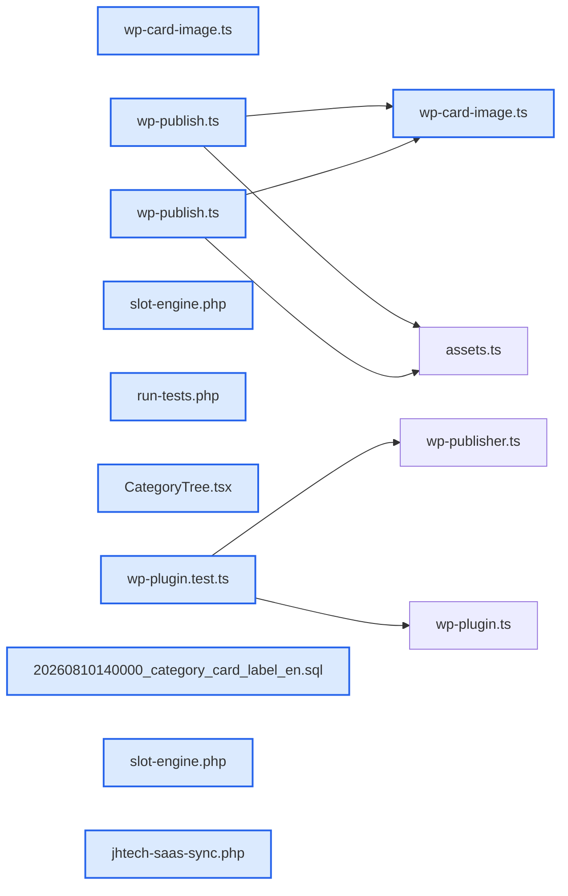

# jhtechSaaS — Dev Note: WP-Template-Visual-Complete

> **📅 Date:** 2026-08-11 · **🗂️ Project:** jhtechSaaS · **🏷️ Main Task:** WP-Template-Visual-Complete
> **👤 Author:** — · **🔖 Tags:** wordpress, elementor, worker, puppeteer, template, publish

---

## TL;DR

WP 자동 등록 시각 완성 세션: 템플릿 충실도 수정(전체폭·사양 2-프로토·스페이서 접기)으로 자동 글을 수제와 동형화하고, 프린터 전용 템플릿(4627)을 신설해 커팅기(4605)와 레이아웃 분기. 카드 대표 이미지 자동 합성(수제 카드 프레임 재현) + 분류 페이지 리디자인·영문 라벨 필드 추가. XTRA 3300S·A3 Max 5 실공개 및 수제 글 정리로 전체 사이클 완주.

---

## Code Structure

오늘 변경된 파일 간 의존 관계 (자동 분석):



---

## Today's Work

### 🐛 `fix(wp-plugin/worker)`: WP 템플릿 복제 충실도 수정 (PR #268)

**Status:** `completed`  
**Files changed:** `wp-plugin/jhtech-saas-sync/includes/slot-engine.php`, `wp-plugin/jhtech-saas-sync/jhtech-saas-sync.php`, `apps/worker/src/jobs/wp-publish.ts`

#### 📋 Context (왜)

자동 등록 글이 수제 원본과 크게 달랐음(가로폭 좁음·빈 밴드·사양 폰트/불릿/구분선/이미지 누락)

#### 🔨 Implementation (무엇을 어떻게)

_wp_page_template(elementor_header_footer) 복사, 사양 2-프로토(제목/항목) 재구성+라벨 키워드 의미 아이콘, jh-if 제거 시에만 연속 스페이서 접기, 사진 1장 image-02 재사용. Claude+Codex 듀얼 리뷰가 P1 3건 공동 적발(프로토 오인·무조건 접기·페이지템플릿 덮어쓰기) 반영

#### 📐 Architecture Decisions (ADR)

**Decision:** 2-프로토 진입 = 첫 icon-list가 1항목일 때만(다중 컬럼 레거시 오인 방지)


**Decision:** _wp_page_template은 Elementor 화이트리스트만 복사·삭제 분기 금지


#### 🐛 Problems & Solutions

**Problem:** 


#### 💡 Learnings

- Elementor 위젯 스타일은 위젯 설정+테마 클래스+인라인이 섞임 — 치환 엔진은 프로토 위젯을 통째 복제해야 스타일 보존

---

### ✨ `feat(worker/web)`: 카드 대표 이미지 자동 합성 + 분류 리디자인 (PR #270·#274·#275)

**Status:** `completed`  
**Files changed:** `apps/worker/src/jobs/wp-card-image.ts`, `apps/web/src/app/admin/categories/_components/CategoryTree.tsx`, `supabase/migrations/20260810140000_category_card_label_en.sql`

#### 📋 Context (왜)

전체 제품 목록의 수제 카드(검은 밴드 프레임)와 통일된 대표 이미지가 필요 — 수동 제작 없이

#### 🔨 Implementation (무엇을 어떻게)

수제 카드 실측(500×500, #1a2842/#23282c) 프레임을 워커 Puppeteer HTML 합성으로 재현, 소재=대표사진+quote_device_name 로고+분류 card_label_en(조상 폴백). __card__ 의사 키로 매 sync 재업로드+옛 카드 정리. 분류 페이지는 재고현황형 테이블로 리디자인+영문 라벨 입력

#### 📐 Architecture Decisions (ADR)

**Decision:** 카드 세로 영문 = vertical-rl(위→아래)·Arimo Bold Italic 900 — 수제 서체 정합


**Decision:** 영문 라벨은 분류 컬럼(card_label_en)로 관리자 관리


#### 🐛 Problems & Solutions

**Problem:** 


**Problem:** 


#### 💡 Learnings

- 같은 스타일 카드 = 이미지 프레임을 코드로 실측 재현하면 수작업 제거 가능

---

### ✨ `feat(wp-plugin/템플릿)`: 프린터 전용 템플릿(4627) + 모델명/빨간 첫 글자 슬롯 (PR #271·#272·#273)

**Status:** `completed`  
**Files changed:** `wp-plugin/jhtech-saas-sync/includes/slot-engine.php`

#### 📋 Context (왜)

커팅기·프린터 레이아웃 분기 요구 — 수제 '플로라 XTRA 3300S' 기반

#### 🔨 Implementation (무엇을 어떻게)

Duplicate Post 복제 → Elementor JS로 슬롯 마킹 19건+신규 위젯 생성($e.run document/elements/create). 엔진에 jh-specs-flat(단일 헤더+평탄화)·jh-slot-model(다중 위치 전체 채움)·jh-first-red(첫 글자 빨강) 추가. 히어로 = 작은 분류+큰 모델명(빨간 첫 글자), 커팅기도 동일 문법 통일

#### 📐 Architecture Decisions (ADR)

**Decision:** flat 모드는 템플릿 마킹(jh-specs-flat)으로 분기 — 커팅기는 그룹 헤더 유지


**Decision:** 모델명 슬롯만 전체 채움(다중 배치 관행)


#### 🐛 Problems & Solutions

**Problem:** 


#### 💡 Learnings

- Elementor 프로그래밍 위젯 생성은 elementor.getContainer(id)+$e.run('document/elements/create')로 안정 동작

---

### 🔧 `chore(운영)`: 실공개 + 수제 글 정리

**Status:** `completed`  
**Files changed:** _(미지정)_

#### 📋 Context (왜)

두 초안 승인 후 실공개 단계

#### 🔨 Implementation (무엇을 어떻게)

publish 잡 실행(4600·4603), 수제 플로라 XTRA 3300S(876) 임시글 전환. 전체 제품 프린터 섹션은 브랜드 카테고리(FLORA=30) 쿼리라 롤 UV프린터 매핑 8→30 변경으로 노출

#### 📐 Architecture Decisions (ADR)

**Decision:** 프린터 소분류 WP 매핑은 유형(8/11/13/14)이 아닌 브랜드 카테고리(FLORA/JU)를 사용


#### 🐛 Problems & Solutions

**Problem:** 


#### 💡 Learnings

- 노출 안 되면 목록 위젯의 실제 쿼리 조건(카테고리/태그)을 기존 글과 대조하는 게 빠르다

---

## 🎯 Prompt Library

> 오늘 Claude Code에게 보낸 프롬프트 중 학습 가치가 있는 것들.

### ✅ 잘 통한 프롬프트: 원본 대비 시각 수정 요구(구체 항목 나열)

```
1. 페이지 가로 폭... 2. 밴드 높이... 3. 빈 밴드 제거... 4. 사양 폰트/불릿... 5. 좌스펙/우이미지... 원본하고 비교해서 최대한 똑같이 만들어주고 다시 만들어진 화면을 보여줘.
```

**교훈:** 번호로 증상을 나열+수용 기준(원본과 동일)+검증 방법(화면 재제시)까지 지정하면 한 번에 근본 원인 4개를 수렴

### ✅ 잘 통한 프롬프트: 레이아웃 기준 지정

```
지금 수기로 만들어진 XTRA3300S의 레이아웃을 기준으로 프린터기 페이지 레이아웃을 만들어줘. 메인사진은 최상단... 사양은 좌측 서브이미지...
```

**교훈:** 기준 페이지(실물)를 지정하면 디자인 논쟁 없이 실측 기반으로 진행됨

---

## 📋 Changes Summary

### Added

- 프린터 전용 템플릿(4627)·jh-specs-flat·jh-slot-model·jh-first-red
- 카드 대표 이미지 자동 합성(wp-card-image)
- 분류 card_label_en + 리디자인

### Changed

- 커팅기 템플릿 히어로 문법 통일
- 카드 타이포 원본 정합
- 롤 UV프린터 WP 매핑 8→30(FLORA)

### Fixed

- _wp_page_template 미복사(가로폭)
- 사양 프로토 오인·스페이서 스택
- shared 테스트 model 필드 누락(typecheck)

### Removed

- 수제 플로라 XTRA 3300S(876) 공개 상태(임시글 전환)

---

## ⏭️ Next Steps

- [ ] 프린터 나머지 소분류(솔벤트/평판/하이브리드/승화) 매핑을 브랜드 카테고리로 정리
- [ ] 수제 '자동 급지 커팅기'(4508) 정리 시점 결정(JC 3종 각각 등록 후)
- [ ] 4627 실export 픽스처 repo 추가
- [ ] 옛 URL(/flora_xtra_3300s/) 리다이렉트 여부

---

## 🤖 Claude Code Hints

> **For future Claude Code sessions reading this note:**
> WP 템플릿 수정은 Elementor JS(모델 set + $e.run save)로, 엔진 수정은 반드시 PHP 픽스처 테스트+플러그인 zip 재업로드+재sync 순서로. 목록 미노출은 portfolio 위젯의 브랜드 카테고리(FLORA=30) 기준을 먼저 의심. 재sync는 service_role로 jobs 직접 INSERT(enqueue RPC는 auth.uid 필수).

**Reusable patterns introduced today:**

- `수제 디자인 실측→코드 재현` — 원본 이미지/페이지를 픽셀 실측(색·크기·폰트)해 HTML로 재현하고 나란히 비교로 검증
    - 파일: `apps/worker/src/jobs/wp-card-image.ts`
- `Elementor 슬롯 마킹+신규 위젯 생성 JS` — elementor.getContainer + document/elements/create로 템플릿에 위젯 프로그래밍 삽입
    - 파일: `wp-plugin/jhtech-saas-sync/includes/slot-engine.php`
