# jhtechSaaS — Dev Note: v0.9.1.0-공개폼-UX개선

> **📅 Date:** 2026-06-03 · **🗂️ Project:** jhtechSaaS · **🏷️ Main Task:** v0.9.1.0-공개폼-UX개선
> **👤 Author:** — · **🔖 Tags:** UX, 공개폼, 도그푸딩, P-F, v0.9.1.0, React-Hook-Form

---

## TL;DR

v0.9.1.0 공개 신청폼 UX 개선 배포(PR#36). M2 P-F 통합 고객이력(v0.9.0.0)을 오후에 ship한 뒤, 로컬에서 전체 시스템을 처음부터 끝까지 실사용 도그푸딩하며 발견한 마찰 4건(에러요약 배너·아코디언·biz_no 자동하이픈·역링크)을 코드만으로 해소. DB변경 0.

---

## Code Structure

오늘 변경된 파일 간 의존 관계 (자동 분석):

```mermaid
flowchart LR
    N0["MEMORY.md"]
    N1["jhtechsaas-dogfood-improvements.md"]
    N2["jhtechsaas-project.md"]
    N3["main-pe-autoplan-review-20260603.md"]
    N4["CHANGELOG.md"]
    N5["PROJECT-MAP.html"]
    N6["customers.spec.ts"]
    N7["request.spec.ts"]
    N8["supply-requests.spec.ts"]
    N9["page.tsx"]
    N10["CompanyTable.tsx"]
    N11["layout.tsx"]
    N12["page.tsx"]
    N13["StatusBadge.tsx"]
    N14["MarkReadOnView.tsx"]
    N15["StatusControl.tsx"]
    N16["page.tsx"]
    N17["SupplyRequestTable.tsx"]
    N18["page.tsx"]
    N19["RequestForm.tsx"]
    N20["SupplyRequestForm.tsx"]
    N21["actions.ts"]
    N22["page.tsx"]
    N23["page.tsx"]
    N24["ServiceRequestForm.tsx"]
    N25["FormErrorSummary.tsx"]
    N26["application-status.tsx"]
    N27["history.ts"]
    N28["queries.ts"]
    N29["error-summary.test.ts"]
    N30["error-summary.ts"]
    N31["request-status.tsx"]
    N32["admin-actions.ts"]
    N33["format.test.ts"]
    N34["format.ts"]
    N35["grouping.test.ts"]
    N36["grouping.ts"]
    N37["queries.ts"]
    N38["schema.test.ts"]
    N39["schema.ts"]
    N40["status.ts"]
    N41["roadmap.json"]
    N42["get_company_request_history.test.ts"]
    N43["list_consumables_for_company.test.ts"]
    N44["submit_supply_request.test.ts"]
    N45["supply_requests.test.ts"]
    N46["permissions.test.ts"]
    N47["permissions.ts"]
    N48["20260603120001_supply_requests.sql"]
    N49["20260603120002_list_consumables_for_company.sql"]
    N50["20260603120003_submit_supply_request.sql"]
    N51["20260603130001_lookup_company_add_model.sql"]
    N52["20260603140000_pf_customer_history_rpc.sql"]
    N53["20260603120001_supply_requests_down.sql"]
    N54["20260603130001_lookup_company_add_model_down.sql"]
    N55["20260603140000_pf_customer_history_rpc_down.sql"]
    N56["devnote_data.json"]
    N57["devnote_data_pe.json"]
    N58["pe-spec-body.md"]
    N59["pf-spec-body.md"]
    N60["MarkReadOnView.tsx"]
    N61["StatusControl.tsx"]
    N62["page.tsx"]
    N63["StatusBadge.tsx"]
    N64["MarkReadOnView.tsx"]
    N65["StatusControl.tsx"]
    N66["page.tsx"]
    N67["SupplyRequestTable.tsx"]
    N68["ConsentAccordion.tsx"]
    N69["InstallSurvey.tsx"]
    N70["RequestForm.tsx"]
    N71["SitePhotoUploader.tsx"]
    N72["actions.ts"]
    N73["SupplyRequestForm.tsx"]
    N74["AsPhotoUploader.tsx"]
    N75["ServiceRequestForm.tsx"]
    N76["actions.ts"]
    N77["FormErrorSummary.tsx"]
    N78["history.ts"]
    N79["error-summary.test.ts"]
    N80["error-summary.ts"]
    N81["format.ts"]
    N82["grouping.ts"]
    N83["schema.ts"]
    N84["status.ts"]
    N85["helpers.ts"]
    N86["permissions.ts"]
    N79 --> N80
    N70 --> N72
    N70 --> N68
    N70 --> N71
    N70 --> N69
    N75 --> N76
    N75 --> N74
    N62 --> N63
    N62 --> N61
    N62 --> N60
    N66 --> N65
    N66 --> N64
    N45 --> N85
    N43 --> N85
    N44 --> N85
    N46 --> N86
    N37 --> N84
    N32 --> N84
    N22 --> N73
    N18 --> N67
    N16 --> N65
    N16 --> N64
    N36 --> N83
    N35 --> N82
    N35 --> N83
    N33 --> N81
    N42 --> N85
    N28 --> N78
    N29 --> N80
    N19 --> N72
    N19 --> N68
    N19 --> N71
    N19 --> N69
    N24 --> N76
    N24 --> N74
    N12 --> N63
    N12 --> N61
    N12 --> N60
    style N54 fill:#dbeafe,stroke:#2563eb,stroke-width:2px
    style N75 fill:#dbeafe,stroke:#2563eb,stroke-width:2px
    style N34 fill:#dbeafe,stroke:#2563eb,stroke-width:2px
    style N62 fill:#dbeafe,stroke:#2563eb,stroke-width:2px
    style N49 fill:#dbeafe,stroke:#2563eb,stroke-width:2px
    style N51 fill:#dbeafe,stroke:#2563eb,stroke-width:2px
    style N35 fill:#dbeafe,stroke:#2563eb,stroke-width:2px
    style N59 fill:#dbeafe,stroke:#2563eb,stroke-width:2px
    style N3 fill:#dbeafe,stroke:#2563eb,stroke-width:2px
    style N70 fill:#dbeafe,stroke:#2563eb,stroke-width:2px
    style N66 fill:#dbeafe,stroke:#2563eb,stroke-width:2px
    style N39 fill:#dbeafe,stroke:#2563eb,stroke-width:2px
    style N10 fill:#dbeafe,stroke:#2563eb,stroke-width:2px
    style N41 fill:#dbeafe,stroke:#2563eb,stroke-width:2px
    style N53 fill:#dbeafe,stroke:#2563eb,stroke-width:2px
    style N20 fill:#dbeafe,stroke:#2563eb,stroke-width:2px
    style N47 fill:#dbeafe,stroke:#2563eb,stroke-width:2px
    style N50 fill:#dbeafe,stroke:#2563eb,stroke-width:2px
    style N52 fill:#dbeafe,stroke:#2563eb,stroke-width:2px
    style N40 fill:#dbeafe,stroke:#2563eb,stroke-width:2px
    style N29 fill:#dbeafe,stroke:#2563eb,stroke-width:2px
    style N0 fill:#dbeafe,stroke:#2563eb,stroke-width:2px
    style N48 fill:#dbeafe,stroke:#2563eb,stroke-width:2px
    style N79 fill:#dbeafe,stroke:#2563eb,stroke-width:2px
    style N32 fill:#dbeafe,stroke:#2563eb,stroke-width:2px
    style N46 fill:#dbeafe,stroke:#2563eb,stroke-width:2px
    style N11 fill:#dbeafe,stroke:#2563eb,stroke-width:2px
    style N36 fill:#dbeafe,stroke:#2563eb,stroke-width:2px
    style N38 fill:#dbeafe,stroke:#2563eb,stroke-width:2px
    style N4 fill:#dbeafe,stroke:#2563eb,stroke-width:2px
    style N42 fill:#dbeafe,stroke:#2563eb,stroke-width:2px
    style N2 fill:#dbeafe,stroke:#2563eb,stroke-width:2px
    style N9 fill:#dbeafe,stroke:#2563eb,stroke-width:2px
    style N80 fill:#dbeafe,stroke:#2563eb,stroke-width:2px
    style N22 fill:#dbeafe,stroke:#2563eb,stroke-width:2px
    style N56 fill:#dbeafe,stroke:#2563eb,stroke-width:2px
    style N17 fill:#dbeafe,stroke:#2563eb,stroke-width:2px
    style N57 fill:#dbeafe,stroke:#2563eb,stroke-width:2px
    style N55 fill:#dbeafe,stroke:#2563eb,stroke-width:2px
    style N13 fill:#dbeafe,stroke:#2563eb,stroke-width:2px
    style N77 fill:#dbeafe,stroke:#2563eb,stroke-width:2px
    style N7 fill:#dbeafe,stroke:#2563eb,stroke-width:2px
    style N23 fill:#dbeafe,stroke:#2563eb,stroke-width:2px
    style N24 fill:#dbeafe,stroke:#2563eb,stroke-width:2px
    style N26 fill:#dbeafe,stroke:#2563eb,stroke-width:2px
    style N37 fill:#dbeafe,stroke:#2563eb,stroke-width:2px
    style N8 fill:#dbeafe,stroke:#2563eb,stroke-width:2px
    style N19 fill:#dbeafe,stroke:#2563eb,stroke-width:2px
    style N1 fill:#dbeafe,stroke:#2563eb,stroke-width:2px
    style N44 fill:#dbeafe,stroke:#2563eb,stroke-width:2px
    style N45 fill:#dbeafe,stroke:#2563eb,stroke-width:2px
    style N73 fill:#dbeafe,stroke:#2563eb,stroke-width:2px
    style N33 fill:#dbeafe,stroke:#2563eb,stroke-width:2px
    style N5 fill:#dbeafe,stroke:#2563eb,stroke-width:2px
    style N6 fill:#dbeafe,stroke:#2563eb,stroke-width:2px
    style N27 fill:#dbeafe,stroke:#2563eb,stroke-width:2px
    style N28 fill:#dbeafe,stroke:#2563eb,stroke-width:2px
    style N31 fill:#dbeafe,stroke:#2563eb,stroke-width:2px
    style N18 fill:#dbeafe,stroke:#2563eb,stroke-width:2px
    style N15 fill:#dbeafe,stroke:#2563eb,stroke-width:2px
    style N30 fill:#dbeafe,stroke:#2563eb,stroke-width:2px
    style N25 fill:#dbeafe,stroke:#2563eb,stroke-width:2px
    style N58 fill:#dbeafe,stroke:#2563eb,stroke-width:2px
    style N16 fill:#dbeafe,stroke:#2563eb,stroke-width:2px
    style N12 fill:#dbeafe,stroke:#2563eb,stroke-width:2px
    style N14 fill:#dbeafe,stroke:#2563eb,stroke-width:2px
    style N21 fill:#dbeafe,stroke:#2563eb,stroke-width:2px
    style N43 fill:#dbeafe,stroke:#2563eb,stroke-width:2px
```



---

## Today's Work

### ✨ `feat(ux)`: 공개폼 에러 요약 배너 (M4)

**Status:** `completed`  
**Files changed:** `apps/web/src/lib/forms/error-summary.ts`, `apps/web/src/lib/forms/error-summary.test.ts`, `apps/web/src/components/FormErrorSummary.tsx`, `apps/web/src/app/request/_components/RequestForm.tsx`, `apps/web/src/app/support/_components/ServiceRequestForm.tsx`, `apps/web/src/app/supply/_components/SupplyRequestForm.tsx`

#### 📋 Context (왜)

긴 공개폼(견적·AS·소모품) 제출 시 한 칸이라도 누락되면 화면 변화 없이 '무반응 제출'처럼 보여 이탈 위험. 도그푸딩 중 직접 주소 누락으로 두 번 헤맴 — 실고객이면 그대로 이탈.

#### 🔨 Implementation (무엇을 어떻게)

RHF errors를 평탄화해 '입력 안 된 N개' 메시지 목록을 만드는 순수함수 collectErrorMessages(단위테스트)와, 그것을 폼 상단에 렌더하고 제출 시도마다 그 위치로 스크롤하는 공통 FormErrorSummary 컴포넌트로 분리. 세 폼에 일괄 적용.

#### 💻 Key Code

**`apps/web/src/lib/forms/error-summary.ts`**

```typescript
// RHF errors 객체를 사람이 읽는 메시지 배열로 평탄화(순수·테스트 가능)
// ref 키는 DOM 노드라 순회에서 스킵(미래 중첩 필드 방어)
export function collectErrorMessages(errors: FieldErrors): string[] { /* ... */ }
```

_에러 평탄화 순수함수 — 컴포넌트에서 분리해 단위테스트_

#### 📐 Architecture Decisions (ADR)

**Decision:** 소모품폼의 itemsError('소모품 1개 이상 선택')는 RHF errors 밖의 별도 state라 배너가 못 봄 → FormErrorSummary에 extraMessages prop을 추가하고 소모품폼이 주입. /review에서 잡혀 보강.


#### 💡 Learnings

- 폼별 에러 표시를 컴포넌트마다 복붙하지 말고 '평탄화 순수함수 + 공통 표시 컴포넌트'로 분리하면 세 폼에 일관 적용·테스트가 쉬움.
- RHF errors 밖의 커스텀 state(itemsError 같은)는 배너가 못 보므로 extraMessages 같은 명시 주입 경로가 필요.

---

### ✨ `feat(ux)`: 견적폼 사진·설치설문 아코디언 (M5)

**Status:** `completed`  
**Files changed:** `apps/web/src/app/request/_components/RequestForm.tsx`

#### 📋 Context (왜)

긴 설치설문+사진 업로드가 한꺼번에 노출돼 위압적. 코어(연락처·요청사항)만 보이게 하고 부가정보는 접고 싶음.

#### 🔨 Implementation (무엇을 어떻게)

사진 업로드+설치설문을 '설치 환경 정보·사진 (선택)' details 요소로 묶어 기본 접힘. 접힌 영역 바로 위에 작성 유도 안내문구. details 내부는 접혀도 DOM에 마운트돼 설치설문 기본값이 제출에 그대로 포함됨(E2E로 검증).

#### 📐 Architecture Decisions (ADR)

**Decision:** 형님 확정: ②사진 + ③설치설문 둘 다 접고 기본 접힘, 접힌 위치 바로 위에 안내문구. 코어(연락처)만 항상 노출.


**Decision:** 안내문구는 Claude 초안 — TODO(문구검토) 주석 남김. 재현테크 톤으로 형님이 추후 수정.


#### 💡 Learnings

- details로 접어도 자식이 DOM에 마운트되므로 접힌 채 제출해도 기본값이 payload에 포함됨 — '선택' 섹션 구현에 적합. E2E로 반드시 검증.

---

### ✨ `feat(ux)`: biz_no 자동 하이픈 + AS/소모품→고객 P-F 역링크 (M8·M6)

**Status:** `completed`  
**Files changed:** `apps/web/src/app/request/_components/RequestForm.tsx`, `apps/web/src/app/support/_components/ServiceRequestForm.tsx`, `apps/web/src/app/admin/service-requests/[id]/page.tsx`, `apps/web/src/app/admin/supply-requests/[id]/page.tsx`

#### 📋 Context (왜)

biz_no 마스크가 화면마다 달랐고(admin·소모품폼만 자동하이픈), AS/소모품 처리 중 그 고객의 과거이력을 보려면 목록으로 되돌아가야 함.

#### 🔨 Implementation (무엇을 어떻게)

견적·AS 폼 biz_no를 blur 시 자동 하이픈(admin·소모품폼과 일관). admin AS·소모품 상세에 '이 고객의 통합 이력 보기 →' 링크 추가(P-F 고객 상세로 딥링크).

---

### ✨ `feat(pf)`: M2 P-F 통합 고객 이력 ship (v0.9.0.0)

**Status:** `completed`  
**Files changed:** _(미지정)_

#### 📋 Context (왜)

관리자가 고객(업체) 한 곳을 열면 견적·구입·AS·소모품 활동을 완료여부와 함께 한 화면에서 보게 함. (오늘 오후 PR#35 머지·supabase db push·canary HEALTHY)

#### 🔨 Implementation (무엇을 어떻게)

고객 상세 /admin/customers/[id] 신설(4섹션 전체N·완료M 카운트). 테이블 RLS 위닝 대신 DEFINER RPC get_company_request_history로 customers.manage 게이트 전체조회 — 테이블정책 무변경으로 회귀0.

#### 📐 Architecture Decisions (ADR)

**Decision:** plan-eng-review: supply_request_items SELECT가 부모 로직 인라인복제라 부모정책만 넓혀선 items 누락 + applications per-row regex blast radius → DEFINER RPC가 정답(기존 search_applications_for_customer 선례).


**Decision:** 견적=biz_no 정규화 OR source_application_id UNION(NULL biz_no 고객도 출처견적 포함), 완료=견적 closed·AS/소모품 done(canceled 제외).


#### 💡 Learnings

- trust-source 뷰는 fetch 에러를 빈배열로 삼키지 말고 throw해야 함(리뷰 발견).

---

### 🔧 `chore(qa)`: 전체 시스템 실사용 도그푸딩 + 개선 백로그 14건

**Status:** `completed`  
**Files changed:** _(미지정)_

#### 📋 Context (왜)

P-F 배포 후 '더 진행 전 전체 프로세스를 실제 웹으로 처음부터 끝까지 테스트'(SQL 직접 입력 금지, 서브 띄워 실제 입력) 요청. 분류→장비→소모품→고객 입력 후 견적·AS·소모품 공개폼 신청 → admin 확인·상태전이까지.

#### 🔨 Implementation (무엇을 어떻게)

REQ-/AS-/SUP- 전부 정상 생성·P-F 통합뷰 연결·완료카운트 전이 확인(버그 0). 발견한 기능갭·UX마찰·다듬기 14건(H1~3 핵심·M4~9 마찰·P10~14 다듬기)을 메모리에 백로그로 저장. 이 중 M4·M5·M6·M8을 v0.9.1.0으로 즉시 처리.

#### 📐 Architecture Decisions (ADR)

**Decision:** M9 소모품 금액노출 → 드롭(장비·소모품 금액은 담당자 유선 안내만).


**Decision:** P12·P13 제품 URL 임포트 기능 → 보류. jhtech.co.kr 실측 결과 WP+Elementor, OG·wp-json 없음, 사양표가 이미지라 자동 구조화 불가 → 대안은 엑셀 일괄임포트(형님 결정 대기).


#### 💡 Learnings

- 도그푸딩은 SQL 시드가 아니라 실제 웹으로 입력해야 진짜 마찰(무반응 제출·위압적 폼)이 드러난다.

---

## 🎯 Prompt Library

> 오늘 Claude Code에게 보낸 프롬프트 중 학습 가치가 있는 것들.

### ✅ 잘 통한 프롬프트: 도그푸딩 지시 — 실제 웹 입력 강제

```
더 진행하기전에 전체 프로세스를 한번 실제 테스트를 해봐야할꺼같아. 데이터베이스에 장비, 소모품, 고객정보를 실제로 넣고 테스트를 해줘. sql로 데이터를 넣지 말고, 서브를 띄워서 실제 웹으로 접속해서 직접 데이터를 입력하는것부터 테스트하고...
```

**교훈:** 'SQL 금지·실제 웹 입력'이라는 제약을 명시하면 시드로 건너뛰던 UX 마찰이 실제로 드러난다. 도그푸딩 프롬프트의 좋은 패턴.

### ✅ 잘 통한 프롬프트: 개선점 능동 발굴 요청

```
니가 지금 테스트 하면서 기능적으로 추가 되었으면 좋을 기능이나 사용자가 불편해 할만한 점이 있는지, 있다면 어떻게 개선하는게 좋을지 말해봐. 자세하고 꼼꼼하게
```

**교훈:** 구현이 아니라 '발견·제안'을 분리해 먼저 요청 → 14건 백로그로 정리 후 우선순위만 즉시 처리. 발견과 실행을 분리하는 흐름.

### ✅ 잘 통한 프롬프트: 백로그는 메모리에, 실행은 우선순위만

```
앞에서 이야기한 핵심/마찰/다듬기 모든 내용을 메모리에 저장해서 기억해놔줘. 내가 천천히 다시 읽어보고 계획 세워보게. 그리고 별도로 먼저 처리하면 좋을 순서대로 처리 순서와 이유를 같이 정리해서 보여줘
```

**교훈:** 발견 전체는 메모리 백로그로 박제(나중에 계획), 당장은 우선순위 묶음만 실행 — 대량 발견을 잃지 않으면서 스코프를 통제하는 방식.

---

## 📚 References & 외부 학습

- **[jhtech.co.kr 제품 페이지 (URL 임포트 실측 대상)](http://jhtech.co.kr/flora-xtra-3300h/)** `url-import` · `보류`
    - WP+Elementor, OG·wp-json 없음, 사양표가 이미지라 자동 구조화 불가. 자동가능=장비명·youtube_url뿐. 대안=엑셀 임포트.

---

## 📋 Changes Summary

### Added

- 관리자 AS·소모품 신청 상세에 '이 고객의 통합 이력 보기 →' 링크(M6)

### Changed

- 긴 공개폼 제출 시 누락 항목 요약 배너 + 스크롤(M4)
- 견적폼 설치 환경 정보·사진을 '선택' 아코디언으로 접음(M5)
- 견적·AS 폼 biz_no 입력 시 자동 하이픈(M8)

---

## ⏭️ Next Steps

- [ ] P-G 알림인프라(#25, M2 마지막 단계) spec — 관리자 웹알림 + 카톡/문자(외부 발송사 준비 후)
- [ ] OR 도그푸딩 H1(견적 처리 본업 루프 부재)로 견적콘솔 E4~E6을 P-G보다 먼저 당길지 사업판단
- [ ] M5 아코디언 안내문구 초안 → 형님 재현테크 톤으로 검토·수정(TODO 주석)
- [ ] 운영 이월: SUPPORT_PHONE 실번호·프로덕션 실고객/장비 입력·홈 3분기 활성화

---

## 🤖 Claude Code Hints

> **For future Claude Code sessions reading this note:**
> 이 프로젝트의 공개폼 검증 UX는 'collectErrorMessages(순수함수) + FormErrorSummary(공통 컴포넌트)' 패턴을 따른다 — 새 폼에도 복붙 말고 이 둘을 재사용하고, RHF errors 밖 커스텀 state는 extraMessages로 주입할 것. 다음 작업은 P-G(알림) spec부터이되, 그 전에 H1(견적콘솔)을 먼저 당길지 사용자에게 사업판단을 물어라.

**Reusable patterns introduced today:**

- `폼 에러 요약 배너` — RHF errors를 순수함수로 평탄화(collectErrorMessages)하고 공통 컴포넌트(FormErrorSummary)가 상단 표시+제출 시 스크롤. 커스텀 state는 extraMessages prop으로 주입.
    - 파일: `apps/web/src/lib/forms/error-summary.ts, apps/web/src/components/FormErrorSummary.tsx`
- `선택 정보 아코디언` — 부가 입력을 details로 접되 자식을 DOM에 마운트 유지 → 접힌 채 제출해도 기본값이 payload에 포함. E2E로 검증.
    - 파일: `apps/web/src/app/request/_components/RequestForm.tsx`
