# jhtechSaaS — Dev Note: 견적-시스템-피드백-슬라이스

> **📅 Date:** 2026-06-09 · **🗂️ Project:** jhtechSaaS · **🏷️ Main Task:** 견적-시스템-피드백-슬라이스
> **👤 Author:** — · **🔖 Tags:** E5-견적, Next.js, Supabase, RLS, jsonb, UI, TDD

---

## TL;DR

하루에 프로덕션 6배포(v0.12.7→v0.12.12). E5 견적 시스템을 사용자 피드백 슬라이스로 다듬음: 견적 프레임 시각 폴리시·연락처 하이픈 포맷, 고객 거래처장부 확장필드(+업종) DB 컬럼, 견적 미발행 미리보기(견적 없어도 요청장비로 통합 레이아웃), 견적 폼 카탈로그 개편+포함옵션 스냅샷+요청장비 자동 프리필. 전부 게이트 GREEN·프로덕션 200 확인.

---

## Code Structure

오늘 변경된 파일 간 의존 관계 (자동 분석):

```mermaid
flowchart LR
    N0["MEMORY.md"]
    N1["jhtechsaas-project.md"]
    N2["CHANGELOG.md"]
    N3["CLAUDE.md"]
    N4["PROJECT-MAP.html"]
    N5["quotes.spec.ts"]
    N6["QuoteLinesEditor.tsx"]
    N7["AssignControl.tsx"]
    N8["QuoteForm.tsx"]
    N9["RegisterCustomerButton.tsx"]
    N10["StatusControl.tsx"]
    N11["ApplicantInfo.tsx"]
    N12["InstallSurvey.tsx"]
    N13["OptionLists.tsx"]
    N14["Placeholders.tsx"]
    N15["QuoteHero.tsx"]
    N16["QuoteSummaryPanel.tsx"]
    N17["SectionHeader.tsx"]
    N18["SelectedEquipment.tsx"]
    N19["SitePhotos.tsx"]
    N20["VersionHistory.tsx"]
    N21["page.tsx"]
    N22["page.tsx"]
    N23["page.tsx"]
    N24["page.tsx"]
    N25["CompanyForm.tsx"]
    N26["ManualQuoteForm.tsx"]
    N27["page.tsx"]
    N28["actions.ts"]
    N29["schema.ts"]
    N30["banner.test.ts"]
    N31["banner.ts"]
    N32["equipment-match.server.ts"]
    N33["equipment-match.test.ts"]
    N34["equipment-match.ts"]
    N35["form.test.ts"]
    N36["form.ts"]
    N37["roadmap.json"]
    N38["2026-06-09-applications-quote-frame-design.md"]
    N39["package.json"]
    N40["companies_extended_fields.test.ts"]
    N41["quote_create_rpc.test.ts"]
    N42["quote-calc.ts"]
    N43["20260609150000_companies_extended_fields.sql"]
    N44["20260609150000_companies_extended_fields_down.sql"]
    N45["devnote_data.json"]
    N46["devnote_data_0609.json"]
    N47["devnote_data_eod.json"]
    N48["quotes.spec.ts"]
    N49["QuoteLinesEditor.tsx"]
    N50["AssignControl.tsx"]
    N51["QuoteForm.tsx"]
    N52["RegisterCustomerButton.tsx"]
    N53["StatusControl.tsx"]
    N54["ApplicantInfo.tsx"]
    N55["InstallSurvey.tsx"]
    N56["OptionLists.tsx"]
    N57["Placeholders.tsx"]
    N58["QuoteHero.tsx"]
    N59["QuoteSummaryPanel.tsx"]
    N60["SectionHeader.tsx"]
    N61["SelectedEquipment.tsx"]
    N62["SitePhotos.tsx"]
    N63["VersionHistory.tsx"]
    N64["page.tsx"]
    N65["page.tsx"]
    N66["page.tsx"]
    N67["page.tsx"]
    N68["CompanyEquipmentEditor.tsx"]
    N69["CompanyForm.tsx"]
    N70["ManualQuoteForm.tsx"]
    N71["page.tsx"]
    N72["actions.ts"]
    N73["schema.ts"]
    N74["banner.ts"]
    N75["equipment-match.ts"]
    N76["form.ts"]
    N77["companies_extended_fields.test.ts"]
    N78["helpers.ts"]
    N79["quote_create_rpc.test.ts"]
    N80["quote-calc.ts"]
    N81["20260609150000_companies_extended_fields.sql"]
    N82["20260609150000_companies_extended_fields_down.sql"]
    N64 --> N53
    N64 --> N50
    N64 --> N52
    N64 --> N58
    N64 --> N60
    N64 --> N63
    N64 --> N54
    N64 --> N55
    N64 --> N62
    N64 --> N61
    N64 --> N56
    N64 --> N59
    N64 --> N57
    N77 --> N78
    N69 --> N68
    N66 --> N69
    N65 --> N51
    N71 --> N70
    N56 --> N60
    N79 --> N78
    N30 --> N74
    N33 --> N75
    N32 --> N75
    N21 --> N53
    N21 --> N50
    N21 --> N52
    N21 --> N58
    N21 --> N60
    N21 --> N63
    N21 --> N54
    N21 --> N55
    N21 --> N62
    N21 --> N61
    N21 --> N56
    N21 --> N59
    N21 --> N57
    N20 --> N60
    N12 --> N60
    N19 --> N60
    N13 --> N60
    N14 --> N60
    N11 --> N60
    N18 --> N60
    N40 --> N78
    N25 --> N68
    N23 --> N69
    N22 --> N51
    N27 --> N70
    N41 --> N78
    style N37 fill:#dbeafe,stroke:#2563eb,stroke-width:2px
    style N11 fill:#dbeafe,stroke:#2563eb,stroke-width:2px
    style N38 fill:#dbeafe,stroke:#2563eb,stroke-width:2px
    style N9 fill:#dbeafe,stroke:#2563eb,stroke-width:2px
    style N40 fill:#dbeafe,stroke:#2563eb,stroke-width:2px
    style N71 fill:#dbeafe,stroke:#2563eb,stroke-width:2px
    style N39 fill:#dbeafe,stroke:#2563eb,stroke-width:2px
    style N43 fill:#dbeafe,stroke:#2563eb,stroke-width:2px
    style N29 fill:#dbeafe,stroke:#2563eb,stroke-width:2px
    style N2 fill:#dbeafe,stroke:#2563eb,stroke-width:2px
    style N23 fill:#dbeafe,stroke:#2563eb,stroke-width:2px
    style N82 fill:#dbeafe,stroke:#2563eb,stroke-width:2px
    style N67 fill:#dbeafe,stroke:#2563eb,stroke-width:2px
    style N76 fill:#dbeafe,stroke:#2563eb,stroke-width:2px
    style N25 fill:#dbeafe,stroke:#2563eb,stroke-width:2px
    style N49 fill:#dbeafe,stroke:#2563eb,stroke-width:2px
    style N56 fill:#dbeafe,stroke:#2563eb,stroke-width:2px
    style N51 fill:#dbeafe,stroke:#2563eb,stroke-width:2px
    style N41 fill:#dbeafe,stroke:#2563eb,stroke-width:2px
    style N81 fill:#dbeafe,stroke:#2563eb,stroke-width:2px
    style N24 fill:#dbeafe,stroke:#2563eb,stroke-width:2px
    style N18 fill:#dbeafe,stroke:#2563eb,stroke-width:2px
    style N3 fill:#dbeafe,stroke:#2563eb,stroke-width:2px
    style N30 fill:#dbeafe,stroke:#2563eb,stroke-width:2px
    style N19 fill:#dbeafe,stroke:#2563eb,stroke-width:2px
    style N44 fill:#dbeafe,stroke:#2563eb,stroke-width:2px
    style N20 fill:#dbeafe,stroke:#2563eb,stroke-width:2px
    style N0 fill:#dbeafe,stroke:#2563eb,stroke-width:2px
    style N45 fill:#dbeafe,stroke:#2563eb,stroke-width:2px
    style N79 fill:#dbeafe,stroke:#2563eb,stroke-width:2px
    style N75 fill:#dbeafe,stroke:#2563eb,stroke-width:2px
    style N1 fill:#dbeafe,stroke:#2563eb,stroke-width:2px
    style N4 fill:#dbeafe,stroke:#2563eb,stroke-width:2px
    style N66 fill:#dbeafe,stroke:#2563eb,stroke-width:2px
    style N28 fill:#dbeafe,stroke:#2563eb,stroke-width:2px
    style N60 fill:#dbeafe,stroke:#2563eb,stroke-width:2px
    style N48 fill:#dbeafe,stroke:#2563eb,stroke-width:2px
    style N46 fill:#dbeafe,stroke:#2563eb,stroke-width:2px
    style N16 fill:#dbeafe,stroke:#2563eb,stroke-width:2px
    style N74 fill:#dbeafe,stroke:#2563eb,stroke-width:2px
    style N26 fill:#dbeafe,stroke:#2563eb,stroke-width:2px
    style N13 fill:#dbeafe,stroke:#2563eb,stroke-width:2px
    style N73 fill:#dbeafe,stroke:#2563eb,stroke-width:2px
    style N36 fill:#dbeafe,stroke:#2563eb,stroke-width:2px
    style N27 fill:#dbeafe,stroke:#2563eb,stroke-width:2px
    style N33 fill:#dbeafe,stroke:#2563eb,stroke-width:2px
    style N5 fill:#dbeafe,stroke:#2563eb,stroke-width:2px
    style N47 fill:#dbeafe,stroke:#2563eb,stroke-width:2px
    style N32 fill:#dbeafe,stroke:#2563eb,stroke-width:2px
    style N21 fill:#dbeafe,stroke:#2563eb,stroke-width:2px
    style N7 fill:#dbeafe,stroke:#2563eb,stroke-width:2px
    style N42 fill:#dbeafe,stroke:#2563eb,stroke-width:2px
    style N70 fill:#dbeafe,stroke:#2563eb,stroke-width:2px
    style N12 fill:#dbeafe,stroke:#2563eb,stroke-width:2px
    style N77 fill:#dbeafe,stroke:#2563eb,stroke-width:2px
    style N6 fill:#dbeafe,stroke:#2563eb,stroke-width:2px
    style N31 fill:#dbeafe,stroke:#2563eb,stroke-width:2px
    style N69 fill:#dbeafe,stroke:#2563eb,stroke-width:2px
    style N14 fill:#dbeafe,stroke:#2563eb,stroke-width:2px
    style N10 fill:#dbeafe,stroke:#2563eb,stroke-width:2px
    style N22 fill:#dbeafe,stroke:#2563eb,stroke-width:2px
    style N15 fill:#dbeafe,stroke:#2563eb,stroke-width:2px
    style N72 fill:#dbeafe,stroke:#2563eb,stroke-width:2px
    style N17 fill:#dbeafe,stroke:#2563eb,stroke-width:2px
    style N80 fill:#dbeafe,stroke:#2563eb,stroke-width:2px
    style N8 fill:#dbeafe,stroke:#2563eb,stroke-width:2px
    style N35 fill:#dbeafe,stroke:#2563eb,stroke-width:2px
    style N65 fill:#dbeafe,stroke:#2563eb,stroke-width:2px
    style N34 fill:#dbeafe,stroke:#2563eb,stroke-width:2px
    style N64 fill:#dbeafe,stroke:#2563eb,stroke-width:2px
```



---

## Today's Work

### 💅 `style(견적관리)`: 견적 프레임 시각 폴리시 + 연락처 하이픈 자동포맷

**Status:** `completed`  
**Files changed:** `apps/web/src/app/admin/applications/[id]/_components/quote-frame/SectionHeader.tsx`, `QuoteHero.tsx`, `QuoteSummaryPanel.tsx`, `ApplicantInfo.tsx`, `SelectedEquipment.tsx`, `apps/web/src/app/admin/applications/[id]/page.tsx`, `apps/web/src/app/admin/customers/[id]/page.tsx`, `apps/web/src/lib/quotes/banner.ts`

#### 📋 Context (왜)

슬라이스 3a 견적 프레임에 대한 사용자 시각 피드백(딱딱함·히어로 어두움·소계 제목 안 보임·중복 필드). 연락처/사업자번호는 자리수 하이픈 자동.

#### 🔨 Implementation (무엇을 어떻게)

공통 SectionHeader(네이비 세로막대 #0B1F3A + 작은 제목 + 구분선) 전 카드 통일. 히어로 값 글씨 축소(합계만 강조), 유효기간 15→30일·'07.09까지(30일)' 표기. 처리바 박스화. 신청기업 등록/미등록 배지·통합이력/고객등록 우측 배치. 선택장비 시안 구조(큰 이미지·행 구분선·견적번호 배지). 우측 요약 소계에 세로막대+서브라인. 연락처는 @jhtechsaas/shared의 formatBizNo/formatPhone로 통일.

#### 📐 Architecture Decisions (ADR)

**Decision:** banner.ts VALID_DAYS를 export해 표기·요약패널 동기화


**Decision:** 포맷 유틸은 새로 만들지 말고 기존 @jhtechsaas/shared 재사용(중복 정리)


#### 🐛 Problems & Solutions

**Problem:** #5b에서 lib/format/contact.ts를 새로 만들었는데 @jhtechsaas/shared에 이미 formatBizNo/formatPhone 존재 → 중복. 다음 슬라이스에서 shared로 단일화하고 중복 삭제


#### 💡 Learnings

- 새 유틸 만들기 전 packages/shared에 동일 기능 있는지 grep 먼저

---

### ✨ `feat(고객관리)`: 고객(companies) 거래처 장부 확장 필드 + 업종(종목)

**Status:** `completed`  
**Files changed:** `supabase/migrations/20260609150000_companies_extended_fields.sql`, `supabase/rollback/20260609150000_companies_extended_fields_down.sql`, `packages/db-tests/src/companies_extended_fields.test.ts`, `apps/web/src/lib/customers/schema.ts`, `apps/web/src/lib/customers/actions.ts`, `apps/web/src/app/admin/customers/_components/CompanyForm.tsx`, `apps/web/src/app/admin/customers/[id]/edit/page.tsx`, `apps/web/src/app/admin/customers/[id]/page.tsx`

#### 📋 Context (왜)

엑셀 거래처 장부 이관(S1) 대비. 견적 신청기업 정보와 1:1로 고객 마스터가 모든 항목을 담아야 함.

#### 🔨 Implementation (무엇을 어떻게)

companies에 manager·biz_type·biz_item(업종)·ledger_name·phone1/2·fax·address_actual1/2 9컬럼(nullable text + 길이 CHECK) ALTER 추가. RLS·트리거 무변경. 폼=기본정보(담당자·업태·업종)/추가정보(장부명·전화1/2·팩스·실제주소) 그룹. 상세에 전 필드 표시(전화 하이픈). db-test로 권한별 INSERT/UPDATE/길이CHECK 단언.

#### 📐 Architecture Decisions (ADR)

**Decision:** 견적(신청)엔 거래처 장부 필드 불필요 — 공개 신청폼이 수집 안 하고 등록 후 수기 입력이므로 고객 마스터 전용(사용자 시나리오 분석). 견적 신청기업 정보는 실제 수집 7항목만으로 간소화


#### 🐛 Problems & Solutions

**Problem:** 마이그레이션은 새 파일로(기존 적용 마이그 수정 금지). 롤백은 supabase/rollback/(단수)에


#### 💡 Learnings

- DB 스키마 변경 PR: 새 마이그 + 롤백 + db-test + 머지 후 supabase db push까지

---

### ✨ `feat(견적관리)`: 견적 미발행 미리보기 — 견적 없어도 통합 레이아웃

**Status:** `completed`  
**Files changed:** `apps/web/src/app/admin/applications/[id]/page.tsx`, `QuoteHero.tsx`, `QuoteSummaryPanel.tsx`, `SelectedEquipment.tsx`, `apps/web/src/lib/quotes/equipment-match.ts`, `equipment-match.server.ts`

#### 📋 Context (왜)

신청만 들어온 상태(견적 미발행)에서 견적 페이지가 신청기업 정보만 보이고 버전·장비·금액 박스가 사라져 보임. 사용자: 신청 들어오면 화면이 다 채워져야.

#### 🔨 Implementation (무엇을 어떻게)

견적 유무와 무관하게 동일한 2분할 레이아웃. 미발행이면 고객 요청장비(equipment_id 우선, 없으면 equipment_name 매칭)+기본공급가로 선택장비·예상 합계를 미리 채움(표시전용, 견적 자동생성 안 함). 버전이력='발행 견적 없음', 우측 요약='예상 합계'+'견적 작성' 버튼. 매칭 타입에 basePrice 추가.

#### 📐 Architecture Decisions (ADR)

**Decision:** 옵션은 견적 작성 때만 — 신청 단계는 장비만 수집(조사로 확인). 미발행 미리보기는 표시전용(draft 자동생성 안 함 → 견적번호 낭비 없음)


#### 💡 Learnings

- 견적 프레임 박스는 quote-derived(버전·금액·옵션) vs application-derived(신청기업·설문·사진) 구분. 미발행은 요청장비로 전자를 미리보기

---

### ✨ `feat(견적관리)`: 견적 폼 카탈로그 개편 + 포함옵션 스냅샷 + 요청장비 프리필

**Status:** `completed`  
**Files changed:** `packages/shared/src/quote-calc.ts`, `apps/web/src/lib/quotes/form.ts`, `apps/web/src/app/admin/_components/QuoteLinesEditor.tsx`, `apps/web/src/app/admin/applications/[id]/_components/QuoteForm.tsx`, `apps/web/src/app/admin/quotes/_components/ManualQuoteForm.tsx`, `apps/web/src/app/admin/applications/[id]/quote/new/page.tsx`, `apps/web/src/app/admin/quotes/new/page.tsx`, `apps/web/src/app/admin/applications/[id]/_components/quote-frame/OptionLists.tsx`, `packages/db-tests/src/quote_create_rpc.test.ts`, `apps/web/e2e/quotes.spec.ts`

#### 📋 Context (왜)

포함옵션 중 일부를 견적서에서 제외(체크 해제) 가능해야. 장비를 카탈로그에서 선택하면 결정적이고 오선택 방지. 신청 요청장비를 기본 셋팅해 담당자 재입력 제거.

#### 🔨 Implementation (무엇을 어떻게)

QuoteLine에 선택적 kind('included'|'extra') 추가(jsonb·Zod 보존, 계산 무시). 폼 장비=카탈로그 드롭다운(이름·기본공급가 자동, '직접 입력' 폴백). 포함옵션=체크박스(기본 전체 포함). 선택분만 quote.options에 kind=included(단가 0)로 스냅샷 저장 → 금액 무영향, 발행본은 카탈로그 변경에도 불변. 새 견적 작성 시 신청 요청장비(equipment_id/이름매칭) 자동 선택+포함옵션 전체 체크. 표시: 발행본=스냅샷, 미발행=요청장비 카탈로그.

#### 💻 Key Code

**`packages/shared/src/quote-calc.ts`**

```typescript
const QuoteLineSchema = z.object({
  name: z.string().trim().min(1),
  unitPrice: z.number().int(),
  quantity: z.number().int().min(1),
  // z.object는 미정의 키를 strip하므로 보존하려면 스키마에 명시
  kind: z.enum(["included", "extra"]).optional(),
});
```

_jsonb로 흘려보낼 kind는 Zod 스키마에 명시해야 .parse()가 strip 안 함_

#### 📐 Architecture Decisions (ADR)

**Decision:** 포함옵션을 quote.options에 kind 태그로 스냅샷 저장(발행=불변 모델과 정합) — 기존 카탈로그 라이브 파생(카탈로그 바뀌면 발행본도 바뀜) 버그도 동시 해결


**Decision:** 장비는 카탈로그 드롭다운 + 직접입력 폴백(커스텀·재발행 매칭 안전)


#### 🐛 Problems & Solutions

**Problem:** z.object 기본 strip으로 kind가 RPC 전에 사라질 뻔 → 스키마에 명시


**Problem:** e2e 재발행 테스트가 '카탈로그에 장비 없음' 가정으로 직접입력 input을 단언 → 데모DB(UV3300S 카탈로그 존재)에 돌리니 드롭다운 매칭되며 깨짐. 단가 기준 검증으로 견고화 + 게이트는 클린 reset+seed에서만


#### 💡 Learnings

- e2e는 반드시 클린 supabase db reset + seed-local 후 실행(데모/잔여 데이터가 카탈로그·전역카운트 단언을 오염)
- jsonb 통과 필드는 경계 Zod 스키마에 명시해야 보존

---

## 🎯 Prompt Library

> 오늘 Claude Code에게 보낸 프롬프트 중 학습 가치가 있는 것들.

### ✅ 잘 통한 프롬프트: 데이터모델 결정을 유도하는 시나리오 서술

```
지금 견적정보하고 고객정보에 필드하나가 빠졌어. 업종(종목) 항목... 견적정보에는 내가 화면을 보고 위치를 잡을테니, 일단 데이터베이스를 수정해주고, 샘플데이터로 고객정보 5개, 견적정보 5개(등록고객2개, 미등록고객3개) 만들어줘. 필드는 모두 다 채워주고
```

**교훈:** 필드 위치·DB 우선·샘플 구성(등록/미등록 비율)까지 구체적으로 지정 → 모호함 없이 실행. 다만 '모든 필드 채움'이 데이터모델 결정(컬럼 vs jsonb)을 불러 확인 질문 필요

### ✅ 잘 통한 프롬프트: 잘못된 가정을 도메인 관점에서 교정

```
말이 좀 이상한데? 견적이 붙어있을 때만 박스들을 표시한다니?? ...견적서 발행을 안한 상태여도 정보(박스)가 다 보여야 하는거 아니야?
```

**교훈:** Claude의 '견적 있어야 표시'를 사용자가 도메인 관점에서 교정 → 미발행 미리보기 기능으로 발전. 사용자 도메인 지식이 설계를 바로잡음

### ✅ 잘 통한 프롬프트: UX 개선 요구를 '왜'와 함께

```
신청이 들어올때 장비를 고객이 선택해서 신청을 했으니, 견적 작성페이지에서는 고객이 선택한 장비를 기본으로 셋팅... 담당자가 다시 입력하는 수고를 덜고, 실수로 다른 장비 선택 안 하게
```

**교훈:** '왜'(수고 절감·오선택 방지)를 함께 줘서 구현 방향 명확 → 요청장비 프리필

### ✅ 잘 통한 프롬프트: 다중 항목 시각 수정 일괄 지정

```
수정사항 1.~9. (히어로 글씨·유효기간 형식·박스화·세로막대·버튼 크기·필드 구성...)
```

**교훈:** 번호 매긴 구체적 수정 목록 → 누락 없이 일괄 처리. 단 미존재 필드 항목은 데이터 현황 확인 후 옵션 제시 필요

---

## 📋 Changes Summary

### Added

- 고객 거래처장부 9컬럼(+업종) 마이그레이션·폼·상세
- 견적 미발행 미리보기(요청장비 기반)
- 견적 폼 카탈로그 드롭다운+포함옵션 체크박스+스냅샷 저장
- 견적 작성 시 요청장비 자동 프리필
- 공통 SectionHeader·연락처 하이픈 포맷

### Changed

- 견적 신청기업 정보 간소화(실제 수집 7항목)
- 유효기간 15→30일
- QuoteLine에 선택적 kind 필드
- 포함옵션 표시: 발행본=스냅샷

### Fixed

- 포맷 유틸 중복(lib/format/contact) 제거→shared 단일화
- 포함옵션 카탈로그 라이브파생→스냅샷(발행본 불변)

### Removed

- apps/web/src/lib/format/contact.ts (중복)

---

## ⏭️ Next Steps

- [ ] 3b 특기사항(quotes 컬럼)
- [ ] 3c 영업일지
- [ ] 3d 메일발송(하이웍스 API + 담당자별 발송주소)
- [ ] 회사 주업종·사업자등록일
- [ ] 견적 items의 equipment_id 영속

---

## 🤖 Claude Code Hints

> **For future Claude Code sessions reading this note:**
> 견적/고객 작업 시: (1) 새 포맷·유틸 만들기 전 packages/shared에 동일 기능 있는지 grep 먼저(중복 방지). (2) e2e·db-tests는 반드시 supabase db reset + bash supabase/seed/seed-local.sh 후 실행 — 데모/잔여 데이터가 카탈로그 매칭·전역카운트 단언을 오염시킨다. (3) jsonb로 통과시킬 필드는 경계 Zod 스키마(z.object)에 명시해야 .parse()가 strip하지 않는다. (4) DB 스키마 변경은 새 마이그+롤백(supabase/rollback 단수)+db-test, 머지 후 supabase db push.

**Reusable patterns introduced today:**

- `옵션 kind 스냅샷` — 카탈로그 파생 데이터(포함옵션)를 발행 불변 레코드에 스냅샷 저장 — jsonb 요소에 kind 태그, 계산은 무시, 발행본이 카탈로그 변경에 흔들리지 않음
    - 파일: `apps/web/src/lib/quotes/form.ts`
- `통합 레이아웃 + 미리보기` — 레코드(견적) 유무와 무관하게 같은 레이아웃, 없으면 상위 데이터(신청 요청장비)로 표시전용 미리보기
    - 파일: `apps/web/src/app/admin/applications/[id]/page.tsx`
