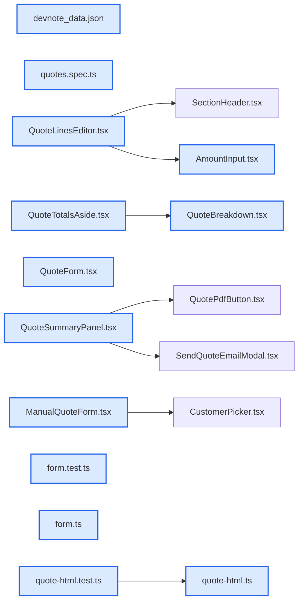

# jhtechSaaS — Dev Note: 견적 폼·PDF 3종 개선

> **📅 Date:** 2026-07-02 · **🗂️ Project:** jhtechSaaS · **🏷️ Main Task:** 견적 폼·PDF 3종 개선
> **👤 Author:** — · **🔖 Tags:** quote, pdf, ui, web, worker, vercel, railway

---

## TL;DR

견적 작성/수정·수기 폼과 견적서 PDF를 3개 PR로 개선: (1) 모든 금액 입력칸 천단위 구분자 + 포함옵션 이름 편집 + 드롭다운 분류 제거(#194), (2) 견적서 PDF 품목표에서 포함/추가 옵션을 색·소제목으로 그룹 구분(#195), (3) 수정/수기 폼 우측 합계 박스를 상세 요약과 동일한 장비/옵션 소계 분해로 통일 + 입력칸 정렬·추가옵션 레이아웃 재배치(#196). 3건 모두 머지·배포 라이브, DB/RPC 무변경.

---

## Code Structure

오늘 변경된 파일 간 의존 관계 (자동 분석):



---

## Today's Work

### ✨ `feat(web/quote-form)`: 견적 폼 금액 천단위 구분자 + 포함옵션 이름 편집 + 드롭다운 분류 제거

**Status:** `completed`  
**Files changed:** `apps/web/src/app/admin/_components/AmountInput.tsx`, `apps/web/src/app/admin/_components/QuoteLinesEditor.tsx`, `apps/web/e2e/quotes.spec.ts`

#### 📋 Context (왜)

견적 폼의 금액 입력칸에 천단위 구분자가 없어 큰 금액 가독성이 떨어졌고, 포함옵션은 가격만 편집 가능하고 이름은 카탈로그 고정이었으며, 장비 선택 드롭다운이 '장비명 · 분류'로 길었다.

#### 🔨 Implementation (무엇을 어떻게)

type=number는 콤마를 못 넣으므로 text+inputMode=numeric의 공용 AmountInput 신설(내부값 정수, 화면 ko-KR 콤마). 견적 폼 금액칸 5곳에 적용. 포함옵션 UI를 체크박스 → [이름][가격][삭제] 편집 줄로 재구성(카탈로그 옵션은 하단 칩으로 재추가). 드롭다운을 장비명만 표시.

#### 💻 Key Code

**`apps/web/src/app/admin/_components/AmountInput.tsx`**

```tsx
const display = Number.isFinite(value) ? value.toLocaleString("ko-KR") : "";
return (<input {...rest} type="text" inputMode="numeric" value={display}
  onChange={(e) => { const digits = e.target.value.replace(/[^0-9]/g, ""); onChange(digits === "" ? Number.NaN : Number(digits)); }} />);
```

_천단위 구분자 자동 입력 — text+inputMode=numeric, 내부값은 정수_

#### 📐 Architecture Decisions (ADR)

**Decision:** 포함옵션 이름 편집은 견적 jsonb(kind=included)에만 저장 → PDF에만 반영, 장비(카탈로그) 원본 포함옵션은 불변. 세 조건이 구조적으로 성립(장비/카탈로그 테이블 미변경).


**Decision:** 천단위 구분자는 수량 포함 모든 숫자 입력칸에 일괄 적용('모든 숫자 입력박스' 요청 그대로).


#### 💡 Learnings

- Playwright fill('50000000')은 AmountInput(text)에도 동작하지만 결과 표시값은 '50,000,000'이라 toHaveValue 단언을 포맷값으로 갱신해야 한다.
- 입력 aria-label을 유지하면 UI 구조를 바꿔도 e2e 선택자가 호환된다.

---

### ✨ `feat(worker/quote-pdf)`: 견적서 PDF 품목표 — 포함/추가 옵션 그룹 구분

**Status:** `completed`  
**Files changed:** `apps/worker/src/jobs/quote-html.ts`, `apps/worker/src/jobs/quote-html.test.ts`

#### 📋 Context (왜)

PDF 품목표에 장비·포함옵션·추가옵션이 한 목록으로 이어져, 어느 것이 가격 포함이고 어느 것이 별도 비용인지 구분이 안 됐다.

#### 🔨 Implementation (무엇을 어떻게)

옵션을 두 그룹으로 나눠 각 그룹 앞에 소제목 행 삽입: 포함 옵션(쿨=네이비 도트+옅은 파랑 밴드/배경) / 추가 옵션(웜=앰버 도트+옅은 베이지 배경). 옵션 줄 이름 앞 └ 트리 기호+들여쓰기. 포함옵션의 '포함'은 공급가 칸이 아닌 비고 칸에 회색 표기(단가·공급가 빈칸 유지, 금액은 장비 줄에 흡수 — 기존 로직). 소제목은 해당 옵션이 있을 때만 렌더. 금액·총계 로직 무변경.

#### 💻 Key Code

**`apps/worker/src/jobs/quote-html.ts`**

```typescript
const groupHead = (cls, label, rows) =>
  rows ? `<tr class="grp ${cls}"><td colspan="5" class="glabel"><span class="gdot"></span>${label}</td></tr>${rows}` : "";
const incGroup = groupHead("g-inc", "포함 옵션", incRows);
const extraGroup = groupHead("g-extra", "추가 옵션", extraRows);
```

_옵션 그룹 소제목 행 — 해당 옵션 있을 때만 삽입_

#### 📐 Architecture Decisions (ADR)

**Decision:** 샘플을 먼저 실제 렌더(장비1+포함3+추가3)해 Read 도구로 대조 후 사용자 승인받고 확정. 사용자 피드백으로 소제목 안내문구 삭제 + 포함 '포함'을 공급가→비고 칸으로 이동.


#### 💡 Learnings

- PDF 시각검증은 워커 tsx 하니스로 렌더 → Read 도구로 대조(PNG/PDF를 cat/grep 금지). 로컬 macOS 크롬 분기(channel:chrome)로 즉시 렌더 가능.
- Railway 워커는 railway.json watchPatterns(apps/worker/**)로 main push 시 자동 재배포 — 배포 상태는 GitHub 커밋 상태 'JHTECH - jhtechSaaS' + deployment 'JHTECH / production'으로 확인 가능(Railway CLI 없이도).

---

### ✨ `feat(web/quote-form)`: 견적 수정/수기 폼 우측 합계 소계 분해 + 입력 정렬·추가옵션 재배치

**Status:** `completed`  
**Files changed:** `apps/web/src/lib/quotes/form.ts`, `apps/web/src/lib/quotes/form.test.ts`, `apps/web/src/app/admin/_components/QuoteBreakdown.tsx`, `apps/web/src/app/admin/_components/QuoteTotalsAside.tsx`, `apps/web/src/app/admin/_components/QuoteLinesEditor.tsx`, `apps/web/src/app/admin/applications/[id]/_components/QuoteForm.tsx`, `apps/web/src/app/admin/applications/[id]/_components/quote-frame/QuoteSummaryPanel.tsx`, `apps/web/src/app/admin/quotes/_components/ManualQuoteForm.tsx`, `apps/web/e2e/quotes.spec.ts`

#### 📋 Context (왜)

견적 상세 우측 요약패널엔 장비/옵션 소계가 있는데 수정·수기 폼 우측 합계 박스엔 단일 합계만 있어 불일치했고, 메인 장비 카드의 기본공급가/수량 입력칸 폭이 달라 정렬이 안 됐으며, 추가옵션 입력이 옵션명/단가/(줄바꿈)비고/수량 순이라 어색했다.

#### 🔨 Implementation (무엇을 어떻게)

상세 패널의 소계 블록(장비 소계·옵션 소계·합계 금액 민트박스)을 공용 QuoteBreakdown 컴포넌트로 추출 → 상세(QuoteSummaryPanel)·수정/수기(QuoteTotalsAside)가 같은 컴포넌트를 렌더해 시각 완전 일치. form.ts formBreakdown로 소계 계산(장비 소계=Σ(기본가+포함옵션)×수량, 옵션 소계=Σ추가옵션). 기본공급가 w-40→w-32, 수량 w-20→w-32(동일 폭). 추가옵션을 옵션명·수량·단가 한 줄 + 비고 아래줄(표→항목 리스트)로 재배치.

#### 💻 Key Code

**`apps/web/src/lib/quotes/form.ts`**

```typescript
const equipmentSubtotal = items.reduce((s, it) => s + itemFinalUnit(it) * fin(it.quantity), 0);
const optionSubtotal = cleanExtra.reduce((s, r) => s + fin(r.unitPrice) * fin(r.quantity), 0);
// 라인 목록 단가는 상세와 동일하게 '기본가'(포함옵션 미합산) — 소계 값만 포함옵션 반영
```

_formBreakdown — 상세 요약과 동일한 소계 분해_

#### 📐 Architecture Decisions (ADR)

**Decision:** '동일하게 보이도록' 요구를 만족시키려 마크업을 복사하지 않고 공용 컴포넌트(QuoteBreakdown)로 추출해 양쪽에서 렌더 — 드리프트 원천 차단.


**Decision:** 폼 합계 표기를 상세와 동일한 ₩ 프리픽스로 통일(기존 '원' 서픽스에서 변경).


#### 💡 Learnings

- QuoteTotalsAside를 QuoteResult totals → 소계 분해 props로 바꾸면서 QuoteForm/ManualQuoteForm 양쪽 사용부와 QuoteBottomBar supplyPrice 결선을 함께 갱신해야 한다.
- 폼 합계 표기 변경('원'→'₩')으로 e2e getByText 단언 2곳이 깨짐 → 새 표기로 갱신.

---

## 🎯 Prompt Library

> 오늘 Claude Code에게 보낸 프롬프트 중 학습 가치가 있는 것들.

### ✅ 잘 통한 프롬프트: PDF 개선 — 방법 제안 + 샘플 우선

```
견적서PDF파일에 품목코드 및 품목명에 제품명, 포함옵션, 추가옵션이 모두 하나로 나열되서 들어가있는데, 포함옵션하고 추가옵션을 구분해서 봤으면 좋겠어. 방법을 생각해서 샘플을 보여줘
```

**교훈:** '방법을 생각해서 샘플을 보여줘'는 확정 전 시각 산출물을 먼저 요구하는 좋은 패턴. 커밋 없이 워킹트리 수정→렌더→Read 대조→승인 흐름으로 리스크 0.

### ✅ 잘 통한 프롬프트: 동일하게 보이도록 — 기존 컴포넌트 참조

```
견적 메인프레임 오른쪽에 견적내용 합계가 표시되는 박스에 '장비소계, 옵션 소계'내용이 있는데 이걸 견적서 수정페이지에도 동일하게 보이도록 추가해줘. 합계 금액까지 모두 동일하게 보이게 해줬으면 좋겠어.
```

**교훈:** '기존 X와 동일하게'는 공용 컴포넌트 추출로 해결 — 복사 대신 단일 컴포넌트를 양쪽에서 렌더하면 시각 일치가 보장된다.

### ✅ 잘 통한 프롬프트: 안전 순서 명시 — 백업 후 e2e

```
로컬 supabase를 백업 확인 후 띄워 견적 e2e를 돌린 뒤 올리자
```

**교훈:** db reset이 데모/백업 볼륨을 지울 위험이 있을 때, 시작→pg_dump 백업→reset→GRANT복구→seed→e2e 순서를 지키면 손실 없이 클린 게이트 통과.

---

## 📋 Changes Summary

### Added

- 공용 AmountInput(천단위 구분자 숫자 입력)
- 공용 QuoteBreakdown(장비/옵션 소계·합계 분해)
- 견적서 PDF 포함/추가 옵션 그룹 소제목·색 구분
- 견적 수정/수기 폼 우측 합계 박스 소계 분해
- form.ts formBreakdown 헬퍼

### Changed

- 견적 폼 금액 입력칸 5곳 → 천단위 구분자
- 포함옵션 UI(체크박스→이름·가격 편집 줄)
- 장비 선택 드롭다운(장비명만)
- 장비 카드 기본공급가/수량 입력 폭 통일(w-32)
- 추가옵션 레이아웃(옵션명·수량·단가 한 줄 + 비고 아래줄)
- 폼 합계 표기 '원'→'₩'(상세와 통일)

---

## ⏭️ Next Steps

- [ ] 실사용 확인: 견적 발행/재발행 후 PDF에서 포함/추가 그룹 구분 눈으로 확인
- [ ] 감사 후속(High): 공개 lookup 레이트리밋·.env.example Gmail→Hiworks·gen types·RLS db-tests CI·DB백업
- [ ] 수금 원장(receivables-ledger-plan) 착수
- [ ] 출고의뢰서 모바일 대응
- [ ] 미정: untracked analysis.md·docs/audit-2026-06-19.md 커밋 여부

---

## 🤖 Claude Code Hints

> **For future Claude Code sessions reading this note:**
> 견적 폼(작성/수정)·수기 견적은 QuoteLinesEditor + QuoteTotalsAside를 공유하고, 소계 표시는 QuoteBreakdown(상세 QuoteSummaryPanel과 공용)로 단일화됨 — 합계 표기는 ₩ 프리픽스. 금액 입력은 반드시 공용 AmountInput 사용(type=number 금지). 견적서 PDF 시각 변경은 apps/worker/src/jobs/quote-html.ts를 고치고 tsx 하니스로 렌더→Read 대조 후 사용자 승인, 워커는 Railway가 자동 재배포. UI 구조를 바꿔도 입력 aria-label은 유지해 e2e 호환 확보.

**Reusable patterns introduced today:**

- `AmountInput` — 천단위 구분자 자동 표시 숫자 입력(text+inputMode=numeric, 내부값 정수)
    - 파일: `apps/web/src/app/admin/_components/AmountInput.tsx`
- `QuoteBreakdown` — 장비/옵션 소계·합계 분해 블록 — 견적 상세·작성/수정·수기가 공유해 시각 일치
    - 파일: `apps/web/src/app/admin/_components/QuoteBreakdown.tsx`
- `PDF 시각검증 하니스` — 워커 tsx 하니스로 PDF 렌더→Read 도구 대조(cat/grep 금지). 로컬 macOS는 channel:chrome 분기
    - 파일: `apps/worker/src/jobs/_render-sample.ts`
