# jhtechSaaS — Dev Note: 견적-프레임-재구성

> **📅 Date:** 2026-06-09 · **🗂️ Project:** jhtechSaaS · **🏷️ Main Task:** 견적-프레임-재구성
> **👤 Author:** — · **🔖 Tags:** 견적, 의뢰관리, 프론트엔드, 디자인, TDD, Ghostty, Next.js

---

## TL;DR

의뢰 상세를 견적서 같은 견적 중심 프레임(네이비 히어로+좌측 본문+우측 sticky QUOTE SUMMARY)으로 재구성(슬라이스3a, PR #74, v0.12.9.0). 슬라이스2 상단바·배너(PR #73 머지, v0.12.8.0)에 이어짐. 시각 피드백 조정 라운드(그라데이션 히어로·요약 타이틀바·sticky 겹침수정·카드 세련화)까지. 마지막에 Ghostty 터미널 한글 깨짐을 폰트 폴백+legacy 폭계산으로 해결.

---

## Code Structure

오늘 변경된 파일 간 의존 관계 (자동 분석):

```mermaid
flowchart LR
    N0["MEMORY.md"]
    N1["jhtechsaas-project.md"]
    N2["CHANGELOG.md"]
    N3["CLAUDE.md"]
    N4["PROJECT-MAP.html"]
    N5["quotes.spec.ts"]
    N6["QuoteHero.tsx"]
    N7["QuoteSummaryPanel.tsx"]
    N8["page.tsx"]
    N9["banner.test.ts"]
    N10["banner.ts"]
    N11["equipment-match.server.ts"]
    N12["equipment-match.test.ts"]
    N13["equipment-match.ts"]
    N14["2026-06-09-applications-quote-frame-design.md"]
    N15["devnote_data.json"]
    N16["devnote_data_0609.json"]
    N17["AssignControl.tsx"]
    N18["RegisterCustomerButton.tsx"]
    N19["StatusControl.tsx"]
    N20["ApplicantInfo.tsx"]
    N21["InstallSurvey.tsx"]
    N22["OptionLists.tsx"]
    N23["Placeholders.tsx"]
    N24["QuoteHero.tsx"]
    N25["QuoteSummaryPanel.tsx"]
    N26["SelectedEquipment.tsx"]
    N27["SitePhotos.tsx"]
    N28["VersionHistory.tsx"]
    N29["page.tsx"]
    N30["page.tsx"]
    N31["banner.ts"]
    N32["equipment-match.server.ts"]
    N33["equipment-match.ts"]
    N29 --> N19
    N29 --> N17
    N29 --> N18
    N29 --> N24
    N29 --> N28
    N29 --> N20
    N29 --> N21
    N29 --> N27
    N29 --> N26
    N29 --> N22
    N29 --> N25
    N29 --> N23
    N32 --> N33
    N9 --> N31
    N12 --> N33
    N11 --> N33
    N8 --> N19
    N8 --> N17
    N8 --> N18
    N8 --> N24
    N8 --> N28
    N8 --> N20
    N8 --> N21
    N8 --> N27
    N8 --> N26
    N8 --> N22
    N8 --> N25
    N8 --> N23
    style N20 fill:#dbeafe,stroke:#2563eb,stroke-width:2px
    style N2 fill:#dbeafe,stroke:#2563eb,stroke-width:2px
    style N5 fill:#dbeafe,stroke:#2563eb,stroke-width:2px
    style N8 fill:#dbeafe,stroke:#2563eb,stroke-width:2px
    style N14 fill:#dbeafe,stroke:#2563eb,stroke-width:2px
    style N13 fill:#dbeafe,stroke:#2563eb,stroke-width:2px
    style N28 fill:#dbeafe,stroke:#2563eb,stroke-width:2px
    style N3 fill:#dbeafe,stroke:#2563eb,stroke-width:2px
    style N10 fill:#dbeafe,stroke:#2563eb,stroke-width:2px
    style N22 fill:#dbeafe,stroke:#2563eb,stroke-width:2px
    style N26 fill:#dbeafe,stroke:#2563eb,stroke-width:2px
    style N6 fill:#dbeafe,stroke:#2563eb,stroke-width:2px
    style N25 fill:#dbeafe,stroke:#2563eb,stroke-width:2px
    style N12 fill:#dbeafe,stroke:#2563eb,stroke-width:2px
    style N29 fill:#dbeafe,stroke:#2563eb,stroke-width:2px
    style N0 fill:#dbeafe,stroke:#2563eb,stroke-width:2px
    style N33 fill:#dbeafe,stroke:#2563eb,stroke-width:2px
    style N16 fill:#dbeafe,stroke:#2563eb,stroke-width:2px
    style N15 fill:#dbeafe,stroke:#2563eb,stroke-width:2px
    style N31 fill:#dbeafe,stroke:#2563eb,stroke-width:2px
    style N30 fill:#dbeafe,stroke:#2563eb,stroke-width:2px
    style N9 fill:#dbeafe,stroke:#2563eb,stroke-width:2px
    style N24 fill:#dbeafe,stroke:#2563eb,stroke-width:2px
    style N7 fill:#dbeafe,stroke:#2563eb,stroke-width:2px
    style N11 fill:#dbeafe,stroke:#2563eb,stroke-width:2px
    style N1 fill:#dbeafe,stroke:#2563eb,stroke-width:2px
    style N4 fill:#dbeafe,stroke:#2563eb,stroke-width:2px
    style N32 fill:#dbeafe,stroke:#2563eb,stroke-width:2px
```



---

## Today's Work

### ✨ `feat(applications)`: 의뢰 상세 상단바 + 견적 배너 (슬라이스2)

**Status:** `completed`  
**Files changed:** `apps/web/src/app/admin/applications/[id]/page.tsx`, `apps/web/src/lib/quotes/banner.ts`

#### 📋 Context (왜)

의뢰 상세 정보가 위아래로 흩어져 핵심(담당자·상태·견적 합계·유효기간)을 한눈에 못 봄.

#### 🔨 Implementation (무엇을 어떻게)

sticky 상단바(접수번호·회사명·담당자·상태 배지+컨트롤) + 배너(대표견적 합계·유효기간). 순수로직 TDD(pickRepresentativeQuote·computeQuoteValidity). PR #73 squash 머지(v0.12.8.0).

#### 📐 Architecture Decisions (ADR)

**Decision:** 유효기간=발행일+30일 표시전용(이후 3a에서 15일로 정정)


**Decision:** 배너 합계=최신 발행본 우선


**Decision:** 상단바 버튼 변경 전 고스트→변경 시 스틸블루


#### 💡 Learnings

- app-status 배지 testid는 e2e 권위 상태 readout 계약 — 제거 시 4곳 e2e 깨짐

---

### ♻️ `refactor(applications)`: 의뢰 상세를 견적 중심 프레임으로 재구성 (슬라이스3a)

**Status:** `completed`  
**Files changed:** `apps/web/src/app/admin/applications/[id]/page.tsx`, `apps/web/src/app/admin/applications/[id]/_components/quote-frame/QuoteHero.tsx`, `apps/web/src/app/admin/applications/[id]/_components/quote-frame/VersionHistory.tsx`, `apps/web/src/app/admin/applications/[id]/_components/quote-frame/ApplicantInfo.tsx`, `apps/web/src/app/admin/applications/[id]/_components/quote-frame/SelectedEquipment.tsx`, `apps/web/src/app/admin/applications/[id]/_components/quote-frame/OptionLists.tsx`, `apps/web/src/app/admin/applications/[id]/_components/quote-frame/QuoteSummaryPanel.tsx`, `apps/web/src/lib/quotes/equipment-match.ts`, `apps/web/src/lib/quotes/equipment-match.server.ts`, `apps/web/src/app/admin/quotes/[id]/page.tsx`

#### 📋 Context (왜)

사용자가 제공한 견적 상세 목업(네이비 히어로·버전이력·신청기업·선택장비·우측 QUOTE SUMMARY·영업일지)을 목표로 의뢰 상세 메인 프레임 재구성. 기존 데이터만, DB 변경 0, 읽기전용.

#### 🔨 Implementation (무엇을 어떻게)

page.tsx가 application·quotes·선택견적(?v=)·장비매칭을 페치하고 견적 유무로 분기. 표시는 _components/quote-frame/ 작은 컴포넌트로 위임. 견적 item 이름을 장비 카탈로그 name/model과 best-effort 매칭해 이미지·카테고리·포함옵션(kind=included) 연결. /admin/quotes/[id]는 ?v= 리다이렉트로 통합. 서브에이전트 주도(배치별 구현+게이트 검증).

#### 💻 Key Code

**`apps/web/src/lib/quotes/equipment-match.ts`**

```typescript
function norm(s: string): string {
  return s.toLowerCase().replace(/[^0-9a-z가-힣]/g, "");
}
export function matchEquipmentName<T extends { name: string; model: string | null }>(itemName: string, list: T[]): T | null {
  const key = norm(itemName);
  if (key === "") return null;
  return list.find((e) => norm(e.name) === key || (e.model != null && norm(e.model) === key)) ?? null;
}
```

_견적 item이 equipment_id를 안 가져 이름으로 best-effort 매칭(정규화: 소문자+영숫자/한글만)_

#### 📐 Architecture Decisions (ADR)

**Decision:** D1 기존 데이터 읽기전용(마이그 0)부터 — 신규 데이터는 후속


**Decision:** D2 /admin/applications/[id] 단일 페이지 + ?v= 버전전환 + 견적없음 폴백


**Decision:** D3 선택 장비 = 이름 best-effort 매칭(미매칭은 텍스트 폴백)


**Decision:** D4 특기사항·영업일지·메일발송 = 비활성 준비중 플레이스홀더


**Decision:** 유효기간 발행일+15일 정정(슬라이스2의 30일 오류 — 목표 견적서가 15일 명시)


#### 🐛 Problems & Solutions

**Problem:** 구조 변경으로 quotes e2e 3건 실패

- **Root cause:** 재발행 흐름의 /admin/quotes/ 별도페이지가 ?v= 리다이렉트로 사라짐 + JHQ번호·발행배지·금액이 히어로/버전이력/요약패널 여러 곳 중복(strict 위반)
- **Solution:** 재발행=요약패널 [수정]링크로 재작성, 중복 텍스트 .first()

#### 💡 Learnings

- SSR 클라 페이지 큰 재설계 = page는 데이터 페치/분기만, 표시는 _components/<frame>/ 작은 컴포넌트로 분리(파일 비대화 방지)
- 견적 item은 equipment_id 미저장(스냅샷) → 카탈로그 연동은 이름 매칭(향후 equipment_id 영속으로 정확화)

---

### 💅 `style(applications)`: 견적 프레임 시각 조정 (디자인 피드백 반영)

**Status:** `completed`  
**Files changed:** `apps/web/src/app/admin/applications/[id]/_components/quote-frame/QuoteHero.tsx`, `apps/web/src/app/admin/applications/[id]/_components/quote-frame/QuoteSummaryPanel.tsx`, `apps/web/src/app/admin/applications/[id]/page.tsx`

#### 📋 Context (왜)

사용자 시각 피드백: 너무 딱딱함, 네이비 히어로 너무 어두워 답답, 견적금액 박스에 컬러 타이틀 원함, 스크롤 시 영업일지가 견적금액 박스에 겹침.

#### 🔨 Implementation (무엇을 어떻게)

히어로=풀블리드 플랫다크→라운드카드+스틸블루→네이비 그라데이션. QUOTE SUMMARY 상단에 히어로 톤 네이비 타이틀바. 우측 컬럼(요약+영업일지)을 self-start sticky 한 덩어리로 묶어 겹침 해결. 좌측 카드 rounded-lg+p-5+soft shadow+연한보더로 세련화.

#### 📐 Architecture Decisions (ADR)

**Decision:** sticky는 개별 컴포넌트가 아니라 우측 컬럼 전체를 self-start로(겹침 방지)


#### 💡 Learnings

- CSS grid에서 sticky 사이드바는 컬럼에 self-start 필요(기본 stretch면 full-height라 sticky 무력화). 같은 컬럼 내 sticky+하위형제는 겹치므로 컬럼 전체를 한 덩어리 sticky로.

---

### 🐛 `fix(tooling)`: Ghostty 터미널 한글 깨짐 해결

**Status:** `completed`  
**Files changed:** `~/.config/ghostty/config (repo 밖 전역)`

#### 📋 Context (왜)

Claude Code 화면에서 한글이 깨져 보임. 앱·소스·웹폰트는 모두 정상 확인(Pretendard 로드·UTF-8·헤드리스 렌더 정상) → 터미널 측 문제로 좁힘.

#### 🔨 Implementation (무엇을 어떻게)

Ghostty 폰트가 JetBrains Mono 단독(한글 글리프 없음)이라 한글 폴백 깨짐. ~/.config/ghostty/config에 font-family=Apple SD Gothic Neo(한글 폴백) + grapheme-width-method=legacy(CJK 더블폭 wcwidth 기준) 추가. ghostty +validate-config exit0 확인.

#### 📐 Architecture Decisions (ADR)

**Decision:** 앱 코드가 아니라 Ghostty 설정으로 해결(근본 원인이 터미널 폰트/폭계산)


#### 💡 Learnings

- 터미널에서 한글이 깨지는데 앱·소스는 정상이면 → 터미널 폰트(JetBrains/Latin 전용은 한글 無)에 한글 폴백 추가 + Ghostty는 grapheme-width-method=legacy로 TUI CJK 폭 맞춤. 적용은 Ghostty 재실행 또는 Cmd+Shift+,(reload)

---

## 🎯 Prompt Library

> 오늘 Claude Code에게 보낸 프롬프트 중 학습 가치가 있는 것들.

### ✅ 잘 통한 프롬프트: 구체적 시각 디자인 피드백

```
내가 처음에 이미지 줬던건 세련된느낌이였는데, 이건 너무 딱딱한 느낌이고, 네이비 히어로가 너무 어두워서 답답해보여. 오른쪽 견적금액 박스도 상단에 견적번호와 제목정도는 히어로처럼 색을 넣어서 타이틀을 만들어줬으면. 스크롤하니까 영업일지 부분이 견적금액 박스에 겹쳐져서 움직여.
```

**교훈:** 각 불만을 구체적 위치+증상으로 짚으면(어둡다/겹친다/타이틀 원함) 바로 타겟 수정 가능. 슬라이스 방식 조정 라운드에 이상적.

### 🔁 참고 프롬프트: 증상만 주고 원인 조사 위임

```
한글이 깨져서나오는데 왜그런거지? / The Korean text is currently displaying incorrectly. Please investigate the cause, fix it.
```

**교훈:** 위치 불명확한 '깨짐'은 앱/소스/폰트/터미널을 층층이 배제(앱 정상 입증→터미널로 좁힘). TERM=xterm-ghostty 같은 env 단서가 결정적.

---

## 📚 References & 외부 학습

- **[Claude Code CJK 렌더링 이슈](https://github.com/anthropics/claude-code/issues/66269)** `claude-code` · `cjk`
    - no-flicker 렌더러 CJK 깨짐(차선책). 1차 원인은 Ghostty 폰트였음
- **[Ghostty grapheme-width-method](https://ghostty.org/docs/config)** `ghostty` · `terminal`
    - legacy=wcwidth 기준 CJK 폭, TUI 호환

---

## 📋 Changes Summary

### Added

- 의뢰 상세 견적 중심 프레임(히어로·버전이력·신청기업·선택장비·포함/추가옵션·우측 sticky QUOTE SUMMARY)
- 장비 이름 best-effort 매칭(이미지·포함옵션)
- 슬라이스2 상단바+배너

### Changed

- 의뢰 상세 IA를 견적 중심으로 재구성
- 견적 유효기간 발행일+15일로 정정
- /admin/quotes/[id]를 ?v= 리다이렉트로 통합
- 히어로 그라데이션·요약 타이틀바·카드 세련화

### Fixed

- 우측 컬럼 sticky 겹침(요약↔영업일지)
- Ghostty 터미널 한글 깨짐(폰트 폴백+legacy 폭)

### Removed

- 슬라이스2 QuoteBanner(히어로+QUOTE SUMMARY로 대체)

---

## ⏭️ Next Steps

- [ ] PR #74 머지(머지 시 Vercel 자동 배포) + roadmap.json 3a done 반영
- [ ] 후속 슬라이스 3b 특기사항(quotes 컬럼) · 3c 영업일지(컬럼, 불변모델과 분리) · 3d 메일발송(jobs email+워커+액션)
- [ ] 회사 주업종·사업자등록일(companies 컬럼) · 견적 items에 equipment_id 영속(이미지 정확연결)

---

## 🤖 Claude Code Hints

> **For future Claude Code sessions reading this note:**
> 견적 상세 작업은 의뢰 상세 /admin/applications/[id] 단일 페이지에 ?v=로 통합돼 있다(별도 quotes 페이지 없음, 리다이렉트). 견적 프레임 UI는 _components/quote-frame/ 컴포넌트들로 분리됨. 견적 유효기간은 발행일+15일(banner.ts VALID_DAYS=15). 견적 item은 equipment_id를 안 가지므로 카탈로그 연동은 matchEquipmentName 이름 매칭. 터미널 한글 깨짐은 Ghostty 폰트 폴백 문제였고 ~/.config/ghostty/config에 해결됨.

**Reusable patterns introduced today:**

- `이름 best-effort 매칭` — FK 없는 스냅샷 데이터를 카탈로그와 정규화 이름 대조로 연결(미매칭은 폴백)
    - 파일: `apps/web/src/lib/quotes/equipment-match.ts`
- `컬럼 전체 sticky 사이드바` — grid에서 우측 컬럼에 self-start lg:sticky lg:top-0 → 요약+부가 패널이 한 덩어리로 고정(겹침 방지)
    - 파일: `apps/web/src/app/admin/applications/[id]/page.tsx`
