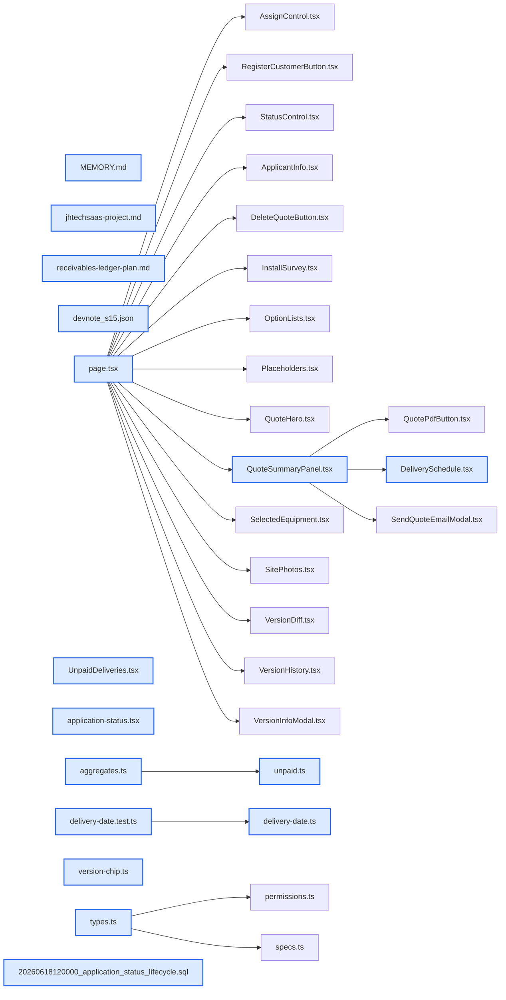

# jhtechSaaS — Dev Note: 견적UX-상태라이프사이클-미수금

> **📅 Date:** 2026-06-18 · **🗂️ Project:** jhtechSaaS · **🏷️ Main Task:** 견적UX-상태라이프사이클-미수금
> **👤 Author:** — · **🔖 Tags:** quote, dashboard, status-lifecycle, ux, supabase-migration

---

## TL;DR

견적 상세 UX 정리 3건(#146 처리바·#147 납품일정 입력·#148 상태 라이프사이클+미수금 위젯) 머지·프로덕션 배포. #148은 supabase db push까지 완료. 수금 원장은 계획만 기록(미구현).

---

## Code Structure

오늘 변경된 파일 간 의존 관계 (자동 분석):



---

## Today's Work

### ✨ `feat(admin/applications)`: 견적 처리바 정리 (#146)

**Status:** `completed`  
**Files changed:** `apps/web/src/app/admin/applications/[id]/page.tsx`, `apps/web/src/app/admin/applications/[id]/_components/quote-frame/QuoteSummaryPanel.tsx`, `apps/web/src/lib/quotes/version-chip.ts`

#### 📋 Context (왜)

기능이 늘며 처리바 한 줄에 정보·산출물·컨트롤이 뒤섞여 줄바꿈으로 깨짐.

#### 🔨 Implementation (무엇을 어떻게)

출고의뢰서 버튼을 처리바→우측 sticky 요약패널 '문서' 영역으로 이동(testid 유지, preview 분기 밖이라 노출 조건 보존). 처리바를 flex-wrap+ml-auto(우연한 줄바꿈)→좌(버전정보)/우(담당자·상태) 명시 2영역(lg 미만 세로 stack). 버전칩 금액 제거(히어로·요약패널 중복).

#### 💡 Learnings

- 좁은 패널은 flex-wrap 대신 명시 2영역+lg stack으로 줄바꿈을 의도화

---

### 🐛 `fix(quote-frame/DeliverySchedule)`: 납품일정 입력 개선 (#147)

**Status:** `completed`  
**Files changed:** `apps/web/src/app/admin/applications/[id]/_components/quote-frame/DeliverySchedule.tsx`, `apps/web/src/lib/quotes/delivery-date.ts`, `apps/web/src/lib/quotes/delivery-date.test.ts`

#### 📋 Context (왜)

좁은 요약패널서 시각 칸 잘림 + 브라우저 기본 date 입력이 연도→월 커서 자동이동을 안 함(Chrome: 연도 4자리 초과 허용이라 '다 침'을 판단 못함).

#### 🔨 Implementation (무엇을 어떻게)

2행 레이아웃(날짜 전체폭 / 시각+저장 다음줄, 시각 flex-1)으로 시각 잘림 해소. 날짜를 기본 date칸→마스크 텍스트입력으로 교체: formatDateMask가 숫자 연속입력을 YYYY-MM-DD로 자동 포맷(커서 점프 자체 제거), parseDeliveryDate가 미완성·월/일 범위·연도<1000·윤년 검증.

#### 💡 Learnings

- 네이티브 input[type=date]는 연도 세그먼트 자동이동 불가(브라우저 한계) → 마스크 텍스트입력이 키보드 연속입력엔 더 나음(달력 팝업은 트레이드오프)

---

### ✨ `feat(application-status / dashboard)`: 의뢰 상태 라이프사이클 확장 + 미수금 대시보드 위젯 (#148)

**Status:** `completed`  
**Files changed:** `supabase/migrations/20260618120000_application_status_lifecycle.sql`, `apps/web/src/lib/application-status.tsx`, `apps/web/src/lib/dashboard/unpaid.ts`, `apps/web/src/app/admin/dashboard/_components/UnpaidDeliveries.tsx`, `apps/web/src/lib/dashboard/aggregates.ts`, `packages/shared/src/types.ts`

#### 📋 Context (왜)

업체 미팅 요구 — 견적발송 이후 납품·수금 단계 추적 + 대시보드에서 '납품했는데 수금 안 된 회사' 확인.

#### 🔨 Implementation (무엇을 어떻게)

기존 5상태 유지(완료=closed는 라벨만 '종료', 키 불변) + 납품완료/수금중/수금완료 3개 추가(DB CHECK additive, 기존 행·트리거 무변경). 단일 출처 application-status.tsx(8상태 배열 + 진행중/완료군/미수금 셋 + 색). 미수금 위젯 = 납품완료·수금중 의뢰의 대표 발행견적 합계·목록(buildUnpaidSummary 순수함수 TDD). 흩어진 참조(zod·history 타입·shared·진행중 필터·대시보드 집계) 단일화.

#### 📐 Architecture Decisions (ADR)

**Decision:** 완료(closed)는 삭제 아닌 라벨 변경(종료)으로 데이터 이전 회피


**Decision:** 납품·수금 진행은 영업 수동(출고의뢰서 발행→납품완료 자동전이 안 함)


**Decision:** 미수금 금액은 VAT 포함 total 기준


#### 💡 Learnings

- 상태 enum은 '단일 출처' 같아도 DB CHECK·zod·타입(여러 곳)·필터·대시보드 6~9곳에 흩어짐 — 확장 시 전수 확인
- 미수금=VAT포함 total−Σ수금이 정확(현 위젯은 공급가라 임시·부정확)

---

### 📝 `docs(planning)`: 수금 원장 기능 — 계획만 기록(미구현)

**Status:** `blocked`  
**Files changed:** `memory/receivables-ledger-plan.md`

#### 📋 Context (왜)

정확한 미수금(=total−Σ수금)엔 입금내역 데이터가 필요한데 의뢰 상세가 이미 과밀.

#### 🔨 Implementation (무엇을 어떻게)

별도 '수금 원장' 페이지 + payments 원장 테이블로 분리하는 계획을 메모리에 기록. 프로세스: 견적→계약금→중도금(수금중)→납품(수금중·순서가변)→1주후 잔금(수금완료). 구현은 시간 날 때 착수.

#### 💡 Learnings

- UX 과밀 우려 시 관리 surface를 의뢰 상세서 분리(별도 페이지)

---

## 🎯 Prompt Library

> 오늘 Claude Code에게 보낸 프롬프트 중 학습 가치가 있는 것들.

### ✅ 잘 통한 프롬프트: 영향 범위 먼저 조사 요청

```
완료 상태를 삭제했을 경우 영향을 미치는 내용이 어떤게 있는지 확인해서 알려줘
```

**교훈:** 구현 전 '삭제 시 영향'을 먼저 묻게 해 데이터 이전 리스크(기존 closed 행 CHECK 위반)를 사전 발견

### ✅ 잘 통한 프롬프트: 현 동작의 의미 확인

```
지금 완료 상태가 견적을 완료한 상태인건지 아니면 납품까지 모두 완료한 상태인건지 알 수 있나?
```

**교훈:** 기존 상태의 실제 의미를 코드로 확인하니 완료가 무정의(수동 종결)임이 드러나 재설계 근거가 됨

### ✅ 잘 통한 프롬프트: 정확성 지적(공식 제시)

```
미수금이 정확히는 전체금액-계약금 + 부가세
```

**교훈:** 도메인 공식을 명시하니 현 구현의 금액 부정확성(공급가·수금액 누락)을 정확히 진단

---

## 📋 Changes Summary

### Added

- 의뢰 상태 납품완료·수금중·수금완료(#148)
- 대시보드 미수금 위젯(#148)
- 납품일 마스크 입력 delivery-date.ts(#147)

### Changed

- 출고의뢰서 버튼 위치→요약패널(#146)
- 처리바 2영역 분리(#146)
- 상태 라벨 완료→종료(#148)
- 버전칩 금액 제거(#146)

### Fixed

- 납품일정 시각 칸 잘림(#147)
- 납품일 연도→월 커서 미이동(#147)

---

## ⏭️ Next Steps

- [ ] 수금 원장 기능 착수(receivables-ledger-plan.md) — 시간 날 때
- [ ] 착수 시 미수금 위젯을 total−Σ수금으로 보정(현 공급가 임시)

---

## 🤖 Claude Code Hints

> **For future Claude Code sessions reading this note:**
> 상태 enum 확장 시 application-status.tsx(단일출처)+DB CHECK+zod+shared/history 타입+필터+대시보드 집계를 전수 동기화하라. 미수금 정확값=VAT포함 quote.total−Σ수금(현 위젯 공급가는 임시). 수금 원장은 의뢰 상세가 아닌 별도 페이지로(과밀 회피).

**Reusable patterns introduced today:**

- `마스크 텍스트 날짜입력` — 네이티브 date칸의 연도 자동이동 한계를 한 칸 마스크 텍스트입력으로 회피(숫자→YYYY-MM-DD 자동포맷+검증)
    - 파일: `apps/web/src/lib/quotes/delivery-date.ts`
- `상태 단일출처+파생셋` — 상태 배열 1곳 + ACTIVE/DONE/UNPAID 파생 셋을 satisfies로 정의해 필터·집계가 단일출처서 파생
    - 파일: `apps/web/src/lib/application-status.tsx`
