# jhtechSaaS — Dev Note: 견적·출고의뢰서-개선-13건

> **📅 Date:** 2026-06-26 · **🗂️ Project:** jhtechSaaS · **🏷️ Main Task:** 견적·출고의뢰서-개선-13건
> **👤 Author:** — · **🔖 Tags:** 견적서, 출고의뢰서, PDF, 버전관리, RLS, Supabase, 영업일지

---

## TL;DR

견적서 8건 + 출고의뢰서 5건, 총 13개 개선을 8개 PR(#170~177)로 구현·머지·프로덕션 배포. 견적: PDF 폰트/라벨 다듬기, 특기사항 편집, 항목별 비고, 수신처 담당자·직책, 영업일지(신규). 출고의뢰서: RIP'기타'/칼라'프라이머'+직접입력, 고객정보 편집+고객DB반영, 발행후 수정+버전관리, PDF 메모. 전 게이트 GREEN, db push 5건 라이브.

---

## Code Structure

오늘 변경된 파일 간 의존 관계 (자동 분석):

```mermaid
flowchart LR
    N0["MEMORY.md"]
    N1["release-orders.spec.ts"]
    N2["sales-logs.spec.ts"]
    N3["QuoteLinesEditor.tsx"]
    N4["QuoteNotesEditor.tsx"]
    N5["SalesLogPanel.tsx"]
    N6["QuoteForm.tsx"]
    N7["ReleaseOrderForm.tsx"]
    N8["page.tsx"]
    N9["page.tsx"]
    N10["route.ts"]
    N11["page.tsx"]
    N12["page.tsx"]
    N13["CompanyForm.tsx"]
    N14["EquipmentForm.tsx"]
    N15["EquipmentTable.tsx"]
    N16["layout.tsx"]
    N17["ManualQuoteForm.tsx"]
    N18["page.tsx"]
    N19["page.tsx"]
    N20["actions.ts"]
    N21["schema.ts"]
    N22["actions.ts"]
    N23["form.test.ts"]
    N24["form.ts"]
    N25["queries.ts"]
    N26["schema.ts"]
    N27["actions.ts"]
    N28["queries.ts"]
    N29["actions.ts"]
    N30["queries.ts"]
    N31["_render-logo-check.ts"]
    N32["quote-html.test.ts"]
    N33["quote-html.ts"]
    N34["quote-pdf.ts"]
    N35["release-html.test.ts"]
    N36["release-html.ts"]
    N37["release-pdf.ts"]
    N38["quote_create_rpc.test.ts"]
    N39["release_orders.test.ts"]
    N40["sales_logs.test.ts"]
    N41["quote-calc.ts"]
    N42["release-order.ts"]
    N43["20260626120000_quote_notes.sql"]
    N44["20260626130000_company_manager_title.sql"]
    N45["20260626140000_sales_logs.sql"]
    N46["20260626150000_release_order_editable_customer.sql"]
    N47["20260626160000_release_order_versioning.sql"]
    N48["20260626120000_quote_notes_down.sql"]
    N49["20260626130000_company_manager_title_down.sql"]
    N50["20260626140000_sales_logs_down.sql"]
    N51["20260626150000_release_order_editable_customer_down.sql"]
    N52["20260626160000_release_order_versioning_down.sql"]
    N53["devnote_data.json"]
    N54["AccountMenu.tsx"]
    N55["AdminSidebar.tsx"]
    N56["BadgePoller.tsx"]
    N57["ConsoleMain.tsx"]
    N58["ForcedPasswordChange.tsx"]
    N59["Icon.tsx"]
    N60["MobileNav.tsx"]
    N61["QuoteNotesEditor.tsx"]
    N62["SalesLogPanel.tsx"]
    N63["ApplicationContext.tsx"]
    N64["QuoteForm.tsx"]
    N65["ReleaseOrderForm.tsx"]
    N66["ReleaseOrderPdfButton.tsx"]
    N67["route.ts"]
    N68["CustomerActivityTabs.tsx"]
    N69["CustomerHeader.tsx"]
    N70["CustomerInfoSidebar.tsx"]
    N71["CustomerKpiStrip.tsx"]
    N72["SavedToast.tsx"]
    N73["CompanyEquipmentEditor.tsx"]
    N74["CompanyForm.tsx"]
    N75["FormSectionCard.tsx"]
    N76["StickyFormFooter.tsx"]
    N77["BannerUploader.tsx"]
    N78["CatalogUploader.tsx"]
    N79["EquipmentForm.tsx"]
    N80["EquipmentTable.tsx"]
    N81["HighlightsEditor.tsx"]
    N82["ImageUploader.tsx"]
    N83["OptionEditor.tsx"]
    N84["SpecEditor.tsx"]
    N85["YoutubeUrlsEditor.tsx"]
    N86["layout.tsx"]
    N87["CustomerPicker.tsx"]
    N88["ManualQuoteForm.tsx"]
    N89["page.tsx"]
    N90["schema.ts"]
    N91["actions.ts"]
    N92["queries.ts"]
    N93["queries.ts"]
    N94["assets.ts"]
    N95["logo-kind.ts"]
    N96["quote-html.ts"]
    N97["quote-pdf.ts"]
    N98["release-html.ts"]
    N99["release-pdf.ts"]
    N100["render-quote-pdf.ts"]
    N101["render-release-pdf.ts"]
    N102["helpers.ts"]
    N103["quote-calc.ts"]
    N104["release-order.ts"]
    N105["20260626120000_quote_notes.sql"]
    N106["20260626130000_company_manager_title.sql"]
    N107["20260626140000_sales_logs.sql"]
    N108["20260626150000_release_order_editable_customer.sql"]
    N109["20260626160000_release_order_versioning.sql"]
    N79 --> N84
    N79 --> N81
    N79 --> N85
    N79 --> N83
    N79 --> N82
    N79 --> N77
    N79 --> N78
    N97 --> N100
    N97 --> N95
    N97 --> N96
    N74 --> N73
    N74 --> N75
    N74 --> N76
    N86 --> N59
    N86 --> N55
    N86 --> N54
    N86 --> N60
    N86 --> N58
    N86 --> N56
    N86 --> N57
    N65 --> N66
    N99 --> N101
    N99 --> N94
    N99 --> N98
    N14 --> N84
    N14 --> N81
    N14 --> N85
    N14 --> N83
    N14 --> N82
    N14 --> N77
    N14 --> N78
    N17 --> N87
    N8 --> N64
    N8 --> N63
    N34 --> N100
    N34 --> N95
    N34 --> N96
    N32 --> N96
    N38 --> N102
    N13 --> N73
    N13 --> N75
    N13 --> N76
    N11 --> N74
    N31 --> N100
    N31 --> N96
    N29 --> N93
    N12 --> N72
    N12 --> N69
    N12 --> N70
    N12 --> N68
    N12 --> N71
    N18 --> N88
    N16 --> N59
    N16 --> N55
    N16 --> N54
    N16 --> N60
    N16 --> N58
    N16 --> N56
    N16 --> N57
    N40 --> N102
    N7 --> N66
    N35 --> N98
    N39 --> N102
    N9 --> N65
    N37 --> N101
    N37 --> N94
    N37 --> N98
    style N79 fill:#dbeafe,stroke:#2563eb,stroke-width:2px
    style N106 fill:#dbeafe,stroke:#2563eb,stroke-width:2px
    style N65 fill:#dbeafe,stroke:#2563eb,stroke-width:2px
    style N5 fill:#dbeafe,stroke:#2563eb,stroke-width:2px
    style N35 fill:#dbeafe,stroke:#2563eb,stroke-width:2px
    style N3 fill:#dbeafe,stroke:#2563eb,stroke-width:2px
    style N7 fill:#dbeafe,stroke:#2563eb,stroke-width:2px
    style N51 fill:#dbeafe,stroke:#2563eb,stroke-width:2px
    style N6 fill:#dbeafe,stroke:#2563eb,stroke-width:2px
    style N19 fill:#dbeafe,stroke:#2563eb,stroke-width:2px
    style N52 fill:#dbeafe,stroke:#2563eb,stroke-width:2px
    style N2 fill:#dbeafe,stroke:#2563eb,stroke-width:2px
    style N42 fill:#dbeafe,stroke:#2563eb,stroke-width:2px
    style N36 fill:#dbeafe,stroke:#2563eb,stroke-width:2px
    style N22 fill:#dbeafe,stroke:#2563eb,stroke-width:2px
    style N80 fill:#dbeafe,stroke:#2563eb,stroke-width:2px
    style N107 fill:#dbeafe,stroke:#2563eb,stroke-width:2px
    style N31 fill:#dbeafe,stroke:#2563eb,stroke-width:2px
    style N45 fill:#dbeafe,stroke:#2563eb,stroke-width:2px
    style N25 fill:#dbeafe,stroke:#2563eb,stroke-width:2px
    style N53 fill:#dbeafe,stroke:#2563eb,stroke-width:2px
    style N1 fill:#dbeafe,stroke:#2563eb,stroke-width:2px
    style N67 fill:#dbeafe,stroke:#2563eb,stroke-width:2px
    style N74 fill:#dbeafe,stroke:#2563eb,stroke-width:2px
    style N39 fill:#dbeafe,stroke:#2563eb,stroke-width:2px
    style N105 fill:#dbeafe,stroke:#2563eb,stroke-width:2px
    style N41 fill:#dbeafe,stroke:#2563eb,stroke-width:2px
    style N28 fill:#dbeafe,stroke:#2563eb,stroke-width:2px
    style N91 fill:#dbeafe,stroke:#2563eb,stroke-width:2px
    style N43 fill:#dbeafe,stroke:#2563eb,stroke-width:2px
    style N29 fill:#dbeafe,stroke:#2563eb,stroke-width:2px
    style N92 fill:#dbeafe,stroke:#2563eb,stroke-width:2px
    style N16 fill:#dbeafe,stroke:#2563eb,stroke-width:2px
    style N23 fill:#dbeafe,stroke:#2563eb,stroke-width:2px
    style N9 fill:#dbeafe,stroke:#2563eb,stroke-width:2px
    style N4 fill:#dbeafe,stroke:#2563eb,stroke-width:2px
    style N103 fill:#dbeafe,stroke:#2563eb,stroke-width:2px
    style N62 fill:#dbeafe,stroke:#2563eb,stroke-width:2px
    style N24 fill:#dbeafe,stroke:#2563eb,stroke-width:2px
    style N8 fill:#dbeafe,stroke:#2563eb,stroke-width:2px
    style N104 fill:#dbeafe,stroke:#2563eb,stroke-width:2px
    style N17 fill:#dbeafe,stroke:#2563eb,stroke-width:2px
    style N96 fill:#dbeafe,stroke:#2563eb,stroke-width:2px
    style N99 fill:#dbeafe,stroke:#2563eb,stroke-width:2px
    style N14 fill:#dbeafe,stroke:#2563eb,stroke-width:2px
    style N108 fill:#dbeafe,stroke:#2563eb,stroke-width:2px
    style N61 fill:#dbeafe,stroke:#2563eb,stroke-width:2px
    style N86 fill:#dbeafe,stroke:#2563eb,stroke-width:2px
    style N34 fill:#dbeafe,stroke:#2563eb,stroke-width:2px
    style N32 fill:#dbeafe,stroke:#2563eb,stroke-width:2px
    style N90 fill:#dbeafe,stroke:#2563eb,stroke-width:2px
    style N33 fill:#dbeafe,stroke:#2563eb,stroke-width:2px
    style N18 fill:#dbeafe,stroke:#2563eb,stroke-width:2px
    style N27 fill:#dbeafe,stroke:#2563eb,stroke-width:2px
    style N21 fill:#dbeafe,stroke:#2563eb,stroke-width:2px
    style N50 fill:#dbeafe,stroke:#2563eb,stroke-width:2px
    style N44 fill:#dbeafe,stroke:#2563eb,stroke-width:2px
    style N13 fill:#dbeafe,stroke:#2563eb,stroke-width:2px
    style N40 fill:#dbeafe,stroke:#2563eb,stroke-width:2px
    style N98 fill:#dbeafe,stroke:#2563eb,stroke-width:2px
    style N12 fill:#dbeafe,stroke:#2563eb,stroke-width:2px
    style N46 fill:#dbeafe,stroke:#2563eb,stroke-width:2px
    style N26 fill:#dbeafe,stroke:#2563eb,stroke-width:2px
    style N38 fill:#dbeafe,stroke:#2563eb,stroke-width:2px
    style N37 fill:#dbeafe,stroke:#2563eb,stroke-width:2px
    style N20 fill:#dbeafe,stroke:#2563eb,stroke-width:2px
    style N97 fill:#dbeafe,stroke:#2563eb,stroke-width:2px
    style N49 fill:#dbeafe,stroke:#2563eb,stroke-width:2px
    style N30 fill:#dbeafe,stroke:#2563eb,stroke-width:2px
    style N10 fill:#dbeafe,stroke:#2563eb,stroke-width:2px
    style N48 fill:#dbeafe,stroke:#2563eb,stroke-width:2px
    style N89 fill:#dbeafe,stroke:#2563eb,stroke-width:2px
    style N15 fill:#dbeafe,stroke:#2563eb,stroke-width:2px
    style N0 fill:#dbeafe,stroke:#2563eb,stroke-width:2px
    style N109 fill:#dbeafe,stroke:#2563eb,stroke-width:2px
    style N11 fill:#dbeafe,stroke:#2563eb,stroke-width:2px
    style N47 fill:#dbeafe,stroke:#2563eb,stroke-width:2px
```



---

## Today's Work

### 🐛 `fix(quote-pdf)`: 견적서 PDF 표시 다듬기 + 장비 라벨 '판매중'

**Status:** `completed`  
**Files changed:** `apps/worker/src/jobs/quote-html.ts`, `apps/web/src/app/admin/equipment/_components/EquipmentForm.tsx`, `apps/web/src/app/admin/equipment/_components/EquipmentTable.tsx`

#### 📋 Context (왜)

견적서 PDF 가독성 다듬기 + 장비 상태 라벨 변경 요청. DB 무변경.

#### 🔨 Implementation (무엇을 어떻게)

품목표·특기사항 폰트 11.5px 통일, 합계 한글금액 12px + white-space:nowrap(긴 금액·(단위:원) 한 줄 유지), 장비 상태 라벨 '운영중'→'판매중'(DB enum active 불변·UI만).

#### 💡 Learnings

- 합계 한글금액은 nowrap+min-width:0+overflow:hidden으로 12억대 최악케이스도 한 줄 유지 확인(Read 도구 PDF 대조)

---

### ✨ `feat(quote)`: 견적 특기사항 편집 + 항목별 비고

**Status:** `completed`  
**Files changed:** `supabase/migrations/20260626120000_quote_notes.sql`, `packages/shared/src/quote-calc.ts`, `apps/web/src/lib/quotes/*`, `apps/web/src/app/admin/_components/QuoteNotesEditor.tsx`, `apps/worker/src/jobs/quote-pdf.ts`

#### 📋 Context (왜)

특기사항이 워커에 하드코딩이었고 항목별 비고가 없었음. 견적별 편집 가능화 요청.

#### 🔨 Implementation (무엇을 어떻게)

quotes.notes(jsonb) + create_quote/create_manual_quote/_quote_insert에 p_notes 추가(최신 본문 재정의·상태전이/company_id 보존). 특기사항 여러 줄 자유편집 에디터(기본 2줄 프리필). 비고는 QuoteLine.remark를 shared 스키마에 명시(jsonb strip 방지)→RPC 변경 불필요(_quote_validate_lines가 단가·수량만 검사).

#### 📐 Architecture Decisions (ADR)

**Decision:** 특기사항=여러 줄 자유편집(사용자 선택)


**Decision:** 비고는 RPC 무변경 — 줄 검증이 단가·수량만 보므로 jsonb에 그대로 보존


#### 💡 Learnings

- RPC 인자추가는 named-arg 하위호환 → db push를 머지보다 먼저 하면 배포윈도우 리스크0
- _quote_insert 재정의는 반드시 최신 마이그 본문 기준(상태전이 로직 보존)

---

### ✨ `feat(quote-pdf)`: 견적서 수신처 담당자·직책 + 글씨 축소

**Status:** `completed`  
**Files changed:** `supabase/migrations/20260626130000_company_manager_title.sql`, `apps/web/src/lib/customers/schema.ts`, `apps/web/src/app/admin/customers/_components/CompanyForm.tsx`, `apps/worker/src/jobs/quote-pdf.ts`, `apps/worker/src/jobs/quote-html.ts`

#### 📋 Context (왜)

수신처가 '[회사] 귀하'뿐이라 담당자·직책 표기 요청. 고객에 직책 칸 신설 필요.

#### 🔨 Implementation (무엇을 어떻게)

companies.manager_title 컬럼 + 고객 폼/스키마. 워커 PDF가 quotes→application.company_id→companies 중첩조인(customer 별칭으로 company 텍스트 컬럼과 충돌 회피)으로 담당자·직책을 끌어와 '[회사][담당자][직책] 귀하'. 회사명 24→18px, 담당자·직책 13px.

#### 💡 Learnings

- 중첩조인 별칭은 부모 텍스트컬럼명과 충돌 회피(customer:company_id)
- 공개폼 의뢰는 company_id=null → 회사명만 폴백

---

### ✨ `feat(sales-logs)`: 영업일지(내부용) — 신규 기능

**Status:** `completed`  
**Files changed:** `supabase/migrations/20260626140000_sales_logs.sql`, `apps/web/src/lib/sales-logs/*`, `apps/web/src/app/admin/_components/SalesLogPanel.tsx`, `apps/web/src/app/admin/sales-logs/page.tsx`, `apps/web/src/app/admin/layout.tsx`

#### 📋 Context (왜)

업체별로 견적 작성 시 참고할 내부 메모 필요. PDF·고객 미노출.

#### 🔨 Implementation (무엇을 어떻게)

sales_logs 테이블 + RLS(부모 company 접근권+본인 작성분, author_id/created_at/company_id 트리거 서버강제·불변). SalesLogPanel을 고객 상세+견적 작성 화면 공용(회사 바뀌면 서버액션 재조회). /admin/sales-logs 작성자 모아보기 + 사이드바.

#### 📐 Architecture Decisions (ADR)

**Decision:** 고객 페이지+견적 화면 둘 다 노출(사용자 선택)


**Decision:** 별도 capability 없이 기존 customers 스코프 재사용


#### 🐛 Problems & Solutions

**Problem:** 

- **Solution:** companyId null 분기의 동기 setLogs([]) 제거(렌더가 placeholder로 가려 잔상 안 보임)

#### 💡 Learnings

- db-tests는 클린 reset 직후에만 — seed-local+e2e 오염 시 전역카운트 17개 거짓실패(전/후 분리 필수)

---

### ✨ `feat(release-order)`: 출고의뢰서 제공RIP '기타'·칼라 '프라이머'+직접입력

**Status:** `completed`  
**Files changed:** `packages/shared/src/release-order.ts`, `apps/web/src/app/admin/applications/[id]/_components/ReleaseOrderForm.tsx`, `apps/worker/src/jobs/release-html.ts`

#### 📋 Context (왜)

제공 RIP·칼라구성에 옵션 추가 + 관리자 직접입력 요청.

#### 🔨 Implementation (무엇을 어떻게)

RELEASE_OPTIONS.printerRip에 '기타', printerColors에 '프라이머' 추가. printer.ripOther/colorsOther 자유입력. 폼·PDF 반영. DB 무변경(details jsonb).

#### 💡 Learnings

- release_orders.details는 jsonb라 옵션·필드 추가는 마이그 불필요(RPC는 객체·20KB만 검증)

---

### ✨ `feat(release-order)`: 출고의뢰서 고객정보 편집 + 고객DB 반영(선택)

**Status:** `completed`  
**Files changed:** `supabase/migrations/20260626150000_release_order_editable_customer.sql`, `apps/web/src/lib/release-orders/actions.ts`, `apps/web/src/lib/release-orders/queries.ts`, `apps/web/src/app/admin/applications/[id]/_components/ReleaseOrderForm.tsx`

#### 📋 Context (왜)

고객정보가 읽기전용 스냅샷이라 수정 불가. 편집 가능화 + 고객관리 반영 여부 결정 필요.

#### 🔨 Implementation (무엇을 어떻게)

upsert_release_order에 p_company/p_contact_phone/p_install_address 추가(클라 우선·application 폴백). 회사·연락처·주소 편집 가능. '고객관리에도 반영' 체크박스→연결 고객(application.company_id)의 companies 갱신(companies_update RLS 통제).

#### 📐 Architecture Decisions (ADR)

**Decision:** 매번 체크박스로 선택(사용자 선택) — 체크 시에만 고객관리 원본 갱신


---

### ✨ `feat(release-order)`: 출고의뢰서 발행 후 수정 + 버전관리

**Status:** `completed`  
**Files changed:** `supabase/migrations/20260626160000_release_order_versioning.sql`, `apps/web/src/lib/release-orders/*`, `apps/web/src/app/admin/applications/[id]/release-order/pdf/route.ts`, `apps/worker/src/jobs/release-pdf.ts`, `apps/worker/src/jobs/release-html.ts`

#### 📋 Context (왜)

발행 후 잠겨 수정 불가. 발행 후에도 수정 + 이력 보존(버전관리) 요청.

#### 🔨 Implementation (무엇을 어떻게)

견적 버전 패턴 미러: version 컬럼+UNIQUE(application_id,version), 1:1 해제. seq_no 버전 간 공유. 발행본 불변(트리거)·수정 시 새 draft 버전. upsert가 최신 draft면 제자리·발행본/없음이면 새 버전 INSERT. 폼 잠금해제+버전이력 패널(버전별 PDF). pdf route/isReady/워커 모두 최신버전 기준.

#### 📐 Architecture Decisions (ADR)

**Decision:** 견적처럼 버전관리(사용자 선택) — V1·V2·V3 이력·PDF 모두 보존


#### 🐛 Problems & Solutions

**Problem:** 

- **Solution:** TextField input에 aria-label 추가(접근성+테스트 동시 개선)

#### 💡 Learnings

- 버전관리=발행본 잠금 트리거는 유지하되 upsert가 새 버전을 INSERT(발행본 보존)
- 모델 변경 시 기존 db-test의 단일행 가정 단언 갱신 필요(발행후 upsert=거부→새버전)

---

### ✨ `feat(release-order)`: 출고의뢰서 메모/특이사항(PDF 인쇄)

**Status:** `completed`  
**Files changed:** `packages/shared/src/release-order.ts`, `apps/web/src/app/admin/applications/[id]/_components/ReleaseOrderForm.tsx`, `apps/worker/src/jobs/release-html.ts`

#### 📋 Context (왜)

출고의뢰서에 현장 전달용 메모 필요. PDF 인쇄.

#### 🔨 Implementation (무엇을 어떻게)

details.memo(2000자) 추가. 폼 하단 메모 textarea. 워커 PDF 하단 '메모/특이사항' 섹션(내용 있을 때만·줄바꿈 보존). DB 무변경.

#### 📐 Architecture Decisions (ADR)

**Decision:** PDF에 인쇄되는 메모 영역(사용자 선택)


---

## 🎯 Prompt Library

> 오늘 Claude Code에게 보낸 프롬프트 중 학습 가치가 있는 것들.

### ✅ 잘 통한 프롬프트: 기능 갭 일괄 지정

```
견적서 작성에 관련된 내용 중에서 작업이 안되어 있는게 있어. 1. 영업일지... 2. 특기사항... (8건 번호 나열)
```

**교훈:** 번호 매긴 기능 목록 + 각 항목에 '왜/어디서 보이게/PDF 포함여부'까지 명시하면 탐색→PR 그룹핑→결정질문이 매끄럽게 흐른다.

### ✅ 잘 통한 프롬프트: 결정 위임형 요청

```
출고의뢰서에서 변경한 고객정보는 고객정보에 반영할지 여부도 확인해야 함 / (메모) 어느위치에 어떻게 추가할 지 고민중
```

**교훈:** 사용자가 미정 사항을 명시적으로 표시 → AskUserQuestion으로 핵심 결정만 모아 물어보고 나머지는 자율 진행하는 패턴이 효율적.

---

## 📋 Changes Summary

### Added

- sales_logs 테이블·영업일지 기능
- companies.manager_title(담당자 직책)
- quotes.notes(특기사항)·QuoteLine.remark(비고)
- release_orders.version(버전관리)·details.memo
- 출고의뢰서 RIP'기타'/칼라'프라이머'+직접입력

### Changed

- 견적 PDF 폰트·합계 줄바꿈
- 장비 상태 라벨 '운영중'→'판매중'
- 출고의뢰서 고객정보 편집 가능
- 출고의뢰서 발행 후 수정 가능(버전 생성)

### Fixed

- 견적 합계 한글금액 줄바꿈 방지

---

## ⏭️ Next Steps

- [ ] 데모 예약 장비 복수 선택(현재 단수 equipment_id — 자식테이블 vs 배열 결정 필요)
- [ ] 신규 장비 가격(0원) 채우기
- [ ] 감사 후속(공개 lookup 레이트리밋·.env.example Gmail→Hiworks·gen types·RLS db-tests CI·DB백업)
- [ ] 수금 원장(receivables-ledger-plan)
- [ ] 출고의뢰서 모바일 대응

---

## 🤖 Claude Code Hints

> **For future Claude Code sessions reading this note:**
> 이 프로젝트는 마이그레이션 RPC 인자추가가 named-arg 하위호환이라 db push를 머지보다 먼저 하면 배포 윈도우 리스크가 0이다. release_orders/quotes의 details·items는 jsonb라 필드 추가는 마이그 불필요(RPC는 객체·크기만 검증). PDF 변경은 반드시 Read 도구로 렌더 PDF를 대조 검증하고, db-tests:rls는 클린 db reset 직후에만 돌린다(seed-local+e2e 오염 시 전역카운트 거짓실패).

**Reusable patterns introduced today:**

- `버전관리(견적 패턴)` — version 컬럼+UNIQUE(parent,version), 발행본 불변 트리거 유지+upsert가 새 draft 버전 INSERT, seq_no는 버전 간 공유
    - 파일: `supabase/migrations/20260626160000_release_order_versioning.sql`
- `자식 스코프 RLS` — 부모 company 접근권(assignee OR view_all) EXISTS 미러 + 본인 작성분, 서버강제 필드는 BEFORE 트리거
    - 파일: `supabase/migrations/20260626140000_sales_logs.sql`
