# jhtechSaaS — Dev Note: 견적서-PDF-자동생성

> **📅 Date:** 2026-06-10 · **🗂️ Project:** jhtechSaaS · **🏷️ Main Task:** 견적서-PDF-자동생성
> **👤 Author:** — · **🔖 Tags:** pdf, puppeteer, railway, quote, supabase, production-deploy

---

## TL;DR

견적서 발행→PDF 자동생성 기능을 하루에 완성하고 프로덕션에 6배포(v0.12.13~0.12.15.0). Puppeteer HTML→PDF로 실제 견적서 양식을 만들고, Railway 워커의 크롬 배포 실패를 @sparticuz/chromium으로 해결, 다운로드·발행후 버튼 자동활성화·편집모드 시각구분·양식 다듬기까지 마감. 메일발송(하이웍스)은 API 스펙 미확보로 조사·결정 노트만 남기고 보류.

---

## Code Structure

오늘 변경된 파일 간 의존 관계 (자동 분석):

```mermaid
flowchart LR
    N0["MEMORY.md"]
    N1["jhtechsaas-project.md"]
    N2["CHANGELOG.md"]
    N3["VERSION"]
    N4["QuoteSummaryPanel.tsx"]
    N5["page.tsx"]
    N6["ApplicationListPane.tsx"]
    N7["page.tsx"]
    N8["BannerUploader.tsx"]
    N9["EquipmentForm.tsx"]
    N10["actions.ts"]
    N11["schema.ts"]
    N12["actions.ts"]
    N13["equipment-match.ts"]
    N14["assets.ts"]
    N15["browser.ts"]
    N16["quote-html.test.ts"]
    N17["quote-html.ts"]
    N18["quote-pdf.ts"]
    N19["render-quote-pdf.test.ts"]
    N20["render-quote-pdf.ts"]
    N21["roadmap.json"]
    N22["2026-06-10-quote-email-hiworks-research.md"]
    N23["2026-06-10-quote-pdf-render-design.md"]
    N24["quote-pdf-fields.test.ts"]
    N25["company.ts"]
    N26["equipment-match.test.ts"]
    N27["equipment-match.ts"]
    N28["index.ts"]
    N29["korean-amount.test.ts"]
    N30["korean-amount.ts"]
    N31["pnpm-workspace.yaml"]
    N32["20260610120000_quote_pdf_fields.sql"]
    N33["20260610120000_quote_pdf_fields_down.sql"]
    N34["devnote_data.json"]
    N35["AssignControl.tsx"]
    N36["RegisterCustomerButton.tsx"]
    N37["StatusControl.tsx"]
    N38["ApplicantInfo.tsx"]
    N39["InstallSurvey.tsx"]
    N40["OptionLists.tsx"]
    N41["Placeholders.tsx"]
    N42["QuoteHero.tsx"]
    N43["QuotePdfButton.tsx"]
    N44["QuoteSummaryPanel.tsx"]
    N45["SectionHeader.tsx"]
    N46["SelectedEquipment.tsx"]
    N47["SitePhotos.tsx"]
    N48["VersionHistory.tsx"]
    N49["page.tsx"]
    N50["ApplicationListPane.tsx"]
    N51["page.tsx"]
    N52["BannerUploader.tsx"]
    N53["EquipmentForm.tsx"]
    N54["HighlightsEditor.tsx"]
    N55["ImageUploader.tsx"]
    N56["OptionEditor.tsx"]
    N57["SpecEditor.tsx"]
    N58["YoutubeUrlsEditor.tsx"]
    N59["actions.ts"]
    N60["actions.ts"]
    N61["assets.ts"]
    N62["browser.ts"]
    N63["quote-html.ts"]
    N64["quote-pdf.ts"]
    N65["render-quote-pdf.ts"]
    N66["2026-06-10-quote-email-hiworks-research.md"]
    N67["biz-no.ts"]
    N68["company.ts"]
    N69["equipment-match.ts"]
    N70["korean-amount.ts"]
    N71["permissions.ts"]
    N72["phone.ts"]
    N73["quote-calc.ts"]
    N74["seed.ts"]
    N75["specs.ts"]
    N76["supabase.ts"]
    N77["types.ts"]
    N78["pnpm-workspace.yaml"]
    N79["20260610120000_quote_pdf_fields.sql"]
    N64 --> N65
    N64 --> N61
    N64 --> N63
    N65 --> N62
    N65 --> N63
    N53 --> N57
    N53 --> N54
    N53 --> N58
    N53 --> N56
    N53 --> N55
    N53 --> N52
    N49 --> N37
    N49 --> N35
    N49 --> N36
    N49 --> N42
    N49 --> N45
    N49 --> N48
    N49 --> N38
    N49 --> N39
    N49 --> N47
    N49 --> N46
    N49 --> N40
    N49 --> N44
    N49 --> N41
    N51 --> N53
    N29 --> N70
    N28 --> N71
    N28 --> N75
    N28 --> N76
    N28 --> N74
    N28 --> N77
    N28 --> N67
    N28 --> N72
    N28 --> N73
    N28 --> N70
    N28 --> N68
    N28 --> N69
    N26 --> N69
    N16 --> N63
    N20 --> N62
    N20 --> N63
    N19 --> N65
    N19 --> N62
    N19 --> N63
    N18 --> N65
    N18 --> N61
    N18 --> N63
    N9 --> N57
    N9 --> N54
    N9 --> N58
    N9 --> N56
    N9 --> N55
    N9 --> N52
    N7 --> N53
    N5 --> N37
    N5 --> N35
    N5 --> N36
    N5 --> N42
    N5 --> N45
    N5 --> N48
    N5 --> N38
    N5 --> N39
    N5 --> N47
    N5 --> N46
    N5 --> N40
    N5 --> N44
    N5 --> N41
    N4 --> N43
    style N69 fill:#dbeafe,stroke:#2563eb,stroke-width:2px
    style N9 fill:#dbeafe,stroke:#2563eb,stroke-width:2px
    style N70 fill:#dbeafe,stroke:#2563eb,stroke-width:2px
    style N2 fill:#dbeafe,stroke:#2563eb,stroke-width:2px
    style N15 fill:#dbeafe,stroke:#2563eb,stroke-width:2px
    style N14 fill:#dbeafe,stroke:#2563eb,stroke-width:2px
    style N28 fill:#dbeafe,stroke:#2563eb,stroke-width:2px
    style N19 fill:#dbeafe,stroke:#2563eb,stroke-width:2px
    style N65 fill:#dbeafe,stroke:#2563eb,stroke-width:2px
    style N79 fill:#dbeafe,stroke:#2563eb,stroke-width:2px
    style N68 fill:#dbeafe,stroke:#2563eb,stroke-width:2px
    style N60 fill:#dbeafe,stroke:#2563eb,stroke-width:2px
    style N51 fill:#dbeafe,stroke:#2563eb,stroke-width:2px
    style N6 fill:#dbeafe,stroke:#2563eb,stroke-width:2px
    style N5 fill:#dbeafe,stroke:#2563eb,stroke-width:2px
    style N66 fill:#dbeafe,stroke:#2563eb,stroke-width:2px
    style N64 fill:#dbeafe,stroke:#2563eb,stroke-width:2px
    style N23 fill:#dbeafe,stroke:#2563eb,stroke-width:2px
    style N29 fill:#dbeafe,stroke:#2563eb,stroke-width:2px
    style N25 fill:#dbeafe,stroke:#2563eb,stroke-width:2px
    style N11 fill:#dbeafe,stroke:#2563eb,stroke-width:2px
    style N16 fill:#dbeafe,stroke:#2563eb,stroke-width:2px
    style N21 fill:#dbeafe,stroke:#2563eb,stroke-width:2px
    style N34 fill:#dbeafe,stroke:#2563eb,stroke-width:2px
    style N49 fill:#dbeafe,stroke:#2563eb,stroke-width:2px
    style N30 fill:#dbeafe,stroke:#2563eb,stroke-width:2px
    style N13 fill:#dbeafe,stroke:#2563eb,stroke-width:2px
    style N53 fill:#dbeafe,stroke:#2563eb,stroke-width:2px
    style N8 fill:#dbeafe,stroke:#2563eb,stroke-width:2px
    style N0 fill:#dbeafe,stroke:#2563eb,stroke-width:2px
    style N24 fill:#dbeafe,stroke:#2563eb,stroke-width:2px
    style N50 fill:#dbeafe,stroke:#2563eb,stroke-width:2px
    style N78 fill:#dbeafe,stroke:#2563eb,stroke-width:2px
    style N31 fill:#dbeafe,stroke:#2563eb,stroke-width:2px
    style N17 fill:#dbeafe,stroke:#2563eb,stroke-width:2px
    style N63 fill:#dbeafe,stroke:#2563eb,stroke-width:2px
    style N18 fill:#dbeafe,stroke:#2563eb,stroke-width:2px
    style N59 fill:#dbeafe,stroke:#2563eb,stroke-width:2px
    style N12 fill:#dbeafe,stroke:#2563eb,stroke-width:2px
    style N26 fill:#dbeafe,stroke:#2563eb,stroke-width:2px
    style N33 fill:#dbeafe,stroke:#2563eb,stroke-width:2px
    style N1 fill:#dbeafe,stroke:#2563eb,stroke-width:2px
    style N22 fill:#dbeafe,stroke:#2563eb,stroke-width:2px
    style N10 fill:#dbeafe,stroke:#2563eb,stroke-width:2px
    style N32 fill:#dbeafe,stroke:#2563eb,stroke-width:2px
    style N27 fill:#dbeafe,stroke:#2563eb,stroke-width:2px
    style N62 fill:#dbeafe,stroke:#2563eb,stroke-width:2px
    style N7 fill:#dbeafe,stroke:#2563eb,stroke-width:2px
    style N3 fill:#dbeafe,stroke:#2563eb,stroke-width:2px
    style N4 fill:#dbeafe,stroke:#2563eb,stroke-width:2px
    style N20 fill:#dbeafe,stroke:#2563eb,stroke-width:2px
```



---

## Today's Work

### ✨ `feat(quotes)`: 견적 작성 2단 개편 + 저장 후 목록 배지 stale 수정

**Status:** `completed`  
**Files changed:** `apps/web/src/lib/quotes/actions.ts`, `apps/web/src/app/admin/applications/_components/ApplicationListPane.tsx`

#### 📋 Context (왜)

전날 이월된 견적 작성 UX 마무리. 견적 저장 후 의뢰 목록의 상태 배지가 이전 값으로 남는(stale) 문제.

#### 🔨 Implementation (무엇을 어떻게)

견적작성 화면을 2단 구조로 개편하고, 저장 액션 후 목록 캐시 무효화로 배지를 최신 상태로 갱신. PR#81 v0.12.13.0.

---

### ✨ `feat(worker/pdf)`: 견적서 PDF 실제 양식 생성 (Puppeteer HTML→PDF)

**Status:** `completed`  
**Files changed:** `apps/worker/src/jobs/quote-html.ts`, `apps/worker/src/jobs/quote-pdf.ts`, `apps/worker/src/jobs/render-quote-pdf.ts`, `packages/shared/src/korean-amount.ts`, `packages/shared/src/equipment-match.ts`, `packages/shared/src/company.ts`, `supabase/migrations/20260610120000_quote_pdf_fields.sql`, `apps/web/src/app/admin/equipment/_components/EquipmentForm.tsx`

#### 📋 Context (왜)

견적서 발행을 누르면 실제 양식의 PDF가 생성돼야 함. 의뢰사가 제공한 커팅기/프린터 견적서 양식 2종(Multicut Eco SG1625, JU1810 PLUS)이 기준. 상·하단 이미지는 장비마다 다름.

#### 🔨 Implementation (무엇을 어떻게)

워커가 renderQuoteHtml로 견적서 HTML을 조립한 뒤 Puppeteer(헤드리스 크롬)로 PDF 변환. 크롬 싱글턴 + base64 인라인 자산. 한글 금액 표기(numberToKoreanAmount)·공급자 정보(SUPPLIER)·장비명 매칭(matchEquipmentName)을 web에서 shared로 승격해 워커·웹 공용화. 마이그 20260610120000: equipment에 상/하단 배너 2컬럼 + profiles.phone 추가. 관리자가 장비별 배너를 업로드. PR#82 v0.12.14.0.

#### 📐 Architecture Decisions (ADR)

**Decision:** PDF 생성 방식 = Puppeteer HTML→PDF (pdf-lib 직접조립 대신). HTML/CSS로 양식을 잡는 게 디자인 반복이 빠름.


**Decision:** 장비별 상·하단 배너 이미지는 equipment 테이블 컬럼으로 관리, 관리자 폼에서 업로드.


**Decision:** 담당자 전화 = profiles.phone 컬럼 추가. 도장 이미지는 의뢰사 제공.


#### 💡 Learnings

- 금액 한글표기·공급자·장비명매칭 같은 순수 로직은 web→shared로 올려 워커와 공용화하면 PDF/화면 표기가 일관된다.

---

### 🐛 `fix(worker/railway)`: Railway 워커 크롬 배포 실패 수정 (@sparticuz/chromium)

**Status:** `completed`  
**Files changed:** `apps/worker/src/jobs/browser.ts`, `pnpm-workspace.yaml`

#### 📋 Context (왜)

puppeteer 번들 크롬이 Railway(Linux 컨테이너)에서 실행 실패. 또 puppeteer가 끌어온 zod@3가 web의 react-hook-form typecheck를 깸.

#### 🔨 Implementation (무엇을 어떻게)

puppeteer 제거 → puppeteer-core + @sparticuz/chromium. browser.ts가 환경별 분기(Linux=@sparticuz/chromium, macOS=channel chrome). zod 충돌은 pnpm overrides로 zod 4.4.3 고정. PR#83 v0.12.14.1.

#### 📐 Architecture Decisions (ADR)

**Decision:** 서버리스/컨테이너 크롬은 puppeteer-core + @sparticuz/chromium 조합이 표준. 로컬 macOS는 설치된 chrome 채널 사용.


#### 🐛 Problems & Solutions

**Problem:** puppeteer가 전이의존성으로 zod@3을 끌어와 web RHF typecheck 깨짐

- **Solution:** pnpm-workspace.yaml overrides에 zod 4.4.3 핀

#### 💡 Learnings

- 무거운 워커 의존성(puppeteer)이 끌어오는 전이의존성이 다른 패키지 타입검사를 깰 수 있다. pnpm overrides로 버전 강제.

---

### ✨ `feat(quotes/pdf)`: PDF 다운로드·발행후 버튼 자동활성화·편집모드 시각구분 + 양식 다듬기

**Status:** `completed`  
**Files changed:** `apps/worker/src/jobs/quote-html.ts`, `apps/web/src/app/admin/applications/[id]/page.tsx`, `apps/web/src/app/admin/equipment/[id]/edit/page.tsx`, `apps/web/src/app/admin/equipment/actions.ts`

#### 📋 Context (왜)

PDF가 quote-pdfs(비공개 버킷)에 저장되므로 다운로드에 서명 URL 필요. 발행 직후 '견적서 확인' 버튼이 즉시 활성화돼야 하고, 편집모드를 시각적으로 구분해야 함. 양식 디테일(글씨크기·공급자 박스·수신처 정렬·하단 이미지 위치) 보정.

#### 🔨 Implementation (무엇을 어떻게)

비공개 quote-pdfs 서명 URL 발급으로 다운로드 수정. pdf_url 폴링으로 발행 후 '견적서 확인' 버튼 자동활성화. 편집모드는 accent 좌측 레일로 구분. 양식 3차 다듬기: 글씨 크기 키움, 공급자 박스 중앙 시작 단일 테두리, 수신처([업체명] 귀하) 좌측 하단·우측 정렬, 합계 우측 정렬 배경, 705호 keep-all. 하단 배너는 내용 유무와 무관하게 항상 페이지 최하단 고정(flex layout). PR#84 v0.12.15.0.

#### 📐 Architecture Decisions (ADR)

**Decision:** 하단 배너 = 내용 분량과 무관하게 페이지 최하단 기준 고정(여백이 많아도 bottom에 붙임).


#### 🐛 Problems & Solutions

**Problem:** 테스트 견적(옵션/특기사항 비움)에서 하단 이미지가 특기사항 바로 아래 붙어 아래 여백 과다

- **Solution:** 본문을 flex로 늘리고 하단 배너를 항상 페이지 바닥에 고정

#### 💡 Learnings

- 로컬 PDF 검증 = 워커 tsx 하니스(_render-sample.ts)로 렌더 → Read 도구로 PDF 대조하며 튜닝. PNG는 절대 cat/grep 금지(컨텍스트 오염).

---

### 📝 `docs(email)`: 견적서 메일 발송(하이웍스) 조사·결정 노트 — 보류

**Status:** `blocked`  
**Files changed:** `docs/superpowers/specs/2026-06-10-quote-email-hiworks-research.md`

#### 📋 Context (왜)

재현테크 영업/관리자가 견적서 메일을 하이웍스(Hiworks) 플랫폼으로 송수신. PDF를 하이웍스 연동으로 발송하는 기능 검토.

#### 🔨 Implementation (무엇을 어떻게)

브레인스토밍 결과: 하이웍스가 POP-only라 SMTP로는 보낸편지함 기록이 안 됨 → REST API 경로로 결정. 단 API 스펙(인증·첨부·보낸편지함)을 아직 확보 못해 구현 보류. Seonje님이 가비아(1661-4370)에 문의 대기. 연구노트 PR#85.

#### 📐 Architecture Decisions (ADR)

**Decision:** 메일 발송 = SMTP 아닌 하이웍스 REST API. SMTP는 POP-only라 보낸편지함에 안 남음.


**Decision:** API 스펙(인증 방식·첨부 업로드·보낸편지함 반영) 미확보로 E6 구현 보류, 가비아 문의 응답 대기.


#### 💡 Learnings

- 메일 연동 전 '보낸편지함에 남는가'를 먼저 확인. POP-only 계정은 SMTP 발송이 송신함에 기록 안 됨.

---

## 🎯 Prompt Library

> 오늘 Claude Code에게 보낸 프롬프트 중 학습 가치가 있는 것들.

### ✅ 잘 통한 프롬프트: PDF 생성 방식부터 고민

```
이제 견적서 발행을 누르면 pdf가 만들어지는 기능을 구현할꺼야. 어떻게 구현할지부터 고민해보자
```

**교훈:** 구현 전 방식 선택(Puppeteer vs pdf-lib)을 먼저 논의해 디자인 반복이 빠른 길을 골랐다. 큰 기능은 '어떻게'부터.

### ✅ 잘 통한 프롬프트: 샘플 양식 + 가변 자산 사전 명시

```
커팅기/프린터 양식 2개가 있어. 상단/하단 이미지는 장비마다 모두 다르니 장비에 맞는 이미지로 넣어 만들어야 해. 이미지는 내가 제공할꺼야.
```

**교훈:** 실제 산출물 샘플 + 가변 부분(장비별 배너)을 미리 알려주면 데이터 모델(equipment 배너 컬럼)을 처음부터 맞게 잡는다.

### ✅ 잘 통한 프롬프트: PR 열어두고 자산 도착 후 같은 브랜치 튜닝

```
자산·시각 튜닝이 남았으니 PR을 열어두고, 도장·배너를 받아 같은 브랜치에서 시각 튜닝 커밋을 더한 뒤 머지하는 흐름으로 가자
```

**교훈:** 외부 자산 대기 중인 기능은 PR을 열어두고 자산 도착 후 같은 브랜치에 커밋을 쌓는 워크플로가 깔끔하다.

### ✅ 잘 통한 프롬프트: 하단 이미지 항상 바닥 고정 (구체적 버그 기술)

```
bottom 이미지는 내용 여부와 관계없이 항상 제일 아래쪽 기준으로 붙여줘
```

**교훈:** PDF 시각 버그를 '언제·어디서·어떻게 돼야 하는지' 구체적으로 기술하면 flex 바닥 고정으로 바로 해결.

---

## 📚 References & 외부 학습

- **[@sparticuz/chromium](https://github.com/Sparticuz/chromium)** `puppeteer` · `railway`
    - 서버리스/컨테이너용 크롬 바이너리. puppeteer-core와 조합해 Railway에서 헤드리스 크롬 실행.
- **[하이웍스 견적메일 연구노트](docs/superpowers/specs/2026-06-10-quote-email-hiworks-research.md)** `email` · `hiworks`
    - 하이웍스 메일 연동 조사: POP-only→REST API 경로, 스펙 미확보로 보류.

---

## 📋 Changes Summary

### Added

- 견적서 발행 시 Puppeteer HTML→PDF 실제 양식 생성
- 장비별 상·하단 배너 이미지 업로드 (equipment 2컬럼)
- profiles.phone (담당자 전화)
- PDF 다운로드 서명 URL, 발행후 '견적서 확인' 버튼 자동활성화, 편집모드 좌측 레일 시각구분

### Changed

- 금액 한글표기·공급자·장비명매칭 로직 web→shared 승격
- 견적서 양식 다듬기: 글씨크기·공급자 박스 중앙 시작·수신처 우측정렬·합계 우측정렬·하단 배너 바닥 고정
- pnpm overrides zod 4.4.3 핀

### Fixed

- Railway 워커 크롬 배포 실패 (puppeteer→puppeteer-core + @sparticuz/chromium)
- 견적 저장 후 의뢰 목록 상태 배지 stale
- 테스트 견적에서 하단 이미지가 위로 붙던 여백 문제

### Removed

- puppeteer (puppeteer-core로 대체)

---

## ⏭️ Next Steps

- [ ] 하이웍스 API 스펙 수령 시 E6 메일발송 재개 (인증·첨부·보낸편지함)
- [ ] PDF 추가 자산(이미지·데이터) 도착 시 양식 더 다듬기
- [ ] 3b 특기사항(quotes 컬럼)·3c 영업일지 구현
- [ ] 프로덕션 @sparticuz 크롬 런타임 최종 검증(Seonje 배너 업로드+발행 필요)

---

## 🤖 Claude Code Hints

> **For future Claude Code sessions reading this note:**
> 이 프로젝트의 PDF는 워커가 Puppeteer로 HTML→PDF 변환한다(quote-html.ts renderQuoteHtml). Railway(Linux)는 @sparticuz/chromium, 로컬 macOS는 channel chrome으로 browser.ts가 분기한다. PDF 시각 검증은 워커 tsx 하니스(_render-sample.ts)로 렌더 후 Read 도구로 PDF를 대조해 튜닝하라 — PNG/PDF를 cat/grep으로 읽지 마라(컨텍스트 오염). 금액 한글표기·공급자·장비명매칭 등 화면·PDF 공용 로직은 packages/shared에 둔다.

**Reusable patterns introduced today:**

- `워커 PDF 렌더 하니스` — tsx로 quote-html을 렌더해 로컬에서 PDF 산출, Read로 대조하며 시각 튜닝
    - 파일: `apps/worker/src/_render-sample.ts`
- `환경별 크롬 분기` — Linux=@sparticuz/chromium, macOS=channel chrome으로 puppeteer-core 실행
    - 파일: `apps/worker/src/jobs/browser.ts`
