# jhtechSaaS — Dev Note: 견적서-PDF-재구성-및-견적관리-보강

> **📅 Date:** 2026-06-15 · **🗂️ Project:** jhtechSaaS · **🏷️ Main Task:** 견적서-PDF-재구성-및-견적관리-보강
> **👤 Author:** — · **🔖 Tags:** quote-pdf, puppeteer, supabase, nextjs, zod, storage

---

## TL;DR

견적서 PDF를 새 자산 양식(배경·로고·장비이미지·장비네임)으로 재구성하고, 발행 PDF 결함(한글 제목 깨짐·사양 길이 페이지 넘침·장비 변경 시 사양/로고 불일치)을 연쇄 수정. 이어 견적 관리 기능 보강: 폼 취소 버튼·버전 이력 diff·버전별 PDF·견적 삭제(버전별/전체)·화면 부가세 제거. 하루 프로덕션 7배포(#111~117).

---

## Code Structure

오늘 변경된 파일 간 의존 관계 (자동 분석):

```mermaid
flowchart LR
    N0["MEMORY.md"]
    N1["jhtechsaas-project.md"]
    N2["quotes.spec.ts"]
    N3["QuoteTotalsAside.tsx"]
    N4["QuoteForm.tsx"]
    N5["DeleteQuoteButton.tsx"]
    N6["QuoteSummaryPanel.tsx"]
    N7["SelectedEquipment.tsx"]
    N8["VersionDiff.tsx"]
    N9["VersionHistory.tsx"]
    N10["page.tsx"]
    N11["page.tsx"]
    N12["page.tsx"]
    N13["BannerUploader.tsx"]
    N14["EquipmentForm.tsx"]
    N15["actions.ts"]
    N16["schema.ts"]
    N17["actions.ts"]
    N18["diff.test.ts"]
    N19["diff.ts"]
    N20["form.test.ts"]
    N21["form.ts"]
    N22["queries.ts"]
    N23["_render-sample.ts"]
    N24["assets.ts"]
    N25["quote-html.test.ts"]
    N26["quote-html.ts"]
    N27["quote-pdf.ts"]
    N28["render-quote-pdf.test.ts"]
    N29["2026-06-15-quote-pdf-asset-redesign.md"]
    N30["2026-06-15-quote-pdf-asset-redesign-design.md"]
    N31["quote-pdf-fields.test.ts"]
    N32["quote_create_rpc.test.ts"]
    N33["quote-calc.test.ts"]
    N34["quote-calc.ts"]
    N35["20260615120000_quote_device_assets.sql"]
    N36["20260615120000_quote_device_assets_down.sql"]
    N37["devnote_data.json"]
    N38["QuoteTotalsAside.tsx"]
    N39["ApplicationContext.tsx"]
    N40["AssignControl.tsx"]
    N41["QuoteForm.tsx"]
    N42["RegisterCustomerButton.tsx"]
    N43["StatusControl.tsx"]
    N44["ApplicantInfo.tsx"]
    N45["DeleteQuoteButton.tsx"]
    N46["DeliverySchedule.tsx"]
    N47["InstallSurvey.tsx"]
    N48["OptionLists.tsx"]
    N49["Placeholders.tsx"]
    N50["QuoteHero.tsx"]
    N51["QuotePdfButton.tsx"]
    N52["QuoteSummaryPanel.tsx"]
    N53["SectionHeader.tsx"]
    N54["SelectedEquipment.tsx"]
    N55["SitePhotos.tsx"]
    N56["VersionDiff.tsx"]
    N57["VersionHistory.tsx"]
    N58["BannerUploader.tsx"]
    N59["EquipmentForm.tsx"]
    N60["HighlightsEditor.tsx"]
    N61["ImageUploader.tsx"]
    N62["OptionEditor.tsx"]
    N63["SpecEditor.tsx"]
    N64["YoutubeUrlsEditor.tsx"]
    N65["schema.ts"]
    N66["actions.ts"]
    N67["diff.ts"]
    N68["form.ts"]
    N69["assets.ts"]
    N70["browser.ts"]
    N71["quote-html.ts"]
    N72["quote-pdf.ts"]
    N73["render-quote-pdf.ts"]
    N74["helpers.ts"]
    N75["quote-calc.ts"]
    N76["20260615120000_quote_device_assets.sql"]
    N72 --> N73
    N72 --> N71
    N57 --> N53
    N56 --> N53
    N25 --> N71
    N27 --> N73
    N27 --> N71
    N28 --> N73
    N28 --> N70
    N28 --> N71
    N14 --> N63
    N14 --> N60
    N14 --> N64
    N14 --> N62
    N14 --> N61
    N14 --> N58
    N12 --> N59
    N23 --> N73
    N23 --> N71
    N33 --> N75
    N32 --> N74
    N7 --> N53
    N10 --> N43
    N10 --> N40
    N10 --> N42
    N10 --> N50
    N10 --> N53
    N10 --> N57
    N10 --> N56
    N10 --> N44
    N10 --> N47
    N10 --> N55
    N10 --> N54
    N10 --> N48
    N10 --> N52
    N10 --> N49
    N11 --> N41
    N11 --> N39
    N6 --> N51
    N6 --> N46
    N6 --> N45
    N18 --> N67
    N9 --> N53
    N8 --> N53
    style N32 fill:#dbeafe,stroke:#2563eb,stroke-width:2px
    style N5 fill:#dbeafe,stroke:#2563eb,stroke-width:2px
    style N7 fill:#dbeafe,stroke:#2563eb,stroke-width:2px
    style N56 fill:#dbeafe,stroke:#2563eb,stroke-width:2px
    style N72 fill:#dbeafe,stroke:#2563eb,stroke-width:2px
    style N21 fill:#dbeafe,stroke:#2563eb,stroke-width:2px
    style N17 fill:#dbeafe,stroke:#2563eb,stroke-width:2px
    style N24 fill:#dbeafe,stroke:#2563eb,stroke-width:2px
    style N76 fill:#dbeafe,stroke:#2563eb,stroke-width:2px
    style N28 fill:#dbeafe,stroke:#2563eb,stroke-width:2px
    style N0 fill:#dbeafe,stroke:#2563eb,stroke-width:2px
    style N23 fill:#dbeafe,stroke:#2563eb,stroke-width:2px
    style N66 fill:#dbeafe,stroke:#2563eb,stroke-width:2px
    style N45 fill:#dbeafe,stroke:#2563eb,stroke-width:2px
    style N10 fill:#dbeafe,stroke:#2563eb,stroke-width:2px
    style N1 fill:#dbeafe,stroke:#2563eb,stroke-width:2px
    style N3 fill:#dbeafe,stroke:#2563eb,stroke-width:2px
    style N69 fill:#dbeafe,stroke:#2563eb,stroke-width:2px
    style N75 fill:#dbeafe,stroke:#2563eb,stroke-width:2px
    style N33 fill:#dbeafe,stroke:#2563eb,stroke-width:2px
    style N18 fill:#dbeafe,stroke:#2563eb,stroke-width:2px
    style N16 fill:#dbeafe,stroke:#2563eb,stroke-width:2px
    style N11 fill:#dbeafe,stroke:#2563eb,stroke-width:2px
    style N38 fill:#dbeafe,stroke:#2563eb,stroke-width:2px
    style N9 fill:#dbeafe,stroke:#2563eb,stroke-width:2px
    style N36 fill:#dbeafe,stroke:#2563eb,stroke-width:2px
    style N8 fill:#dbeafe,stroke:#2563eb,stroke-width:2px
    style N37 fill:#dbeafe,stroke:#2563eb,stroke-width:2px
    style N27 fill:#dbeafe,stroke:#2563eb,stroke-width:2px
    style N26 fill:#dbeafe,stroke:#2563eb,stroke-width:2px
    style N25 fill:#dbeafe,stroke:#2563eb,stroke-width:2px
    style N30 fill:#dbeafe,stroke:#2563eb,stroke-width:2px
    style N29 fill:#dbeafe,stroke:#2563eb,stroke-width:2px
    style N22 fill:#dbeafe,stroke:#2563eb,stroke-width:2px
    style N68 fill:#dbeafe,stroke:#2563eb,stroke-width:2px
    style N35 fill:#dbeafe,stroke:#2563eb,stroke-width:2px
    style N12 fill:#dbeafe,stroke:#2563eb,stroke-width:2px
    style N67 fill:#dbeafe,stroke:#2563eb,stroke-width:2px
    style N14 fill:#dbeafe,stroke:#2563eb,stroke-width:2px
    style N2 fill:#dbeafe,stroke:#2563eb,stroke-width:2px
    style N19 fill:#dbeafe,stroke:#2563eb,stroke-width:2px
    style N20 fill:#dbeafe,stroke:#2563eb,stroke-width:2px
    style N15 fill:#dbeafe,stroke:#2563eb,stroke-width:2px
    style N71 fill:#dbeafe,stroke:#2563eb,stroke-width:2px
    style N41 fill:#dbeafe,stroke:#2563eb,stroke-width:2px
    style N34 fill:#dbeafe,stroke:#2563eb,stroke-width:2px
    style N13 fill:#dbeafe,stroke:#2563eb,stroke-width:2px
    style N4 fill:#dbeafe,stroke:#2563eb,stroke-width:2px
    style N31 fill:#dbeafe,stroke:#2563eb,stroke-width:2px
    style N65 fill:#dbeafe,stroke:#2563eb,stroke-width:2px
    style N6 fill:#dbeafe,stroke:#2563eb,stroke-width:2px
    style N57 fill:#dbeafe,stroke:#2563eb,stroke-width:2px
```



---

## Today's Work

### ✨ `feat(worker/web/db)`: 견적서 PDF 자산 재구성(배경·로고·장비이미지·장비네임)

**Status:** `completed`  
**Files changed:** `apps/worker/src/jobs/quote-html.ts`, `apps/worker/src/jobs/quote-pdf.ts`, `apps/worker/src/jobs/assets.ts`, `supabase/migrations/20260615120000_quote_device_assets.sql`, `apps/web/src/lib/equipment/schema.ts`

#### 📋 Context (왜)

실제 영업용 견적서 양식(SG1625 등 실장비 사진·브랜드 로고)으로 발송 필요. 기존은 장비별 상/하단 폭전체 배너 방식.

#### 🔨 Implementation (무엇을 어떻게)

고정 자산(A4 배경·회사로고·상단 회색띠·Arimo폰트)=워커 번들, 장비별 자산(좌하단 모델명 로고·우하단 장비사진)=equipment.quote_banner_top/bottom 컬럼을 quote_device_name/quote_device_image로 rename(경로 device-name/device-image). 상단 헤더=회색띠 배경+로고+모델명 텍스트(견적 메인 품목명 자동).

#### 📐 Architecture Decisions (ADR)

**Decision:** 배경·로고는 고정(모든 PDF 공통), 장비이미지·네임만 장비별 — 매번 올리는 반복 제거


**Decision:** 제목=장비명(풀네임, 예 MULTICUT ECO SG1625 Digital Cutter), model 필드는 짧은 코드(SG1625)로 분리. 제목은 견적 품목명(스냅샷) 사용이 맞음


#### 💡 Learnings

- Railway(Linux) 크롬엔 Arial 없음 → Arimo Bold Italic(Arial 메트릭 호환 오픈폰트)을 @font-face base64 임베드해야 서버 발행본 폰트 동결. 한글 제목은 'KR'(NotoSansKR) 폴백 추가(Arimo는 라틴 전용)

---

### 🐛 `fix(worker)`: 발행 PDF 결함 수정(한글 제목 깨짐·사양 페이지 넘침)

**Status:** `completed`  
**Files changed:** `apps/worker/src/jobs/quote-html.ts`

#### 📋 Context (왜)

실발행 PDF에서 한글 모델명이 □□□로 깨지고, 장비 사양 18줄이 1열로 길어져 하단 로고/이미지가 2페이지로 넘어감.

#### 🔨 Implementation (무엇을 어떻게)

모델명 font-family에 'KR' 폴백 추가(라틴=Arimo, 한글=NotoSansKR). 사양을 그룹 내 항목 2열 grid로(.spec-items, 18줄→9줄)+폰트/줄간격 압축+빈 라벨('· : 값'→'· 값') 정리.

#### 💡 Learnings

- 기존 .specs는 grid가 spec-group 단위라 group 1개면 1열로 길어짐 → group 내부에 .spec-items grid wrapper 추가해야 항목이 2열. 시각검증=tsx 하니스 최악케이스(한글·긴사양) 렌더→Read 대조

---

### 🐛 `fix(shared/web/worker)`: 견적 PDF 장비 정보를 견적 선택 장비 기준으로(equipmentId 영속)

**Status:** `completed`  
**Files changed:** `packages/shared/src/quote-calc.ts`, `apps/web/src/lib/quotes/form.ts`, `apps/worker/src/jobs/quote-pdf.ts`, `apps/web/src/app/admin/applications/[id]/_components/QuoteForm.tsx`

#### 📋 Context (왜)

이미 발행된 견적을 수정해 장비를 UV프린터→커팅기로 바꿔 발행하면 제목·품목만 바뀌고 사양·로고·이미지는 UV프린터(의뢰 신청 장비) 그대로 출력. 로고/이미지는 빈칸.

#### 🔨 Implementation (무엇을 어떻게)

견적 items가 equipmentId를 버려(form.ts) 워커가 application.equipment_id로 폴백하던 게 원인. QuoteLine/QuoteRow+Zod에 equipmentId(선택) 추가, itemRowsToLines가 보존, 워커는 ①견적 장비id ②의뢰 장비 ③이름매칭 순 조회.

#### 📐 Architecture Decisions (ADR)

**Decision:** equipmentId 저장 위치=items jsonb(마이그레이션 불필요, 스냅샷 호환). quotes 별도 컬럼 대신


#### 💡 Learnings

- Zod z.object는 미정의 키를 strip → equipmentId 보존하려면 shared QuoteLineSchema에 명시 필수(안 하면 서버 액션 검증에서 잘림). 기존 견적(id 없음)은 폴백으로 하위호환, 재발행/새작성해야 id 저장됨

---

### ✨ `feat(web)`: 견적 관리 보강(삭제·폼취소·버전 diff·버전별 PDF·부가세 제거)

**Status:** `completed`  
**Files changed:** `apps/web/src/lib/quotes/actions.ts`, `apps/web/src/lib/quotes/diff.ts`, `apps/web/src/app/admin/applications/[id]/_components/quote-frame/VersionHistory.tsx`, `apps/web/src/app/admin/applications/[id]/_components/quote-frame/VersionDiff.tsx`, `apps/web/src/app/admin/applications/[id]/_components/quote-frame/DeleteQuoteButton.tsx`, `apps/web/src/app/admin/_components/QuoteTotalsAside.tsx`

#### 📋 Context (왜)

Seonje 사용 피드백 연속: 신청 장비이미지 확대됨, 견적 삭제 불가, 견적 페이지 폭 유동, 폼 취소 불가, 버전 비교/PDF 없음, 부가세 표시 불필요.

#### 🔨 Implementation (무엇을 어떻게)

선택장비 이미지 object-cover→contain+축소. 견적 삭제(관리자 users.manage RLS 기존)=버전별 삭제+PDF 동반삭제, 의뢰 전체 삭제(deleteAllQuotesForApplicationAction). 의뢰/견적 페이지 max-w-1180 중앙정렬(2분할 우측 유동 해소). 폼 취소 버튼. 버전이력 행 전체 클릭+버전별 PDF버튼+직전 버전 diff(diffQuoteVersions 순수로직). 화면 부가세 제거=합계를 공급가(VAT별도)로 통일.

#### 💡 Learnings

- 견적 삭제는 DB행만 지우면 storage PDF가 고아로 남음 → storage.remove([pdf_url]) 동반 필요. 화면 합계에서 부가세 빼면 total(세포함) 대신 공급가로 통일해야 일관(VersionHistory 합계컬럼도 q.total→q.supply_price 누락 주의)

---

## 🎯 Prompt Library

> 오늘 Claude Code에게 보낸 프롬프트 중 학습 가치가 있는 것들.

### ✅ 잘 통한 프롬프트: 참고 PDF로 시각 양식 합의

```
/Users/.../견적서_샘플_v4.pdf 이 파일에 상단처럼 만들고 싶어. 배경 넣고 배경위에 로고, 장비모델명 전체, 장비이미지는 넣지 않고
```

**교훈:** 시안/참고 PDF를 Read로 먼저 분석하면 양식 합의가 정확. 스펙만 추측하지 말고 실파일 대조

### ✅ 잘 통한 프롬프트: 데이터 모델 혼란 해소

```
장비명(한글), 모델명(영어)하고 헷갈리는건가? 제목하고 장비견적이름이 모두 모델명이 아니고 장비명으로 들어가는거 같은데 맞나?
```

**교훈:** 사용자가 동작 불일치를 지적하면 추측 말고 데이터 흐름을 코드로 끝까지 추적(폼→action→RPC→DB→워커)해 출처를 확정

### ✅ 잘 통한 프롬프트: 전체 로직 파악 요청

```
코드 기준으로 견적서가 발행되는 첫번째 동작부터, 옵션/장비 변경 시 어떻게 PDF 정보를 수집하는지 로직을 모두 파악해
```

**교훈:** 버그 수정 전 전체 데이터 흐름을 Explore 에이전트로 추적+코드 인용으로 근본원인 확정 후 착수

### ✅ 잘 통한 프롬프트: 쭉 진행 위임

```
PR, 머지, db push까지 순서대로 진행해. 나한테 물어보지 말고 쭉 진행해
```

**교훈:** 게이트 GREEN+명확한 결정이면 PR→머지→db push까지 멈추지 말고 진행. 시각 결과물만 사용자 확인

---

## 📋 Changes Summary

### Added

- 견적서 PDF 새 양식(배경·로고·상단헤더·장비이미지·장비네임)
- Arimo Bold Italic 폰트 임베드
- 견적 버전 diff(직전 버전 대비)
- 버전별 PDF 버튼
- 견적 폼 취소 버튼
- 견적 삭제(버전별/전체) + PDF 동반삭제

### Changed

- equipment.quote_banner_top/bottom → quote_device_name/quote_device_image rename
- 견적 items에 equipmentId 보존(jsonb)
- PDF 사양/로고/이미지를 견적 선택 장비 기준 조회
- 의뢰/견적 페이지 고정폭(max-w-1180)
- 화면 합계를 공급가(VAT별도)로 통일

### Fixed

- 한글 제목 폰트 깨짐
- 사양 길이로 하단 장비 2페이지 넘침
- 장비 변경 시 사양/로고 불일치
- 선택장비 이미지 확대(object-cover)
- 삭제 시 PDF 고아 파일

### Removed

- 견적 화면 부가세(세액) 표시

---

## ⏭️ Next Steps

- [ ] 하이웍스 API 스펙 오면 E6 메일발송 재개
- [ ] 3b 특기사항(quotes 컬럼)
- [ ] 3c 영업일지
- [ ] 견적 데이터 정리 후 Seonje 프로덕션 실테스트(장비 자산 재업로드 필요)

---

## 🤖 Claude Code Hints

> **For future Claude Code sessions reading this note:**
> 견적서 PDF는 워커 puppeteer(quote-html.ts HTML→PDF), 시각검증=tsx _render-sample.ts 렌더→Read 대조(PNG/PDF를 cat/grep 금지). PDF 폰트는 번들 임베드 필수(Railway엔 시스템 폰트 없음): 한글=NotoSansKR, 영문제목=Arimo. 견적 items의 equipmentId가 PDF 장비정보(사양/로고/이미지) 조회 기준 — z.object strip 방지로 shared 스키마에 명시돼 있음. 화면 합계는 공급가(VAT별도), 부가세 미표시.

**Reusable patterns introduced today:**

- `버전 diff 순수로직` — 두 버전 items+options를 (kind,name) 키로 매칭해 added/removed/changed 산출, jsonb 방어파싱
    - 파일: `apps/web/src/lib/quotes/diff.ts`
- `PDF 시각검증 하니스` — tsx로 최악케이스 데이터 렌더→/tmp PDF→Read 도구 대조
    - 파일: `apps/worker/src/jobs/_render-sample.ts`
