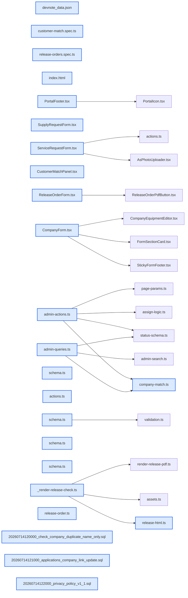

# jhtechSaaS — Dev Note: 고객중복-매칭-개인정보-출고특이사항

> **📅 Date:** 2026-07-15 · **🗂️ Project:** jhtechSaaS · **🏷️ Main Task:** 고객중복-매칭-개인정보-출고특이사항
> **👤 Author:** — · **🔖 Tags:** customers, dedup, privacy, release-order, pdf, kakao-alimtalk, prod-deploy

---

## TL;DR

고객관리 3종(동명 경고 게이트·견적요청-고객 매칭/연결/선택교정·개인정보 동의 전문 v1.1)을 PR#222로, 포털 연락처 통일을 PR#223·224로, 출고의뢰서 기본준비사항 박스별 특이사항(폼+PDF 1장 유지)을 PR#225로 구현·머지·prod 배포 완료. 카카오 알림톡 3종은 조사·템플릿 문안까지(채널 개설 대기).

---

## Code Structure

오늘 변경된 파일 간 의존 관계 (자동 분석):



---

## Today's Work

### ✨ `feat(customers)`: 고객 등록 동명(name_only) 경고 + 확인 게이트

**Status:** `completed`  
**Files changed:** `supabase/migrations/20260714120000_check_company_duplicate_name_only.sql`, `apps/web/src/lib/customers/schema.ts`, `apps/web/src/lib/customers/actions.ts`, `apps/web/src/app/admin/customers/_components/CompanyForm.tsx`

#### 📋 Context (왜)

사업자번호·회사명+전화 일치는 차단했지만 회사명만 같은 오타 중복은 그대로 통과 → 같은 회사가 두 번 등록되는 구멍

#### 🔨 Implementation (무엇을 어떻게)

check_company_duplicate RPC에 3순위 name_only(회사명 정규화 단독 일치, 배너용 biz_no·manager·address 포함) 추가. 폼은 코랄 경고 배너 + '동명의 다른 회사가 맞습니다' 체크(name_only_confirmed, 폼 전용 필드) 후에만 저장, 서버 액션 fail-closed 재검증.

#### 📐 Architecture Decisions (ADR)

**Decision:** 동명은 차단이 아닌 '확인 후 진행'(진짜 동명 회사 허용)


**Decision:** 1·2순위 차단 동작 불변


#### 💡 Learnings

- {'title': 'RPC 반환 필드 추가는 duplicateHitSchema(zod)와 DuplicateHit 타입 동시 확장'}

---

### ✨ `feat(applications)`: 견적요청 ↔ 기존 고객 매칭·연결·필드별 선택 교정

**Status:** `completed`  
**Files changed:** `apps/web/src/lib/applications/company-match.ts`, `apps/web/src/lib/applications/admin-queries.ts`, `apps/web/src/lib/applications/admin-actions.ts`, `apps/web/src/app/admin/applications/[id]/_components/CustomerMatchPanel.tsx`, `supabase/migrations/20260714121000_applications_company_link_update.sql`, `apps/web/e2e/customer-match.spec.ts`

#### 📋 Context (왜)

공개 견적요청은 고객 입력 원문 그대로 저장돼 기존 고객과 연결·오타 교정 수단이 없었음. 공개폼 실시간 확인은 익명 조회에 의한 개인정보 노출 위험이라 관리자 쪽 처리로 결정

#### 🔨 Implementation (무엇을 어떻게)

순수함수 matchCompany(linked>biz_no>name_only)·diffCustomerFields + 목록 배지(기존 고객/확인 필요) + 상세 CustomerMatchPanel('이 고객으로 연결' + 값 다른 필드만 3택 교정 모달). applications.company_id 트리거 동결 해제(연결 링크 의미로 변경) + upsert_company_from_application이 의뢰에 company_id 자동 기록.

#### 📐 Architecture Decisions (ADR)

**Decision:** 매칭·교정은 관리자 화면에서(익명 노출 회피)


**Decision:** 연결 + 필드별 선택 교정(자동 덮어쓰기 없음)


**Decision:** company_id는 불변 감사값 → 가변 연결 링크로 의미 변경(보호는 RLS)


#### 🐛 Problems & Solutions

**Problem:** 

- **Solution:** 반환 company_id = DB링크 ?? biz_no매치(기존 배지 호환), name_only는 match_kind/matched_company_id로만 노출

#### 💡 Learnings

- {'title': "기존 db-test가 '불변' 단언 중이면 의미 변경 시 테스트도 새 의미로 갱신"}
- {'title': '목록 매칭은 행별 쿼리 금지 — companies(id,name,biz_no) 1회 로드 후 JS 대조'}

---

### ✨ `feat(privacy)`: 개인정보 수집·이용 동의 전문 v1.1

**Status:** `completed`  
**Files changed:** `supabase/migrations/20260714122000_privacy_policy_v1_1.sql`, `apps/web/src/lib/applications/schema.ts`, `apps/web/src/lib/service-requests/schema.ts`, `apps/web/src/lib/supply-requests/schema.ts`

#### 📋 Context (왜)

privacy_policies v1.0 body가 '[플레이스홀더]' 그대로 → 법적 리스크. 공개 폼 3종이 같은 행을 읽는 구조

#### 🔨 Implementation (무엇을 어떻게)

법정 4요소(항목·목적·보유 3년·거부권리+문의처 02-839-7723/support@jhtech.co.kr) 전문을 v1.1 행으로 INSERT(v1.0 불변 보존 — 기존 동의 원문), PRIVACY_VERSION 3곳 v1.1 범프 → 3개 폼 동시 반영. prod HTML에서 노출 확인.

#### 📐 Architecture Decisions (ADR)

**Decision:** v1.0 덮어쓰기 금지 — 새 버전 행 추가(동의 기록 원문 보존)


**Decision:** 보유기간=목적 달성 후 3년, 책임자=대표 연락처만


#### 🐛 Problems & Solutions

**Problem:** 

- **Solution:** 기대값 v1.1로 갱신(상수와 함께 움직여야 하는 테스트)

#### 💡 Learnings

- {'title': '동의 전문 재버전 시 PRIVACY_VERSION 상수 3곳(applications/service/supply schema) 동시 범프 필수 — 누락 시 RPC 버전검증이 제출 거부'}

---

### 🐛 `fix(portal)`: 포털 연락처 통일(02-839-7723 · support@jhtech.co.kr)

**Status:** `completed`  
**Files changed:** `apps/web/src/app/(portal)/_components/PortalFooter.tsx`, `apps/web/src/app/(portal)/support/_components/ServiceRequestForm.tsx`, `apps/web/src/app/(portal)/supply/_components/SupplyRequestForm.tsx`, `apps/web/public/manual/index.html`

#### 📋 Context (왜)

푸터 전화가 1577-0000 placeholder, 이메일이 support@/cs@ 혼재

#### 🔨 Implementation (무엇을 어떻게)

대표번호 02-839-7723·이메일 support@jhtech.co.kr로 전 사이트 통일 + 사용설명서의 임시값 경고 문구 교체. prod 전 페이지 잔존 0건 검증.

#### 🐛 Problems & Solutions

**Problem:** 

- **Solution:** fetch 후 rebase origin/main — 브랜치 생성 전 fetch 습관

---

### ✨ `feat(release-orders)`: 출고의뢰서 기본준비사항 박스별 특이사항(폼+PDF)

**Status:** `completed`  
**Files changed:** `packages/shared/src/release-order.ts`, `apps/web/src/app/admin/applications/[id]/_components/ReleaseOrderForm.tsx`, `apps/worker/src/jobs/release-html.ts`, `apps/worker/src/jobs/_render-release-check.ts`, `apps/web/e2e/release-orders.spec.ts`

#### 📋 Context (왜)

운송차량·전기·입고·기타 4개 박스에 관리자 자유입력 특이사항 필요 + PDF 1장 유지 요구. 시안(폼 목업+실PDF 샘플) 승인 후 구현

#### 🔨 Implementation (무엇을 어떻게)

PrepDetail에 특이사항 4필드(max500, jsonb라 마이그 불필요). 폼은 sm:auto-rows-fr+h-full flex-col로 4박스 등높이·특이사항 mt-auto 하단 고정. PDF는 .prep 세로 중앙정렬+값 있을 때만 prepnote 한 줄, 섹션 14px·표 패딩 5px·메모 60px 압축으로 특이사항 4줄 최악 케이스도 A4 1장 유지(실렌더 페이지 수 검증).

#### 📐 Architecture Decisions (ADR)

**Decision:** PDF 특이사항은 조건부 출력(미입력 시 기존과 동일)


**Decision:** 1장 유지를 위해 전체 간격 압축(기준선 1장·최악 1장 실측)


#### 🐛 Problems & Solutions

**Problem:** 

- **Solution:** 메인 repo diff를 git apply로 worktree에 옮기고 메인은 checkout -- 원복

**Problem:** 

- **Solution:** 간격 압축 후 페이지 수 재검증. PDF 여백 판단은 반드시 실렌더(임베드 폰트)로

#### 💡 Learnings

- {'title': 'prepnote 부재 단언은 CSS 클래스 정의 때문에 \'<div class="prepnote">\'로 정확히'}
- {'title': '4박스 등높이 = grid auto-rows-fr + 아이템 h-full flex-col + 하단 요소 mt-auto'}

---

### 📝 `docs(alimtalk)`: 카카오 알림톡 3종 조사·템플릿 문안(미구현)

**Status:** `in-progress`  
**Files changed:** `~/.gstack/projects/jhtechSaaS/alimtalk-templates.md`

#### 📋 Context (왜)

데모예약 확정(고객)·견적서 발송(고객)·출고의뢰서 알림(담당자) 카톡 요구

#### 🔨 Implementation (무엇을 어떻게)

조사 확정: 하이웍스에 알림톡 API 있음 / 카카오 공식 API 전체에 단톡방 전송·파일첨부 없음(이미지는 템플릿 고정형, PDF는 링크 버튼) → 단톡방은 담당자 개별 발송으로 대체. 심사용 템플릿 문안 3종+체크리스트+구현 메모 작성.

#### 📐 Architecture Decisions (ADR)

**Decision:** 카톡 3종 = 하이웍스 알림톡 단일 창구(불가 시 대행사 교체, 설계 불변)


**Decision:** PDF는 자체 도메인 단축링크(클릭 시점 서명URL 발급) 방식


#### 💡 Learnings

- {'title': '착수 조건 = 카카오채널 개설+하이웍스 알림톡 신청+템플릿 심사 통과(Seonje 선행 작업)'}

---

## 🎯 Prompt Library

> 오늘 Claude Code에게 보낸 프롬프트 중 학습 가치가 있는 것들.

### ✅ 잘 통한 프롬프트: 문제 서술형 점검 요청(고객관리)

```
고객관리에 대한 전체적인 로직과 내용을 점검하고 수정을 해야할꺼 같아... (현상 1·2·3 + 결정 필요 지점 명시)
```

**교훈:** 현상·이미 해본 조치·결정 필요 지점을 번호로 나눠주면 조사→질문→설계 흐름이 빨라짐. 코드 실측과 다른 부분(이미 2단 판정 존재)도 조사 단계에서 정정됨

### ✅ 잘 통한 프롬프트: 시안 선승인 요구(출고의뢰서 특이사항)

```
작업을 진행하기 전에 전체적인 레이아웃을 확인하기 위해서 출고의뢰서 작성페이지와 PDF샘플을 만들어서 보여주고 내가 오케이하면 작업해.
```

**교훈:** UI+PDF 동시 변경은 목업(HTML)+실렌더 PDF 샘플을 먼저 승인받으면 재작업 0. 단 최종 여백 판정은 실폰트 렌더로 한 번 더

---

## 📚 References & 외부 학습

- **[하이웍스 개발자센터 — 카카오 알림톡 API 오픈](https://developers.hiworks.com/support/article/5)** `alimtalk`
    - 하이웍스 알림톡 API 존재 근거(스토어 충전 후 사용)
- **[카카오 데브톡 — 단체방 메시지 API 부재](https://devtalk.kakao.com/t/api/110828)** `kakao`
    - 단톡방 전송은 카카오 공식 API 전체 미지원
- **[카카오비즈니스 알림톡 가이드](https://kakaobusiness.gitbook.io/main/ad/infotalk)** `alimtalk`
    - 템플릿 심사·이미지형·정보성 요건

---

## 📋 Changes Summary

### Added

- 고객 동명 경고+확인 게이트(RPC name_only 3순위)
- 견적요청 목록 배지·상세 매칭 패널(연결+선택 교정)
- 개인정보 동의 전문 v1.1(공개 폼 3종)
- 출고의뢰서 준비사항 박스별 특이사항(폼+PDF)
- customer-match e2e 3케이스

### Changed

- applications.company_id 트리거 동결 해제(연결 링크 의미)
- PDF 준비사항 표 세로 중앙정렬+전체 간격 압축(1장 유지)
- 포털 연락처 02-839-7723·support@jhtech.co.kr 통일

### Fixed

- PRIVACY_VERSION 하드코딩 테스트 2건
- 사용설명서 임시 연락처 경고 문구

---

## ⏭️ Next Steps

- [ ] 실사용 확인: 고객 등록 동명 경고·견적요청 매칭 패널/교정 모달·출고의뢰서 특이사항 입력→발행 PDF
- [ ] 개인정보 전문 v1.1 법무 최종 검토(수정 시 v1.2)
- [ ] 카카오 알림톡 선행 작업(Seonje): 카카오채널 개설·하이웍스 알림톡 신청·템플릿 심사 → 통과 후 /spec
- [ ] 이월: 감사후속(공개lookup 레이트리밋 등)·수금원장·출고의뢰서 모바일 대응

---

## 🤖 Claude Code Hints

> **For future Claude Code sessions reading this note:**
> worktree 세션에서 packages/shared 수정 시 반드시 worktree 경로(.claude/worktrees/...)인지 확인하라 — 메인 repo 절대경로 Edit이 이번에도 재발했다. PDF 여백/페이지 수 판단은 목업이 아니라 _render-*-check.ts 실렌더(임베드 폰트)로 하고, 마이그레이션 배포는 머지 직후 supabase db push(이번에 #221 마이그 2건 미기록 발견됨).

**Reusable patterns introduced today:**

- `matchCompany/diffCustomerFields` — 의뢰-고객 대조(linked>biz_no>name_only)와 필드별 값 차이 계산 순수함수 — 다른 문서(AS/소모품)의 고객 매칭에도 재사용 가능
    - 파일: `apps/web/src/lib/applications/company-match.ts`
- `확인 게이트(fail-closed) 패턴` — 경고성 중복은 차단 대신 폼 전용 확인 플래그 + 서버 액션 재검증으로 우회 차단
    - 파일: `apps/web/src/lib/customers/actions.ts`
- `PDF 1장 하드캡 검증` — 기준선/최악 케이스 실렌더 후 /Count 페이지 수 비교
    - 파일: `apps/worker/src/jobs/_render-release-check.ts`
