# jhtechSaaS — Dev Note: 고객포털-리디자인

> **📅 Date:** 2026-06-05 · **🗂️ Project:** jhtechSaaS · **🏷️ Main Task:** 고객포털-리디자인
> **👤 Author:** — · **🔖 Tags:** frontend, nextjs, design-system, portal, mobile, route-group

---

## TL;DR

공개 페이지를 고객 포털로 재구성: 문구 정정(#52) → 카드 elevation(#53) → 라우트 그룹 (portal) 셸 + 상단바·모바일 하단탭·홈 리디자인(#54/#55). 색은 v3 인디고 유지, 모바일 친화. 전부 프로덕션 라이브.

---

## Code Structure

오늘 변경된 파일 간 의존 관계 (자동 분석):

```mermaid
flowchart LR
    N0["MEMORY.md"]
    N1["design-system-v3-redesign.md"]
    N2["git-mv-rewrite-restage-gotcha.md"]
    N3["jhtechsaas-project.md"]
    N4["zod4-uuid-strict-gotcha.md"]
    N5["client-meeting-questions-2026-06-05.md"]
    N6["seonjecho-main-design-20260604-235859.md"]
    N7["seonjecho-main-test-plan-20260605-000919.md"]
    N8["20260605-canary.md"]
    N9["CHANGELOG.md"]
    N10["DESIGN.md"]
    N11["PROJECT-MAP.html"]
    N12["UI-SPEC.md"]
    N13["dashboard.spec.ts"]
    N14["Icon.tsx"]
    N15["ActionQueue.tsx"]
    N16["AssigneeLoad.tsx"]
    N17["EmptyOnboarding.tsx"]
    N18["ReferenceCounts.tsx"]
    N19["RightRail.tsx"]
    N20["StatusDonut.tsx"]
    N21["page.tsx"]
    N22["page.tsx"]
    N23["layout.tsx"]
    N24["globals.css"]
    N25["admin-actions.ts"]
    N26["console.test.ts"]
    N27["console.ts"]
    N28["schema.test.ts"]
    N29["aggregates.ts"]
    N30["bars.test.ts"]
    N31["bars.ts"]
    N32["recent.ts"]
    N33["roadmap.json"]
    N34["2026-06-05-e5b-dashboard.md"]
    N35["assignee_propagation.test.ts"]
    N36["dashboard_counts.test.ts"]
    N37["20260605120000_assignee_propagation.sql"]
    N38["20260605120000_assignee_propagation_down.sql"]
    N39["devnote_data.json"]
    N40["devnote_today.json"]
    N41["kpi-shot.mjs"]
    N42["DESIGN.md"]
    N43["portal-nav.spec.ts"]
    N44["PortalFooter.tsx"]
    N45["PortalHeader.tsx"]
    N46["PortalIcon.tsx"]
    N47["PortalTabBar.tsx"]
    N48["nav.ts"]
    N49["HighlightsList.tsx"]
    N50["PublicGallery.tsx"]
    N51["SpecTable.tsx"]
    N52["YoutubeEmbed.tsx"]
    N53["page.tsx"]
    N54["EquipmentCard.tsx"]
    N55["page.tsx"]
    N56["layout.tsx"]
    N57["page.tsx"]
    N58["ConsentAccordion.tsx"]
    N59["InstallSurvey.tsx"]
    N60["RequestForm.tsx"]
    N61["SitePhotoUploader.tsx"]
    N62["actions.ts"]
    N63["Icon.tsx"]
    N64["ActionQueue.tsx"]
    N65["AssigneeLoad.tsx"]
    N66["EmptyOnboarding.tsx"]
    N67["ReferenceCounts.tsx"]
    N68["RightRail.tsx"]
    N69["StatusDonut.tsx"]
    N70["globals.css"]
    N71["assign-logic.ts"]
    N72["status-schema.ts"]
    N73["console.ts"]
    N74["schema.ts"]
    N75["bars.ts"]
    N76["helpers.ts"]
    N57 --> N46
    N55 --> N54
    N53 --> N49
    N53 --> N50
    N53 --> N51
    N53 --> N52
    N60 --> N62
    N60 --> N58
    N60 --> N61
    N60 --> N59
    N56 --> N45
    N56 --> N44
    N56 --> N47
    N45 --> N48
    N47 --> N48
    N47 --> N46
    N44 --> N46
    N48 --> N46
    N30 --> N75
    N15 --> N63
    N21 --> N64
    N21 --> N69
    N21 --> N67
    N21 --> N66
    N21 --> N65
    N21 --> N68
    N26 --> N73
    N23 --> N63
    N36 --> N76
    N25 --> N72
    N25 --> N71
    N35 --> N76
    N19 --> N63
    N28 --> N74
    style N31 fill:#dbeafe,stroke:#2563eb,stroke-width:2px
    style N44 fill:#dbeafe,stroke:#2563eb,stroke-width:2px
    style N70 fill:#dbeafe,stroke:#2563eb,stroke-width:2px
    style N18 fill:#dbeafe,stroke:#2563eb,stroke-width:2px
    style N43 fill:#dbeafe,stroke:#2563eb,stroke-width:2px
    style N37 fill:#dbeafe,stroke:#2563eb,stroke-width:2px
    style N6 fill:#dbeafe,stroke:#2563eb,stroke-width:2px
    style N5 fill:#dbeafe,stroke:#2563eb,stroke-width:2px
    style N26 fill:#dbeafe,stroke:#2563eb,stroke-width:2px
    style N23 fill:#dbeafe,stroke:#2563eb,stroke-width:2px
    style N24 fill:#dbeafe,stroke:#2563eb,stroke-width:2px
    style N27 fill:#dbeafe,stroke:#2563eb,stroke-width:2px
    style N35 fill:#dbeafe,stroke:#2563eb,stroke-width:2px
    style N32 fill:#dbeafe,stroke:#2563eb,stroke-width:2px
    style N10 fill:#dbeafe,stroke:#2563eb,stroke-width:2px
    style N11 fill:#dbeafe,stroke:#2563eb,stroke-width:2px
    style N41 fill:#dbeafe,stroke:#2563eb,stroke-width:2px
    style N0 fill:#dbeafe,stroke:#2563eb,stroke-width:2px
    style N4 fill:#dbeafe,stroke:#2563eb,stroke-width:2px
    style N55 fill:#dbeafe,stroke:#2563eb,stroke-width:2px
    style N47 fill:#dbeafe,stroke:#2563eb,stroke-width:2px
    style N8 fill:#dbeafe,stroke:#2563eb,stroke-width:2px
    style N15 fill:#dbeafe,stroke:#2563eb,stroke-width:2px
    style N17 fill:#dbeafe,stroke:#2563eb,stroke-width:2px
    style N9 fill:#dbeafe,stroke:#2563eb,stroke-width:2px
    style N40 fill:#dbeafe,stroke:#2563eb,stroke-width:2px
    style N54 fill:#dbeafe,stroke:#2563eb,stroke-width:2px
    style N57 fill:#dbeafe,stroke:#2563eb,stroke-width:2px
    style N13 fill:#dbeafe,stroke:#2563eb,stroke-width:2px
    style N46 fill:#dbeafe,stroke:#2563eb,stroke-width:2px
    style N45 fill:#dbeafe,stroke:#2563eb,stroke-width:2px
    style N34 fill:#dbeafe,stroke:#2563eb,stroke-width:2px
    style N48 fill:#dbeafe,stroke:#2563eb,stroke-width:2px
    style N16 fill:#dbeafe,stroke:#2563eb,stroke-width:2px
    style N19 fill:#dbeafe,stroke:#2563eb,stroke-width:2px
    style N42 fill:#dbeafe,stroke:#2563eb,stroke-width:2px
    style N25 fill:#dbeafe,stroke:#2563eb,stroke-width:2px
    style N28 fill:#dbeafe,stroke:#2563eb,stroke-width:2px
    style N53 fill:#dbeafe,stroke:#2563eb,stroke-width:2px
    style N33 fill:#dbeafe,stroke:#2563eb,stroke-width:2px
    style N22 fill:#dbeafe,stroke:#2563eb,stroke-width:2px
    style N39 fill:#dbeafe,stroke:#2563eb,stroke-width:2px
    style N60 fill:#dbeafe,stroke:#2563eb,stroke-width:2px
    style N3 fill:#dbeafe,stroke:#2563eb,stroke-width:2px
    style N2 fill:#dbeafe,stroke:#2563eb,stroke-width:2px
    style N30 fill:#dbeafe,stroke:#2563eb,stroke-width:2px
    style N29 fill:#dbeafe,stroke:#2563eb,stroke-width:2px
    style N38 fill:#dbeafe,stroke:#2563eb,stroke-width:2px
    style N56 fill:#dbeafe,stroke:#2563eb,stroke-width:2px
    style N21 fill:#dbeafe,stroke:#2563eb,stroke-width:2px
    style N14 fill:#dbeafe,stroke:#2563eb,stroke-width:2px
    style N20 fill:#dbeafe,stroke:#2563eb,stroke-width:2px
    style N1 fill:#dbeafe,stroke:#2563eb,stroke-width:2px
    style N36 fill:#dbeafe,stroke:#2563eb,stroke-width:2px
    style N12 fill:#dbeafe,stroke:#2563eb,stroke-width:2px
    style N7 fill:#dbeafe,stroke:#2563eb,stroke-width:2px
```



---

## Today's Work

### 🐛 `fix(public)`: 공개 홈·카탈로그 문구를 UV프린터·커팅기로 정정

**Status:** `completed`  
**Files changed:** `apps/web/src/app/(portal)/page.tsx`, `apps/web/src/app/(portal)/equipment/page.tsx`

#### 📋 Context (왜)

홈/카탈로그 설명문이 '포장·자동화 장비'(식품제조업 톤)로 잘못 적혀 있었음. 재현테크 실제 취급=UV프린터·커팅기.

#### 🔨 Implementation (무엇을 어떻게)

홈 히어로 문구와 카탈로그 메타 description을 'UV 프린터·커팅기'로 교체. PR #52.

#### 💡 Learnings

- 화면 텍스트뿐 아니라 SEO 메타 description에도 같은 잘못된 카피가 숨어 있을 수 있음 → 코드베이스 전체 grep으로 동일 표현 일괄 확인

---

### ✨ `feat(design-system)`: 공개 페이지 카드화 — elevation 토큰 도입

**Status:** `completed`  
**Files changed:** `apps/web/src/app/globals.css`, `apps/web/src/app/(portal)/equipment/_components/EquipmentCard.tsx`, `apps/web/src/app/(portal)/equipment/[id]/page.tsx`, `apps/web/src/app/(portal)/request/_components/RequestForm.tsx`, `DESIGN.md`

#### 📋 Context (왜)

카탈로그·상세·신청 페이지가 배경에 글씨만 얹혀 밋밋. Seonje님 '항목마다 둥둥 떠있는 박스처럼 구분' 요청.

#### 🔨 Implementation (무엇을 어떻게)

흰 카드(surface)+보더+옅은 그림자로 항목 박스 분리. 핵심 버그: 카탈로그 카드가 bg-bg(배경동색)라 묻혀 있던 것 수정. shadow-card 토큰은 검정 대신 본문 네이비(#2a2840)를 옅게 깔아 v3 인디고와 조화. 카드 radius 2xl(16) 통일. PR #53.

#### 💻 Key Code

**`apps/web/src/app/globals.css`**

```css
--shadow-card: 0 1px 2px 0 rgb(42 40 64 / 0.04), 0 6px 16px -4px rgb(42 40 64 / 0.08);
--shadow-card-hover: 0 2px 4px 0 rgb(42 40 64 / 0.06), 0 10px 24px -6px rgb(42 40 64 / 0.12);
```

_Tailwind v4 @theme: --shadow-* → shadow-card / shadow-card-hover 유틸 자동 생성_

#### 📐 Architecture Decisions (ADR)

**Decision:** 그림자 세기는 '옅은 그림자' 선택(AskUserQuestion 프리뷰 3안 중) — DESIGN.md 미니멀 톤 유지하면서 떠 보이게


#### 🐛 Problems & Solutions

**Problem:** 카탈로그 카드가 배경과 동일한 bg-bg라 평평

- **Solution:** bg-surface(흰색)로 교체 + shadow-card

#### 💡 Learnings

- 밋밋함의 근본 원인은 그림자 부재가 아니라 카드 배경이 페이지 배경과 동일 토큰이었던 것

---

### ✨ `feat(public)`: 고객 포털 셸 — 라우트 그룹 (portal) + 상단바·모바일 하단탭·홈 리디자인

**Status:** `completed`  
**Files changed:** `apps/web/src/app/(portal)/layout.tsx`, `apps/web/src/app/(portal)/_components/PortalHeader.tsx`, `apps/web/src/app/(portal)/_components/PortalTabBar.tsx`, `apps/web/src/app/(portal)/_components/PortalFooter.tsx`, `apps/web/src/app/(portal)/_components/PortalIcon.tsx`, `apps/web/src/app/(portal)/_components/nav.ts`, `apps/web/src/app/(portal)/page.tsx`, `apps/web/e2e/portal-nav.spec.ts`

#### 📋 Context (왜)

장비신청/AS/소모품 3기능이 nav 없는 단순 폼 모음이었음. Seonje님: '고객 포털 느낌, 모든 페이지 상단 네비, 홈 박스 SVG 아이콘, 모바일 친화'.

#### 🔨 Implementation (무엇을 어떻게)

Next.js 라우트 그룹 app/(portal)/로 공개 페이지(홈·카탈로그·상세·견적·A/S·소모품)를 한 레이아웃 아래 묶음(URL 불변). PortalHeader(데스크톱 상단 메뉴, active=accent) + PortalTabBar(모바일 하단 고정탭, md:hidden) + PortalFooter. 홈=히어로+아이콘 3카드+이용안내 3단계. nav/탭=짧은 라벨, 홈 카드=풀네임으로 E2E 접근명 분리. PR #54+#55.

#### 💻 Key Code

**`apps/web/src/app/(portal)/_components/nav.ts`**

```typescript
export const NAV_ITEMS: NavItem[] = [
  { href: "/equipment", label: "견적", icon: "quote", match: ["/equipment", "/request"] },
  { href: "/support", label: "A/S", icon: "service", match: ["/support"] },
  { href: "/supply", label: "소모품", icon: "supply", match: ["/supply"] },
];
```

_네비 단일출처. 견적은 카탈로그·상세·견적폼을 한 영역으로 active 판정_

#### 📐 Architecture Decisions (ADR)

**Decision:** 네비 패턴=상단바+모바일 하단탭(앱 느낌, 폼 작성 중 이동 쉬움)


**Decision:** 홈=히어로+3카드+이용안내(포털 첫인상)


**Decision:** 전화번호 placeholder 유지


**Decision:** v3 색 그대로(새 색 0)


#### 🐛 Problems & Solutions

**Problem:** git mv로 옮긴 page.tsx를 Write로 재작성했으나 커밋 때 재스테이징 누락 → 삭제된 HomeNav import하는 깨진 홈이 #54로 main 머지(Vercel 빌드 실패). 로컬 build/E2E는 워킹트리(새 내용)라 통과해 못 잡음

- **Solution:** 즉시 발견, #55로 복구. 교훈: git mv+재작성 파일은 반드시 다시 git add, 커밋 직전 git diff --staged 확인, rename(100%)인데 내용 바꿨으면 스테이징 누락 의심

#### 💡 Learnings

- 라우트 그룹 (portal)은 URL을 안 바꿔 기존 E2E(goto URL 기반) 무해
- 페이지를 옮기면 .next/types가 stale → next build로 라우트 타입 재생성 필요
- nav 링크와 홈 카드의 getByRole 접근명이 겹치면 Playwright strict 중복매칭 → 짧은 라벨 vs 풀네임으로 분리

---

## 🎯 Prompt Library

> 오늘 Claude Code에게 보낸 프롬프트 중 학습 가치가 있는 것들.

### ✅ 잘 통한 프롬프트: 모호한 시각 용어 → 프리뷰로 구체화

```
항목마다 둥둥 떠있는 박스처럼 항목마다 구분되어져 보이도록 할 수 있을까?
```

**교훈:** 용어가 불명확한 시각 요청은 코드 전에 AskUserQuestion 프리뷰(ASCII 목업)로 강도/방향 옵션을 보여주고 고르게 하면 재작업 0

### ✅ 잘 통한 프롬프트: 기능 프레이밍 — 단순 폼이 아닌 포털

```
단순히 신청만 하는페이지가 아니라 고객 포털이라는 느낌을 고객이 받을 수 있도록 메인 페이지와 각 내부 페이지를 디자인을 만들어줘. 색은 지금 톤을 유지하고, 모바일에서도 불편하지 않도록
```

**교훈:** 큰 디자인 요청엔 brainstorming으로 네비 패턴·홈 구성 같은 구조 결정부터 합의 후 구현. '색 유지/모바일 친화' 같은 제약은 그대로 받아 적용

### ✅ 잘 통한 프롬프트: 도메인 정확성 카피 수정

```
'포장·자동화 장비 견적·유지보수'는 식품제조업 내용이야. 재현테크는 uv프린터, 커팅기 업체
```

**교훈:** 도메인 카피 오류는 화면+메타 description 둘 다 grep으로 일괄 점검

---

## 📋 Changes Summary

### Added

- 고객 포털 공통 셸: 라우트 그룹 (portal) + 상단바 + 모바일 하단 탭바 + 푸터
- PortalIcon 인라인 SVG 아이콘 세트(견적=문서·A/S=렌치·소모품=박스·전화·메일)
- 홈 리디자인: 히어로 + 아이콘 3카드 + 이용안내 3단계
- globals.css elevation 토큰 shadow-card / shadow-card-hover
- e2e/portal-nav.spec.ts(상단바·하단탭)

### Changed

- 공개 페이지(카탈로그·상세·신청) 카드화로 항목 박스 분리
- 홈/카탈로그 문구를 UV프린터·커팅기로 정정
- DESIGN.md: elevation 규격 + 포털 셸 + 결정 로그

### Fixed

- 카탈로그 카드 bg-bg(배경동색=묻힘) → 흰 카드
- #54 깨진 홈 콘텐츠 복구(#55, 삭제된 HomeNav import 제거)

### Removed

- app/_components/HomeNav.tsx(새 홈으로 대체)

---

## ⏭️ Next Steps

- [ ] admin KPI 페이지(/admin/kpi) WIP 미완 — page.tsx lint 에러(donutOffset 렌더 후 재할당 193번), nav 배선(layout.tsx·Icon.tsx)은 커밋 안 됨. 마무리 또는 정리 필요(Seonje 결정)
- [ ] 브랜드/로고 색 확정 시 globals.css --color-accent 한 값 교체
- [ ] SUPPORT 전화번호 placeholder(1577-0000) 실번호 확정 시 PortalFooter 교체
- [ ] E5 견적작성+통합 PDF(roadmap #6, Railway 워커)

---

## 🤖 Claude Code Hints

> **For future Claude Code sessions reading this note:**
> 공개 페이지는 app/(portal)/ 라우트 그룹 아래 있고 공통 셸(PortalHeader/TabBar/Footer)이 자동 적용된다(URL 불변). UI 작업 전 DESIGN.md를 먼저 읽고 v3 토큰(shadow-card 포함)을 쓴다. git mv한 파일을 재작성하면 반드시 다시 git add하고 커밋 직전 git diff --staged로 확인(이번에 깨진 홈을 머지한 실수). nav 링크 접근명과 홈 카드 풀네임이 겹치지 않게 유지(E2E strict 매칭).

**Reusable patterns introduced today:**

- `라우트 그룹 공통 셸` — 공개/특정 섹션 페이지를 app/(group)/로 묶고 group/layout.tsx에 헤더·탭바·푸터 배치. URL 불변, 특정 경로(/login·/admin) 제외
    - 파일: `apps/web/src/app/(portal)/layout.tsx`
- `모바일 하단 탭바` — fixed inset-x-0 bottom-0 md:hidden + 본문 pb-16로 가림 방지. usePathname로 active. 데스크톱 메뉴는 hidden md:flex
    - 파일: `apps/web/src/app/(portal)/_components/PortalTabBar.tsx`
- `elevation 토큰(네이비 틴트 그림자)` — 검정 대신 본문색을 옅게 깐 shadow로 팔레트와 조화. Tailwind v4 --shadow-* → shadow-* 유틸
    - 파일: `apps/web/src/app/globals.css`
