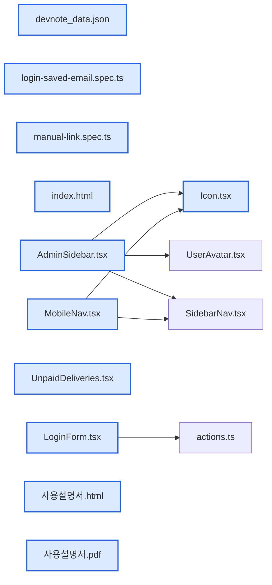

# jhtechSaaS — Dev Note: 납품준비-매뉴얼-장비등록-로그인버그

> **📅 Date:** 2026-06-22 · **🗂️ Project:** jhtechSaaS · **🏷️ Main Task:** 납품준비-매뉴얼-장비등록-로그인버그
> **👤 Author:** — · **🔖 Tags:** bugfix, manual, onboarding, equipment, production-ops, react19

---

## TL;DR

로그인 '아이디 저장' 회귀 버그 수정, 대시보드 미수금 라벨 임시 변경, 고객사 납품용 HTML 사용 설명서 제작(실제 화면 캡처 18장 포함) + 사이드바 링크 추가, 프로덕션에 장비 23종 신규 등록 + 2종 견적자산 보강.

---

## Code Structure

오늘 변경된 파일 간 의존 관계 (자동 분석):



---

## Today's Work

### 🐛 `fix(login)`: 로그인 '아이디 저장' 실패 시 입력값 회귀 버그 수정

**Status:** `completed`  
**Files changed:** `apps/web/src/app/login/LoginForm.tsx`, `apps/web/e2e/login-saved-email.spec.ts`

#### 📋 Context (왜)

저장된 아이디가 프리필된 상태에서 다른 아이디로 바꿔 입력 후 로그인이 실패하면(리다이렉트 없음) 입력칸이 처음 저장된 옛 아이디로 되돌아가는 버그. Playwright로 재현 확인.

#### 🔨 Implementation (무엇을 어떻게)

이메일·'아이디 저장' 체크박스를 비제어(defaultValue)에서 제어(useState+value/checked+onChange) 입력으로 전환. 원인은 React 19가 form action 제출 후 비제어 입력을 자동 초기화하는 동작. PR #164.

#### 💡 Learnings

- React 19 <form action={fn}>는 제출 후 비제어 입력을 defaultValue로 자동 리셋 → 에러 표시하고 머무는 폼은 controlled 입력으로 둬야 입력이 유지된다.

---

### 🐛 `fix(dashboard)`: 대시보드 미수금 위젯 라벨 '미수금 합계' → '견적 합계'

**Status:** `completed`  
**Files changed:** `apps/web/src/app/admin/dashboard/_components/UnpaidDeliveries.tsx`

#### 📋 Context (왜)

수금(입금) 추적 기능이 아직 없어 위젯 금액이 발행견적 공급가라 '미수금 합계'는 부정확.

#### 🔨 Implementation (무엇을 어떻게)

표시 문구만 '견적 합계'로 변경(계산·집계 로직 무변경). 추후 수금 원장 기능 추가 시 미수금=견적 total(VAT포함)−Σ수금으로 정확화 예정. PR #165.

---

### 📝 `docs(manual)`: 고객사 납품용 HTML 사용 설명서 + 사이드바 링크

**Status:** `completed`  
**Files changed:** `docs/사용설명서.html`, `docs/사용설명서.pdf`, `apps/web/public/manual/index.html`, `apps/web/src/app/admin/_components/AdminSidebar.tsx`, `apps/web/src/app/admin/_components/MobileNav.tsx`, `apps/web/src/app/admin/_components/Icon.tsx`, `apps/web/e2e/manual-link.spec.ts`

#### 📋 Context (왜)

고객사 납품 시 시스템 사용법을 알려줄 매뉴얼이 필요. 사용자가 직접 보고 따라 할 수 있게.

#### 🔨 Implementation (무엇을 어떻게)

서브에이전트로 전 화면 기능을 코드 기준 조사 → 16개 장 HTML 매뉴얼(디자인 시스템 톤) 작성. 로컬에 시연 데이터 시드 후 Playwright로 18개 화면 실제 캡처해 각 장에 삽입. 웹앱이 서빙하도록 apps/web/public/manual/에 배치하고, 사이드바(데스크톱+모바일) 프로필 박스 위에 새 창으로 열리는 링크 추가. PR #166.

#### 💡 Learnings

- 새 창으로 열 정적 HTML은 apps/web/public/에 둬야 웹앱이 서빙한다.
- 견적 발행 후 화면을 실제 데이터로 캡처하려면 장비 단가·옵션을 시드한 뒤 실제로 발행해야 한다.

---

### 🔧 `chore(equipment)`: 프로덕션 장비 23종 신규 등록 + 2종 견적자산 보강

**Status:** `completed`  
**Files changed:** _(미지정)_

#### 📋 Context (왜)

협력사 제공 사진(솔벤트/커팅기/UV프린터 3폴더, 54파일)으로 시스템에 장비를 등록. 파일명=장비명, '-logo'=견적서 좌하단 로고, 그냥 사진=메인+견적 우하단.

#### 🔨 Implementation (무엇을 어떻게)

service_role REST로 equipment-images 버킷에 사진 업로드(메인 photos + device-image + device-name) 후 equipment 행 INSERT. 분류는 접두사(롤/평판/하이브리드)로 매핑. 모델 중복 자동 건너뜀(SG1625·JP0806), 견적자산 빈 기존 장비 2개(XTRA 3300S·R16) PATCH 보강. 5MB 초과 4개는 sips로 압축. 검증: 총 28개 장비 사진 OK, 프로덕션 카탈로그 깨짐 0.

#### 📐 Architecture Decisions (ADR)

**Decision:** 중복 장비는 빈 견적자산만 보강

- **Rationale:** 기존 운영 데이터 보존

**Decision:** MultiCut A3 Max와 A3 Max 5는 별개 장비로 등록

- **Rationale:** 사진이 서로 다른 장비

**Decision:** 가격은 0원으로 등록

- **Rationale:** 파일에 가격 정보 없음, 추후 입력

#### 💡 Learnings

- 장비 견적자산 경로 규칙: equipment/{uuid}/device-image.png(우하단 사진)·device-name.png(좌하단 로고), DB CHECK 정규식 강제.
- 이미지 업로드 제한 5MB(jpg/png/webp), 초과 시 sips -Z로 리사이즈.

---

## 🎯 Prompt Library

> 오늘 Claude Code에게 보낸 프롬프트 중 학습 가치가 있는 것들.

### ✅ 잘 통한 프롬프트: 근거 우선 디버깅 요구

```
기억은 정상적으로 하는데 다음의 경우에는 문제가 좀 있는거 같아 ... 이 과정이 맞는건가?
```

**교훈:** 사용자가 구체적 재현 시나리오를 주면 추측 대신 그 경로를 그대로 재현해 증거부터 확보한다. 첫 추측(자동완성)이 빗나갔던 만큼 실제 재현이 결정적이었다.

### ✅ 잘 통한 프롬프트: 자율 진행 위임

```
바로 모두 다 나한테 물어보지 말고 진행해
```

**교훈:** 작고 명확한 작업은 매 단계 확인 없이 커밋·PR·머지까지 자율 진행. 위험·비가역 작업(프로덕션 DB 등)만 먼저 확인.

### ✅ 잘 통한 프롬프트: 파일 먼저 확인 후 분류 위임

```
파일먼저 모두 확인하고 잘 분류해서 입력해줘
```

**교훈:** 대량 자산 등록은 전체 파일 목록·짝(사진/로고)·애매한 케이스를 먼저 파악하고, 되돌리기 어려운 프로덕션 쓰기 전에 등록 환경·중복 처리만 확인한다.

---

## 📋 Changes Summary

### Added

- 고객사 납품용 HTML/PDF 사용 설명서(화면 캡처 18장)
- 관리자 사이드바 사용 설명서 링크(새 창)
- 프로덕션 장비 23종(솔벤트3·커팅기6·하이브리드5·평판5·롤4)

### Changed

- 로그인 이메일·아이디저장 입력을 controlled로 전환
- 대시보드 미수금 라벨 '견적 합계'로
- 기존 장비 XTRA 3300S·R16 견적 로고/사진 보강

### Fixed

- 로그인 실패 시 입력 아이디가 옛 저장값으로 회귀하던 버그

---

## ⏭️ Next Steps

- [ ] 수금 원장 기능(미수금=견적 total VAT포함 − Σ수금) 착수 시 미수금 위젯 라벨 정확화
- [ ] 신규 등록 장비 가격(0원) 채우기 — /admin/equipment 수정
- [ ] 매뉴얼을 실제 운영 데이터 화면으로 재캡처(선택)
- [ ] untracked analysis.md·docs/audit-2026-06-19.md 커밋 여부 결정(Seonje)

---

## 🤖 Claude Code Hints

> **For future Claude Code sessions reading this note:**
> 이 프로젝트는 단일테넌트 Supabase+Next.js. 에러 표시 후 머무는 폼은 React 19 자동 리셋 때문에 controlled 입력으로 둘 것. 프로덕션 DB/Storage 직접 작업은 apps/worker/.env의 service_role + REST로 하되 되돌리기 어려우니 환경·중복 처리를 먼저 확인. 장비 견적자산 경로는 equipment/{uuid}/device-image|name.png 고정.

**Reusable patterns introduced today:**

- `프로덕션 자산 일괄 등록` — service_role REST로 Storage 업로드 + equipment INSERT, 모델 중복은 자동 건너뜀, 5MB 초과는 sips 압축
    - 파일: `(임시 스크립트, 미커밋)`
- `실데이터 화면 캡처` — 로컬에 시드 데이터 채우고 Playwright로 admin 화면 캡처해 문서에 삽입
    - 파일: `docs/manual-assets/`
