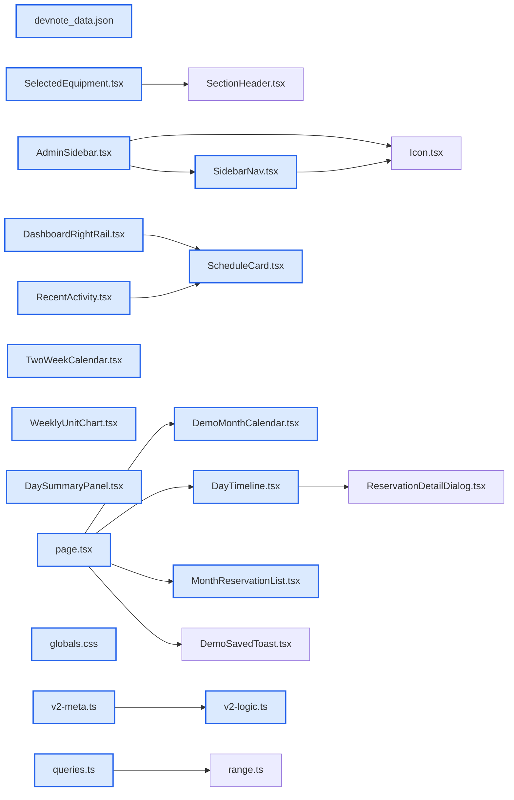

# jhtechSaaS — Dev Note: 대시보드-데모예약-사이드바-견적-시각폴리시

> **📅 Date:** 2026-06-15 · **🗂️ Project:** jhtechSaaS · **🏷️ Main Task:** 대시보드-데모예약-사이드바-견적-시각폴리시
> **👤 Author:** — · **🔖 Tags:** dashboard, demo-reservations, sidebar, quote, design-tokens, ui-polish

---

## TL;DR

대시보드·데모예약·사이드바·견적 시각 폴리시 하루 4PR 프로덕션 배포(v0.13.2.1~0.13.2.4, #107~110). Seonje 피드백 즉시반영→/ship 루프 반복.

---

## Code Structure

오늘 변경된 파일 간 의존 관계 (자동 분석):



---

## Today's Work

### ✨ `feat(dashboard)`: 대시보드 날짜 배지 5색 + 일요일 시작 + 주간활동 레인 + 배경·그림자 폴리시

**Status:** `completed`  
**Files changed:** `apps/web/src/app/admin/dashboard/_components/ScheduleCard.tsx`, `apps/web/src/app/admin/dashboard/_components/TwoWeekCalendar.tsx`, `apps/web/src/app/admin/dashboard/_components/WeeklyUnitChart.tsx`, `apps/web/src/app/admin/dashboard/_components/DashboardRightRail.tsx`, `apps/web/src/app/admin/dashboard/_components/RecentActivity.tsx`, `apps/web/src/lib/dashboard/v2-meta.ts`, `apps/web/src/lib/dashboard/v2-logic.ts`, `apps/web/src/app/globals.css`

#### 📋 Context (왜)

Seonje 피드백: 날짜/시간 음영 배지 우측 여백·항목 색 구분 안 됨·요일 월요일 시작·주간활동 라벨 위치 흔들림. v0.13.2.1(#107).

#### 🔨 Implementation (무엇을 어떻게)

날짜 배지 = EVENT_META 5색 틴트(REQUEST_DOMAIN_EVENT 매핑 신설). 배지 고정폭 w-20/wide w-[88px]로 제목 정렬, 중앙정렬+rounded-sm. buildTwoWeekDays 주 시작 월→일요일(-jsDow). WeeklyUnitChart 고정높이 h-40로 날짜라벨 하단 고정 + divide-x 세로 레인. 본문 bg #F8FBFA→#FBFDFC, shadow-card 농도 강조. AA 대비 보정(opacity 제거·주말 라벨 muted-foreground).

#### 💻 Key Code

**`apps/web/src/app/admin/dashboard/_components/ScheduleCard.tsx`**

```tsx
// 배지 폭=단일시간 목록 w-20 / 시간범위 일정 레일 w-[88px](wide) 고정 — 제목 시작 정렬 유지
className={`flex shrink-0 flex-col items-center rounded-sm px-2.5 py-1.5 text-center ${wide ? "w-[88px]" : "w-20"} ${tint ? "" : "bg-surface-2"}`}
```

_배지 고정폭+중앙정렬(컨텍스트별 폭 분리)_

#### 📐 Architecture Decisions (ADR)

**Decision:** 배지 폭은 섹션별 고정값 분리(단일시간 좁게/시간범위 넓게) — w-fit은 행마다 제목 정렬 어긋남


**Decision:** 데모 색 단일 출처 = EVENT_META(캘린더 칩·배지·범례 자동 전파)


#### 🐛 Problems & Solutions

**Problem:** 배지 우측 여백 원인 = 고정 w-[88px]가 시간범위용이라 단일시간엔 과함 → wide prop 분기


#### 💡 Learnings

- 접힘/펼침처럼 컨텍스트별 폭이 다르면 w-fit보다 명시 고정폭 분기가 정렬에 유리

---

### 🐛 `fix(sidebar)`: 사이드바 접힘 시 아이콘 정렬 — 고정 40px 레일

**Status:** `completed`  
**Files changed:** `apps/web/src/app/admin/_components/SidebarNav.tsx`, `apps/web/src/app/admin/_components/AdminSidebar.tsx`

#### 📋 Context (왜)

Seonje 버그 3종: 펼침/접힘 시 아이콘 위치 달라 토글 시 흔들림, 활성 동그라미 어긋남, 접힘 시 아이콘 좌측 쏠림. v0.13.2.2(#108).

#### 🔨 Implementation (무엇을 어떻게)

원인=접힘 상태에서 라벨 flex-1이 레이아웃에 남고 gap-3가 아이콘을 좌측으로 밀음. 해결=아이콘을 고정 size-10(40px) 레일에 중앙 배치 → 펼침/접힘 x좌표 불변(playwright 측정 33px=33px diff 0). 접힘 시 Link 폭 w-10 정사각 → 활성 배경 정원. 라벨은 접힘 시 w-0 flex-none으로 flex 흐름 제거. 프로필 아바타도 동일.

#### 💻 Key Code

**`apps/web/src/app/admin/_components/SidebarNav.tsx`**

```tsx
{/* 고정 40px 아이콘 레일 — 펼침/접힘 무관 아이콘 중앙 고정 */}
<span className="flex size-10 shrink-0 items-center justify-center">
  <Icon name={it.icon} size={18} .../>
</span>
<span className={`min-w-0 truncate ${expanded ? "flex-1 pr-3 opacity-100" : "w-0 flex-none opacity-0"}`}>{it.label}</span>
```

_고정 레일 + 접힘 시 라벨 w-0(흐름 제거)_

#### 📐 Architecture Decisions (ADR)

**Decision:** 흔들림 제거 = 아이콘을 고정폭 레일에 두고 x좌표 불변


**Decision:** 적대적 리뷰 반영: 펼침 라벨 pr-3(긴 라벨이 활성 pill 둥근 끝 닿지 않게)


#### 🐛 Problems & Solutions

**Problem:** 접힘 시 opacity-0만으론 라벨이 flex-1로 폭 차지 → 아이콘 밀림. w-0 flex-none으로 흐름에서 제거해야 중앙


#### 💡 Learnings

- 접힘 사이드바 아이콘 정렬 = 시각 숨김(opacity)이 아니라 레이아웃 제거(w-0 display)가 핵심. center-x를 playwright boundingBox로 측정해 흔들림 0 검증

---

### ✨ `feat(demo-reservations)`: 데모 색 틸→보라 + 2주 캘린더 높이 +20% + 데모예약 월간 예약 리스트

**Status:** `completed`  
**Files changed:** `apps/web/src/lib/dashboard/v2-meta.ts`, `apps/web/src/app/globals.css`, `apps/web/src/app/admin/demo-reservations/_components/DemoMonthCalendar.tsx`, `apps/web/src/app/admin/demo-reservations/_components/DayTimeline.tsx`, `apps/web/src/app/admin/demo-reservations/_components/DaySummaryPanel.tsx`, `apps/web/src/app/admin/demo-reservations/_components/MonthReservationList.tsx`, `apps/web/src/app/admin/demo-reservations/page.tsx`, `apps/web/src/lib/demo-reservations/queries.ts`, `apps/web/src/app/admin/dashboard/_components/TwoWeekCalendar.tsx`

#### 📋 Context (왜)

Seonje: 날짜 배지에서 데모(틸)와 견적(파인 초록) 구분 안 됨 → 중복없이 변경. + 2주 캘린더 높이 20% 키우기. + 데모예약 페이지 캘린더 아래 이번달 예약 리스트. v0.13.2.3(#109).

#### 🔨 Implementation (무엇을 어떻게)

데모 틸 #34B8A5→보라 #7C5CD3(신규 토큰 --color-demo/--color-demo-soft). EVENT_META.demo + 데모예약 월간캘린더 dot/범례(bg-accent-ring→bg-demo)·타임라인·요약 블록 일괄. 틸은 포커스링·완료 상태색으로 유지(의미 다름). 2주 캘린더 셀 min-h-24→min-h-[115px]. 신규 listReservationsForMonth 쿼리 + MonthReservationList 컴포넌트(시작시각순, 보라 좌측보더, 선택일 ring, 행클릭→?date=).

#### 💻 Key Code

**`apps/web/src/lib/dashboard/v2-meta.ts`**

```ts
demo: { label: "데모", color: "#7C5CD3", bg: "#ECE9FB", fg: "#4A3A8C" },
```

_데모 보라(EVENT_META 단일 출처)_

#### 📐 Architecture Decisions (ADR)

**Decision:** 데모 색 = 보라(견적 초록·소모품 라임·A/S 코랄·납품 파랑과 색상환 분리, 5색 중 유일 보라). AskUserQuestion으로 보라/앰버/마젠타 제시→보라 선택


**Decision:** 틸은 포커스링·완료 상태색이라 안 건드림(의미 다른 축)


**Decision:** 월간 리스트 추가로 고객명이 타임라인+리스트 중복 노출 → e2e 단언 3건 first()+타임라인 전용 (90분) 단언 보강


#### 🐛 Problems & Solutions

**Problem:** created_at/issued_at은 서버 트리거가 now() 강제 → 캘린더 샘플 분산 불가. session_replication_role=replica로 트리거 우회 후 날짜 UPDATE(seq_no/quote_no 보존)


**Problem:** 강의용 샘플: 납품(delivery_date)·데모(time_range)는 분산되나 견적/AS/소모품(트리거 강제 컬럼)은 today로 몰림


#### 💡 Learnings

- created_at 백데이트가 트리거로 막히면 superuser로 session_replication_role=replica 후 UPDATE(seq_no 등 채번값은 유지됨). 시각검증용 샘플 분산에 유용

---

### 🐛 `fix(quote)`: 견적 페이지 선택 장비 대표사진 표시 — publicImageUrl 변환

**Status:** `completed`  
**Files changed:** `apps/web/src/app/admin/applications/[id]/_components/quote-frame/SelectedEquipment.tsx`

#### 📋 Context (왜)

Seonje: 장비 등록 시 넣은 대표사진이 견적 페이지에 안 보임. v0.13.2.4(#110).

#### 🔨 Implementation (무엇을 어떻게)

원인=SelectedEquipment가 eq.photos[0](storage 경로)을 그대로 img src에 넣어 상대경로→404. 수정=publicImageUrl(eq.photos[0])로 공개 버킷 전체 URL 변환(공개 카탈로그·장비목록 동일 패턴). 발행본·미발행 미리보기 공용. 전수 점검=사진/배너 렌더 8곳 중 이 한 곳만 누락.

#### 💻 Key Code

**`apps/web/src/app/admin/applications/[id]/_components/quote-frame/SelectedEquipment.tsx`**

```tsx
// photos[0]은 storage 경로 → publicImageUrl로 전체 URL 변환(공개 카탈로그와 동일)

```

_storage 경로→공개 URL_

#### 📐 Architecture Decisions (ADR)

**Decision:** 원인 확정(전수 감사)이라 /investigate 생략, 수정→전수점검→/ship 단축경로


#### 🐛 Problems & Solutions

**Problem:** 로컬 미리보기가 빈 건 테스트 장비가 status=inactive라 카탈로그(active 필터)에서 빠진 것 — 코드 무관. 활성화 후 img src가 전체 URL로 변환·로드 확인


**Problem:** 커밋 시 경로 [id]가 zsh glob으로 해석돼 fix 파일 누락→따옴표로 감싸 재커밋


#### 💡 Learnings

- storage 경로는 반드시 publicImageUrl()로 감싸야 함(equipment-images 버킷은 public이라 서명URL 불필요). git add 시 동적 라우트 경로 [id]는 따옴표 필수(zsh glob)

---

## 🎯 Prompt Library

> 오늘 Claude Code에게 보낸 프롬프트 중 학습 가치가 있는 것들.

### ✅ 잘 통한 프롬프트: 근본원인 먼저 묻기

```
장비를 등록할 때 대표사진을 넣어서 등록을 했는데, 왜 견적 페이지에가면 사진이 보이지 않는거지?
```

**교훈:** 증상+맥락(어디서 넣고 어디서 안 보이는지)을 주면 데이터 흐름 추적으로 정확한 근본원인(경로→URL 미변환)에 바로 도달

### ✅ 잘 통한 프롬프트: 전수 점검 요청

```
고쳐서 빠진 다른 화면도 같이 점검해줘
```

**교훈:** 한 곳 고칠 때 같은 패턴 전수 감사를 명시 요청 → 8개 렌더 사이트 분류로 회귀 방지. 한 곳만 버그 확인

### ✅ 잘 통한 프롬프트: 색 변경 전체 반영·중복금지

```
데모 색을 다른걸로 변경해줘. 전체적으로 다 반영되도록. 중복되지 않게
```

**교훈:** '전체 반영·중복금지'를 명시하면 단일 출처(EVENT_META)+모든 사용처 일괄 + 5색 상호 구분 검증까지 유도

---

## 📋 Changes Summary

### Added

- 데모예약 페이지 캘린더 아래 '이번 달 예약' 리스트(시작시각순, 행클릭→날짜 이동, 선택일 보라 링)

### Changed

- 대시보드 날짜 배지 5색 항목별 구분(견적·A/S·소모품·데모·납품)
- 2주 캘린더·주간활동 일요일 시작
- 주간활동 날짜라벨 하단 고정 + 요일 세로 레인
- 본문 배경 밝힘 + 카드 그림자 강조
- 데모 색 틸→보라(대시보드·데모예약 전반)
- 2주 캘린더 셀 높이 +20%(96→115px)
- 사이드바 접힘 아이콘 고정 레일 정렬

### Fixed

- 견적 페이지 선택 장비 대표사진 미표시(publicImageUrl 변환 누락)
- AA 대비(배지 시간줄·주말 라벨)
- 사이드바 토글 시 아이콘 흔들림·활성 동그라미 어긋남

---

## ⏭️ Next Steps

- [ ] 하이웍스 API 스펙 오면 E6 메일 재개
- [ ] 3b 특기사항(quotes 컬럼)·3c 영업일지
- [ ] 장비폼 저장실패 시 세션업로드 정리(백로그)
- [ ] 고아 스토리지 청소 cron(백로그)

---

## 🤖 Claude Code Hints

> **For future Claude Code sessions reading this note:**
> 이 프로젝트의 시각 작업은 Seonje 피드백→즉시수정→dev 스크린샷(Read 도구) 확인→/ship 루프다. 이벤트/상태 색은 반드시 단일 출처(lib/dashboard/v2-meta.ts EVENT_META)에서만 바꿔 전 사용처 전파. storage 경로 이미지는 항상 publicImageUrl()로 감싼다(equipment-images 버킷 public). git add 시 동적 라우트 경로([id])는 따옴표로 감쌀 것(zsh glob).

**Reusable patterns introduced today:**

- `이벤트 색 단일 출처` — 캘린더 칩·날짜 배지·범례·dot이 모두 EVENT_META 한 곳을 참조 → 색 변경이 전 화면 자동 전파
    - 파일: `apps/web/src/lib/dashboard/v2-meta.ts`
- `storage 경로→공개 URL` — equipment.photos 등 storage 경로는 publicImageUrl(path)로 감싸야 img src가 동작. 8개 렌더 사이트 공용
    - 파일: `apps/web/src/lib/equipment/images.ts`
- `트리거 우회 샘플 분산` — created_at/issued_at을 서버 트리거가 now()로 강제할 때, superuser psql에서 set session_replication_role=replica 후 UPDATE로 백데이트(채번값 보존)
    - 파일: `scripts/seed-requests-sample.mjs`
