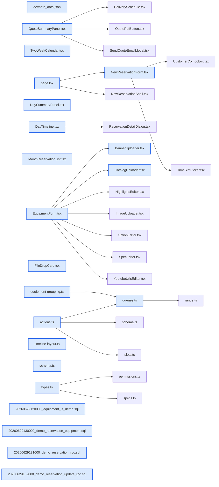

# jhtechSaaS — Dev Note: 데모예약-개편-첨부UI통일-8건

> **📅 Date:** 2026-06-30 · **🗂️ Project:** jhtechSaaS · **🏷️ Main Task:** 데모예약-개편-첨부UI통일-8건
> **👤 Author:** — · **🔖 Tags:** 데모예약, drag-drop-upload, ui-consistency, supabase-rpc, design-system

---

## TL;DR

재현테크 SaaS 세션20(6/29): PR 8건(#179~#186) 머지+prod db push 전부 라이브. 핵심=데모예약 개편(장비 '데모 가능' 플래그→복수장비 체크박스 선택·장비별 겹침차단·담당자·캘린더 구분·예약 수정), 사진/파일 첨부 UI를 드롭존 카드로 전면 통일, 타임라인 겹침 예약 열 분할, 일정 박스 색 스파인→플랫, 임시저장 견적 PDF 버튼 문구 수정.

---

## Code Structure

오늘 변경된 파일 간 의존 관계 (자동 분석):



---

## Today's Work

### ✨ `feat(upload-ux)`: 사진/파일 첨부 UI를 드롭존 카드로 통일

**Status:** `completed`  
**Files changed:** `apps/web/src/components/ui/FileDropCard.tsx`, `apps/web/src/app/admin/equipment/_components/CatalogUploader.tsx`, `apps/web/src/app/admin/equipment/_components/BannerUploader.tsx`, `apps/web/src/app/(public)/request/_components/SitePhotoUploader.tsx`, `apps/web/src/app/(public)/support/_components/AsPhotoUploader.tsx`

#### 📋 Context (왜)

기존엔 대부분 '텍스트 링크'를 눌러야 첨부 가능 → 어디서 사진을 올리는지 인식이 어려웠다. 사용자가 장비 카탈로그 이미지 첨부식(드롭존 카드)을 표준으로 지정.

#### 🔨 Implementation (무엇을 어떻게)

공용 FileDropCard 컴포넌트 신설(드래그앤드롭+클릭). 관리자(장비 카탈로그/배너)·공개(의뢰 현장사진·AS 사진) 등 첨부 지점 전체를 카드형으로 교체. 이미지는 카드 내부 미리보기, PDF 등은 파일명만 표시.

#### 📐 Architecture Decisions (ADR)

**Decision:** 첨부 UI 단일 표준 = 드롭존 카드(텍스트 링크 폐기)


#### 💡 Learnings

- 흩어진 업로더를 공용 컴포넌트 1개로 수렴해야 일관성·유지보수 확보

---

### 🐛 `fix(upload-ux)`: 드롭존 카드 크기 축소 + 제목 위계 구분 + 아이콘 제거

**Status:** `completed`  
**Files changed:** `apps/web/src/components/ui/FileDropCard.tsx`

#### 📋 Context (왜)

통일 후 카드가 너무 컸고(정사각형 강제 불필요), 박스 안 아이콘이 거슬렸으며, 메인/서브 타이틀이 크기·색이 같아 구분이 안 됐다.

#### 🔨 Implementation (무엇을 어떻게)

카드 크기 최소화(정사각형 해제·콘텐츠에 맞춤), 박스 내 아이콘 제거, 메인 타이틀 vs 서브 타이틀을 글자 크기·색으로 위계 구분. 이미지 미리보기는 박스에 꽉 차게. 동일 패턴 다른 화면도 전수 수정(#181).

#### 📐 Architecture Decisions (ADR)

**Decision:** 제목 위계는 디자인 시스템 일관성 항목 — 발견 시 전수 교정


---

### ✨ `feat(demo-reservations)`: 장비 '데모 가능' 플래그 (데모예약 개편 Phase 1)

**Status:** `completed`  
**Files changed:** `supabase/migrations/20260629120000_equipment_is_demo.sql`, `apps/web/src/lib/equipment/schema.ts`, `apps/web/src/app/admin/equipment/_components/EquipmentForm.tsx`, `packages/shared/src/types.ts`

#### 📋 Context (왜)

데모예약에서 장비를 고를 때 데모 대상 장비만 노출해야 함 → equipment에 데모 가능 여부 플래그 필요.

#### 🔨 Implementation (무엇을 어떻게)

equipment.is_demo boolean 컬럼 마이그(+롤백). 장비 폼에 '데모 가능' 토글, schema·shared 타입 동기화.

#### 💡 Learnings

- 기존 prod 장비는 is_demo=false 기본 → 데모 노출하려면 장비별 수동 체크 필요

---

### ✨ `feat(demo-reservations)`: 데모예약 복수장비·장비별 겹침·담당자 + 예약 수정 (Phase 2)

**Status:** `completed`  
**Files changed:** `supabase/migrations/20260629130000_demo_reservation_equipment.sql`, `supabase/migrations/20260629131000_demo_reservation_rpc.sql`, `supabase/migrations/20260629132000_demo_reservation_update_rpc.sql`, `apps/web/src/app/admin/demo-reservations/_components/NewReservationForm.tsx`, `apps/web/src/app/admin/demo-reservations/[id]/edit/page.tsx`, `apps/web/src/lib/demo-reservations/actions.ts`, `apps/web/src/lib/demo-reservations/queries.ts`, `apps/web/src/lib/demo-reservations/equipment-grouping.ts`

#### 📋 Context (왜)

단수 equipment_id 한계 해소. 한 예약에 복수 장비, 동일 장비는 같은 시간대 중복예약 차단하되 다른 장비면 같은 시간대 예약 허용, 캘린더에서 구분, 그리고 발행 후 예약 수정 지원.

#### 🔨 Implementation (무엇을 어떻게)

장비를 드롭박스→대분류 기준 체크박스 그룹(equipment-grouping)으로 모두 노출. 자식 테이블 + 장비별 겹침 차단 RPC. 담당자 필드 추가. 예약 수정용 update RPC + edit 페이지. db-tests로 권한·겹침 검증.

#### 📐 Architecture Decisions (ADR)

**Decision:** 장비 선택 = 대분류 체크박스 그룹(전부 보이게)


**Decision:** 겹침 차단은 장비 단위(예약 단위 아님)


#### 💡 Learnings

- 동시성 db-test는 23P01/40P01 레이스로 본질적 flaky
- 로컬 supabase db reset 후 GRANT 회귀 2차(함수 EXECUTE까지 벗겨짐→service_role 함수 grant 복구 필요)

---

### 🐛 `fix(demo-reservations)`: 데모예약 타임라인 겹침 예약 열 분할

**Status:** `completed`  
**Files changed:** `apps/web/src/app/admin/demo-reservations/_components/DayTimeline.tsx`, `apps/web/src/lib/demo-reservations/timeline-layout.ts`

#### 📋 Context (왜)

같은 시간(예: 11시)에 예약 2건이면 먼저 예약한 건이 뒤 예약에 가려 우측 일정에 안 보였다.

#### 🔨 Implementation (무엇을 어떻게)

겹치는 예약을 열(column)로 분할 배치하는 timeline-layout 순수함수 신설 → 둘 다 시간표에 표시. 단위 테스트 포함.

#### 📐 Architecture Decisions (ADR)

**Decision:** 겹침 레이아웃은 순수함수로 분리해 TDD


---

### 🐛 `fix(design-system)`: 일정/이벤트 박스 좌측 색 스파인 → 플랫(옅은 배경+색 도트)

**Status:** `completed`  
**Files changed:** `apps/web/src/app/admin/demo-reservations/_components/DaySummaryPanel.tsx`, `apps/web/src/app/admin/demo-reservations/_components/MonthReservationList.tsx`, `apps/web/src/app/admin/dashboard/_components/TwoWeekCalendar.tsx`

#### 📋 Context (왜)

예약/일정 박스 좌측의 두껍고 진한 색 스파인 대신 얇은 테두리 톤으로 통일 요청. 프로젝트 내 동일 디자인 박스를 샘플로 비교 후 변경.

#### 🔨 Implementation (무엇을 어떻게)

좌측 색 스파인 → 옅은 배경 + 색 도트 + 얇은 테두리로 플랫화. 용도별 색 매핑 유지. (DESIGN.md 시각 방향과 정합)

#### 📐 Architecture Decisions (ADR)

**Decision:** 상태 색 = 스파인 폐기, 플랫(옅은 배경+도트)로 통일


---

### 🐛 `fix(quote)`: 임시저장(견적중) 견적 PDF 버튼 문구 수정

**Status:** `completed`  
**Files changed:** `apps/web/src/app/admin/applications/[id]/_components/quote-frame/QuoteSummaryPanel.tsx`

#### 📋 Context (왜)

수기 견적을 임시저장하면 '견적중' 태그가 달리는데, PDF 버튼이 '견적서 생성중…'으로 표시되고 호버 시 모래시계가 계속 돌아 오해를 줬다(실제론 발행 전이라 PDF 없음).

#### 🔨 Implementation (무엇을 어떻게)

임시저장 상태 버튼 문구를 '생성중…' → '발행 후 확인'으로 변경(로딩 스피너 제거).

#### 📐 Architecture Decisions (ADR)

**Decision:** 발행 전 견적은 PDF 미생성 — 버튼이 '발행 후 확인'으로 명확히 안내


---

## 🎯 Prompt Library

> 오늘 Claude Code에게 보낸 프롬프트 중 학습 가치가 있는 것들.

### ✅ 잘 통한 프롬프트: 첨부 UI 전수 파악 후 표준화

```
관리자 페이지 전체와 고객견적신청(as, 소모품)페이지 전체에서 사진을 첨부하는 기능이 있는 곳이 얼마나 있는지 전부 확인해봐 → 장비추가 페이지의 카탈로그 이미지 첨부 형식으로 나머지 모든 사진첨부 방법을 변경
```

**교훈:** UI 통일은 '먼저 전수 인벤토리 → 표준 1개 지정 → 전체 교체' 순서로 시키면 누락이 적다

### ✅ 잘 통한 프롬프트: 디자인 변경 전 현황 샘플 요구

```
지금 이 프로젝트에 있는 동일한 디자인의 박스를 찾아서 모두 샘플로 보여주고, 변경 후 박스도 샘플로 볼 수 있게 html페이지로 간단히 만들어서 보여줘
```

**교훈:** 시각 변경은 before/after를 HTML 샘플로 먼저 확인시키면 안전 — 적용 범위와 색 매핑 검증 가능

### ✅ 잘 통한 프롬프트: 실패 시 자율 재시도 위임

```
실패하는 경우에는 내가 따로 이야기 안해도 계속 시도하고 처리해
```

**교훈:** 사용자는 작고 명확한 작업의 끝까지 자율 진행을 선호(autonomy-just-proceed)

---

## 📋 Changes Summary

### Added

- 공용 FileDropCard 드롭존 카드 컴포넌트
- equipment.is_demo 플래그
- 데모예약 복수장비·담당자·예약 수정
- 데모예약 겹침 타임라인 열 분할

### Changed

- 사진/파일 첨부 UI 전면 드롭존 카드화
- 일정/이벤트 박스 색 스파인→플랫
- 임시저장 견적 PDF 버튼 문구

### Fixed

- 같은 시간 겹침 예약 가림
- 제목 위계 미구분
- 임시저장 견적 버튼 무한 로딩 표시

### Removed

- 첨부 텍스트 링크 방식
- 박스 내 아이콘
- 박스 좌측 색 스파인

---

## ⏭️ Next Steps

- [ ] 기존 prod 장비 is_demo 수동 체크(데모 노출 대상 지정)
- [ ] 신규장비 가격(0원) 채우기
- [ ] 감사 후속(공개 lookup 레이트리밋·.env.example Gmail→Hiworks·gen types·RLS db-tests CI·DB백업)
- [ ] 수금 원장(receivables-ledger-plan)
- [ ] 출고의뢰서 모바일 대응
- [ ] untracked analysis.md·docs/audit-2026-06-19.md 커밋 여부 결정

---

## 🤖 Claude Code Hints

> **For future Claude Code sessions reading this note:**
> 데모예약은 복수장비·자식테이블·장비별 겹침차단 구조다(단수 equipment_id 아님). 로컬 supabase db reset 후엔 GRANT가 테이블+함수 EXECUTE까지 회귀하니 seed 전 GRANT 복구 SQL 필수(supabase-local-grant-regression). 첨부 UI는 공용 FileDropCard로 통일됐으니 새 첨부 지점도 이걸 써라. 동시성 db-test는 본질 flaky라 단발 실패는 환경 탓.

**Reusable patterns introduced today:**

- `FileDropCard` — 드래그앤드롭+클릭 첨부 공용 카드(이미지 미리보기·파일명 표시)
    - 파일: `apps/web/src/components/ui/FileDropCard.tsx`
- `timeline-layout` — 겹치는 예약을 열로 분할 배치하는 순수함수(TDD)
    - 파일: `apps/web/src/lib/demo-reservations/timeline-layout.ts`
- `equipment-grouping` — 장비를 대분류 기준 체크박스 그룹으로 묶는 순수함수
    - 파일: `apps/web/src/lib/demo-reservations/equipment-grouping.ts`
