# jhtechSaaS — Dev Note: 데모예약-대시보드v2-신청목록통일

> **📅 Date:** 2026-06-13 · **🗂️ Project:** jhtechSaaS · **🏷️ Main Task:** 데모예약-대시보드v2-신청목록통일
> **👤 Author:** — · **🔖 Tags:** dashboard, demo-reservation, postgres-exclude, tdd, supabase-rls, next-app-router, data-table

---

## TL;DR

데모센터 예약 기능을 신규로 만들고(같은 시간대 중복은 DB EXCLUDE 제약이 원천 차단), 대시보드를 '현황 + 2주 일정' 중심으로 전면 개편했다. 이어 Seonje 피드백 3차례(달력 형태·음영 배지·섹션 헤더)와 A/S·소모품 신청 목록의 고객목록 레이아웃 통일, KPI 페이지 삭제까지 하루 6 PR(#101~#106, v0.13.0.0~v0.13.2.0) 프로덕션 배포. 게이트 전부 GREEN.

---

## Code Structure

오늘 변경된 파일 간 의존 관계 (자동 분석):

```mermaid
flowchart LR
    N0["devnote_data_0612.json"]
    N1["SectionHeader.tsx"]
    N2["QuickFilterCards.tsx"]
    N3["RequestToolbar.tsx"]
    N4["DeliverySchedule.tsx"]
    N5["CustomerTable.tsx"]
    N6["TablePagination.tsx"]
    N7["useListParams.ts"]
    N8["DashboardRightRail.tsx"]
    N9["KpiCards.tsx"]
    N10["PipelineRows.tsx"]
    N11["RecentActivity.tsx"]
    N12["ScheduleCard.tsx"]
    N13["TwoWeekCalendar.tsx"]
    N14["WeeklyUnitChart.tsx"]
    N15["page.tsx"]
    N16["DayTimeline.tsx"]
    N17["DemoMonthCalendar.tsx"]
    N18["DemoSavedToast.tsx"]
    N19["NewReservationShell.tsx"]
    N20["page.tsx"]
    N21["page.tsx"]
    N22["ServiceListShell.tsx"]
    N23["StatusBadge.tsx"]
    N24["SupplyListShell.tsx"]
    N25["v2-logic.ts"]
    N26["v2-meta.ts"]
    N27["v2-queries.ts"]
    N28["actions.ts"]
    N29["constants.ts"]
    N30["queries.ts"]
    N31["range.ts"]
    N32["schema.ts"]
    N33["slots.ts"]
    N34["actions.ts"]
    N35["demo_reservations.test.ts"]
    N36["quotes_delivery.test.ts"]
    N37["seed-requests-sample.mjs"]
    N38["20260612150000_demo_reservations.sql"]
    N39["20260612150001_quotes_delivery.sql"]
    N33 --> N29
    N28 --> N33
    N28 --> N32
    N28 --> N30
    N30 --> N31
    N21 --> N17
    N21 --> N16
    N21 --> N18
    N20 --> N19
    N15 --> N9
    N15 --> N13
    N15 --> N10
    N15 --> N14
    N15 --> N8
    N15 --> N11
    N27 --> N25
    N26 --> N25
    N22 --> N23
    N5 --> N7
    N5 --> N6
    style N5 fill:#dbeafe,stroke:#2563eb,stroke-width:2px
    style N13 fill:#dbeafe,stroke:#2563eb,stroke-width:2px
    style N35 fill:#dbeafe,stroke:#2563eb,stroke-width:2px
    style N28 fill:#dbeafe,stroke:#2563eb,stroke-width:2px
    style N33 fill:#dbeafe,stroke:#2563eb,stroke-width:2px
    style N25 fill:#dbeafe,stroke:#2563eb,stroke-width:2px
    style N37 fill:#dbeafe,stroke:#2563eb,stroke-width:2px
    style N20 fill:#dbeafe,stroke:#2563eb,stroke-width:2px
    style N26 fill:#dbeafe,stroke:#2563eb,stroke-width:2px
    style N30 fill:#dbeafe,stroke:#2563eb,stroke-width:2px
    style N15 fill:#dbeafe,stroke:#2563eb,stroke-width:2px
    style N1 fill:#dbeafe,stroke:#2563eb,stroke-width:2px
    style N39 fill:#dbeafe,stroke:#2563eb,stroke-width:2px
    style N22 fill:#dbeafe,stroke:#2563eb,stroke-width:2px
    style N12 fill:#dbeafe,stroke:#2563eb,stroke-width:2px
    style N27 fill:#dbeafe,stroke:#2563eb,stroke-width:2px
    style N34 fill:#dbeafe,stroke:#2563eb,stroke-width:2px
    style N2 fill:#dbeafe,stroke:#2563eb,stroke-width:2px
    style N36 fill:#dbeafe,stroke:#2563eb,stroke-width:2px
    style N14 fill:#dbeafe,stroke:#2563eb,stroke-width:2px
    style N0 fill:#dbeafe,stroke:#2563eb,stroke-width:2px
    style N3 fill:#dbeafe,stroke:#2563eb,stroke-width:2px
    style N4 fill:#dbeafe,stroke:#2563eb,stroke-width:2px
    style N38 fill:#dbeafe,stroke:#2563eb,stroke-width:2px
    style N24 fill:#dbeafe,stroke:#2563eb,stroke-width:2px
    style N10 fill:#dbeafe,stroke:#2563eb,stroke-width:2px
    style N9 fill:#dbeafe,stroke:#2563eb,stroke-width:2px
    style N21 fill:#dbeafe,stroke:#2563eb,stroke-width:2px
```



---

## Today's Work

### ✨ `feat(demo-reservations)`: 데모예약 신규 기능 — EXCLUDE 겹침 원천차단 + 15분 슬롯 예약

**Status:** `completed`  
**Files changed:** `supabase/migrations/20260612150000_demo_reservations.sql`, `apps/web/src/lib/demo-reservations/slots.ts`, `apps/web/src/lib/demo-reservations/actions.ts`, `apps/web/src/lib/demo-reservations/queries.ts`, `apps/web/src/app/admin/demo-reservations/page.tsx`, `apps/web/src/app/admin/demo-reservations/new/page.tsx`, `packages/db-tests/src/demo_reservations.test.ts`

#### 📋 Context (왜)

데모센터가 1곳뿐이라 같은 시간대에 두 건을 받으면 안 된다. UI 검증만으로는 동시 저장 레이스를 못 막으므로 DB가 최후 방어선이어야 했다. 예약은 15분 단위, 운영시간 09:00–18:00.

#### 🔨 Implementation (무엇을 어떻게)

tstzrange + btree_gist EXCLUDE 제약(status<>'canceled' 부분)으로 겹침을 DB 레벨에서 차단. 서버 액션이 23P01(exclusion_violation)을 '방금 다른 예약이 등록되었습니다' 한국어 메시지로 변환. 15분 CHECK·빈범위 차단·created_by BEFORE 트리거(auth.uid() 강제). 페이지 2종: 월캘린더(데모=틸 dot·납품=파랑 dot, ?date= URL 단일상태) + 타임라인(09–18시 분단위 절대배치) + 15분 슬롯그리드 4열(점유=취소선 disabled·범위=민트·충돌=코랄 배너+저장 차단). 충돌/슬롯 판정은 순수함수 slots.ts로 분리해 TDD.

#### 💻 Key Code

**`supabase/migrations/20260612150000_demo_reservations.sql`**

```sql
constraint demo_reservations_no_overlap
  exclude using gist (time_range with &&) where (status <> 'canceled'),
constraint demo_reservations_quarter_hour check (
  extract(minute from lower(time_range))::int % 15 = 0
  and extract(minute from upper(time_range))::int % 15 = 0
)
```

_EXCLUDE 제약 = 중복 예약 최후 방어선. 취소된 예약은 제외라 시간 재사용 가능._

#### 📐 Architecture Decisions (ADR)

**Decision:** 스펙의 customers(id)/users(id) → 실제 테이블명 companies/profiles로 조정(코드 실측)


**Decision:** 라우트는 admin 셸 안 /admin/demo-reservations(사이드바·권한 일관성)


**Decision:** 권한: 조회=전 직원, 쓰기=demo_reservations.write(registry 19키·영업 프리셋 포함)


#### 🐛 Problems & Solutions

**Problem:** 동시성 db-test가 전체 스위트 실행 시 40P01(데드락)로 실패 — vitest 파일 병렬 실행이 공유 fixture id(sales1·장비)를 만져 교차 데드락. 테스트 전용 id로 분리 + set local role을 BEGIN/COMMIT으로 감싸 해결.


**Problem:** 소요시간 버튼 그룹을 label로 감싸 접근성 이름이 오염(playwright strict 위반) → role=group으로 분리


#### 💡 Learnings

- EXCLUDE 동시성 검증 db-test는 rollback 트랜잭션 밖 독립 커넥션 2개 + 전용 fixture id 필수
- PostgREST tstzrange는 문자열 원문으로 내려옴 → parseTstzRange 파서 필요
- PostgREST 벌크 insert는 객체 키 불일치 시 PGRST102

---

### ✨ `feat(quotes)`: 견적 납품 일정(delivery_date/time) 컬럼

**Status:** `completed`  
**Files changed:** `supabase/migrations/20260612150001_quotes_delivery.sql`, `apps/web/src/lib/quotes/actions.ts`, `apps/web/src/app/admin/applications/[id]/_components/quote-frame/DeliverySchedule.tsx`, `packages/db-tests/src/quotes_delivery.test.ts`

#### 📋 Context (왜)

데모예약 캘린더·대시보드 2주 캘린더의 '납품' 이벤트 소스가 필요했다. 발행(issued) 견적에만 납품일을 입력.

#### 🔨 Implementation (무엇을 어떻게)

quotes에 delivery_date·delivery_time 추가. 발행본 동결 트리거가 '명시 컬럼만' 검사하므로 신규 컬럼은 자동으로 동결 예외가 됨 — 트리거 수정 없이 입력 가능(db-test로 고정). 요약 패널에 입력 UI(issued만 활성).

#### 📐 Architecture Decisions (ADR)

**Decision:** '수주 확정' 상태가 없어 납품일 입력 활성 조건 = 견적 issued(발행)로


#### 💡 Learnings

- 발행본 동결 트리거는 명시 컬럼만 검사 → 신규 운영값 컬럼은 회귀 위험 없이 추가 가능(db-test로 박제)

---

### ✨ `feat(dashboard)`: 대시보드 v2 — 현황 + 2주 일정 중심 개편

**Status:** `completed`  
**Files changed:** `apps/web/src/app/admin/dashboard/page.tsx`, `apps/web/src/lib/dashboard/v2-queries.ts`, `apps/web/src/lib/dashboard/v2-logic.ts`, `apps/web/src/lib/dashboard/v2-meta.ts`, `apps/web/src/app/admin/dashboard/_components/TwoWeekCalendar.tsx`, `apps/web/src/app/admin/dashboard/_components/PipelineRows.tsx`, `apps/web/src/app/admin/dashboard/_components/WeeklyUnitChart.tsx`, `apps/web/src/app/admin/dashboard/_components/ScheduleCard.tsx`

#### 📋 Context (왜)

기존 대시보드는 숫자 나열(도넛·카운트)이라 '오늘·이번 주 무슨 일이 있나'가 안 보였다. 데모예약·납품일이 생기며 일정 축이 핵심이 됐다.

#### 🔨 Implementation (무엇을 어떻게)

KPI 4장(처리 대기 합산 코랄경고·진행중 견적 최신버전 합계·주간 데모납품+가동률·전체고객+월신규) + 2주 캘린더(이벤트 5색 = v2-meta.ts EVENT_META 단일출처) + 파이프라인 세로행(7일 경과 코랄노트) + 주간활동 단위블록(1블록=1건) + ScheduleRow 공용 2줄형식 + 최근활동. 집계는 RLS invoker 쿼리 allSettled 병렬(역할 스코프 자동 적용). ConsoleMain 폭 1320→1180. 구 대시보드 컴포넌트 6종+bars.ts 삭제.

#### 📐 Architecture Decisions (ADR)

**Decision:** 이벤트 5색(견적 파인·AS 코랄·소모품 라임·데모 틸·납품 파랑)을 v2-meta.ts 단일 출처로


**Decision:** 납품 파랑이 팔레트에 없어 --color-info/--color-info-soft 토큰 신설(DESIGN.md 기록)


**Decision:** 역할 분기 = RLS 행 스코프 그대로 + 라벨('내 담당'/'전체')


#### 💡 Learnings

- ApplicationStatus 타입은 application-status가 아니라 customers/history에서 export

---

### 🐛 `fix(dashboard)`: 대시보드 시각 다듬기 — 일반 달력형·음영 배지·KPI·섹션 헤더 (Seonje 피드백 3차)

**Status:** `completed`  
**Files changed:** `apps/web/src/app/admin/dashboard/_components/TwoWeekCalendar.tsx`, `apps/web/src/app/admin/dashboard/_components/ScheduleCard.tsx`, `apps/web/src/app/admin/dashboard/_components/KpiCards.tsx`, `apps/web/src/app/admin/_components/SectionHeader.tsx`, `apps/web/src/app/admin/dashboard/_components/PipelineRows.tsx`

#### 📋 Context (왜)

배포 후 Seonje 피드백 3회: 2주 캘린더를 일반 달력 형태로 + 월 표시 / 일정 행 날짜·시간을 좌측 라인 대신 음영 배지로 / KPI 값 굵기·그라데이션 / 하단 박스 5개에 견적 화면식 섹션 헤더.

#### 🔨 Implementation (무엇을 어떻게)

캘린더를 요일 헤더+gap-px hairline 그리드+연·월 라벨(두 달 걸치면 6월–7월)+1일='M/1'+오늘 마커로 교체. ScheduleRow에 tint prop 추가(데모 민트/납품 파랑/중립 surface-2 음영 배지). KPI 값 extrabold→bold + 대각 그라데이션. SectionHeader를 quote-frame에서 admin/_components로 승격(기존 8개 임포트는 재export 호환)해 하단 박스 5개에 적용.

#### 📐 Architecture Decisions (ADR)

**Decision:** SectionHeader를 콘솔 공용으로 승격 — git mv + 재export 1파일로 quote-frame 임포트 무변경


#### 💡 Learnings

- 공용 컴포넌트 위치 이동 시 재export 스텁을 남기면 다수 임포트를 안 건드리고 승격 가능

---

### ♻️ `refactor(service-requests, supply-requests)`: A/S·소모품 신청 목록 = 고객목록 레이아웃 통일 + KPI 삭제

**Status:** `completed`  
**Files changed:** `apps/web/src/app/admin/_components/request-list/QuickFilterCards.tsx`, `apps/web/src/app/admin/_components/request-list/RequestToolbar.tsx`, `apps/web/src/app/admin/service-requests/_components/ServiceListShell.tsx`, `apps/web/src/app/admin/supply-requests/_components/SupplyListShell.tsx`, `apps/web/src/app/admin/customers/_components/list/CustomerTable.tsx`, `scripts/seed-requests-sample.mjs`

#### 📋 Context (왜)

A/S·소모품 신청 목록이 단순 테이블이라 고객목록과 톤이 달랐다. KPI 페이지는 대시보드 v2가 대체하므로 삭제 요청.

#### 🔨 Implementation (무엇을 어떻게)

공용 QuickFilterCards(KPI 빠른필터 4장)·RequestToolbar(/ 단축키·상태·담당 Select)로 두 신청 목록을 고객목록과 동일 레이아웃으로 재구성(아이콘 칩+업체명+접수번호 서브라인, 미열람 점·미확인 배지, sticky 헤더). 필터는 클라(≤100건). 구 테이블 2개 삭제. 고객목록 업체명 bold→medium. KPI 메뉴·/admin/kpi 페이지 삭제. 레이아웃 검증용 샘플 시드 스크립트(A/S 7·소모품 8 상태분포).

#### 📐 Architecture Decisions (ADR)

**Decision:** 신청 목록 필터는 서버사이드 대신 클라(데이터 ≤100건이라 충분)


**Decision:** 샘플 데이터는 로컬에만 — 프로덕션 실데이터(고객 1,270곳) 오염 방지


#### 🐛 Problems & Solutions

**Problem:** KPI 페이지 삭제 후 .next 잔재가 validator.ts에서 옛 page.js 참조해 typecheck 실패 → rm -rf apps/web/.next로 해결


**Problem:** 소모품 샘플 시드는 consumables+items 필요 + 종결잠금 트리거 때문에 received로 INSERT 후 PATCH로 상태 전이


#### 💡 Learnings

- 라우트 삭제 후 typecheck 깨지면 .next 캐시 잔재 의심 → rm -rf apps/web/.next

---

## 🎯 Prompt Library

> 오늘 Claude Code에게 보낸 프롬프트 중 학습 가치가 있는 것들.

### ✅ 잘 통한 프롬프트: DB가 최후 방어선임을 명시한 기능 스펙

```
데모센터는 1곳뿐이므로 같은 시간대 중복 예약이 절대 발생하면 안 되며, 예약은 15분 단위다. UI 검증과 무관하게 DB가 최후 방어선. 동시 INSERT 레이스에서도 EXCLUDE 제약이 한쪽을 실패시킨다. 서버 액션에서 이 제약 위반(SQLSTATE 23P01)을 잡아 한국어 메시지로 변환할 것
```

**교훈:** 'UI 검증과 무관하게 DB가 최후 방어선'처럼 불변식과 실패 시나리오(동시 INSERT)·구체 에러코드(23P01)를 스펙에 박아주면 방어심층 구조가 자동으로 잡힌다. 동시성 db-test까지 유도됨.

### ✅ 잘 통한 프롬프트: 작업 순서 끼어들기 — 선행 정리 먼저

```
잠깐. 내가 방금 이야기한거 하기전에 KPI는 사이드메뉴에서 삭제해주고, KPI 페이지도 삭제해줘. 그리고 나서 방금전에 내가 하라고 했던 작업을 시작해.
```

**교훈:** 선행 정리 작업을 별도 커밋으로 분리하라는 신호. KPI 삭제를 독립 커밋으로 만들고 나서 본 작업 진입 — 변경 단위가 깔끔해짐.

### ✅ 잘 통한 프롬프트: 이미지 첨부 + '꼭 똑같이 말고'

```
이미지처럼 제목 앞에 세로줄과 제목과 내용을 구분할 수 있게 영역을 나눠줘. 영역을 나누는건 꼭 이미지처럼 할 필요는없고, 지금 디자인에서 각 박스의 제목을 잘 구분할 수 있는 형태로 해주면 되.
```

**교훈:** 참조 이미지가 의도(영역 분리)지 픽셀 명세가 아님을 명시 → 기존 견적 화면의 SectionHeader 패턴을 재사용하는 게 정답. 새로 만들지 않고 기존 컴포넌트 승격으로 해결.

---

## 📋 Changes Summary

### Added

- 데모예약 기능(테이블·페이지 2종·EXCLUDE 겹침 차단·15분 슬롯)
- 견적 납품일(delivery_date/time)
- 대시보드 v2(KPI 4장·2주 캘린더·파이프라인·주간 활동·일정 레일)
- --color-info/--color-info-soft 토큰(납품 파랑)
- 공용 QuickFilterCards·RequestToolbar 컴포넌트
- 로컬 샘플 시드 scripts/seed-requests-sample.mjs

### Changed

- A/S·소모품 신청 목록을 고객목록 레이아웃으로 통일
- 고객목록 업체명 굵기 bold→medium
- 2주 캘린더 일반 달력 형태화 + 월 표시
- 일정 행 날짜·시간 음영 배지화
- KPI 값 굵기·그라데이션
- 하단 박스 5개 섹션 헤더 통일
- ConsoleMain 본문 폭 1320→1180
- SectionHeader를 admin/_components로 승격

### Fixed

- 동시성 db-test 교차 데드락(40P01) — 전용 fixture id 분리

### Removed

- KPI 메뉴·/admin/kpi 페이지(대시보드 v2가 대체)
- 구 대시보드 컴포넌트 6종·bars.ts
- 구 신청 목록 테이블 2종

---

## ⏭️ Next Steps

- [ ] 하이웍스(Hiworks) API 스펙 도착 시 E6 메일 발송 재개
- [ ] 3b 특기사항(quotes 컬럼)·3c 영업일지
- [ ] 데모예약 e2e 취소 테스트 간헐 flaky(재시도 통과, reload 보강함) 안정화 검토

---

## 🤖 Claude Code Hints

> **For future Claude Code sessions reading this note:**
> 이 프로젝트는 단일테넌트 Supabase+Next.js. 신규 도메인 테이블은 반드시 RLS(capability 기반 has_permission) + 서버통제값 BEFORE 트리거 + db-test. 동시성/제약 검증 db-test는 rollback 트랜잭션 밖 독립 커넥션 + 전용 fixture id로(공유 id 쓰면 vitest 병렬과 데드락). 시각 작업은 1440px playwright 스크린샷을 Read 도구로 대조(PNG를 cat/grep 금지). 라우트 삭제 후 typecheck 깨지면 rm -rf apps/web/.next. 게이트: shared·web·db-tests·typecheck·lint·build·e2e·as any 0 전부 통과 후에만 머지.

**Reusable patterns introduced today:**

- `EXCLUDE 동시성 db-test` — rollback txn 밖 독립 커넥션 2개 + 전용 fixture id로 Promise.allSettled 병렬 INSERT → 1건 성공·1건 23P01 단언. set local role은 BEGIN/COMMIT으로 감쌈.
    - 파일: `packages/db-tests/src/demo_reservations.test.ts`
- `이벤트 색 단일 출처(EVENT_META)` — 대시보드 칩·범례·일정 레일이 한 객체에서 색을 읽어 드리프트 방지. 막대·배지·dot 공용.
    - 파일: `apps/web/src/lib/dashboard/v2-meta.ts`
- `컴포넌트 승격 + 재export 스텁` — 공용으로 올릴 컴포넌트를 git mv하고 원위치에 재export 1줄을 남겨 기존 다수 임포트를 무변경 유지.
    - 파일: `apps/web/src/app/admin/applications/[id]/_components/quote-frame/SectionHeader.tsx`
- `KST 슬롯·충돌 순수 로직` — 타임존 연산 없이 'HH:mm' 분 산술만으로 슬롯/겹침/운영시간 판정 → 서버·클라 동일 결과, TDD 용이.
    - 파일: `apps/web/src/lib/demo-reservations/slots.ts`
