# jhtechSaaS — Dev Note: 메일보강-출고의뢰서착수

> **📅 Date:** 2026-06-17 · **🗂️ Project:** jhtechSaaS · **🏷️ Main Task:** 메일보강-출고의뢰서착수
> **👤 Author:** — · **🔖 Tags:** jhtechSaaS, email, hiworks, release-order, routing, supabase, TDD

---

## TL;DR

하루 프로덕션 11배포(PR#128~138): admin 서브도메인 라우팅·로그인 아이디저장·E6 메일 라이브발송 검증 + 메일 보강 4종(버튼화·재발송·브랜드HTML·카탈로그링크)·견적삭제 모달이동·계정 직책연락처·장비 카탈로그PDF. 그리고 장비출고의뢰서 신기능 착수(분석→설계→목업→Phase1 DB→Phase2 shared).

---

## Code Structure

오늘 변경된 파일 간 의존 관계 (자동 분석):

```mermaid
flowchart LR
    N0["quote-email.spec.ts"]
    N1["EditUserClient.tsx"]
    N2["UserTable.tsx"]
    N3["NewUserClient.tsx"]
    N4["saved-email.test.ts"]
    N5["schema.test.ts"]
    N6["last-send.test.ts"]
    N7["host-routing.test.ts"]
    N8["actions.ts"]
    N9["queries.ts"]
    N10["email.ts"]
    N11["quote-equipment.test.ts"]
    N12["2026-06-17-account-fields.md"]
    N13["2026-06-17-equipment-catalog-email.md"]
    N14["2026-06-17-quote-email-resend.md"]
    N15["2026-06-17-release-order-phase1-db.md"]
    N16["2026-06-17-release-order-phase2-shared.md"]
    N17["2026-06-17-account-fields-equipment-catalog-design.md"]
    N18["2026-06-17-quote-email-resend-design.md"]
    N19["2026-06-17-release-order-design.md"]
    N20["equipment_catalog.test.ts"]
    N21["quote_email_enqueue.test.ts"]
    N22["release_orders.test.ts"]
    N23["index.ts"]
    N24["mail.test.ts"]
    N25["mail.ts"]
    N26["permissions.test.ts"]
    N27["permissions.ts"]
    N28["release-order.test.ts"]
    N29["release-order.ts"]
    N30["20260617120000_quote_email_resend.sql"]
    N31["20260617130000_profiles_position.sql"]
    N32["20260617140000_equipment_catalog.sql"]
    N33["20260617150000_release_orders.sql"]
    N34["20260617120000_quote_email_resend_down.sql"]
    N35["20260617130000_profiles_position_down.sql"]
    N36["20260617140000_equipment_catalog_down.sql"]
    N37["20260617150000_release_orders_down.sql"]
    N38["devnote_data_s14.json"]
    N39["release-order-mockup.html"]
    N40["shoot-release.mjs"]
    N41["shoot-users.mjs"]
    N42["DeliverySchedule.tsx"]
    N43["QuotePdfButton.tsx"]
    N44["QuoteSummaryPanel.tsx"]
    N45["SendQuoteEmailModal.tsx"]
    N46["VersionInfoModal.tsx"]
    N47["CatalogUploader.tsx"]
    N48["EditUserClient.tsx"]
    N49["PermissionPicker.tsx"]
    N50["TempPasswordModal.tsx"]
    N51["NewUserClient.tsx"]
    N52["LoginForm.tsx"]
    N53["actions.ts"]
    N54["page.tsx"]
    N55["saved-email.ts"]
    N56["schema.ts"]
    N57["last-send.ts"]
    N58["host-routing.ts"]
    N59["actions.ts"]
    N60["password.ts"]
    N61["permissions-ui.ts"]
    N62["proxy.ts"]
    N63["email.ts"]
    N64["queue.ts"]
    N65["quote-equipment.ts"]
    N66["2026-06-17-release-order-design.md"]
    N67["2026-06-17-release-order-mockup.html"]
    N68["helpers.ts"]
    N69["biz-no.ts"]
    N70["company.ts"]
    N71["date-kst.ts"]
    N72["equipment-match.ts"]
    N73["korean-amount.ts"]
    N74["mail.ts"]
    N75["password.ts"]
    N76["permissions.ts"]
    N77["phone.ts"]
    N78["quote-calc.ts"]
    N79["release-order.ts"]
    N80["seed.ts"]
    N81["specs.ts"]
    N82["supabase.ts"]
    N83["types.ts"]
    N84["20260617120000_quote_email_resend.sql"]
    N85["20260617130000_profiles_position.sql"]
    N86["20260617140000_equipment_catalog.sql"]
    N87["20260617150000_release_orders.sql"]
    N52 --> N53
    N54 --> N52
    N63 --> N64
    N63 --> N65
    N74 --> N70
    N44 --> N43
    N44 --> N42
    N44 --> N45
    N59 --> N61
    N59 --> N60
    N51 --> N49
    N51 --> N50
    N48 --> N49
    N48 --> N50
    N7 --> N58
    N10 --> N64
    N10 --> N65
    N25 --> N70
    N21 --> N68
    N6 --> N57
    N8 --> N61
    N8 --> N60
    N3 --> N49
    N3 --> N50
    N1 --> N49
    N1 --> N50
    N20 --> N68
    N5 --> N56
    N11 --> N65
    N22 --> N68
    N28 --> N79
    N23 --> N76
    N23 --> N81
    N23 --> N82
    N23 --> N80
    N23 --> N83
    N23 --> N69
    N23 --> N77
    N23 --> N78
    N23 --> N73
    N23 --> N71
    N23 --> N70
    N23 --> N72
    N23 --> N74
    N23 --> N75
    N23 --> N79
    style N46 fill:#dbeafe,stroke:#2563eb,stroke-width:2px
    style N33 fill:#dbeafe,stroke:#2563eb,stroke-width:2px
    style N79 fill:#dbeafe,stroke:#2563eb,stroke-width:2px
    style N1 fill:#dbeafe,stroke:#2563eb,stroke-width:2px
    style N23 fill:#dbeafe,stroke:#2563eb,stroke-width:2px
    style N25 fill:#dbeafe,stroke:#2563eb,stroke-width:2px
    style N18 fill:#dbeafe,stroke:#2563eb,stroke-width:2px
    style N41 fill:#dbeafe,stroke:#2563eb,stroke-width:2px
    style N62 fill:#dbeafe,stroke:#2563eb,stroke-width:2px
    style N2 fill:#dbeafe,stroke:#2563eb,stroke-width:2px
    style N13 fill:#dbeafe,stroke:#2563eb,stroke-width:2px
    style N38 fill:#dbeafe,stroke:#2563eb,stroke-width:2px
    style N8 fill:#dbeafe,stroke:#2563eb,stroke-width:2px
    style N26 fill:#dbeafe,stroke:#2563eb,stroke-width:2px
    style N48 fill:#dbeafe,stroke:#2563eb,stroke-width:2px
    style N16 fill:#dbeafe,stroke:#2563eb,stroke-width:2px
    style N14 fill:#dbeafe,stroke:#2563eb,stroke-width:2px
    style N52 fill:#dbeafe,stroke:#2563eb,stroke-width:2px
    style N31 fill:#dbeafe,stroke:#2563eb,stroke-width:2px
    style N55 fill:#dbeafe,stroke:#2563eb,stroke-width:2px
    style N44 fill:#dbeafe,stroke:#2563eb,stroke-width:2px
    style N4 fill:#dbeafe,stroke:#2563eb,stroke-width:2px
    style N12 fill:#dbeafe,stroke:#2563eb,stroke-width:2px
    style N66 fill:#dbeafe,stroke:#2563eb,stroke-width:2px
    style N37 fill:#dbeafe,stroke:#2563eb,stroke-width:2px
    style N11 fill:#dbeafe,stroke:#2563eb,stroke-width:2px
    style N0 fill:#dbeafe,stroke:#2563eb,stroke-width:2px
    style N51 fill:#dbeafe,stroke:#2563eb,stroke-width:2px
    style N7 fill:#dbeafe,stroke:#2563eb,stroke-width:2px
    style N59 fill:#dbeafe,stroke:#2563eb,stroke-width:2px
    style N27 fill:#dbeafe,stroke:#2563eb,stroke-width:2px
    style N3 fill:#dbeafe,stroke:#2563eb,stroke-width:2px
    style N28 fill:#dbeafe,stroke:#2563eb,stroke-width:2px
    style N63 fill:#dbeafe,stroke:#2563eb,stroke-width:2px
    style N29 fill:#dbeafe,stroke:#2563eb,stroke-width:2px
    style N20 fill:#dbeafe,stroke:#2563eb,stroke-width:2px
    style N34 fill:#dbeafe,stroke:#2563eb,stroke-width:2px
    style N9 fill:#dbeafe,stroke:#2563eb,stroke-width:2px
    style N54 fill:#dbeafe,stroke:#2563eb,stroke-width:2px
    style N85 fill:#dbeafe,stroke:#2563eb,stroke-width:2px
    style N6 fill:#dbeafe,stroke:#2563eb,stroke-width:2px
    style N40 fill:#dbeafe,stroke:#2563eb,stroke-width:2px
    style N19 fill:#dbeafe,stroke:#2563eb,stroke-width:2px
    style N58 fill:#dbeafe,stroke:#2563eb,stroke-width:2px
    style N47 fill:#dbeafe,stroke:#2563eb,stroke-width:2px
    style N36 fill:#dbeafe,stroke:#2563eb,stroke-width:2px
    style N35 fill:#dbeafe,stroke:#2563eb,stroke-width:2px
    style N5 fill:#dbeafe,stroke:#2563eb,stroke-width:2px
    style N39 fill:#dbeafe,stroke:#2563eb,stroke-width:2px
    style N32 fill:#dbeafe,stroke:#2563eb,stroke-width:2px
    style N15 fill:#dbeafe,stroke:#2563eb,stroke-width:2px
    style N22 fill:#dbeafe,stroke:#2563eb,stroke-width:2px
    style N17 fill:#dbeafe,stroke:#2563eb,stroke-width:2px
    style N21 fill:#dbeafe,stroke:#2563eb,stroke-width:2px
    style N87 fill:#dbeafe,stroke:#2563eb,stroke-width:2px
    style N86 fill:#dbeafe,stroke:#2563eb,stroke-width:2px
    style N10 fill:#dbeafe,stroke:#2563eb,stroke-width:2px
    style N74 fill:#dbeafe,stroke:#2563eb,stroke-width:2px
    style N84 fill:#dbeafe,stroke:#2563eb,stroke-width:2px
    style N30 fill:#dbeafe,stroke:#2563eb,stroke-width:2px
    style N67 fill:#dbeafe,stroke:#2563eb,stroke-width:2px
    style N24 fill:#dbeafe,stroke:#2563eb,stroke-width:2px
    style N65 fill:#dbeafe,stroke:#2563eb,stroke-width:2px
```



---

## Today's Work

### 🐛 `fix(web)`: admin 서브도메인 라우팅 수정

**Status:** `completed`  
**Files changed:** `apps/web/src/lib/routing/host-routing.ts`, `apps/web/src/proxy.ts`

#### 📋 Context (왜)

admin.jhtech.co.kr 로 들어가도 관리자가 아니라 공개 견적신청 포털(루트 /)이 떴음. 원인=서브도메인 분기 라우팅이 앱에 없었음(Next 16에서 middleware가 proxy.ts로 이름 바뀜).

#### 🔨 Implementation (무엇을 어떻게)

순수함수 resolveHostRedirect(host,path)로 admin 호스트 루트만 /admin으로 리다이렉트(나머지는 통과). 기존 proxy.ts 최상단에 통합. /admin이 미인증=로그인·인증=대시보드 분기하므로 인증 로직 중복 없음.

#### 📐 Architecture Decisions (ADR)

**Decision:** sales.jhtech.co.kr=고객 공개포털, admin=관리자(로드맵 S2 확정). 호스트 분기는 순수함수+proxy 통합이 최소변경.


#### 💡 Learnings

- Next 16: middleware.ts 가 proxy.ts로 rename(빌드 시 'Both middleware and proxy detected' 에러로 발견). 호스트 기반 분기는 proxy에서.
- 라이브 검증=next start + curl -H 'Host: admin.jhtech.co.kr' 로 307→/admin→/login 체인 확인.

---

### ✨ `feat(web)`: 로그인 아이디(이메일) 저장

**Status:** `completed`  
**Files changed:** `apps/web/src/lib/auth/saved-email.ts`, `apps/web/src/app/login/LoginForm.tsx`, `apps/web/src/app/login/page.tsx`

#### 📋 Context (왜)

로그인 편의 — 체크하면 다음 방문 시 마지막 이메일 자동 입력.

#### 🔨 Implementation (무엇을 어떻게)

SSR되는 클라 컴포넌트라 localStorage 금지 규칙대로 쿠키 패턴(서버가 cookies()로 읽어 initial prop 주입). buildSavedEmailCookie/parseSavedEmail 순수로직 TDD.

#### 💡 Learnings

- 체크박스 라벨을 '아이디 저장'(이메일 아님)으로 — Playwright getByLabel('이메일')이 부분매칭이라 '이메일 저장'이면 이메일 input과 2개 매칭돼 e2e 로그인 전부 깨짐(strict mode 위반).

---

### ✨ `feat(worker)`: E6 견적 메일 실발송 활성화·라이브 검증

**Status:** `completed`  
**Files changed:** `apps/worker/src/jobs/email.ts`

#### 📋 Context (왜)

하이웍스 미팅서 Office Token+워커 고정IP 허용등록 완료 → 실발송 활성화 + 첫 라이브 스모크테스트.

#### 🔨 Implementation (무엇을 어떻게)

워커가 하이웍스 실제 응답을 로그로 남기게 추가(안전망). Railway env HIWORKS_OFFICE_TOKEN 주입 + /admin/users hiworks_user_id 설정 후, 발행견적을 본인메일로 발송 → Gmail 수신·하이웍스 보낸편지함 적재·HTML/PDF 정상 전부 확인.

#### 📐 Architecture Decisions (ADR)

**Decision:** 응답 스키마가 추정값이라 첫 실발송 전 raw 응답 로깅 깔아둠. 결과=parseHiworksResponse 가정이 실제와 일치(검증됨).


**Decision:** 프로덕션 DB 확인=supabase projects api-keys로 service키 받아 email_log/jobs REST 조회(email_log=sent·job=done 4초).


#### 💡 Learnings

- DB만으론 진짜발송(Hiworks)·가짜(Fake) 구분 불가(둘 다 sent) → 받은편지함+보낸편지함 확인이 결정적.
- 토큰 미설정=가장 위험한 함정(화면 발송됨인데 실제 안 감).

---

### ✨ `feat(shared/worker)`: 견적 메일 보강 4종(버튼·재발송·브랜드HTML·카탈로그)

**Status:** `completed`  
**Files changed:** `packages/shared/src/mail.ts`, `apps/worker/src/jobs/email.ts`, `supabase/migrations/20260617120000_quote_email_resend.sql`

#### 📋 Context (왜)

라이브 발송 후 Seonje 피드백 연쇄: 긴 URL 불편·재발송 불가·텍스트뿐·카탈로그 미동봉.

#### 🔨 Implementation (무엇을 어떻게)

①다운로드 버튼화(긴 서명URL은 href에만) ②재발송(멱등 잠금을 pending·sending만으로 좁힘, sent/failed면 재발송 허용) ③브랜드 HTML(파인헤더+견적번호카드+버튼+회사푸터, 테이블기반 인라인스타일) ④카탈로그 두번째 버튼.

#### 📐 Architecture Decisions (ADR)

**Decision:** 재발송: 멱등(더블클릭·재시도 방지)은 진행 중일 때만 차단하면 충분. sent까지 막은 게 과했음.


**Decision:** 직전 발송 정보는 모달에 마지막건만(formatLastSendLine).


#### 💡 Learnings

- 이메일 HTML은 테이블 기반+인라인 스타일(flex/grid·외부CSS·웹폰트 금지) — Gmail/네이버/하이웍스/Outlook 호환.
- 부분 유니크 인덱스 술어 변경(sent 제거)으로 재발송 허용 — 기존 db-test의 sent+pending 차단 테스트는 pending 2건 차단으로 갱신.

---

### ✨ `feat(web)`: 견적 삭제를 버전정보 모달로 이동

**Status:** `completed`  
**Files changed:** `apps/web/src/app/admin/applications/[id]/_components/quote-frame/QuoteSummaryPanel.tsx`, `apps/web/src/app/admin/applications/[id]/_components/quote-frame/VersionInfoModal.tsx`

#### 📋 Context (왜)

요약 패널에 버튼 6개 세로로 쌓여 답답, 빨간 삭제 2개가 과노출.

#### 🔨 Implementation (무엇을 어떻게)

삭제를 처리바 버전정보 모달 하단 위험구역(dangerZone prop)으로 이동. 요약패널엔 수정·확인·메일만.

#### 📐 Architecture Decisions (ADR)

**Decision:** 파괴적 동작은 덜 노출돼야 안전 — 버전관리와 삭제를 한 곳에.


---

### ✨ `feat(web)`: 계정 직책·연락처(생성·수정·목록)

**Status:** `completed`  
**Files changed:** `supabase/migrations/20260617130000_profiles_position.sql`, `apps/web/src/lib/users/actions.ts`, `apps/web/src/app/admin/users/new/NewUserClient.tsx`, `apps/web/src/app/admin/users/[id]/EditUserClient.tsx`

#### 📋 Context (왜)

새 계정 폼 항목 부족 — 이름·직책·연락처·이메일(로그인ID).

#### 🔨 Implementation (무엇을 어떻게)

profiles.position 컬럼 추가(phone은 기존 재사용). 생성폼·목록·수정페이지(updateUserBasics, 이름은 profiles+auth metadata 동기) 반영.

#### 💡 Learnings

- 권한(capability)은 키만 추가(registry+preset) — SQL 불요, has_permission이 문자열 배열 멤버십.

---

### ✨ `feat(web/worker/db)`: 장비 카탈로그 PDF + 메일 카탈로그 링크

**Status:** `completed`  
**Files changed:** `supabase/migrations/20260617140000_equipment_catalog.sql`, `apps/web/src/app/admin/equipment/_components/CatalogUploader.tsx`, `apps/worker/src/jobs/email.ts`, `apps/worker/src/jobs/quote-equipment.ts`

#### 📋 Context (왜)

장비별 카탈로그(PDF) 등록 + 견적 메일에 견적서·카탈로그 다운로드 링크 함께.

#### 🔨 Implementation (무엇을 어떻게)

공개 버킷 equipment-catalogs(PDF·20MB·경로정규식 정책) + equipment.catalog_pdf. 워커가 견적 주장비 해석(pickQuoteEquipmentId)으로 catalog_pdf→공개URL(getPublicUrl, 만료없음)→메일 두번째 버튼. best-effort(없으면 견적서만).

#### 📐 Architecture Decisions (ADR)

**Decision:** 카탈로그=공개 버킷 영구링크(홍보용이라 공개 자연스럽고 메일 링크 안 만료).


#### 💡 Learnings

- equipment-images 버킷은 이미지 mime 전용 → PDF는 새 버킷 필요.

---

### ✨ `feat(release-order)`: 장비출고의뢰서 — 분석·설계·Phase 1·2

**Status:** `in-progress`  
**Files changed:** `supabase/migrations/20260617150000_release_orders.sql`, `packages/shared/src/release-order.ts`, `docs/superpowers/specs/2026-06-17-release-order-design.md`, `docs/superpowers/specs/2026-06-17-release-order-mockup.html`

#### 📋 Context (왜)

스캔 PDF(장비출고의뢰서) 분석 → 계약 후 공장에 보내는 설치·물류 작업지시서. 워크플로 뒷단(견적→계약→출고). 견적·설치설문·장비 데이터 자동 프리필 + 나머지 입력 → 워커 PDF.

#### 🔨 Implementation (무엇을 어떻게)

Phase1(DB): release_orders 테이블(의뢰 1:1 UNIQUE)·출고번호 REL-채번·RLS·발행본 불변 트리거(issued는 pdf_url외 변경시 raise)·release_orders.write 권한·release-orders 비공개 버킷. Phase2(shared): ReleaseOrderDetailsSchema(printer/cutter/common/prep/site, 함수형 default로 중첩 기본값 채움)·buildReleaseOrderPrefill 순수함수.

#### 📐 Architecture Decisions (ADR)

**Decision:** 연결=의뢰(application) 1:1(계약서 단계는 나중). 범위=종이양식 전체(프린터+커팅기). 출력=워커PDF+다운로드(공장 이메일 나중).


**Decision:** UI=종이양식 구획·체크박스 배치 그대로(목업 합의), 자동채움 칸=민트색 구분.


#### 💡 Learnings

- Zod .default({})는 중첩 기본값 미적용(리터럴 default 재파싱 안 함) → .default(()=>Schema.parse({}))로 함수형 default 사용해야 중첩까지 채워짐.
- 발행본 불변 트리거는 is distinct from으로 동결필드 변경 감지→raise(silent revert보다 명확).

---

## 🎯 Prompt Library

> 오늘 Claude Code에게 보낸 프롬프트 중 학습 가치가 있는 것들.

### ✅ 잘 통한 프롬프트: 제품 시나리오로 엣지케이스 끌어내기

```
근데 메일을 한번 보내고 다시 보낼 수 있는 방법은 없을까? 고객이 메일 서버문제나 메일함이 꽉차서 못받는다고 다른 주소로 보내달라고 하면? 또는 메일 입력주소에 오타가 있거나?
```

**교훈:** 구체적 운영 시나리오를 들어 기능 공백을 짚으면, 멱등 설계의 과한 제약(sent까지 차단)을 정확히 발견·교정하게 된다.

### ✅ 잘 통한 프롬프트: 전제조건 체크리스트 요청

```
메일을 보내기 위한 필요조건을 정리해줘. 하나라도 빠지면 메일이 안갈 수 있으니 전제 조건을 다 확인해서.
```

**교훈:** 배포 후 동작 전제를 코드 체인 전체에서 등급별(이미보유/부분/미보유)로 정리하면 운영 함정(토큰 미설정=조용한 실패)을 선제 노출한다.

### ✅ 잘 통한 프롬프트: UI 충실도 요구 → 목업 선합의

```
UI에 좀 더 신경써서, 종이 양식처럼 입력위치나 체크박스 위치를 항목별로 잘 나눠서 담당자가 헷갈리지 않도록.
```

**교훈:** 복잡 폼은 구현 전 HTML 목업 스크린샷으로 레이아웃을 먼저 합의(렌더→Read 대조)하면 재작업을 막는다.

---

## 📚 References & 외부 학습

- **[장비출고의뢰서 스캔(설계 원본)](Downloads/스캔_20260611.pdf)** `release-order`
    - 프린터/커팅기 택1 + 물류 체크리스트 양식

---

## 📋 Changes Summary

### Added

- admin 서브도메인 라우팅
- 로그인 아이디 저장
- 견적 메일 재발송·브랜드HTML·카탈로그링크
- 계정 직책·연락처
- 장비 카탈로그 PDF
- release_orders 테이블·스키마(출고의뢰서 기반)

### Changed

- 견적 메일 멱등 잠금을 진행중으로 좁힘
- 견적 삭제를 버전정보 모달로 이동
- 메일 본문 텍스트를 브랜드 HTML로

### Fixed

- admin 도메인이 공개 포털로 빠지던 문제
- 긴 다운로드 URL 노출

### Removed

- 요약 패널의 삭제 버튼(모달로 이동)

---

## ⏭️ Next Steps

- [ ] 출고의뢰서 Phase 3: RPC(upsert_release_order/issue_release_order) + 작성 페이지 UI(목업 레이아웃 그대로, 프린터/커팅기 분기·민트 자동채움) + 의뢰상세 진입
- [ ] 출고의뢰서 Phase 4: 워커 PDF(release-html 조립 + render-release-pdf 잡 + 다운로드 라우트)
- [ ] 운영 후속: 장비별 카탈로그 PDF 업로드, 기존 사용자 직책·연락처 채우기, 프린터/커팅기 대분류 견적로고 설정

---

## 🤖 Claude Code Hints

> **For future Claude Code sessions reading this note:**
> 출고의뢰서는 5단계 중 1·2(DB·shared) 배포 완료, 다음은 Phase 3(RPC+폼 UI). 폼 UI는 docs/superpowers/specs/2026-06-17-release-order-mockup.html 레이아웃을 그대로 따르고 자동채움 칸은 민트색으로 구분. shared buildReleaseOrderPrefill·ReleaseOrderDetailsSchema 재사용. 이메일 HTML은 항상 테이블기반+인라인스타일.

**Reusable patterns introduced today:**

- `호스트 분기 라우팅` — 순수함수 resolveHostRedirect + proxy.ts 통합
    - 파일: `apps/web/src/lib/routing/host-routing.ts`
- `출고의뢰서 프리필` — 의뢰·견적·설문에서 초안 생성 순수함수
    - 파일: `packages/shared/src/release-order.ts`
- `발행본 불변 트리거` — issued 행 동결필드 변경시 raise
    - 파일: `supabase/migrations/20260617150000_release_orders.sql`
