# jhtechSaaS — Dev Note: 비밀번호변경-3종-및-대시보드-캘린더-항목-토글

> **📅 Date:** 2026-06-16 · **🗂️ Project:** jhtechSaaS · **🏷️ Main Task:** 비밀번호변경-3종-및-대시보드-캘린더-항목-토글
> **👤 Author:** — · **🔖 Tags:** auth, supabase, nextjs, rls, dashboard, ux, worktree, tdd

---

## TL;DR

비밀번호 변경 3종(본인 변경·관리자 재설정·최초 로그인 강제)과 대시보드 캘린더 항목 표시/숨김 토글을 각각 격리 worktree에서 brainstorm→plan→TDD로 구현, 둘 다 PR 머지·프로덕션 배포 완료. 작업 중 다른 세션의 메일 기능이 먼저 머지돼 발생한 충돌도 양쪽 보존으로 해소.

---

## Code Structure

오늘 변경된 파일 간 의존 관계 (자동 분석):

```mermaid
flowchart LR
    N0["MEMORY.md"]
    N1["host-routing-pending-ship.md"]
    N2["jhtechsaas-project.md"]
    N3["CHANGELOG.md"]
    N4["CLAUDE.md"]
    N5["VERSION"]
    N6["applications.spec.ts"]
    N7["e5a-permissions.spec.ts"]
    N8["quote-email.spec.ts"]
    N9["quotes.spec.ts"]
    N10["BadgePoller.tsx"]
    N11["ConsoleMain.tsx"]
    N12["AssignControl.tsx"]
    N13["StatusControl.tsx"]
    N14["QuoteSummaryPanel.tsx"]
    N15["SendQuoteEmailModal.tsx"]
    N16["VersionInfoModal.tsx"]
    N17["page.tsx"]
    N18["CategoryTree.tsx"]
    N19["page.tsx"]
    N20["layout.tsx"]
    N21["EditUserClient.tsx"]
    N22["actions.ts"]
    N23["category-tree.ts"]
    N24["queries.ts"]
    N25["actions.ts"]
    N26["version-chip.test.ts"]
    N27["version-chip.ts"]
    N28["actions.ts"]
    N29["queries.ts"]
    N30["proxy.ts"]
    N31["package.json"]
    N32["env.ts"]
    N33["index.ts"]
    N34["_render-logo-check.ts"]
    N35["assets.ts"]
    N36["email.integration.test.ts"]
    N37["email.ts"]
    N38["logo-kind.test.ts"]
    N39["logo-kind.ts"]
    N40["quote-pdf.ts"]
    N41["runner.ts"]
    N42["vitest.config.ts"]
    N43["jhtechSaaS_v0.13.3.0-견적메일발송-E6_2026-06-16.md"]
    N44["roadmap.json"]
    N45["2026-06-10-quote-email-hiworks-research.md"]
    N46["2026-06-17-hiworks-meeting-prep.md"]
    N47["hiworks-미팅-질문시트.md"]
    N48["package.json"]
    N49["equipment_category.test.ts"]
    N50["quote_email_enqueue.test.ts"]
    N51["index.ts"]
    N52["mail.test.ts"]
    N53["mail.ts"]
    N54["20260616120000_equipment_category_logo_kind.sql"]
    N55["20260616170000_quote_email.sql"]
    N56["20260616120000_equipment_category_logo_kind_down.sql"]
    N57["20260616170000_quote_email_down.sql"]
    N58["devnote_data.json"]
    N59["pr-body-logo.md"]
    N60["pr-body-processbar.md"]
    N61["quote-layout-modal.html"]
    N62["quote-layout-options.html"]
    N63["dashboard.spec.ts"]
    N64["AdminSidebar.tsx"]
    N65["BadgePoller.tsx"]
    N66["ConsoleMain.tsx"]
    N67["ForcedPasswordChange.tsx"]
    N68["Icon.tsx"]
    N69["ChangePasswordForm.tsx"]
    N70["page.tsx"]
    N71["AssignControl.tsx"]
    N72["RegisterCustomerButton.tsx"]
    N73["StatusControl.tsx"]
    N74["ApplicantInfo.tsx"]
    N75["DeleteQuoteButton.tsx"]
    N76["DeliverySchedule.tsx"]
    N77["InstallSurvey.tsx"]
    N78["OptionLists.tsx"]
    N79["Placeholders.tsx"]
    N80["QuoteHero.tsx"]
    N81["QuotePdfButton.tsx"]
    N82["QuoteSummaryPanel.tsx"]
    N83["SelectedEquipment.tsx"]
    N84["SendQuoteEmailModal.tsx"]
    N85["SitePhotos.tsx"]
    N86["VersionDiff.tsx"]
    N87["VersionHistory.tsx"]
    N88["VersionInfoModal.tsx"]
    N89["CategoryTree.tsx"]
    N90["DashboardRightRail.tsx"]
    N91["KpiCards.tsx"]
    N92["PipelineRows.tsx"]
    N93["RecentActivity.tsx"]
    N94["TwoWeekCalendar.tsx"]
    N95["WeeklyUnitChart.tsx"]
    N96["page.tsx"]
    N97["layout.tsx"]
    N98["EditUserClient.tsx"]
    N99["PermissionPicker.tsx"]
    N100["TempPasswordModal.tsx"]
    N101["guard.ts"]
    N102["v2-logic.test.ts"]
    N103["v2-logic.ts"]
    N104["version-chip.ts"]
    N105["password-actions.ts"]
    N106["password.ts"]
    N107["permissions-ui.ts"]
    N108["env.ts"]
    N109["browser.ts"]
    N110["email.ts"]
    N111["logo-kind.ts"]
    N112["queue.ts"]
    N113["quote-html.ts"]
    N114["quote-pdf.ts"]
    N115["render-quote-pdf.ts"]
    N116["runner.ts"]
    N117["loop.ts"]
    N118["helpers.ts"]
    N119["biz-no.ts"]
    N120["company.ts"]
    N121["date-kst.ts"]
    N122["equipment-match.ts"]
    N123["korean-amount.ts"]
    N124["mail.ts"]
    N125["password.ts"]
    N126["permissions.ts"]
    N127["phone.ts"]
    N128["quote-calc.ts"]
    N129["seed.ts"]
    N130["specs.ts"]
    N131["supabase.ts"]
    N132["types.ts"]
    N133["20260616180000_password_must_change.sql"]
    N134["20260616180000_password_must_change_down.sql"]
    N105 --> N106
    N70 --> N69
    N67 --> N69
    N97 --> N68
    N97 --> N64
    N97 --> N67
    N97 --> N65
    N97 --> N66
    N98 --> N99
    N98 --> N100
    N96 --> N91
    N96 --> N94
    N96 --> N92
    N96 --> N95
    N96 --> N90
    N96 --> N93
    N49 --> N118
    N38 --> N111
    N40 --> N115
    N40 --> N111
    N40 --> N113
    N19 --> N89
    N34 --> N115
    N34 --> N113
    N26 --> N104
    N17 --> N73
    N17 --> N71
    N17 --> N72
    N17 --> N80
    N17 --> N87
    N17 --> N86
    N17 --> N88
    N17 --> N74
    N17 --> N77
    N17 --> N85
    N17 --> N83
    N17 --> N78
    N17 --> N82
    N17 --> N79
    N20 --> N68
    N20 --> N64
    N20 --> N67
    N20 --> N65
    N20 --> N66
    N50 --> N118
    N51 --> N126
    N51 --> N130
    N51 --> N131
    N51 --> N129
    N51 --> N132
    N51 --> N119
    N51 --> N127
    N51 --> N128
    N51 --> N123
    N51 --> N121
    N51 --> N120
    N51 --> N122
    N51 --> N124
    N51 --> N125
    N37 --> N112
    N41 --> N112
    N41 --> N114
    N41 --> N110
    N33 --> N108
    N33 --> N109
    N33 --> N116
    N33 --> N117
    N36 --> N116
    N14 --> N81
    N14 --> N76
    N14 --> N75
    N14 --> N84
    N28 --> N107
    N28 --> N106
    N21 --> N99
    N21 --> N100
    style N133 fill:#dbeafe,stroke:#2563eb,stroke-width:2px
    style N26 fill:#dbeafe,stroke:#2563eb,stroke-width:2px
    style N6 fill:#dbeafe,stroke:#2563eb,stroke-width:2px
    style N54 fill:#dbeafe,stroke:#2563eb,stroke-width:2px
    style N17 fill:#dbeafe,stroke:#2563eb,stroke-width:2px
    style N13 fill:#dbeafe,stroke:#2563eb,stroke-width:2px
    style N15 fill:#dbeafe,stroke:#2563eb,stroke-width:2px
    style N59 fill:#dbeafe,stroke:#2563eb,stroke-width:2px
    style N52 fill:#dbeafe,stroke:#2563eb,stroke-width:2px
    style N23 fill:#dbeafe,stroke:#2563eb,stroke-width:2px
    style N41 fill:#dbeafe,stroke:#2563eb,stroke-width:2px
    style N14 fill:#dbeafe,stroke:#2563eb,stroke-width:2px
    style N57 fill:#dbeafe,stroke:#2563eb,stroke-width:2px
    style N11 fill:#dbeafe,stroke:#2563eb,stroke-width:2px
    style N36 fill:#dbeafe,stroke:#2563eb,stroke-width:2px
    style N35 fill:#dbeafe,stroke:#2563eb,stroke-width:2px
    style N45 fill:#dbeafe,stroke:#2563eb,stroke-width:2px
    style N44 fill:#dbeafe,stroke:#2563eb,stroke-width:2px
    style N67 fill:#dbeafe,stroke:#2563eb,stroke-width:2px
    style N60 fill:#dbeafe,stroke:#2563eb,stroke-width:2px
    style N8 fill:#dbeafe,stroke:#2563eb,stroke-width:2px
    style N31 fill:#dbeafe,stroke:#2563eb,stroke-width:2px
    style N51 fill:#dbeafe,stroke:#2563eb,stroke-width:2px
    style N39 fill:#dbeafe,stroke:#2563eb,stroke-width:2px
    style N97 fill:#dbeafe,stroke:#2563eb,stroke-width:2px
    style N22 fill:#dbeafe,stroke:#2563eb,stroke-width:2px
    style N46 fill:#dbeafe,stroke:#2563eb,stroke-width:2px
    style N1 fill:#dbeafe,stroke:#2563eb,stroke-width:2px
    style N103 fill:#dbeafe,stroke:#2563eb,stroke-width:2px
    style N40 fill:#dbeafe,stroke:#2563eb,stroke-width:2px
    style N28 fill:#dbeafe,stroke:#2563eb,stroke-width:2px
    style N21 fill:#dbeafe,stroke:#2563eb,stroke-width:2px
    style N30 fill:#dbeafe,stroke:#2563eb,stroke-width:2px
    style N50 fill:#dbeafe,stroke:#2563eb,stroke-width:2px
    style N4 fill:#dbeafe,stroke:#2563eb,stroke-width:2px
    style N55 fill:#dbeafe,stroke:#2563eb,stroke-width:2px
    style N5 fill:#dbeafe,stroke:#2563eb,stroke-width:2px
    style N62 fill:#dbeafe,stroke:#2563eb,stroke-width:2px
    style N16 fill:#dbeafe,stroke:#2563eb,stroke-width:2px
    style N29 fill:#dbeafe,stroke:#2563eb,stroke-width:2px
    style N69 fill:#dbeafe,stroke:#2563eb,stroke-width:2px
    style N25 fill:#dbeafe,stroke:#2563eb,stroke-width:2px
    style N33 fill:#dbeafe,stroke:#2563eb,stroke-width:2px
    style N56 fill:#dbeafe,stroke:#2563eb,stroke-width:2px
    style N49 fill:#dbeafe,stroke:#2563eb,stroke-width:2px
    style N37 fill:#dbeafe,stroke:#2563eb,stroke-width:2px
    style N63 fill:#dbeafe,stroke:#2563eb,stroke-width:2px
    style N0 fill:#dbeafe,stroke:#2563eb,stroke-width:2px
    style N19 fill:#dbeafe,stroke:#2563eb,stroke-width:2px
    style N42 fill:#dbeafe,stroke:#2563eb,stroke-width:2px
    style N53 fill:#dbeafe,stroke:#2563eb,stroke-width:2px
    style N125 fill:#dbeafe,stroke:#2563eb,stroke-width:2px
    style N101 fill:#dbeafe,stroke:#2563eb,stroke-width:2px
    style N34 fill:#dbeafe,stroke:#2563eb,stroke-width:2px
    style N134 fill:#dbeafe,stroke:#2563eb,stroke-width:2px
    style N102 fill:#dbeafe,stroke:#2563eb,stroke-width:2px
    style N3 fill:#dbeafe,stroke:#2563eb,stroke-width:2px
    style N48 fill:#dbeafe,stroke:#2563eb,stroke-width:2px
    style N24 fill:#dbeafe,stroke:#2563eb,stroke-width:2px
    style N70 fill:#dbeafe,stroke:#2563eb,stroke-width:2px
    style N7 fill:#dbeafe,stroke:#2563eb,stroke-width:2px
    style N2 fill:#dbeafe,stroke:#2563eb,stroke-width:2px
    style N43 fill:#dbeafe,stroke:#2563eb,stroke-width:2px
    style N96 fill:#dbeafe,stroke:#2563eb,stroke-width:2px
    style N12 fill:#dbeafe,stroke:#2563eb,stroke-width:2px
    style N18 fill:#dbeafe,stroke:#2563eb,stroke-width:2px
    style N94 fill:#dbeafe,stroke:#2563eb,stroke-width:2px
    style N105 fill:#dbeafe,stroke:#2563eb,stroke-width:2px
    style N98 fill:#dbeafe,stroke:#2563eb,stroke-width:2px
    style N32 fill:#dbeafe,stroke:#2563eb,stroke-width:2px
    style N47 fill:#dbeafe,stroke:#2563eb,stroke-width:2px
    style N38 fill:#dbeafe,stroke:#2563eb,stroke-width:2px
    style N10 fill:#dbeafe,stroke:#2563eb,stroke-width:2px
    style N58 fill:#dbeafe,stroke:#2563eb,stroke-width:2px
    style N27 fill:#dbeafe,stroke:#2563eb,stroke-width:2px
    style N61 fill:#dbeafe,stroke:#2563eb,stroke-width:2px
    style N9 fill:#dbeafe,stroke:#2563eb,stroke-width:2px
    style N20 fill:#dbeafe,stroke:#2563eb,stroke-width:2px
```



---

## Today's Work

### ✨ `feat(auth)`: 비밀번호 변경 기능 (본인 변경·관리자 재설정·최초 로그인 강제)

**Status:** `completed`  
**Files changed:** `supabase/migrations/20260616180000_password_must_change.sql`, `supabase/rollback/20260616180000_password_must_change_down.sql`, `packages/shared/src/password.ts`, `apps/web/src/lib/users/password-actions.ts`, `apps/web/src/app/admin/account/page.tsx`, `apps/web/src/app/admin/account/ChangePasswordForm.tsx`, `apps/web/src/app/admin/_components/ForcedPasswordChange.tsx`, `apps/web/src/lib/auth/guard.ts`, `apps/web/src/app/admin/layout.tsx`, `apps/web/src/app/admin/users/[id]/EditUserClient.tsx`

#### 📋 Context (왜)

신규 직원이 임시 비밀번호로 로그인한 뒤 비밀번호를 바꿀 화면이 아예 없어서, 임시 비밀번호를 영구히 써야 하는 상태였다. 본인 변경 + 분실 복구(관리자 재설정) + 최초 강제 변경을 한 번에 추가.

#### 🔨 Implementation (무엇을 어떻게)

profiles.must_change_password 플래그 컬럼 1개 추가. 본인 변경은 /admin/account에서 현재 비밀번호를 별도 in-memory anon 클라이언트로 재로그인 검증 후 auth.updateUser, 그 다음 admin 클라로 플래그 해제. 최초 강제 변경은 미들웨어 없이 모든 콘솔이 거치는 admin/layout.tsx에서 플래그를 읽어 사이드바·본문 대신 전체화면 변경 패널을 렌더(리다이렉트·루프·pathname 의존 회피). 관리자 재설정은 users.manage 게이트로 새 임시값 발급 + 플래그 set, 기존 1회 노출 모달 재사용.

#### 💻 Key Code

**`apps/web/src/lib/users/password-actions.ts`**

```typescript
// 현재 비밀번호 검증 — 세션을 건드리지 않는 별도 anon 클라이언트로 재로그인 시도.
// createAnonClient는 SSR 쿠키 클라이언트가 아니라 인메모리라 현재 콘솔 세션에 영향 없음.
const verifier = createAnonClient(NEXT_PUBLIC_SUPABASE_URL, NEXT_PUBLIC_SUPABASE_ANON_KEY);
const verify = await verifier.auth.signInWithPassword({ email: user.email, password: currentPassword });
if (verify.error) return { error: "현재 비밀번호가 올바르지 않습니다" };
```

_현재 비밀번호 검증은 인메모리 anon 클라로 — SSR 콘솔 세션 무영향_

**`apps/web/src/app/admin/layout.tsx`**

```typescript
// 임시 비밀번호 상태 → 변경 전엔 콘솔 차단(사이드바·본문 대신 전체화면 변경 패널).
if (access.mustChangePassword) {
  return <ForcedPasswordChange />;
}
```

_강제 변경 = 리다이렉트 아니라 layout 차단 패널(미들웨어 부재 구조 활용)_

#### 📐 Architecture Decisions (ADR)

**Decision:** 범위 = 셋 다(본인 변경 + 관리자 재설정 + 최초 강제 변경) — 사용자 결정


**Decision:** 본인 변경 화면 = /admin/account(상단바 아바타 진입), 비밀번호 규칙 = 최소 8자 + 현재와 동일 금지


**Decision:** 강제 변경은 리다이렉트가 아니라 layout 차단 패널 — 미들웨어가 없는 구조라 루프·pathname 의존 회피


#### 🐛 Problems & Solutions

**Problem:** 작업 중 다른 세션의 메일 기능(PR#124)이 main에 먼저 머지돼 shared/index.ts·actions.ts·EditUserClient.tsx 3파일 충돌 → origin/main 머지로 양쪽 기능 다 보존(내 reset 버튼 + 그쪽 hiworks ID 입력 공존)하며 해소


#### 💡 Learnings

- profiles_update RLS가 users.manage만 허용 → 일반 직원은 자기 must_change_password를 직접 못 끈다. 플래그 해제는 본인 변경 서버 액션이 admin 클라로만 수행(세션 user.id 본인 행만).
- 강제 패널은 UI 게이트지 authz 경계가 아님 — route handler(customers/export·quotes/pdf)는 layout 밖이라 플래그 무시하나 각자 permission 가드 보유 → 허용 결정
- web 패키지 필터명은 web (@jhtechsaas/web 아님). shared=@jhtechsaas/shared, db-tests=@jhtechsaas/db-tests
- db-tests는 클린 supabase db reset 직후 seed-local 없이 돌려야 정확 — seed 행이 consumables/demo 전역카운트·anon 단언 오염

---

### ✨ `feat(dashboard)`: 대시보드 캘린더 범례 항목 표시/숨김 토글 (쿠키 영속)

**Status:** `completed`  
**Files changed:** `apps/web/src/lib/dashboard/v2-logic.ts`, `apps/web/src/lib/dashboard/v2-logic.test.ts`, `apps/web/src/app/admin/dashboard/_components/TwoWeekCalendar.tsx`, `apps/web/src/app/admin/dashboard/page.tsx`, `apps/web/e2e/dashboard.spec.ts`

#### 📋 Context (왜)

한 캘린더에 5종 일정(견적·A/S·소모품·데모·납품)이 섞여 보여서, 특정 종류만 보고 싶을 때 끌 방법이 없었다.

#### 🔨 Implementation (무엇을 어떻게)

범례 5개를 클릭 가능한 버튼으로 전환(꺼지면 흐리게+취소선). TwoWeekCalendar를 서버→클라이언트 컴포넌트로 바꿔 events.filter로 숨김 항목 제외. 선택은 쿠키 jh.dashCalHidden에 저장, page.tsx(서버)가 cookies()로 읽어 initialHidden prop 주입(서버·클라 초기값 일치=hydration mismatch 방지, 사이드바 접기와 동일 패턴). 파싱/직렬화는 순수함수로 TDD.

#### 💻 Key Code

**`apps/web/src/lib/dashboard/v2-logic.ts`**

```typescript
export function parseHiddenEventTypes(cookieValue: string | undefined): CalendarEventType[] {
  if (!cookieValue) return [];
  const out: CalendarEventType[] = [];
  const seen = new Set<string>();
  for (const raw of cookieValue.split(",")) {
    const t = raw.trim();
    if (isCalendarEventType(t) && !seen.has(t)) { seen.add(t); out.push(t); }
  }
  return out;
}
```

_쿠키 값(쉼표 구분) → 유효 타입만/중복 제거. 타입 가드로 as any 회피_

#### 📐 Architecture Decisions (ADR)

**Decision:** 유지 방식 = 쿠키(사이드바 접기와 동일 패턴) — 새로고침·재방문 후에도 켜고/끄고 선택 유지


**Decision:** 꺼진 항목 표시 = 흐리게(opacity-40) + 취소선


#### 🐛 Problems & Solutions

**Problem:** 새 worktree에 node_modules가 없어 vitest not found → 처음 '테스트 실패'로 오인. pnpm install 후 정상(14 tests pass)


#### 💡 Learnings

- SSR되는 클라 컴포넌트의 영속 UI 상태는 쿠키로 — 서버가 cookies()로 읽어 initial prop 주입하면 서버·클라 초기값 일치(localStorage는 hydration mismatch)
- as any 금지 → 문자열→유니온 타입 좁히기는 타입 가드 함수(s is T)로. CALENDAR_EVENT_TYPES as readonly string[]는 안전한 widening
- 범례를 role=button으로 만들면 e2e에서 동명 KPI 텍스트와 구분돼 안정적으로 타겟 가능(aria-pressed로 on/off 단언)

---

## 🎯 Prompt Library

> 오늘 Claude Code에게 보낸 프롬프트 중 학습 가치가 있는 것들.

### ✅ 잘 통한 프롬프트: 동시 세션 작업 충돌 우려 → worktree 격리

```
지금 다른 세션에서 이 프로젝트의 다른 기능 코드를 수정하면서 작업하고 있는데, 지금 이 세션에서 작업을 해도 문제는 없나?
```

**교훈:** 동시 세션 작업은 같은 워킹트리·브랜치면 충돌 위험 → 별도 git worktree로 격리하면 파일·브랜치·dev서버 완전 분리. 실제로 이번에 다른 세션 머지로 충돌이 났지만 worktree 덕에 영향 없이 origin/main 머지로 해소.

### ✅ 잘 통한 프롬프트: 기능 부재 발견형 요청

```
새로운 사용자를 등록해서 임시비밀번호를 받고 로그인을 했는데, 비밀번호를 변경할 수 있는 부분이 없네?
```

**교훈:** 증상 기반 요청 → 코드 조사로 '정말 없음'을 확인한 뒤 범위(셋 다)·위치를 사용자와 합의하고 설계부터. 추측 금지 원칙.

---

## 📋 Changes Summary

### Added

- profiles.must_change_password 컬럼 + 본인 비밀번호 변경(/admin/account)·관리자 재설정·최초 로그인 강제 변경 패널
- 대시보드 2주 캘린더 범례 항목 표시/숨김 토글(쿠키 jh.dashCalHidden 영속)

### Changed

- TwoWeekCalendar 서버→클라이언트 컴포넌트(범례 span→button)
- auth guard에 mustChangePassword 노출, admin/layout 강제 변경 분기

---

## ⏭️ Next Steps

- [ ] 신규 운영 계정 생성 시 최초 로그인 강제 변경 동작 실사용 확인(기존 계정은 플래그 false라 무영향)
- [ ] 원하면 캘린더 꺼진 항목 표시를 흐리게+취소선 외 다른 스타일로 조정 가능
- [ ] 이월: 하이웍스 실발송 활성화(토큰·워커 IP 허용·스모크테스트), 3b 특기사항, 3c 영업일지

---

## 🤖 Claude Code Hints

> **For future Claude Code sessions reading this note:**
> 이 프로젝트는 동시 세션이 흔하므로 새 기능은 격리 worktree(EnterWorktree)에서 작업하고, 머지 전 origin/main을 머지해 충돌을 미리 해소하라. 게이트 명령의 web 패키지 필터명은 web(@jhtechsaas/web 아님). db-tests는 클린 db reset 직후 seed-local 없이 돌려야 정확하다. SSR 클라 컴포넌트의 영속 UI 상태는 localStorage 금지·쿠키로(서버가 cookies()로 읽어 initial prop 주입).

**Reusable patterns introduced today:**

- `쿠키 영속 UI 상태(서버 읽기 → initial prop)` — 클라가 document.cookie 기록, 서버 컴포넌트가 cookies()로 읽어 initialX prop 주입 → 서버·클라 초기값 일치로 hydration mismatch 방지. 사이드바 접기·캘린더 필터 공용.
    - 파일: `apps/web/src/app/admin/dashboard/_components/TwoWeekCalendar.tsx`
- `layout 단일 choke point 차단 패널` — 미들웨어 없이 모든 콘솔이 거치는 admin/layout.tsx에서 조건 충족 시 children 대신 전체화면 패널 렌더 — 리다이렉트·pathname 의존·루프 회피.
    - 파일: `apps/web/src/app/admin/layout.tsx`
