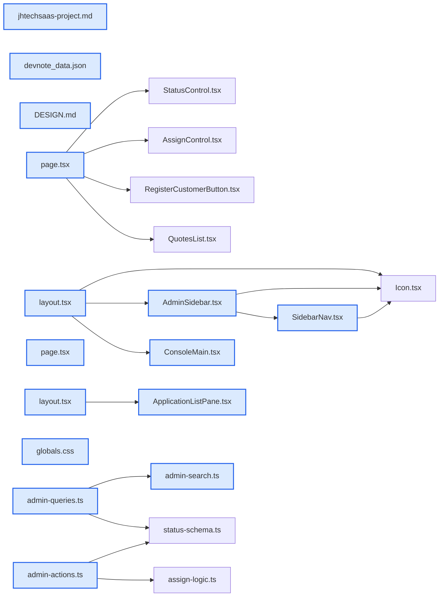

# jhtechSaaS — Dev Note: 색재단장-의뢰관리2분할-슬라이스1

> **📅 Date:** 2026-06-09 · **🗂️ Project:** jhtechSaaS · **🏷️ Main Task:** 색재단장-의뢰관리2분할-슬라이스1
> **👤 Author:** — · **🔖 Tags:** next.js, supabase, railway, design-system, master-detail, hydration, e2e, ux-scale

---

## TL;DR

하루에 프로덕션 3건: ① Railway 워커 대시보드 실배포(PDF 생성 고리 end-to-end 완성) ② 콘솔 색 재단장(딥네이비+스틸블루 모노톤, PR #69) ③ 의뢰관리 2분할 마스터-디테일 + 확장형 목록 + 사이드바 접기/hover-push(PR #70, 2단계 슬라이스 1/4). brainstorm→plan→subagent-driven으로 진행.

---

## Code Structure

오늘 변경된 파일 간 의존 관계 (자동 분석):



---

## Today's Work

### 🔧 `chore(worker)`: Railway 워커 대시보드 실배포 + 검증

**Status:** `completed`  
**Files changed:** _(미지정)_

#### 📋 Context (왜)

PR #66로 워커 코드·railway.json은 준비됐으나 대시보드 실배포가 미완. 발행 시 잡만 쌓이고 PDF는 안 생기던 상태(워커 미기동).

#### 🔨 Implementation (무엇을 어떻게)

대시보드에서 Deploy from GitHub repo로 배포(Root=루트·NIXPACKS·env SUPABASE_URL+SERVICE_ROLE_KEY). Deploy Logs에 'jhtechSaaS worker: jobs 폴링 시작' 확인. 프로덕션 SQL Editor로 jobs 0행·quotes issued 0건 검증 → 누적 잡 우려는 실제론 없었음(테스트 발행은 로컬만).

#### 📐 Architecture Decisions (ADR)

**Decision:** 워커는 tsx 런타임(shared가 TS소스 export라 node dist 불가). railway.json startCommand=pnpm --filter worker start


#### 💡 Learnings

- PDF 생성 고리 end-to-end 완성: 발행→트리거 enqueue→워커 폴링·소진→pdf_url. 실 검증은 실 견적양식 받아 프로덕션 1건 발행 시.

---

### ✨ `feat(web/design)`: 콘솔 색 재단장 — 딥네이비+스틸블루 모노톤

**Status:** `completed`  
**Files changed:** `apps/web/src/app/globals.css`, `apps/web/src/app/admin/layout.tsx`, `apps/web/src/app/admin/_components/SidebarNav.tsx`, `DESIGN.md`

#### 📋 Context (왜)

Seonje님이 새 5색 팔레트 이미지로 콘솔 톤 재단장 요청. v3 소프트 인디고 → 무채색 네이비/그레이 베이스.

#### 🔨 Implementation (무엇을 어떻게)

globals.css @theme 토큰 값만 교체(이름 유지→토큰 기반 유틸 자동 전파): navy #0B1F3A·accent 스틸블루 #1F3B5C·bg #E6E9EF·text 차콜 #2B2F36·muted #667285·그림자 navy틴트. 사이드바 라이트→다크 반전(layout.tsx 글자·프로필 클래스). SidebarNav 신규(usePathname active 강조). 상태 색 스파인·폰트·radius 불변.

#### 💻 Key Code

**`apps/web/src/app/globals.css`**

```css
--color-navy: #0B1F3A;
--color-accent: #1F3B5C;
--color-bg: #E6E9EF;
--color-text: #2B2F36;
--color-muted: #667285;
```

_토큰 값만 교체 — 이름 유지로 전 페이지 자동 반영_

#### 📐 Architecture Decisions (ADR)

**Decision:** 액센트 = 스틸블루 모노톤(시안 후보였다 폐기). 블루 보색 오렌지 제외, 상태 스파인(앰버·그린·보라·레드)과 안 겹치는 색만 후보. Seonje 결정.


**Decision:** 색 재단장은 콘솔만(포털 제외). 색은 추후 재검토 가능(--color-accent 한 값).


#### 💡 Learnings

- 색 변경은 단위테스트 대상 아님 → 무회귀(기존 게이트) + browse 페이지별 시각 점검으로 검증.

---

### ✨ `feat(web/applications)`: 의뢰관리 2분할 마스터-디테일 + 확장형 목록 (2단계 슬라이스 1/4)

**Status:** `completed`  
**Files changed:** `apps/web/src/app/admin/applications/layout.tsx`, `apps/web/src/app/admin/applications/page.tsx`, `apps/web/src/app/admin/applications/[id]/page.tsx`, `apps/web/src/app/admin/applications/_components/ApplicationListPane.tsx`, `apps/web/src/lib/applications/admin-queries.ts`, `apps/web/src/lib/applications/admin-actions.ts`, `apps/web/src/lib/applications/admin-search.ts`

#### 📋 Context (왜)

레거시 admin.html(2분할 마스터-디테일) 참조. 의뢰 목록·상세가 별도 페이지라 오가야 함. + 거래처 1,500+·매달 새 견적이라 '전체 목록'은 무너짐.

#### 🔨 Implementation (무엇을 어떻게)

레이아웃 기반 마스터-디테일: applications/layout.tsx에 목록 패널(고정) + {children} 상세. 행 클릭 시 목록 유지·오른쪽만 교체(URL이 진실). ApplicationListPane=검색(업체명·접수번호·biz_no)+탭(진행중 기본/완료/전체+카운트)+날짜그룹+더보기(offset 페이지네이션 30). listApplicationsPage+countApplicationsByGroup가 100개 하드캡 대체.

#### 📐 Architecture Decisions (ADR)

**Decision:** 목록 스케일 = '전부 보여주기' 버리고 '진행중 기본 + 검색 + 더보기 + 날짜그룹'. 1,500거래처는 검색 대상이지 스크롤 대상 아님.


**Decision:** 레이아웃 기반 라우팅(layout=목록, [id]=상세). searchParams는 layout이 못 받아 → 클라 상태 + 서버액션 fetch.


#### 🐛 Problems & Solutions

**Problem:** ApplicationStatusBadge의 data-testid='app-status'가 2분할에서 목록·상세에 동시 노출 → e2e strict-mode 충돌

- **Solution:** testId prop opt-out(목록은 testId={null}). 상세만 'app-status' 유지.

**Problem:** 회사명·역할명이 사이드바+목록+상세에 중복 노출 → getByText 충돌

- **Solution:** e2e 단언에 .first() 또는 page.locator('main') 스코프.

#### 💡 Learnings

- dev 시각검증: .env.local이 프로덕션 URL이라 로컬 supabase env 인라인 주입 필요(NEXT_PUBLIC_SUPABASE_URL=$API_URL ... pnpm --filter web dev). 샘플 의뢰는 REST service_role로 직접 insert(seed-local은 user만 생성).
- 견적은 불변 버전 스냅샷 모델 → 슬라이스 4 인라인 편집 시 draft 제자리수정 RPC 필요여부 결정 必.

---

### ✨ `feat(web/console-shell)`: 메인 사이드바 접기/펴기 + hover push 펼침 (slice 1 조정)

**Status:** `completed`  
**Files changed:** `apps/web/src/app/admin/_components/AdminSidebar.tsx`, `apps/web/src/app/admin/_components/ConsoleMain.tsx`, `apps/web/src/app/admin/layout.tsx`

#### 📋 Context (왜)

2분할에서 사이드바가 두 개 연속(메인 224 + 목록 300)이라 화면이 좁음. Seonje: 견적 화면선 메인 사이드바 아이콘만 접고, 토글 버튼 + 접힘 hover 자동 펼침. 펼치면 콘텐츠가 폭에 맞춰 재정렬(overlay 아님).

#### 🔨 Implementation (무엇을 어떻게)

AdminSidebar(클라): 토글 버튼(셰브런)+쿠키 저장. 의뢰관리 기본 접힘. 접힘 hover→push로 펼침(aside 실제 폭 64↔224 transition, 옆 콘텐츠 flex-1 재정렬). 라벨 opacity 전환. ConsoleMain이 의뢰관리 본문 전체폭(1320 제한 해제).

#### 🐛 Problems & Solutions

**Problem:** 사이드바 접힘 상태를 localStorage lazy-init으로 읽으니 SSR(null)↔클라(stored) 불일치 → Hydration mismatch, 트리 클라 재생성(깜박임)

- **Solution:** 쿠키로 교체. 서버 layout이 cookies()로 읽어 initialOverride prop 전달 → 서버·클라 초기값 일치. 클라 토글은 document.cookie 기록.

**Problem:** hover 펼침 시 라벨이 {expanded && ...} 조건부 mount라 툭 나타남

- **Solution:** 라벨 항상 렌더 + opacity 전환(부드러운 페이드).

**Problem:** 처음엔 overlay(absolute z-30)로 펼쳐 콘텐츠가 접힌 기준 고정

- **Solution:** Seonje 요청대로 push 방식(flex 폭 전환)으로 변경 → 콘텐츠가 사이드바 폭에 맞춰 재정렬.

#### 💡 Learnings

- SSR'd 클라 컴포넌트에서 localStorage 초기상태는 hydration mismatch 유발 → 쿠키(서버가 읽어 prop 주입)가 정답.
- browse headless hover는 React onMouseEnter를 안 깨움 → js로 mouseover 이벤트 dispatch해서 검증(width 64→224 확인).

---

## 🎯 Prompt Library

> 오늘 Claude Code에게 보낸 프롬프트 중 학습 가치가 있는 것들.

### ✅ 잘 통한 프롬프트: 블루와 어울리는 액센트(색 이론 협업)

```
일단 디자인의 큰 틀은 이걸로 가되. 블루하고 잘 맞는 색이 뭐가 있을까? 오렌지말고
```

**교훈:** 제약(블루 베이스, 오렌지 제외)을 주면 색 이론(보색·유사색)+상태 스파인 비충돌 분석으로 후보를 좁혀 시각 비교까지 끌어낼 수 있다.

### ✅ 잘 통한 프롬프트: 스케일 선반영(1,500 거래처)

```
고객사가 많아지면 왼쪽 목록이 너무 길어질것 같은데, 업체가 많아져도 효율적으로 볼 수 있는 방법이 있을까?
```

**교훈:** 샘플이 작아 안 보이는 스케일 문제를 미리 제기 → '진행중 기본+검색+더보기+날짜그룹' 설계로 이어짐. 운영 규모를 설계 단계에 넣는 좋은 질문.

### ✅ 잘 통한 프롬프트: 반복 레이아웃 협업 방식 지정

```
2단계를 진행할 때 지금 레이아웃을 수정해야할 사항이 있으니 하나씩 레이아웃을 잡아가면서 하자
```

**교훈:** 큰 UI를 슬라이스로 쪼개 목업합의→빌드→로컬확인→조정 루프로. 한 번에 다 만들지 않는다.

### ✅ 잘 통한 프롬프트: 버그 리포트(증상+스크린샷+에러)

```
부드럽게 글씨가 표시되는게 아니고 레이아웃이 다시 깜박거리면서 새로 만들어지는 느낌인데? [스크린샷] 그리고 이런 에러났어
```

**교훈:** 증상(깜박임)+에러 스크린샷을 함께 주면 근본원인(hydration mismatch) 바로 특정 가능. 증상만 말하는 것보다 훨씬 빠름.

### ✅ 잘 통한 프롬프트: overlay vs push 정렬 의도 명확화

```
메인 사이드바가 열리면 열린걸 기준으로 자동 정렬되고, 마우스를 빼면 접힌 사이드바 기준으로 메인프레임을 정렬해주면 안되나?
```

**교훈:** '콘텐츠가 덮이지 말고 밀려서 재정렬' 의도를 정확히 전달 → overlay를 push로 전환.

---

## 📚 References & 외부 학습

- **[레거시 운영 admin.html (2분할 마스터-디테일 참조)](https://jhtechsmart-cloud.github.io/jhtechsmart/admin.html)** `reference` · `legacy`
    - 신청목록(좌)+작업영역(우) 2분할, 배너(담당자·합계)+v2-grid(정보카드/견적패널). 블루#1e56c8·오렌지#f97316. 2단계 레이아웃 레퍼런스.

---

## 📋 Changes Summary

### Added

- 의뢰관리 2분할 마스터-디테일 레이아웃
- 확장형 목록(검색·진행중기본·더보기·날짜그룹)
- 메인 사이드바 접기/펴기 토글 + hover push 펼침(쿠키 기억)
- listApplicationsPage·countApplicationsByGroup·fetchApplicationsPage·dateGroupOf

### Changed

- 콘솔 색 = 딥네이비+스틸블루 모노톤(globals.css 토큰·DESIGN.md)
- 사이드바 라이트→다크
- 의뢰 검색 biz_no 포함
- 의뢰관리 본문 전체폭(1320 제한 해제)

### Fixed

- 사이드바 hydration mismatch(localStorage→쿠키)
- 2분할 app-status testid 충돌(opt-out)

### Removed

- 구 ApplicationTable.tsx(전체페이지 목록)

---

## ⏭️ Next Steps

- [ ] 슬라이스 2: 상단바(담당자·상태) + 배너(합계·유효기간) — 같은 목업→빌드→확인→조정 방식
- [ ] 슬라이스 3: 우측 sticky 견적 요약 패널(읽기) + 완료/견적작성 버튼
- [ ] 슬라이스 4: 인라인 견적 편집 (불변 버전 모델이라 draft 수정 RPC 결정 필요)
- [ ] 3단계: 특기사항·영업일지 (applications 컬럼 추가 + RLS)
- [ ] 실 견적양식 받아 프로덕션 1건 발행 → 워커 PDF 자동생성 end-to-end 검증

---

## 🤖 Claude Code Hints

> **For future Claude Code sessions reading this note:**
> 2단계 의뢰관리는 '슬라이스 단위(목업합의→빌드→로컬확인→조정)'로 진행한다. SSR'd 클라 컴포넌트에서 영속 상태는 localStorage 금지(hydration mismatch)—쿠키로 서버가 읽어 prop 주입. dev 시각검증은 로컬 supabase env를 인라인 주입해 띄우고(admin@jhtech.local/jhtech-admin-dev), 샘플 의뢰는 REST service_role로 insert. 2분할에선 같은 텍스트/배지가 사이드바·목록·상세에 공존하니 e2e는 .first()/main 스코프로.

**Reusable patterns introduced today:**

- `레이아웃 기반 마스터-디테일` — segment layout.tsx가 목록 패널(고정)+{children}(상세) 렌더. 행 클릭=URL 이동, layout 미리렌더라 목록 유지. usePathname으로 선택행 강조.
    - 파일: `apps/web/src/app/admin/applications/layout.tsx`
- `쿠키 기반 영속 UI 상태(SSR 안전)` — 서버 컴포넌트가 cookies()로 읽어 initial prop 전달 → hydration 일치. 클라는 document.cookie로 기록.
    - 파일: `apps/web/src/app/admin/_components/AdminSidebar.tsx`
- `확장형 목록(스케일)` — 진행중 기본 + 검색 + offset 더보기 + KST 날짜그룹. 카운트 head query. 대량 데이터에서 목록 길이를 진행중 건수에만 비례시킴.
    - 파일: `apps/web/src/app/admin/applications/_components/ApplicationListPane.tsx`
