# jhtechSaaS — Dev Note: 서비스리포트-결재흐름-285-구현-배포

> **📅 Date:** 2026-09-11 · **🗂️ Project:** jhtechSaaS · **🏷️ Main Task:** 서비스리포트-결재흐름-285-구현-배포
> **👤 Author:** — · **🔖 Tags:** service-report, approval-workflow, supabase-rls, worker, pdf, e2e, deploy

---

## TL;DR

서비스 리포트 결재 흐름(#285)을 워커·현장·관리자·후속방문 4개 PR로 완성하고, 프로덕션 DB 마이그레이션 5건 적용 + PR 5건 체인 머지 + Vercel·Railway 배포까지 끝냈다. 기사가 확정한 리포트를 이사가 등록 직인으로 승인하고 관리부가 세금계산서 처리 후 완료하는 3단 결재가 라이브 상태다.

---

## Code Structure

오늘 변경된 파일 간 의존 관계 (자동 분석):

```mermaid
flowchart LR
    N0["MEMORY.md"]
    N1["jhtechsaas-project.md"]
    N2["_png.ts"]
    N3["field-followup-report.spec.ts"]
    N4["ReportDetail.tsx"]
    N5["ReportTable.tsx"]
    N6["page.tsx"]
    N7["FollowUpList.tsx"]
    N8["steps-basic.tsx"]
    N9["page.tsx"]
    N10["page.tsx"]
    N11["actions.ts"]
    N12["admin-actions.ts"]
    N13["followup.test.ts"]
    N14["followup.ts"]
    N15["types.ts"]
    N16["actions.ts"]
    N17["image-meta.test.ts"]
    N18["image-meta.ts"]
    N19["20260910100000_service_report_stamp_guard.sql"]
    N20["normalize_devnote.py"]
    N21["pr-body-admin.md"]
    N22["pr-body-followup.md"]
    N23["devnote_data.json"]
    N24["_png.ts"]
    N25["field-followup-report.spec.ts"]
    N26["field-service-report.spec.ts"]
    N27["CompleteModal.tsx"]
    N28["Modal.tsx"]
    N29["ReportDetail.tsx"]
    N30["KpiRow.tsx"]
    N31["ReportTable.tsx"]
    N32["page.tsx"]
    N33["StampUpload.tsx"]
    N34["DateField.tsx"]
    N35["DraftList.tsx"]
    N36["FollowUpList.tsx"]
    N37["ReportWizard.tsx"]
    N38["SignaturePad.tsx"]
    N39["steps-confirm.tsx"]
    N40["page.tsx"]
    N41["admin-actions.ts"]
    N42["complete-schema.ts"]
    N43["draft.ts"]
    N44["followup.ts"]
    N45["payload.ts"]
    N46["report-tabs.ts"]
    N47["timeline.ts"]
    N48["types.ts"]
    N49["delete-blockers.ts"]
    N50["department.ts"]
    N51["image-meta.ts"]
    N52["password.ts"]
    N53["permissions-ui.ts"]
    N54["assets.ts"]
    N55["email.ts"]
    N56["queue.ts"]
    N57["quote-pdf.ts"]
    N58["release-pdf.ts"]
    N59["render-service-report-pdf.ts"]
    N60["runner.ts"]
    N61["service-report-approval-notice.ts"]
    N62["service-report-email.ts"]
    N63["service-report-html.ts"]
    N64["service-report-pdf.ts"]
    N65["wp-publish.ts"]
    N66["company.ts"]
    N67["mail.ts"]
    N68["20260910100000_service_report_stamp_guard.sql"]
    N64 --> N54
    N64 --> N59
    N64 --> N63
    N62 --> N56
    N60 --> N56
    N60 --> N57
    N60 --> N58
    N60 --> N55
    N60 --> N64
    N60 --> N62
    N60 --> N61
    N60 --> N65
    N67 --> N66
    N39 --> N38
    N43 --> N48
    N32 --> N30
    N32 --> N31
    N29 --> N31
    N29 --> N28
    N29 --> N27
    N41 --> N42
    N41 --> N46
    N41 --> N48
    N44 --> N47
    N44 --> N48
    N44 --> N45
    N45 --> N48
    N40 --> N37
    N25 --> N24
    N12 --> N42
    N12 --> N46
    N12 --> N48
    N6 --> N30
    N6 --> N31
    N4 --> N31
    N4 --> N28
    N4 --> N27
    N16 --> N53
    N16 --> N52
    N16 --> N49
    N16 --> N50
    N16 --> N51
    N17 --> N51
    N13 --> N44
    N13 --> N48
    N14 --> N47
    N14 --> N48
    N14 --> N45
    N11 --> N44
    N9 --> N35
    N9 --> N36
    N10 --> N37
    N3 --> N24
    N8 --> N34
    N8 --> N37
    style N33 fill:#dbeafe,stroke:#2563eb,stroke-width:2px
    style N16 fill:#dbeafe,stroke:#2563eb,stroke-width:2px
    style N63 fill:#dbeafe,stroke:#2563eb,stroke-width:2px
    style N13 fill:#dbeafe,stroke:#2563eb,stroke-width:2px
    style N18 fill:#dbeafe,stroke:#2563eb,stroke-width:2px
    style N39 fill:#dbeafe,stroke:#2563eb,stroke-width:2px
    style N61 fill:#dbeafe,stroke:#2563eb,stroke-width:2px
    style N32 fill:#dbeafe,stroke:#2563eb,stroke-width:2px
    style N7 fill:#dbeafe,stroke:#2563eb,stroke-width:2px
    style N62 fill:#dbeafe,stroke:#2563eb,stroke-width:2px
    style N21 fill:#dbeafe,stroke:#2563eb,stroke-width:2px
    style N23 fill:#dbeafe,stroke:#2563eb,stroke-width:2px
    style N67 fill:#dbeafe,stroke:#2563eb,stroke-width:2px
    style N51 fill:#dbeafe,stroke:#2563eb,stroke-width:2px
    style N5 fill:#dbeafe,stroke:#2563eb,stroke-width:2px
    style N45 fill:#dbeafe,stroke:#2563eb,stroke-width:2px
    style N64 fill:#dbeafe,stroke:#2563eb,stroke-width:2px
    style N17 fill:#dbeafe,stroke:#2563eb,stroke-width:2px
    style N68 fill:#dbeafe,stroke:#2563eb,stroke-width:2px
    style N19 fill:#dbeafe,stroke:#2563eb,stroke-width:2px
    style N10 fill:#dbeafe,stroke:#2563eb,stroke-width:2px
    style N25 fill:#dbeafe,stroke:#2563eb,stroke-width:2px
    style N46 fill:#dbeafe,stroke:#2563eb,stroke-width:2px
    style N8 fill:#dbeafe,stroke:#2563eb,stroke-width:2px
    style N26 fill:#dbeafe,stroke:#2563eb,stroke-width:2px
    style N4 fill:#dbeafe,stroke:#2563eb,stroke-width:2px
    style N0 fill:#dbeafe,stroke:#2563eb,stroke-width:2px
    style N38 fill:#dbeafe,stroke:#2563eb,stroke-width:2px
    style N47 fill:#dbeafe,stroke:#2563eb,stroke-width:2px
    style N36 fill:#dbeafe,stroke:#2563eb,stroke-width:2px
    style N1 fill:#dbeafe,stroke:#2563eb,stroke-width:2px
    style N15 fill:#dbeafe,stroke:#2563eb,stroke-width:2px
    style N9 fill:#dbeafe,stroke:#2563eb,stroke-width:2px
    style N6 fill:#dbeafe,stroke:#2563eb,stroke-width:2px
    style N41 fill:#dbeafe,stroke:#2563eb,stroke-width:2px
    style N20 fill:#dbeafe,stroke:#2563eb,stroke-width:2px
    style N43 fill:#dbeafe,stroke:#2563eb,stroke-width:2px
    style N29 fill:#dbeafe,stroke:#2563eb,stroke-width:2px
    style N14 fill:#dbeafe,stroke:#2563eb,stroke-width:2px
    style N2 fill:#dbeafe,stroke:#2563eb,stroke-width:2px
    style N12 fill:#dbeafe,stroke:#2563eb,stroke-width:2px
    style N3 fill:#dbeafe,stroke:#2563eb,stroke-width:2px
    style N40 fill:#dbeafe,stroke:#2563eb,stroke-width:2px
    style N11 fill:#dbeafe,stroke:#2563eb,stroke-width:2px
    style N22 fill:#dbeafe,stroke:#2563eb,stroke-width:2px
    style N60 fill:#dbeafe,stroke:#2563eb,stroke-width:2px
    style N44 fill:#dbeafe,stroke:#2563eb,stroke-width:2px
```



---

## Today's Work

### ✨ `feat(worker)`: 워커 — 결재 박스 PDF·세대 가드·승인 요청 알림 잡 (PR #287)

**Status:** `completed`  
**Files changed:** `apps/worker/src/jobs/service-report-html.ts`, `apps/worker/src/jobs/service-report-pdf.ts`, `apps/worker/src/jobs/service-report-email.ts`, `apps/worker/src/jobs/service-report-approval-notice.ts`, `apps/worker/src/jobs/runner.ts`, `packages/shared/src/mail.ts`

#### 📋 Context (왜)

#A(DB)가 approved/completed 상태를 만들었지만 워커가 모르면 승인된 리포트의 PDF 잡이 매번 throw 되어 failed로 고착되고, 새로 생긴 승인 알림 잡은 '알 수 없는 잡 타입'으로 죽는다.

#### 🔨 Implementation (무엇을 어떻게)

PDF 잡의 허용 상태를 issued|approved|completed로 넓히고, 잡 payload의 세대(pdf_revision)·기대 상태를 렌더 직전 재조회한 행과 대조해 stale이면 폐기한다. 업로드 경로는 세대별 불변(report-r{n}.pdf), pdf_url 기록은 status·revision·null 조건 CAS. HTML에는 결재 박스 3칸(담당=기사 서명, 팀장='생략', 본부장=직인+이름+승인일)을 헤더 우측에 넣었다. 승인 요청 알림 잡을 신설해 활성 승인 권한자에게 메일을 보내고, 3일 뒤 재알림은 상태가 여전히 issued일 때만 발송한다.

#### 💻 Key Code

**`apps/worker/src/jobs/service-report-pdf.ts`**

```typescript
export function decidePdfJob(job, row) {
  if (row.status === "voided") return { kind: "discard", reason: "무효화된 리포트" };
  const revision = job.revision ?? row.pdf_revision;
  const expected = job.expectedStatus ?? row.status;
  if (row.pdf_revision !== revision) return { kind: "discard", reason: `세대 불일치(잡 r${revision} ≠ 행 r${row.pdf_revision})` };
  if (row.status !== expected) return { kind: "discard", reason: `상태 불일치` };
  if (row.pdf_url) return { kind: "discard", reason: `이미 생성됨` };
  return { kind: "render" };
}
```

_세대 대조로 stale 렌더가 최신본을 덮어쓰는 경쟁을 막는다 (D-C8)_

#### 📐 Architecture Decisions (ADR)

**Decision:** 직인은 approval-stamps 원본을 직접 읽어 PDF에만 임베드한다

- **Rationale:** 직인은 approval-stamps 원본을 직접 읽어 PDF에만 임베드한다. 리포트 폴더로 복사하면 그 폴더 읽기 권한자 전원이 원본 해상도 직인 파일을 내려받아 위조에 쓸 수 있다(적대·보안·codex 3개 리뷰가 공통 지적).

**Decision:** 결재 박스는 상단(헤더 우측) 배치로 확정

- **Rationale:** 결재 박스는 상단(헤더 우측) 배치로 확정. 상단·하단 2안을 실제 렌더해 Read로 대조한 결과, 하단은 최대 부하 유상 리포트에서 2페이지로 넘어갔다.

**Decision:** 고객 메일 발신자는 payload의 호출자 하이웍스 ID만 쓴다

- **Rationale:** 고객 메일 발신자는 payload의 호출자 하이웍스 ID만 쓴다. 기사 스냅샷 폴백을 남기면 컷오버 전 구 트리거가 만든 잡이 버튼 없이 기사 명의로 자동 발송된다.

**Decision:** 승인 알림 수신자가 0명이면 조용히 성공 처리하지 않고 잡을 실패시킨다

- **Rationale:** 승인 알림 수신자가 0명이면 조용히 성공 처리하지 않고 잡을 실패시킨다. '알림 갔다'로 보이는 설정 오류가 묻히기 때문.

#### 💡 Learnings

- PDF 결재 박스처럼 시각이 중요한 변경은 tsx 하니스로 실제 렌더해 Read 도구로 대조해야 한다. 이번에도 하단 배치의 페이지 넘침은 렌더 전에는 보이지 않았다.

---

### ✨ `feat(web/field)`: 현장 콘솔 — 기사 본인 서명 단계 + 서명 무효화 규칙 (PR #288)

**Status:** `completed`  
**Files changed:** `apps/web/src/app/field/_components/steps-confirm.tsx`, `apps/web/src/lib/service-reports/draft.ts`, `apps/web/src/app/field/_components/SignaturePad.tsx`, `apps/web/e2e/field-service-report.spec.ts`

#### 📋 Context (왜)

확정 RPC가 기사 서명을 요구하도록 바뀌어서, 이 UI 없이는 현장에서 리포트를 확정할 수 없다. 서명은 PDF 결재 박스의 담당 칸에 들어간다.

#### 🔨 Implementation (무엇을 어떻게)

고객 서명이 끝나면 같은 화면 아래에 기사 서명 카드를 열고, 서명 전에는 확정 버튼을 비활성으로 둔다. 무효화 규칙은 순수 함수로 분리했다: 내용이 바뀌면 두 서명 모두 무효, 고객이 다시 서명하면 기사 서명도 무효, 기사 서명만 다시 하면 고객 서명은 유지.

#### 💻 Key Code

**`apps/web/src/lib/service-reports/draft.ts`**

```typescript
export function applyDraftPatch(draft, patch) {
  const next = { ...draft, ...patch };
  const touchesOnlySignatures = Object.keys(patch).every((k) => SIGNATURE_KEYS.includes(k));
  if (!touchesOnlySignatures) {
    if (draft.signature_path) next.signature_path = "";
    if (draft.engineer_signature_path) next.engineer_signature_path = "";
    return next;
  }
  if ("signature_path" in patch && !("engineer_signature_path" in patch) && patch.signature_path !== draft.signature_path) {
    next.engineer_signature_path = "";
  }
  return next;
}
```

_서명 무효화 규칙을 순수 함수로 빼서 단위 테스트 7건으로 고정_

#### 📐 Architecture Decisions (ADR)

**Decision:** 기사 서명은 고객 서명 뒤 순서로 둔다

- **Rationale:** 기사 서명은 고객 서명 뒤 순서로 둔다. 잠금 뷰 이전에 두자는 대안이 있었지만, 고객에게 화면을 넘기는 흐름이 끊긴다.

---

### ✨ `feat(web/admin)`: 관리자 결재 콘솔 — 상세·승인·완료·수동 메일·KPI·직인 (PR #289)

**Status:** `completed`  
**Files changed:** `apps/web/src/app/admin/service-reports/page.tsx`, `apps/web/src/app/admin/service-reports/[id]/_components/ReportDetail.tsx`, `apps/web/src/lib/service-reports/admin-actions.ts`, `apps/web/src/lib/service-reports/report-tabs.ts`, `apps/web/src/lib/service-reports/timeline.ts`, `apps/web/src/app/admin/users/_components/StampUpload.tsx`, `apps/web/src/lib/users/image-meta.ts`, `supabase/migrations/20260910100000_service_report_stamp_guard.sql`

#### 📋 Context (왜)

승인·완료를 누를 화면이 없으면 결재 흐름이 닫히지 않는다. 자동 발송을 없앤 고객 메일도 보낼 버튼이 필요하다.

#### 🔨 Implementation (무엇을 어떻게)

목록에 KPI 5박스와 탭 7종을 올리고, 상세는 '지금 누구 차례·며칠 경과' 헤더 → 청구액 요약 → PDF → 결재 타임라인 → 연결 → 메일 이력 순으로 구성했다. 액션 버튼은 데스크톱 헤더 우측과 모바일 하단 바에 항상 보이고 권한이 없으면 DOM에 넣지 않는다. 사용자 상세에는 직인 업로드 카드를 붙이고, 서버가 업로드된 바이트의 헤더를 직접 읽어 형식·픽셀 크기를 검증한다.

#### 💻 Key Code

**`apps/web/src/lib/users/image-meta.ts`**

```typescript
export function readImageMeta(buf: Buffer): ImageMeta | null {
  return readPng(buf) ?? readJpeg(buf) ?? readWebp(buf);
}
// 클라가 보낸 MIME·확장자는 신뢰하지 않는다: 이름만 바꾼 파일도 스토리지 업로드와
// 승인 RPC의 "size>0"을 통과해 결재 PDF에 깨진 이미지가 박힌다.
```

_디코더 없이 헤더만 읽어 직인 파일을 검증_

#### 📐 Architecture Decisions (ADR)

**Decision:** 탭 필터와 건수를 서버에서 계산한다

- **Rationale:** 탭 필터와 건수를 서버에서 계산한다. 최근 300건만 불러와 클라에서 세면 창 밖의 승인 대기·세금계산서 미발행 업무가 화면에서 사라지고 KPI 숫자와 어긋난다(codex P1).

**Decision:** 앱은 직인 스토리지 객체를 지우지 않는다

- **Rationale:** 앱은 직인 스토리지 객체를 지우지 않는다. 승인이 방금 검증한 경로가 별도 트랜잭션에서 사라지면 승인본 PDF 재생성이 영구 실패한다. 포인터만 해제하고 파일은 버전 파일명으로 누적한다.

**Decision:** 마이그레이션이 CHECK를 추가하기 전에 위반 포인터를 먼저 격리한다

- **Rationale:** 마이그레이션이 CHECK를 추가하기 전에 위반 포인터를 먼저 격리한다. 구 제약이 타인 uuid 접두를 허용했으므로 위반 행이 하나라도 있으면 프로덕션 마이그레이션이 통째로 실패한다.

#### 🐛 Problems & Solutions

**Problem:** 서버 액션 파일에서 순수 함수를 export 해 빌드가 깨짐 — "use server" 파일에서 동기 함수를 export 하자 런타임에 Uncaught Error가 뜨고 e2e 전체가 실패

- **Root cause:** "use server" 모듈은 async 함수만 export 할 수 있다
- **Solution:** canResolveFollow·monthStartKstIso 같은 순수 헬퍼를 report-tabs.ts로 옮김

#### 💡 Learnings

- 권한 게이트는 화면과 RPC가 같은 조건이어야 한다. 후속처리 버튼을 읽기 전용 영업에게도 보여주면 누를 때마다 실패한다.

---

### ✨ `feat(web/field)`: 후속 방문 리포트 흐름 (PR #290)

**Status:** `completed`  
**Files changed:** `apps/web/src/lib/service-reports/followup.ts`, `apps/web/src/lib/service-reports/payload.ts`, `apps/web/src/app/field/_components/FollowUpList.tsx`, `apps/web/src/app/field/report/page.tsx`, `apps/web/e2e/field-followup-report.spec.ts`

#### 📋 Context (왜)

재방문이 필요한 A/S에서 기사가 고객·장비를 처음부터 다시 입력하고 원 리포트와의 연결도 끊겼다.

#### 🔨 Implementation (무엇을 어떻게)

현장 홈에 '후속 방문 대기' 섹션을 만들고, 카드를 누르면 고객·장비가 채워진 새 리포트가 열린다. 원 리포트 내용은 접이식 참고 카드로 보여준다. 확정하면 #A의 RPC가 부모의 후속조치를 자동으로 처리 완료한다. DB는 건드리지 않았다.

#### 💻 Key Code

**`apps/web/src/lib/service-reports/followup.ts`**

```typescript
// 물려받는 것 = 누구의 무슨 장비인가(고객·장비·의뢰·수신처).
// 새로 쓰는 것 = 이번 방문에 무엇을 했나.
// ⚠️ 서명·사진은 절대 복사하지 않는다(원 리포트 서명이 새 문서에 붙으면 위조).
export function buildFollowUpSeed(parent: ServiceReportRow): ReportPayload {
  return { ...emptyPayloadBase(), parent_report_id: parent.id, company_id: parent.company_id, /* ... */ };
}
```

_시드가 물려받는 범위를 주석으로 못박음_

#### 📐 Architecture Decisions (ADR)

**Decision:** 후속 리포트에 서명·사진은 복사하지 않는다

- **Rationale:** 후속 리포트에 서명·사진은 복사하지 않는다. 원 리포트 서명이 새 문서에 붙으면 위조다.

#### 🐛 Problems & Solutions

**Problem:** 단계 튕김 — 첫 저장이 방금 넘어간 단계를 되돌림 — 후속 리포트에서 '다음'을 눌러도 1단계에 머물렀다. 기존 새 리포트 흐름에서는 우연히 드러나지 않던 레이스

- **Root cause:** 첫 저장 후 id를 URL에 심는 replace가, push한 단계가 주소창에 반영되기 전에 옛 step을 읽는다. 후속 시드 조회로 서버가 느려지면서 확정적으로 드러남
- **Solution:** 의도한 단계를 pendingStepRef로 들고 가서 replace URL에 넣고, id를 얻으면 parent를 URL에서 제거

**Problem:** 자유입력 장비명이 접힌 채 숨어 있음 — 값이 들어 있는데 화면에는 안 보여 기사가 '장비가 비었다'고 오해

- **Root cause:** 직접 입력칸의 펼침 상태가 항상 false로 시작
- **Solution:** 카탈로그·보유장비 링크 없이 이름만 있으면 펼친 상태로 시작(이어쓰기 draft에도 적용)

---

### 🔧 `chore(deploy)`: 프로덕션 배치 적용 — 마이그 5건 + PR 5건 체인 머지 + 배포

**Status:** `completed`  
**Files changed:** _(미지정)_

#### 📋 Context (왜)

#A~#D는 따로 머지해도 되지만 prod 적용은 한 번에 해야 한다. DB만 적용하면 현장 확정이 막히고, 코드만 올리면 관리자 콘솔이 깨진다.

#### 🔨 Implementation (무엇을 어떻게)

Railway CLI가 없어 워커를 멈출 수 없으므로, 워커·웹이 자동 재배포되는 머지보다 DB 적용을 먼저 했다. 마이그 5건 적용 후 컬럼·RPC·버킷·정책·트리거를 직접 조회해 확인하고, PR을 순서대로 스쿼시 머지했다. 컷오버 창(20:27~21:00)에 생성된 잡이 0건이라 재큐는 불필요했다.

#### 📐 Architecture Decisions (ADR)

**Decision:** 배포 순서를 'DB 먼저, 그다음 머지'로 바꿨다

- **Rationale:** 배포 순서를 'DB 먼저, 그다음 머지'로 바꿨다. 원래 runbook은 워커 정지 → db push → 배포였지만 Railway 제어 수단이 없어, 신규 워커가 구 스키마를 만나는 경우를 DB 선적용으로 없앴다.

**Decision:** 결재 권한은 부여하지 않았다

- **Rationale:** 결재 권한은 부여하지 않았다. 실제 사람에게 영향이 가는 결정이라 사용자 판단으로 남겼고, 부여 전까지 승인·완료 버튼은 아무에게도 보이지 않는다.

#### 🐛 Problems & Solutions

**Problem:** 체인 머지에서 브랜치를 지우자 다음 PR이 닫힘 — gh pr merge --delete-branch 직후 자식 PR이 CLOSED가 되고 reopen도 거부됨

- **Root cause:** base ref가 사라지면 GitHub가 PR을 닫고, 되살리려면 base 브랜치가 존재해야 한다
- **Solution:** 지운 커밋으로 브랜치를 복원해 reopen → main으로 retarget → 브랜치 재삭제. 이후 체인이 끝날 때까지 --delete-branch 사용 금지

**Problem:** 스쿼시 3-way 병합이 예전 test.skip을 되살림 — 현장 e2e 3건이 꺼진 채 main에 들어감(제품 코드는 정상)

- **Root cause:** 스쿼시로 커밋 id가 바뀌면 다음 PR의 merge-base가 옛 커밋이라, 이미 지운 줄이 부활할 수 있다
- **Solution:** 다음 PR에 수정을 포함해 복구하고 skip 제거 후 3/3 통과 확인. 체인 머지 후 main에서 skip·TODO 잔존 여부를 grep으로 확인하는 습관 필요

**Problem:** 프로덕션 DB 비밀번호 분실 — supabase db push가 SASL 인증 실패, --linked는 계정 권한 403

- **Root cause:** 캐시된 연결 문자열에는 비밀번호가 없고 키체인에도 남아 있지 않았다
- **Solution:** 대시보드에서 DB 비밀번호 재설정 후 적용. 웹·워커는 API 키로 붙으므로 재설정 영향 없음

#### 💡 Learnings

- 전체 e2e를 병렬로 돌리면 무관한 spec이 매번 다르게 실패한다. base 커밋에서도 동일하게 실패함을 확인해 내 변경 탓이 아님을 입증했다. 실패 원인을 추정으로 넘기지 말고 base와 비교하는 게 가장 빠른 판별법이다.

---

## 🎯 Prompt Library

> 오늘 Claude Code에게 보낸 프롬프트 중 학습 가치가 있는 것들.

### ✅ 잘 통한 프롬프트: 체인 작업 이어가기

```
PR #D 착수해
```

**교훈:** 앞 세션에서 메모리에 '다음 = PR #D'를 남겨 두면 이 한 줄로 바로 이어진다. 재개 절차를 메모리에 적어 두는 습관이 짧은 프롬프트를 가능하게 한다.

### ✅ 잘 통한 프롬프트: 배포까지 한 번에 위임

```
순서대로 머지하고 prod 배치 적용까지 진행해
```

**교훈:** 비가역 작업을 위임할 때도 순서(체인 머지 → 배치 적용)를 명시하면 에이전트가 중간에 멈추지 않는다. 다만 자격증명이 필요한 지점에서는 멈추고 물어야 한다.

### ✅ 잘 통한 프롬프트: 용어 확인

```
잠깐만.. DB비밀번호라는데 supabase 로그인 비밀번호를 이야기하는건가?
```

**교훈:** 모르는 용어를 그냥 넘기지 않고 되물으면 잘못된 자격증명으로 헤매는 시간을 줄인다. 에이전트는 계정 로그인과 Postgres DB 비밀번호를 구분해 설명해야 한다.

---

## 📚 References & 외부 학습

- **[PR #287 워커 결재 PDF·세대 가드](https://github.com/jhtechsmart-cloud/jhtechSaaS/pull/287)** `pr`
    - 직인 원본 임베드 결정
- **[PR #289 관리자 결재 콘솔](https://github.com/jhtechsmart-cloud/jhtechSaaS/pull/289)** `pr`
    - codex P1 3건 반영
- **[PR #290 후속 방문 리포트](https://github.com/jhtechsmart-cloud/jhtechSaaS/pull/290)** `pr`
    - 단계 튕김 레이스 수정 포함
- **[이슈 #285 결재 흐름 스펙](https://github.com/jhtechsmart-cloud/jhtechSaaS/issues/285)** `issue`
    - 코멘트가 스펙 오버라이드

---

## 📋 Changes Summary

### Added

- 서비스 리포트 3단 결재(확정 → 이사 승인 → 관리부 완료) + 세금계산서 기록
- PDF 결재 박스 3칸(담당 기사 서명·팀장 생략·본부장 직인)
- 승인 요청 알림 메일 + 3일 재알림 잡
- 관리자 상세 페이지·KPI 5박스·탭 7종·직인 업로드
- 후속 방문 리포트(원 리포트 링크·프리필·참고 카드)

### Changed

- 고객 메일이 자동 발송에서 수동 버튼으로 바뀜
- 현장 확정에 기사 본인 서명이 필요
- 목록 탭 필터·건수를 서버에서 계산

### Fixed

- 단계 튕김 레이스(첫 저장이 방금 넘어간 단계를 되돌림)
- 자유입력 장비명이 접힌 채 보이지 않던 문제
- 스쿼시 머지로 되살아난 현장 e2e test.skip

### Removed

- pdf_url 기록 시 고객 메일을 자동 enqueue 하던 트리거

---

## ⏭️ Next Steps

- [ ] /admin/users에서 결재 권한 부여: 승인 후보 배갑중(영업부 이사)·기현준(기술부 이사), 완료 후보 이상미·황보라(관리부)
- [ ] 승인자 계정에 직인 이미지 등록(미등록이면 승인 버튼 비활성)
- [ ] 실사용 1건 점검: 현장 확정 → 승인 → 완료 → 고객 메일 발송
- [ ] #285는 docs/roadmap.json에 phase 미등재 — 등재 여부 결정

---

## 🤖 Claude Code Hints

> **For future Claude Code sessions reading this note:**
> 체인 PR을 스쿼시 머지할 때는 전부 끝날 때까지 --delete-branch를 쓰지 말고, 머지 후 main에서 test.skip·TODO 잔존 여부를 grep으로 확인해라. 프로덕션 배포는 Railway 제어 수단이 없으므로 DB 마이그레이션을 먼저 적용하고 그다음 머지한다(머지가 워커·웹 자동 배포를 트리거한다). e2e 실패는 추정하지 말고 base 커밋에서 같은 조건으로 재현해 귀속을 먼저 가려라.

**Reusable patterns introduced today:**

- `세대(revision) 기반 잡 가드` — 잡 payload에 세대와 기대 상태를 실어 렌더 직전 재조회한 행과 대조하고, 불일치면 폐기·일치면 CAS로 기록한다. 스테일 결과가 최신본을 덮어쓰는 경쟁을 없앤다.
    - 파일: `apps/worker/src/jobs/service-report-pdf.ts`
- `업로드 파일 헤더 검증` — 클라 MIME을 믿지 않고 서버가 바이트 헤더를 읽어 형식·픽셀 크기를 확인하고, 실패 시 올라간 객체를 정리한다.
    - 파일: `apps/web/src/lib/users/image-meta.ts`
- `서명 무효화 순수 함수` — 무엇이 바뀌면 어떤 서명이 무효인지를 순수 함수 한 곳에 모아 단위 테스트로 고정한다.
    - 파일: `apps/web/src/lib/service-reports/draft.ts`
