# jhtechSaaS — Dev Note: 서비스리포트-현장콘솔-4파트-완성

> **📅 Date:** 2026-07-16 · **🗂️ Project:** jhtechSaaS · **🏷️ Main Task:** 서비스리포트-현장콘솔-4파트-완성
> **👤 Author:** — · **🔖 Tags:** service-reports, field-console, signature, worker-pdf, rls, autoplan, mobile

---

## TL;DR

서비스 리포트(#228)를 하루에 완주: 목업 분석 → /spec(이슈 #227·#228) → /autoplan 3-phase 리뷰(65건 결정) → 4파트 구현(DB·워커·현장 /field·admin) → prod db push·배포 라이브. 선행으로 권한 피커 프리셋 편집화(#227)도 머지. PR 5건(#229~#233), 테스트 신규 40+, e2e로 서명 드로잉→확정까지 실검증.

---

## Code Structure

오늘 변경된 파일 간 의존 관계 (자동 분석):

```mermaid
flowchart LR
    N0["MEMORY.md"]
    N1["kakao-alimtalk-plan.md"]
    N2["admin-service-reports.spec.ts"]
    N3["field-service-report.spec.ts"]
    N4["users-permission-picker.spec.ts"]
    N5["layout.tsx"]
    N6["ReportTable.tsx"]
    N7["page.tsx"]
    N8["PermissionPicker.tsx"]
    N9["PhotoCapture.tsx"]
    N10["ReportWizard.tsx"]
    N11["SignaturePad.tsx"]
    N12["steps-basic.tsx"]
    N13["steps-confirm.tsx"]
    N14["steps-detail.tsx"]
    N15["layout.tsx"]
    N16["page.tsx"]
    N17["next-path.test.ts"]
    N18["next-path.ts"]
    N19["actions.ts"]
    N20["admin-actions.ts"]
    N21["types.ts"]
    N22["permissions-ui.test.ts"]
    N23["permissions-ui.ts"]
    N24["_render-service-report-check.ts"]
    N25["render-service-report-pdf.ts"]
    N26["runner.ts"]
    N27["service-report-email.ts"]
    N28["service-report-html.test.ts"]
    N29["service-report-html.ts"]
    N30["service-report-pdf.ts"]
    N31["service_reports.test.ts"]
    N32["permissions.ts"]
    N33["service-report.test.ts"]
    N34["service-report.ts"]
    N35["20260716170000_service_reports.sql"]
    N36["20260716170100_service_reports_rpc.sql"]
    N37["20260716200000_service_report_pdf_status.sql"]
    N38["issue-a-permission-picker.md"]
    N39["issue-b-service-report.md"]
    N40["devnote_data.json"]
    N41["field-service-report.spec.ts"]
    N42["users-permission-picker.spec.ts"]
    N43["AccountMenu.tsx"]
    N44["AdminSidebar.tsx"]
    N45["BadgePoller.tsx"]
    N46["ConsoleMain.tsx"]
    N47["ForcedPasswordChange.tsx"]
    N48["Icon.tsx"]
    N49["MobileNav.tsx"]
    N50["layout.tsx"]
    N51["service-reports"]
    N52["ReportTable.tsx"]
    N53["MarkReadOnView.tsx"]
    N54["StatusControl.tsx"]
    N55["page.tsx"]
    N56["StatusBadge.tsx"]
    N57["PermissionPicker.tsx"]
    N58["field"]
    N59["DoneScreen.tsx"]
    N60["PhotoCapture.tsx"]
    N61["ReportWizard.tsx"]
    N62["SignaturePad.tsx"]
    N63["steps-basic.tsx"]
    N64["steps-confirm.tsx"]
    N65["steps-detail.tsx"]
    N66["next-path.ts"]
    N67["host-routing.ts"]
    N68["service-reports"]
    N69["admin-actions.ts"]
    N70["permissions-ui.ts"]
    N71["proxy.ts"]
    N72["assets.ts"]
    N73["browser.ts"]
    N74["email.ts"]
    N75["queue.ts"]
    N76["quote-pdf.ts"]
    N77["release-pdf.ts"]
    N78["render-service-report-pdf.ts"]
    N79["runner.ts"]
    N80["service-report-email.ts"]
    N81["service-report-html.ts"]
    N82["service-report-pdf.ts"]
    N83["helpers.ts"]
    N84["service_reports.test.ts"]
    N85["company.ts"]
    N86["mail.ts"]
    N87["service-report.ts"]
    N88["20260716170000_service_reports.sql"]
    N89["20260716170100_service_reports_rpc.sql"]
    N84 --> N83
    N82 --> N72
    N82 --> N78
    N82 --> N81
    N80 --> N75
    N79 --> N75
    N79 --> N76
    N79 --> N77
    N79 --> N74
    N79 --> N82
    N79 --> N80
    N86 --> N85
    N50 --> N48
    N50 --> N44
    N50 --> N43
    N50 --> N49
    N50 --> N47
    N50 --> N45
    N50 --> N46
    N55 --> N56
    N55 --> N54
    N55 --> N53
    N31 --> N83
    N25 --> N73
    N25 --> N81
    N30 --> N72
    N30 --> N78
    N30 --> N81
    N27 --> N75
    N26 --> N75
    N26 --> N76
    N26 --> N77
    N26 --> N74
    N26 --> N82
    N26 --> N80
    N28 --> N81
    N24 --> N78
    N24 --> N72
    N24 --> N81
    N17 --> N66
    N10 --> N63
    N10 --> N65
    N10 --> N64
    N10 --> N59
    N12 --> N61
    N14 --> N60
    N13 --> N62
    N7 --> N52
    N5 --> N48
    N5 --> N44
    N5 --> N43
    N5 --> N49
    N5 --> N47
    N5 --> N45
    N5 --> N46
    style N86 fill:#dbeafe,stroke:#2563eb,stroke-width:2px
    style N15 fill:#dbeafe,stroke:#2563eb,stroke-width:2px
    style N25 fill:#dbeafe,stroke:#2563eb,stroke-width:2px
    style N13 fill:#dbeafe,stroke:#2563eb,stroke-width:2px
    style N8 fill:#dbeafe,stroke:#2563eb,stroke-width:2px
    style N24 fill:#dbeafe,stroke:#2563eb,stroke-width:2px
    style N40 fill:#dbeafe,stroke:#2563eb,stroke-width:2px
    style N55 fill:#dbeafe,stroke:#2563eb,stroke-width:2px
    style N66 fill:#dbeafe,stroke:#2563eb,stroke-width:2px
    style N88 fill:#dbeafe,stroke:#2563eb,stroke-width:2px
    style N41 fill:#dbeafe,stroke:#2563eb,stroke-width:2px
    style N34 fill:#dbeafe,stroke:#2563eb,stroke-width:2px
    style N22 fill:#dbeafe,stroke:#2563eb,stroke-width:2px
    style N70 fill:#dbeafe,stroke:#2563eb,stroke-width:2px
    style N82 fill:#dbeafe,stroke:#2563eb,stroke-width:2px
    style N3 fill:#dbeafe,stroke:#2563eb,stroke-width:2px
    style N17 fill:#dbeafe,stroke:#2563eb,stroke-width:2px
    style N16 fill:#dbeafe,stroke:#2563eb,stroke-width:2px
    style N81 fill:#dbeafe,stroke:#2563eb,stroke-width:2px
    style N0 fill:#dbeafe,stroke:#2563eb,stroke-width:2px
    style N28 fill:#dbeafe,stroke:#2563eb,stroke-width:2px
    style N36 fill:#dbeafe,stroke:#2563eb,stroke-width:2px
    style N6 fill:#dbeafe,stroke:#2563eb,stroke-width:2px
    style N7 fill:#dbeafe,stroke:#2563eb,stroke-width:2px
    style N84 fill:#dbeafe,stroke:#2563eb,stroke-width:2px
    style N58 fill:#dbeafe,stroke:#2563eb,stroke-width:2px
    style N51 fill:#dbeafe,stroke:#2563eb,stroke-width:2px
    style N27 fill:#dbeafe,stroke:#2563eb,stroke-width:2px
    style N9 fill:#dbeafe,stroke:#2563eb,stroke-width:2px
    style N79 fill:#dbeafe,stroke:#2563eb,stroke-width:2px
    style N4 fill:#dbeafe,stroke:#2563eb,stroke-width:2px
    style N26 fill:#dbeafe,stroke:#2563eb,stroke-width:2px
    style N1 fill:#dbeafe,stroke:#2563eb,stroke-width:2px
    style N29 fill:#dbeafe,stroke:#2563eb,stroke-width:2px
    style N71 fill:#dbeafe,stroke:#2563eb,stroke-width:2px
    style N12 fill:#dbeafe,stroke:#2563eb,stroke-width:2px
    style N37 fill:#dbeafe,stroke:#2563eb,stroke-width:2px
    style N30 fill:#dbeafe,stroke:#2563eb,stroke-width:2px
    style N38 fill:#dbeafe,stroke:#2563eb,stroke-width:2px
    style N42 fill:#dbeafe,stroke:#2563eb,stroke-width:2px
    style N14 fill:#dbeafe,stroke:#2563eb,stroke-width:2px
    style N2 fill:#dbeafe,stroke:#2563eb,stroke-width:2px
    style N11 fill:#dbeafe,stroke:#2563eb,stroke-width:2px
    style N39 fill:#dbeafe,stroke:#2563eb,stroke-width:2px
    style N35 fill:#dbeafe,stroke:#2563eb,stroke-width:2px
    style N20 fill:#dbeafe,stroke:#2563eb,stroke-width:2px
    style N68 fill:#dbeafe,stroke:#2563eb,stroke-width:2px
    style N50 fill:#dbeafe,stroke:#2563eb,stroke-width:2px
    style N19 fill:#dbeafe,stroke:#2563eb,stroke-width:2px
    style N89 fill:#dbeafe,stroke:#2563eb,stroke-width:2px
    style N32 fill:#dbeafe,stroke:#2563eb,stroke-width:2px
    style N33 fill:#dbeafe,stroke:#2563eb,stroke-width:2px
    style N57 fill:#dbeafe,stroke:#2563eb,stroke-width:2px
    style N80 fill:#dbeafe,stroke:#2563eb,stroke-width:2px
    style N87 fill:#dbeafe,stroke:#2563eb,stroke-width:2px
    style N69 fill:#dbeafe,stroke:#2563eb,stroke-width:2px
    style N31 fill:#dbeafe,stroke:#2563eb,stroke-width:2px
    style N21 fill:#dbeafe,stroke:#2563eb,stroke-width:2px
    style N5 fill:#dbeafe,stroke:#2563eb,stroke-width:2px
    style N18 fill:#dbeafe,stroke:#2563eb,stroke-width:2px
    style N10 fill:#dbeafe,stroke:#2563eb,stroke-width:2px
    style N23 fill:#dbeafe,stroke:#2563eb,stroke-width:2px
    style N67 fill:#dbeafe,stroke:#2563eb,stroke-width:2px
```



---

## Today's Work

### ✨ `feat(admin/users)`: 사용자 권한 피커 개편 — 프리셋을 편집 가능한 시드로 (#227/PR#229)

**Status:** `completed`  
**Files changed:** `apps/web/src/app/admin/users/_components/PermissionPicker.tsx`, `apps/web/src/lib/users/permissions-ui.ts`, `apps/web/e2e/users-permission-picker.spec.ts`

#### 📋 Context (왜)

영업담당/관리자 프리셋 선택 시 권한 목록이 숨겨져 프리셋±α 계정을 만들 수 없었음. 서비스 리포트 권한(service_reports.write) 도입으로 필요해짐.

#### 🔨 Implementation (무엇을 어떻게)

체크박스 그리드 상시 렌더 + 라디오는 프리셋 시드 주입. 하이라이트는 로컬 state 대신 detectPermissionMode(value) 파생값 — 편집으로 프리셋과 달라지면 자동으로 '직접설정' 이동.

#### 💻 Key Code

**`apps/web/src/lib/users/permissions-ui.ts`**

```typescript
export function detectPermissionMode(value: readonly string[]): PermissionMode {
  if (sameSet(value, SALES_PRESET)) return "sales";
  if (sameSet(value, ADMIN_PRESET)) return "admin";
  return "custom";
}
```

_라디오 하이라이트 = 파생값(상태 동기화 버그 원천 차단)_

#### 📐 Architecture Decisions (ADR)

**Decision:** 프리셋 = 편집 가능한 시작값(시드)으로 의미 재정의


**Decision:** mode 로컬 state 제거 — value에서 매 렌더 유도


#### 💡 Learnings

- 파생 가능한 UI 상태는 useState 대신 렌더 시 계산이 동기화 버그를 없앤다

---

### ✨ `feat(supabase)`: 서비스 리포트 DB 기반 (#228 Part 1/PR#230)

**Status:** `completed`  
**Files changed:** `supabase/migrations/20260716170000_service_reports.sql`, `supabase/migrations/20260716170100_service_reports_rpc.sql`, `packages/shared/src/service-report.ts`, `packages/db-tests/src/service_reports.test.ts`

#### 📋 Context (왜)

release_orders 패턴 4회째 재사용: 채번(SR-)·발행 동결·capability RLS·비공개 버킷. autoplan 리뷰가 스펙의 구멍(RLS 홀·email 하드코딩·오버플로)을 착수 전에 잡음.

#### 🔨 Implementation (무엇을 어떻게)

service_reports 테이블 + RPC 5종(upsert=금액 서버재계산 VAT round / issue=FOR UPDATE 직렬화+서명 storage.objects 실존검증+신규 고객·장비 생성+신청 전이 / void / resolve_follow / list_open_service_requests[기사용 신청 조회 DEFINER]). 메일은 pdf_url 기록 AFTER 트리거가 enqueue(unique_violation 흡수 멱등).

#### 💻 Key Code

**`supabase/migrations/20260716170000_service_reports.sql`**

```sql
-- 발행 동결: 블록리스트(31컬럼 열거) 대신 화이트리스트 — 새 컬럼이 기본 동결(fail-safe)
if (to_jsonb(new) - v_allowed) is distinct from (to_jsonb(old) - v_allowed) then
  raise exception '발행된 리포트는 수정할 수 없습니다';
end if;
```

_동결 화이트리스트化 — release_orders의 컬럼 누락 함정 해소_

**`supabase/migrations/20260716170000_service_reports.sql`**

```sql
if new.status is distinct from old.status then
  if coalesce(current_setting('app.service_reports_status_change', true), '') <> '1' then
    raise exception '리포트 상태 변경은 전용 RPC로만 가능합니다';
  end if;
```

_tx-local 플래그로 직접 UPDATE 발행(서명 검증 우회) 차단_

#### 📐 Architecture Decisions (ADR)

**Decision:** voided 상태 채택(관리자·사유 필수 — 내용 수정은 여전히 불가)


**Decision:** VAT=round 유지: 견적 엔진 실코드(quote-calc.ts:83 Math.round) 기준 — CLAUDE.md의 'floor' 기재는 드리프트


**Decision:** 채번은 next_service_request_seq_no 템플릿(비잘림) — release_orders의 lpad 잘림 버그 미복제


#### 🐛 Problems & Solutions

**Problem:** plpgsql 복합 변수 `v_company is not null`은 모든 필드 non-null이어야 true — email null 고객이면 false로 오판 → `v_company.id is not null`로 정정


**Problem:** 미할당 record 변수는 CASE 미도달 분기여도 참조 시점에 에러 → 스칼라 변수로 분해


#### 💡 Learnings

- 부분 유니크 + BEGIN/EXCEPTION unique_violation 흡수 = 트리거 enqueue 멱등의 정석(42P10 회피)

---

### ✨ `feat(worker)`: 워커 PDF·메일 프로세서 (#228 Part 2/PR#231)

**Status:** `completed`  
**Files changed:** `apps/worker/src/jobs/service-report-html.ts`, `apps/worker/src/jobs/service-report-pdf.ts`, `apps/worker/src/jobs/service-report-email.ts`, `apps/worker/src/jobs/runner.ts`, `packages/shared/src/mail.ts`

#### 📋 Context (왜)

기존 email 잡은 quotes 하드코딩(조회·버킷·본문)이라 '재사용' 불가 — 신규 잡 타입 2종. PDF는 목업 #reportSheet 7섹션 이식.

#### 🔨 Implementation (무엇을 어떻게)

service_report_pdf: 리포트+장비 이력 3건+사진·서명 base64 인라인 → Puppeteer A4(섹션 break-inside:avoid, 고객확인 통짜). service_report_email: email_log CAS 상태기계(견적 패턴)·7일 서명URL·발신자=리포트 스냅샷. 시각검증 하니스로 유상 최대부하·무상 2종 렌더→Read 대조.

#### 📐 Architecture Decisions (ADR)

**Decision:** 메일 링크 7일(견적 30일보다 짧게 — 서명·개인정보 문서)


**Decision:** 발송 직전 status 재확인 — enqueue~발송 사이 voided면 중단(리뷰 발견)


#### 💡 Learnings

- PDF 시각검증은 tsx 하니스 렌더 → Read 도구 대조(관행 재사용) — 더미 사진은 SVG data URI로 충분

---

### ✨ `feat(web/field)`: 현장 모바일 콘솔 /field — 8단계 마법사·서명 잠금 뷰 (#228 Part 3/PR#232)

**Status:** `completed`  
**Files changed:** `apps/web/src/app/field/`, `apps/web/src/lib/service-reports/`, `apps/web/src/lib/auth/next-path.ts`, `apps/web/src/lib/routing/host-routing.ts`, `apps/web/src/proxy.ts`, `apps/web/e2e/field-service-report.spec.ts`

#### 📋 Context (왜)

as.jhtech.co.kr(같은 앱 호스트 분기) 모바일 전용. autoplan CRITICAL 2건 반영: 서명 잠금 뷰(고객 핸드오프)·파인 그린 토큰(폐기된 인디고 지시 정정).

#### 🔨 Implementation (무엇을 어떻게)

단계=URL 쿼리(뒤로가기=이전 단계)·draft upsert(저장 상태 마이크로 표시)·SignaturePad(DPR·유효 스트로크 100px·회전 리셋 안내)·PhotoCapture(canvas 압축 1600px JPEG — HEIC/EXIF 해소·슬롯 6장·실패 탭 재시도)·완료 화면 PDF 폴링+메일 정직 표시. login next 파라미터+sanitizeNextPath(open-redirect 가드)+field 전용 착지.

#### 💻 Key Code

**`apps/web/src/app/field/_components/ReportWizard.tsx`**

```typescript
// 서명 후 내용이 바뀌면 서명 무효화 — 고객이 서명한 내용과 다른 문서로 확정 불가
if (!("signature_path" in p) && d.signature_path) next.signature_path = "";
```

_리뷰 발견: 요약 점프로 서명 뒤 금액 수정 가능하던 무결성 구멍 차단_

#### 📐 Architecture Decisions (ADR)

**Decision:** 서명은 잠금 뷰(총액·요약·캔버스만) → 고객 서명 → 기사 최종 확정 2단 책임 분리


**Decision:** 사진은 첫 임시저장(id 획득) 후 첨부 — 스토리지 정책이 리포트 폴더 소유를 조인 검증


#### 🐛 Problems & Solutions

**Problem:** e2e 연속 '다음' 클릭이 URL 전환과 레이스 → 단계 헤딩(level:1) 대기 필수


**Problem:** h1과 카드 h3가 같은 이름이면 getByRole heading strict 위반 → level 지정


**Problem:** 2번째 db reset 후 seed-local 미실행 → sales 로그인 invalid_credentials(테스트가 아니라 시드 문제)


#### 💡 Learnings

- Next 서버 액션 redirect는 soft navigation — waitForURL은 동작하지만 로그인 실패는 URL이 안 바뀌므로 자격 증명부터 의심

---

### ✨ `feat(admin)`: admin 연동 — 조회·후속조치·무효화 (#228 Part 4/PR#233) + prod 배포

**Status:** `completed`  
**Files changed:** `apps/web/src/app/admin/service-reports/`, `apps/web/src/lib/service-reports/admin-actions.ts`, `apps/web/src/app/admin/layout.tsx`, `apps/web/src/app/admin/service-requests/[id]/page.tsx`

#### 📋 Context (왜)

읽기 전용 콘솔(작성은 현장 전용). 후속조치 대기 = follow_needed && !follow_resolved_at && issued.

#### 🔨 Implementation (무엇을 어떻게)

필터 탭(전체/후속대기/무효)+행 액션(PDF·후속완료 RPC·무효화 RPC[관리자]). 신청 상세에 연결 리포트 카드. prod db push(마이그 3건)+Vercel/Railway 라이브+/field 200 검증+이슈 #228 닫음.

#### 📐 Architecture Decisions (ADR)

**Decision:** 리포트 상세 페이지 대신 목록+행 액션으로 v1 충분(읽기 전용)


---

## 🎯 Prompt Library

> 오늘 Claude Code에게 보낸 프롬프트 중 학습 가치가 있는 것들.

### ✅ 잘 통한 프롬프트: 목업 → 기능 분석 의뢰

```
일단 내가 만든 목업 페이지를 보여줄테니 분석을 하고 어떤 섹션과 연결하고 어느 데이터베이스와 연결해서 사용해야 하는지 분석해봐.
```

**교훈:** 구체적 HTML 목업 + '어디에 연결할지' 프레임이 최고의 스펙 입력 — 코드베이스 연결 지도가 바로 나옴

### ✅ 잘 통한 프롬프트: 결정 일괄 회신

```
1. 기본 유상 + 수동 변경으로 일단 진행 2. 니가 말한대로 진행. 3. 메일발송 + PDF다운로드로 진행 4. …미완료 A/S… 5. …모바일 전용… 별도의 도메인 주소를 사용할 예정임.
```

**교훈:** 번호 붙은 질문에 번호로 일괄 답하면 왕복 없이 스펙이 굳는다

---

## 📚 References & 외부 학습

- **[autoplan 플랜 파일(리뷰 65건 결정 전체)](file://~/.gstack/projects/jhtechSaaS/main-service-report-plan-20260716-161005.md)** `autoplan` · `service-reports`
    - 3-phase 리뷰·Decision Audit Trail·테스트플랜 40
- **[이슈 #228 (autoplan 확정 수정사항 코멘트 = 스펙 오버라이드)](https://github.com/jhtechsmart-cloud/jhtechSaaS/issues/228)** `spec`
    - 운영 체크리스트 4건 포함

---

## 📋 Changes Summary

### Added

- service_reports 테이블·RPC 5종·service-reports 버킷·권한 키 2종
- 워커 잡 service_report_pdf/service_report_email
- /field 현장 콘솔(8단계 마법사·SignaturePad·PhotoCapture)
- /admin/service-reports 조회 콘솔·사이드바 메뉴
- login next 파라미터·as.jhtech.co.kr 호스트 분기
- email_log.service_report_id + 부분 유니크

### Changed

- PermissionPicker: 프리셋을 편집 가능한 시드로
- landingPathFor: field 전용 계정은 /field 착지
- email_log SELECT 정책에 service_reports 권한 분기

### Fixed

- 발행 동결 블록리스트→화이트리스트(신규 컬럼 fail-safe)
- 서명 후 내용 변경 시 서명 무효화

---

## ⏭️ Next Steps

- [ ] Seonje 운영 4건: Vercel 도메인 as.jhtech.co.kr+DNS / 기사 계정 생성+현장 파일럿 / Railway HIWORKS_OFFICE_TOKEN 확인 / 알림톡 심사에 서비스리포트 템플릿 동승
- [ ] CLAUDE.md 'VAT=floor' 기재를 round로 정정(+서브도메인 세션 분리 문서화)
- [ ] 이월: 감사후속(공개 lookup 레이트리밋 등)·수금원장

---

## 🤖 Claude Code Hints

> **For future Claude Code sessions reading this note:**
> 서비스 리포트 도메인은 release_orders 패턴 5회째 재사용 지점이다 — 채번은 next_service_request_seq_no 템플릿(비잘림), 발행 동결은 to_jsonb 화이트리스트, 상태 전환은 tx-local 플래그(app.service_reports_status_change) 방식만 쓸 것. VAT는 round(견적 엔진 기준)이며 CLAUDE.md의 floor 기재는 낡았다. /field 컴포넌트는 파인 그린 토큰만(인디고 금지).

**Reusable patterns introduced today:**

- `발행 동결 화이트리스트` — (to_jsonb(new) - allowed[]) IS DISTINCT FROM (to_jsonb(old) - allowed[]) — 컬럼 추가 시 기본 동결(fail-safe). 블록리스트 열거의 누락 함정 해소.
    - 파일: `supabase/migrations/20260716170000_service_reports.sql`
- `tx-local 상태전환 잠금` — BEFORE UPDATE 트리거가 current_setting('app.x', true)='1'을 요구, RPC만 set_config 후 전환 — RLS UPDATE 권한자의 검증 우회 발행 차단.
    - 파일: `supabase/migrations/20260716170000_service_reports.sql`
- `서명 무효화 patch 가드` — draft patch에 signature_path가 없는데 기존 서명이 있으면 자동 클리어 — 서명 문서 무결성.
    - 파일: `apps/web/src/app/field/_components/ReportWizard.tsx`
- `모바일 사진 캡처` — createImageBitmap→canvas 1600px JPEG 압축(HEIC/EXIF 해소), 슬롯 번호 재사용, 실패 탭 재시도.
    - 파일: `apps/web/src/app/field/_components/PhotoCapture.tsx`
