# jhtechSaaS — Dev Note: 세션24-견적옵션모델·재고판매확정·대시보드캘린더

> **📅 Date:** 2026-07-10 · **🗂️ Project:** jhtechSaaS · **🏷️ Main Task:** 세션24-견적옵션모델·재고판매확정·대시보드캘린더
> **👤 Author:** — · **🔖 Tags:** 견적, 재고, 대시보드, PDF, UX, Supabase

---

## TL;DR

세션24 — 견적 옵션 모델 개편(포함/추가 공용 풀·포함옵션 가격 미반영·PDF 헤드 수량)을 중심으로 재고현황 판매확정, 대시보드 일정 캘린더, 장비 분류 그룹화 등 PR #199~#216(18건)을 머지·prod 배포. DB 변경은 #207·#208 두 건뿐(나머지 화면·순수로직).

---

## Code Structure

오늘 변경된 파일 간 의존 관계 (자동 분석):

```mermaid
flowchart LR
    N0["QuoteLinesEditor.tsx"]
    N1["page.tsx"]
    N2["form.test.ts"]
    N3["form.ts"]
    N4["quote-html.test.ts"]
    N5["quote-html.ts"]
    N6["quote-calc.ts"]
    N7["reorder-samples.html"]
    N8["EquipmentCard.tsx"]
    N9["page.tsx"]
    N10["AdminSidebar.tsx"]
    N11["AmountInput.tsx"]
    N12["Icon.tsx"]
    N13["QuoteLinesEditor.tsx"]
    N14["SectionHeader.tsx"]
    N15["SidebarNav.tsx"]
    N16["UserAvatar.tsx"]
    N17["AssignControl.tsx"]
    N18["DeleteApplicationButton.tsx"]
    N19["RegisterCustomerButton.tsx"]
    N20["StatusControl.tsx"]
    N21["ApplicantInfo.tsx"]
    N22["DeleteQuoteButton.tsx"]
    N23["InstallSurvey.tsx"]
    N24["OptionLists.tsx"]
    N25["Placeholders.tsx"]
    N26["QuoteHero.tsx"]
    N27["QuoteSummaryPanel.tsx"]
    N28["SelectedEquipment.tsx"]
    N29["SitePhotos.tsx"]
    N30["VersionDiff.tsx"]
    N31["VersionHistory.tsx"]
    N32["VersionInfoModal.tsx"]
    N33["page.tsx"]
    N34["ScheduleCalendar.tsx"]
    N35["actions.ts"]
    N36["EquipmentTable.tsx"]
    N37["inventory"]
    N38["v2-logic.ts"]
    N39["group.ts"]
    N40["inventory"]
    N41["form.ts"]
    N42["quote-html.ts"]
    N43["quote-calc.ts"]
    N44["20260709130000_inventory_sale_confirm.sql"]
    N13 --> N14
    N13 --> N11
    N33 --> N20
    N33 --> N17
    N33 --> N19
    N33 --> N26
    N33 --> N31
    N33 --> N30
    N33 --> N32
    N33 --> N22
    N33 --> N18
    N33 --> N21
    N33 --> N23
    N33 --> N29
    N33 --> N28
    N33 --> N24
    N33 --> N27
    N33 --> N25
    N34 --> N35
    N9 --> N8
    N10 --> N12
    N10 --> N16
    N10 --> N15
    N0 --> N14
    N0 --> N11
    N1 --> N20
    N1 --> N17
    N1 --> N19
    N1 --> N26
    N1 --> N31
    N1 --> N30
    N1 --> N32
    N1 --> N22
    N1 --> N18
    N1 --> N21
    N1 --> N23
    N1 --> N29
    N1 --> N28
    N1 --> N24
    N1 --> N27
    N1 --> N25
    N4 --> N42
    style N34 fill:#dbeafe,stroke:#2563eb,stroke-width:2px
    style N2 fill:#dbeafe,stroke:#2563eb,stroke-width:2px
    style N42 fill:#dbeafe,stroke:#2563eb,stroke-width:2px
    style N33 fill:#dbeafe,stroke:#2563eb,stroke-width:2px
    style N3 fill:#dbeafe,stroke:#2563eb,stroke-width:2px
    style N13 fill:#dbeafe,stroke:#2563eb,stroke-width:2px
    style N40 fill:#dbeafe,stroke:#2563eb,stroke-width:2px
    style N9 fill:#dbeafe,stroke:#2563eb,stroke-width:2px
    style N0 fill:#dbeafe,stroke:#2563eb,stroke-width:2px
    style N1 fill:#dbeafe,stroke:#2563eb,stroke-width:2px
    style N36 fill:#dbeafe,stroke:#2563eb,stroke-width:2px
    style N44 fill:#dbeafe,stroke:#2563eb,stroke-width:2px
    style N4 fill:#dbeafe,stroke:#2563eb,stroke-width:2px
    style N37 fill:#dbeafe,stroke:#2563eb,stroke-width:2px
    style N7 fill:#dbeafe,stroke:#2563eb,stroke-width:2px
    style N41 fill:#dbeafe,stroke:#2563eb,stroke-width:2px
    style N43 fill:#dbeafe,stroke:#2563eb,stroke-width:2px
    style N10 fill:#dbeafe,stroke:#2563eb,stroke-width:2px
    style N6 fill:#dbeafe,stroke:#2563eb,stroke-width:2px
    style N38 fill:#dbeafe,stroke:#2563eb,stroke-width:2px
    style N39 fill:#dbeafe,stroke:#2563eb,stroke-width:2px
    style N35 fill:#dbeafe,stroke:#2563eb,stroke-width:2px
    style N5 fill:#dbeafe,stroke:#2563eb,stroke-width:2px
```



---

## Today's Work

### ✨ `feat(quotes)`: 견적 옵션 모델 개편 — 등록옵션 풀·포함옵션 가격 미반영·PDF 헤드 수량

**Status:** `completed`  
**Files changed:** `packages/shared/src/quote-calc.ts`, `apps/web/src/lib/quotes/form.ts`, `apps/web/src/app/admin/_components/QuoteLinesEditor.tsx`, `apps/worker/src/jobs/quote-html.ts`, `apps/web/src/app/admin/applications/[id]/page.tsx`

#### 📋 Context (왜)

장비 등록옵션을 포함/추가 공용 풀로 쓰고, 포함옵션 가격이 합계에 안 더해지도록(실제 금액은 기본공급가에 직접 입력) 요구. 미팅 확인 4문항 후 진행.

#### 🔨 Implementation (무엇을 어떻게)

포함옵션 저장 줄을 unitPrice=0(합계 영향 0)·quantity(PDF 헤드용)·refPrice(참고단가 보존)로 변경 → DB·RPC·마이그레이션 없이 구현. 장비 선택 시 자동 프리필 제거, 등록옵션을 포함·추가 두 박스 칩으로 제공. PDF는 이름에 '헤드' 포함 옵션만 수량 표시. 옛 견적은 unitPrice 폴백·재발행 시 새 모델 재계산(발행본 불변).

#### 💻 Key Code

**`apps/web/src/lib/quotes/form.ts`**

```typescript
out.push({ name: o.name, unitPrice: 0, quantity: qty, kind: 'included', ...(ref !== 0 ? { refPrice: ref } : {}), ...(it.equipmentId ? { equipmentId: it.equipmentId } : {}) });
```

_포함옵션 unitPrice=0 → RPC 합계(Σ unitPrice×qty)에 영향 0, refPrice로 참고단가 보존_

#### 📐 Architecture Decisions (ADR)

**Decision:** 포함옵션 단가=참고용(합계·PDF 미반영), 헤드=이름에 '헤드' 포함, 추가옵션 칩=선택 장비 옵션 합집합, 옛 견적=새 모델 재계산 — 4문항 사전 확정


**Decision:** DB 무변경 채택: RPC가 jsonb 그대로 저장·supply=Σ(unitPrice×qty)라 unitPrice=0이면 합계 영향 0, _quote_validate_lines가 refPrice 추가키 허용


#### 💡 Learnings

- shared QuoteLineSchema에 refPrice optional 추가해야 Zod strip·jsonb 보존
- PDF 시각검증=_render 하니스로 렌더→Read 대조(헤드 4ea·비헤드 미표시 확인)

---

### ✨ `feat(quotes)`: 옵션 순서 이동(위/아래) + 아이콘 버튼 디자인

**Status:** `completed`  
**Files changed:** `apps/web/src/app/admin/_components/QuoteLinesEditor.tsx`

#### 📋 Context (왜)

칩 클릭 순서가 잘못됐을 때 지우지 않고 순서를 바꾸고 싶다는 요청. 처음 ▲▼가 투박하다는 피드백.

#### 🔨 Implementation (무엇을 어떻게)

포함·추가 옵션 각 줄에 위/아래 이동(swap). 디자인은 artifact-design 스킬로 5종 시안을 실제 옵션줄에 얹은 아티팩트 만들어 사용자가 3번(얇은 갈매기 아이콘+둥근 민트 호버) 선택.

#### 📐 Architecture Decisions (ADR)

**Decision:** 순서 이동 UI = 위/아래 아이콘 버튼(드래그 대신)


**Decision:** 디자인 선택 = 시안 아티팩트로 비교 후 결정


#### 💡 Learnings

- 디자인 대안은 아티팩트로 실제 컨텍스트에 얹어 보여주면 결정이 빠름(artifact-design)

---

### ✨ `feat(inventory)`: 재고현황 판매확정·데모·중고 + 상세 모달 + 판매확정 로그

**Status:** `completed`  
**Files changed:** `supabase/migrations/20260709130000_inventory_sale_confirm.sql`, `apps/web/src/lib/inventory/`, `apps/web/src/app/admin/inventory/`

#### 📋 Context (왜)

재고현황에 판매확정·데모·중고 수량 추가, 행 클릭 모달(메모·판매확정 로그), 읽기전용 뷰에 판매확정 버튼.

#### 🔨 Implementation (무엇을 어떻게)

equipment_inventory에 sold_confirmed·demo_qty·used_qty 컬럼 + inventory_sale_log 테이블 + confirm/cancel RPC(SECURITY DEFINER). 판매확정=모든 콘솔 사용자(재고>0), 취소=관리자만. 트리거 tx-local 플래그로 판매확정 시 최종수정 미변경.

#### 📐 Architecture Decisions (ADR)

**Decision:** 판매확정=모든 콘솔 사용자 RPC, 취소=관리자만·재고0 차단, 최종수정은 로그로만 — 4문항 사전 확정


#### 🐛 Problems & Solutions

**Problem:** 


#### 💡 Learnings

- 스키마 의존 코드는 머지 전 prod db push 먼저(추가 컬럼은 라이브 구코드에 무해)
- db-tests는 클린 reset+GRANT복구+seed 후에만

---

### ✨ `feat(dashboard)`: 대시보드 일정 캘린더 — 1주/2주/월 뷰 + 이전/다음 + 클라 즉시이동

**Status:** `completed`  
**Files changed:** `apps/web/src/lib/dashboard/v2-logic.ts`, `apps/web/src/app/admin/dashboard/_components/ScheduleCalendar.tsx`, `apps/web/src/app/admin/dashboard/actions.ts`

#### 📋 Context (왜)

2주 고정 캘린더를 일반 달력처럼 뷰 전환·날짜 이동 가능하게. 이후 이동이 느려서 구글 캘린더식 개선 요청.

#### 🔨 Implementation (무엇을 어떻게)

A안: 뷰·앵커를 클라 useState로 즉시 이동(서버 왕복 0), 3개월 선로딩 + 담은 범위 벗어날 때만 Server Action 추가조회·누적. 주 시작은 사용자 요청으로 월→일 최종 일요일.

#### 📐 Architecture Decisions (ADR)

**Decision:** 이동=클라 상태(A안), 선로딩 3개월 + 누적 캐시


**Decision:** 주 시작 = 일요일(최종)


#### 💡 Learnings

- effect 내 동기 setState 린트경고 → async IIFE로 회피, 의존성은 [anchor, loaded]

---

### ✨ `feat(ui)`: 장비 목록·공개 카탈로그 분류 그룹화 + 사이드바/계정 직책 + 데모예약·재고 정렬 등 UI 다수

**Status:** `completed`  
**Files changed:** `apps/web/src/lib/equipment/group.ts`, `apps/web/src/app/(portal)/equipment/page.tsx`, `apps/web/src/app/admin/equipment/_components/EquipmentTable.tsx`, `apps/web/src/app/admin/_components/AdminSidebar.tsx`

#### 📋 Context (왜)

장비 많아 분류별 접이식 그룹화(카탈로그 4단·모바일), 사이드바·계정메뉴 권한→직책, 데모예약 연락처 자동 하이픈·레이아웃, 재고 읽기뷰 정렬 등.

#### 🔨 Implementation (무엇을 어떻게)

groupByCategory 공용 유틸(관리자 표=분류 헤더 행 접기, 공개=native details+반응형 그리드). profiles.position을 세 곳(사이드바·모바일·계정메뉴)에 표시. 데모 연락처 maskPhoneTyping 재사용.

#### 📐 Architecture Decisions (ADR)

**Decision:** 장비옵션 순서 sort_order 컬럼(#207, 마이그) — 랜덤 재정렬 해소


**Decision:** 직책 미설정 시 역할 라벨 폴백


#### 💡 Learnings

- 공개 카탈로그 접이식=native <details>(SSR·모바일 친화)

---

## 🎯 Prompt Library

> 오늘 Claude Code에게 보낸 프롬프트 중 학습 가치가 있는 것들.

### ✅ 잘 통한 프롬프트: 대규모 옵션 모델 변경 전 충돌 확인 요청

```
위 내용을 확인하고, 내가 다시 체크해야 하는 부분이나 충돌부분, 니가 생각하기에 문제가 있는 부분이 있다면 나한테 반드시 확인받고 수정하도록 해. 시작!
```

**교훈:** 복잡한 요구는 사전 충돌·모호점 4문항으로 좁히고 확인받은 뒤 구현하면 재작업 0

### ✅ 잘 통한 프롬프트: 디자인 대안 요청

```
순서이동 버튼이 너무 투박하고 눈에 잘 띄는거 같은데, 더 좋은 디자인은 없을까? 샘플을 좀 보고 싶은데
```

**교훈:** 디자인 피드백은 아티팩트 시안(실제 컨텍스트에 얹은 비교)으로 응답하면 선택이 명확

---

## 📋 Changes Summary

### Added

- 견적 등록옵션 포함/추가 공용 칩·순서 이동
- 재고 판매확정/데모/중고 + 판매확정 로그·모달
- 대시보드 일정 캘린더 뷰 전환·이동
- 장비/카탈로그 분류 접이식 그룹화
- 사이드바·계정 직책 표시

### Changed

- 포함옵션 가격을 합계·PDF에서 제외(unitPrice=0·refPrice)
- PDF 포함옵션 수량은 '헤드'만 표시
- 대시보드 주 시작 일요일
- 장비옵션 저장 순서 고정(sort_order)

### Fixed

- 장비 목록 사진-이름·열 간격
- 재고 읽기뷰 정렬·판매확정 배경

### Removed

- 견적 포함옵션 자동 프리필
- 데모예약 방문자 필드

---

## ⏭️ Next Steps

- [ ] start 시: 견적 작성 실동작 확인 — 포함/추가 옵션 칩·순서 이동(아이콘)·기본공급가 직접입력, 발행 PDF서 헤드 수량 표시 육안 확인
- [ ] prod 장비 등록옵션(포함/추가 풀)·재고 판매확정 실데이터 점검(재고>0이라야 판매확정 가능)
- [ ] 감사 후속(공개lookup 레이트리밋·.env.example Gmail→Hiworks·gen types·RLS db-tests CI·DB백업)
- [ ] 수금 원장(receivables-ledger-plan)·출고의뢰서 모바일대응

---

## 🤖 Claude Code Hints

> **For future Claude Code sessions reading this note:**
> 견적 옵션: 포함옵션은 unitPrice=0(합계·기본가·PDF 가격 미반영)·refPrice=참고단가·quantity=PDF '헤드'만 표시. 추가옵션만 단가×수량이 공급가에 합산. DB·RPC는 무변경(RPC가 jsonb 그대로 저장·Σ unitPrice×qty). 스키마 의존 코드는 머지 전 prod db push 먼저, 로컬 db reset 후엔 GRANT 복구 SQL 필수.

**Reusable patterns introduced today:**

- `groupByCategory` — 장비를 분류명별 그룹(미분류 뒤·ko 정렬) 공용 순수 유틸 — 관리자 표/공개 카탈로그 공유
    - 파일: `apps/web/src/lib/equipment/group.ts`
- `옵션 참고값 무영향 저장` — 합계에 영향 없어야 할 값은 unitPrice=0 + 별도 refPrice 필드로 → 계산엔진·RPC 무변경
    - 파일: `apps/web/src/lib/quotes/form.ts`
- `디자인 시안 아티팩트` — UI 대안을 실제 컴포넌트 컨텍스트에 얹어 클릭 가능한 아티팩트로 비교
    - 파일: `artifact-design`
