# jhtechSaaS — Dev Note: 소모품카탈로그-장비분류체계

> **📅 Date:** 2026-06-02 · **🗂️ Project:** jhtechSaaS · **🏷️ Main Task:** 소모품카탈로그-장비분류체계
> **👤 Author:** — · **🔖 Tags:** M2, P-C, consumables, taxonomy, supabase, RLS, subagent-driven, ship

---

## TL;DR

M2 P-C 소모품 카탈로그와 장비 분류체계(2단계 taxonomy)를 한 브랜치·한 PR(#32)로 출시(v0.6.0.0 라이브). QA 중 사용자가 자유텍스트 분류의 오타 위험을 짚어 분류체계 개편이 즉석 추가됨.

---

## Code Structure

오늘 변경된 파일 간 의존 관계 (자동 분석):

```mermaid
flowchart LR
    N0["MEMORY.md"]
    N1["canary-depth-trigger.md"]
    N2["jhtechsaas-project.md"]
    N3["supabase-function-grant-anon-gotcha.md"]
    N4["CHANGELOG.md"]
    N5["CLAUDE.md"]
    N6["PROJECT-MAP.html"]
    N7["categories.spec.ts"]
    N8["consumables.spec.ts"]
    N9["customers.spec.ts"]
    N10["public-catalog.spec.ts"]
    N11["request.spec.ts"]
    N12["next.config.ts"]
    N13["CategoryTree.tsx"]
    N14["error.tsx"]
    N15["loading.tsx"]
    N16["page.tsx"]
    N17["error.tsx"]
    N18["loading.tsx"]
    N19["page.tsx"]
    N20["ConsumableForm.tsx"]
    N21["ConsumableScopeEditor.tsx"]
    N22["ConsumableTable.tsx"]
    N23["error.tsx"]
    N24["loading.tsx"]
    N25["NewConsumableClient.tsx"]
    N26["page.tsx"]
    N27["page.tsx"]
    N28["error.tsx"]
    N29["loading.tsx"]
    N30["page.tsx"]
    N31["ApplicationPicker.tsx"]
    N32["CompanyEquipmentEditor.tsx"]
    N33["CompanyForm.tsx"]
    N34["CompanyTable.tsx"]
    N35["error.tsx"]
    N36["loading.tsx"]
    N37["NewCustomerClient.tsx"]
    N38["page.tsx"]
    N39["page.tsx"]
    N40["page.tsx"]
    N41["EquipmentForm.tsx"]
    N42["SpecEditor.tsx"]
    N43["actions.ts"]
    N44["page.tsx"]
    N45["layout.tsx"]
    N46["EquipmentCard.tsx"]
    N47["guard.ts"]
    N48["actions.ts"]
    N49["actions.ts"]
    N50["queries.ts"]
    N51["schema.test.ts"]
    N52["schema.ts"]
    N53["scope-diff.test.ts"]
    N54["scope-diff.ts"]
    N55["actions.ts"]
    N56["equipment-diff.test.ts"]
    N57["equipment-diff.ts"]
    N58["schema.ts"]
    N59["category-tree.test.ts"]
    N60["category-tree.ts"]
    N61["queries.ts"]
    N62["schema.ts"]
    N63["roadmap.json"]
    N64["2026-06-02-equipment-category-taxonomy.md"]
    N65["2026-06-02-m2-pc-consumables.md"]
    N66["2026-06-02-equipment-category-taxonomy-design.md"]
    N67["2026-06-02-m2-pc-consumables-design.md"]
    N68["consumable_scope.test.ts"]
    N69["consumables.test.ts"]
    N70["consumables_for_equipment.test.ts"]
    N71["equipment_category.test.ts"]
    N72["equipment_category_migrate.test.ts"]
    N73["index.ts"]
    N74["permissions.test.ts"]
    N75["permissions.ts"]
    N76["phone.test.ts"]
    N77["phone.ts"]
    N78["types.ts"]
    N79["20260602100001_companies.sql"]
    N80["20260602100002_company_equipment.sql"]
    N81["20260602100004_customer_functions.sql"]
    N82["20260602100005_consumables.sql"]
    N83["20260602100006_equipment_category.sql"]
    N84["20260602100007_equipment_category_migrate.sql"]
    N85["20260602100008_consumable_scope.sql"]
    N86["20260602100009_consumables_for_equipment.sql"]
    N87["20260602100005_consumables_down.sql"]
    N88["20260602100006_equipment_category_down.sql"]
    N89["20260602100007_equipment_category_migrate_down.sql"]
    N90["20260602100008_consumable_scope_down.sql"]
    N91["20260602100009_consumables_for_equipment_down.sql"]
    N92["devnote_pb_data.json"]
    N93["CategoryTree.tsx"]
    N94["ConsumableForm.tsx"]
    N95["ConsumableScopeEditor.tsx"]
    N96["ConsumableTable.tsx"]
    N97["NewConsumableClient.tsx"]
    N98["ApplicationPicker.tsx"]
    N99["CompanyEquipmentEditor.tsx"]
    N100["CompanyForm.tsx"]
    N101["CompanyTable.tsx"]
    N102["NewCustomerClient.tsx"]
    N103["EquipmentForm.tsx"]
    N104["HighlightsEditor.tsx"]
    N105["ImageUploader.tsx"]
    N106["OptionEditor.tsx"]
    N107["SpecEditor.tsx"]
    N108["YoutubeUrlsEditor.tsx"]
    N109["actions.ts"]
    N110["schema.ts"]
    N111["scope-diff.ts"]
    N112["equipment-diff.ts"]
    N113["schema.ts"]
    N114["category-tree.ts"]
    N115["helpers.ts"]
    N116["biz-no.ts"]
    N117["permissions.ts"]
    N118["phone.ts"]
    N119["seed.ts"]
    N120["specs.ts"]
    N121["supabase.ts"]
    N122["types.ts"]
    N123["20260602100005_consumables.sql"]
    N124["20260602100006_equipment_category.sql"]
    N125["20260602100007_equipment_category_migrate.sql"]
    N126["20260602100008_consumable_scope.sql"]
    N127["20260602100009_consumables_for_equipment.sql"]
    N103 --> N107
    N103 --> N104
    N103 --> N108
    N103 --> N106
    N103 --> N105
    N56 --> N112
    N56 --> N113
    N39 --> N101
    N33 --> N99
    N38 --> N102
    N37 --> N100
    N37 --> N98
    N30 --> N100
    N76 --> N118
    N73 --> N117
    N73 --> N120
    N73 --> N121
    N73 --> N119
    N73 --> N122
    N73 --> N116
    N73 --> N118
    N74 --> N117
    N69 --> N115
    N68 --> N115
    N70 --> N115
    N51 --> N110
    N53 --> N111
    N53 --> N110
    N20 --> N95
    N27 --> N96
    N26 --> N97
    N25 --> N94
    N19 --> N94
    N78 --> N117
    N78 --> N120
    N71 --> N115
    N72 --> N115
    N59 --> N114
    N16 --> N93
    N41 --> N107
    N41 --> N104
    N41 --> N108
    N41 --> N106
    N41 --> N105
    N44 --> N103
    N40 --> N103
    style N33 fill:#dbeafe,stroke:#2563eb,stroke-width:2px
    style N85 fill:#dbeafe,stroke:#2563eb,stroke-width:2px
    style N15 fill:#dbeafe,stroke:#2563eb,stroke-width:2px
    style N123 fill:#dbeafe,stroke:#2563eb,stroke-width:2px
    style N53 fill:#dbeafe,stroke:#2563eb,stroke-width:2px
    style N44 fill:#dbeafe,stroke:#2563eb,stroke-width:2px
    style N25 fill:#dbeafe,stroke:#2563eb,stroke-width:2px
    style N61 fill:#dbeafe,stroke:#2563eb,stroke-width:2px
    style N31 fill:#dbeafe,stroke:#2563eb,stroke-width:2px
    style N39 fill:#dbeafe,stroke:#2563eb,stroke-width:2px
    style N0 fill:#dbeafe,stroke:#2563eb,stroke-width:2px
    style N50 fill:#dbeafe,stroke:#2563eb,stroke-width:2px
    style N59 fill:#dbeafe,stroke:#2563eb,stroke-width:2px
    style N103 fill:#dbeafe,stroke:#2563eb,stroke-width:2px
    style N54 fill:#dbeafe,stroke:#2563eb,stroke-width:2px
    style N73 fill:#dbeafe,stroke:#2563eb,stroke-width:2px
    style N35 fill:#dbeafe,stroke:#2563eb,stroke-width:2px
    style N74 fill:#dbeafe,stroke:#2563eb,stroke-width:2px
    style N51 fill:#dbeafe,stroke:#2563eb,stroke-width:2px
    style N63 fill:#dbeafe,stroke:#2563eb,stroke-width:2px
    style N83 fill:#dbeafe,stroke:#2563eb,stroke-width:2px
    style N5 fill:#dbeafe,stroke:#2563eb,stroke-width:2px
    style N66 fill:#dbeafe,stroke:#2563eb,stroke-width:2px
    style N76 fill:#dbeafe,stroke:#2563eb,stroke-width:2px
    style N127 fill:#dbeafe,stroke:#2563eb,stroke-width:2px
    style N27 fill:#dbeafe,stroke:#2563eb,stroke-width:2px
    style N87 fill:#dbeafe,stroke:#2563eb,stroke-width:2px
    style N22 fill:#dbeafe,stroke:#2563eb,stroke-width:2px
    style N17 fill:#dbeafe,stroke:#2563eb,stroke-width:2px
    style N36 fill:#dbeafe,stroke:#2563eb,stroke-width:2px
    style N29 fill:#dbeafe,stroke:#2563eb,stroke-width:2px
    style N30 fill:#dbeafe,stroke:#2563eb,stroke-width:2px
    style N20 fill:#dbeafe,stroke:#2563eb,stroke-width:2px
    style N114 fill:#dbeafe,stroke:#2563eb,stroke-width:2px
    style N10 fill:#dbeafe,stroke:#2563eb,stroke-width:2px
    style N19 fill:#dbeafe,stroke:#2563eb,stroke-width:2px
    style N42 fill:#dbeafe,stroke:#2563eb,stroke-width:2px
    style N77 fill:#dbeafe,stroke:#2563eb,stroke-width:2px
    style N82 fill:#dbeafe,stroke:#2563eb,stroke-width:2px
    style N34 fill:#dbeafe,stroke:#2563eb,stroke-width:2px
    style N56 fill:#dbeafe,stroke:#2563eb,stroke-width:2px
    style N13 fill:#dbeafe,stroke:#2563eb,stroke-width:2px
    style N71 fill:#dbeafe,stroke:#2563eb,stroke-width:2px
    style N84 fill:#dbeafe,stroke:#2563eb,stroke-width:2px
    style N32 fill:#dbeafe,stroke:#2563eb,stroke-width:2px
    style N124 fill:#dbeafe,stroke:#2563eb,stroke-width:2px
    style N65 fill:#dbeafe,stroke:#2563eb,stroke-width:2px
    style N125 fill:#dbeafe,stroke:#2563eb,stroke-width:2px
    style N49 fill:#dbeafe,stroke:#2563eb,stroke-width:2px
    style N70 fill:#dbeafe,stroke:#2563eb,stroke-width:2px
    style N1 fill:#dbeafe,stroke:#2563eb,stroke-width:2px
    style N28 fill:#dbeafe,stroke:#2563eb,stroke-width:2px
    style N126 fill:#dbeafe,stroke:#2563eb,stroke-width:2px
    style N48 fill:#dbeafe,stroke:#2563eb,stroke-width:2px
    style N37 fill:#dbeafe,stroke:#2563eb,stroke-width:2px
    style N68 fill:#dbeafe,stroke:#2563eb,stroke-width:2px
    style N60 fill:#dbeafe,stroke:#2563eb,stroke-width:2px
    style N41 fill:#dbeafe,stroke:#2563eb,stroke-width:2px
    style N69 fill:#dbeafe,stroke:#2563eb,stroke-width:2px
    style N38 fill:#dbeafe,stroke:#2563eb,stroke-width:2px
    style N47 fill:#dbeafe,stroke:#2563eb,stroke-width:2px
    style N67 fill:#dbeafe,stroke:#2563eb,stroke-width:2px
    style N45 fill:#dbeafe,stroke:#2563eb,stroke-width:2px
    style N88 fill:#dbeafe,stroke:#2563eb,stroke-width:2px
    style N7 fill:#dbeafe,stroke:#2563eb,stroke-width:2px
    style N26 fill:#dbeafe,stroke:#2563eb,stroke-width:2px
    style N21 fill:#dbeafe,stroke:#2563eb,stroke-width:2px
    style N24 fill:#dbeafe,stroke:#2563eb,stroke-width:2px
    style N12 fill:#dbeafe,stroke:#2563eb,stroke-width:2px
    style N64 fill:#dbeafe,stroke:#2563eb,stroke-width:2px
    style N91 fill:#dbeafe,stroke:#2563eb,stroke-width:2px
    style N3 fill:#dbeafe,stroke:#2563eb,stroke-width:2px
    style N62 fill:#dbeafe,stroke:#2563eb,stroke-width:2px
    style N109 fill:#dbeafe,stroke:#2563eb,stroke-width:2px
    style N23 fill:#dbeafe,stroke:#2563eb,stroke-width:2px
    style N11 fill:#dbeafe,stroke:#2563eb,stroke-width:2px
    style N58 fill:#dbeafe,stroke:#2563eb,stroke-width:2px
    style N8 fill:#dbeafe,stroke:#2563eb,stroke-width:2px
    style N40 fill:#dbeafe,stroke:#2563eb,stroke-width:2px
    style N80 fill:#dbeafe,stroke:#2563eb,stroke-width:2px
    style N92 fill:#dbeafe,stroke:#2563eb,stroke-width:2px
    style N4 fill:#dbeafe,stroke:#2563eb,stroke-width:2px
    style N81 fill:#dbeafe,stroke:#2563eb,stroke-width:2px
    style N89 fill:#dbeafe,stroke:#2563eb,stroke-width:2px
    style N2 fill:#dbeafe,stroke:#2563eb,stroke-width:2px
    style N57 fill:#dbeafe,stroke:#2563eb,stroke-width:2px
    style N14 fill:#dbeafe,stroke:#2563eb,stroke-width:2px
    style N55 fill:#dbeafe,stroke:#2563eb,stroke-width:2px
    style N72 fill:#dbeafe,stroke:#2563eb,stroke-width:2px
    style N90 fill:#dbeafe,stroke:#2563eb,stroke-width:2px
    style N16 fill:#dbeafe,stroke:#2563eb,stroke-width:2px
    style N79 fill:#dbeafe,stroke:#2563eb,stroke-width:2px
    style N52 fill:#dbeafe,stroke:#2563eb,stroke-width:2px
    style N78 fill:#dbeafe,stroke:#2563eb,stroke-width:2px
    style N46 fill:#dbeafe,stroke:#2563eb,stroke-width:2px
    style N18 fill:#dbeafe,stroke:#2563eb,stroke-width:2px
    style N75 fill:#dbeafe,stroke:#2563eb,stroke-width:2px
    style N6 fill:#dbeafe,stroke:#2563eb,stroke-width:2px
    style N9 fill:#dbeafe,stroke:#2563eb,stroke-width:2px
    style N43 fill:#dbeafe,stroke:#2563eb,stroke-width:2px
    style N86 fill:#dbeafe,stroke:#2563eb,stroke-width:2px
```



---

## Today's Work

### ✨ `feat(consumables)`: P-C 소모품 카탈로그

**Status:** `completed`  
**Files changed:** `supabase/migrations/20260602100005_consumables.sql`, `supabase/migrations/20260602100008_consumable_scope.sql`, `supabase/migrations/20260602100009_consumables_for_equipment.sql`, `apps/web/src/lib/consumables/*`, `apps/web/src/app/admin/consumables/*`

#### 📋 Context (왜)

장비별 소모품을 분류·장비 단위로 매핑하는 카탈로그. A/S·소모품 신청(P-D·P-E)의 토대.

#### 🔨 Implementation (무엇을 어떻게)

consumables(마스터) + consumable_scope(분류 XOR 장비 매핑) + consumables.manage 권한 + consumables_for_equipment() 해석함수(대분류 scope가 하위 소분류 장비 커버) + /admin/consumables CRUD. 자식행은 id 보존 diff-upsert.

#### 📐 Architecture Decisions (ADR)

**Decision:** 관계 = M:N 하이브리드(분류 XOR 장비)


**Decision:** 가격 내부용 nullable 비노출


**Decision:** consumables.manage 신규 권한(admin은 users.manage 자동통과)


**Decision:** 범위 미지정=매칭0(명시적), 전체공통=대분류 여러 행


#### 🐛 Problems & Solutions

**Problem:** Supabase가 anon에 함수 EXECUTE 자동부여 → authenticated 전용 함수는 revoke from public,anon 필수(grant만으론 RLS 우회 노출)


#### 💡 Learnings

- 부분 UNIQUE는 ON CONFLICT arbiter 미작동 → diff-upsert로 우회
- SECURITY DEFINER 함수 grant 함정

---

### ♻️ `refactor(equipment)`: 장비 분류체계(2단계 taxonomy)

**Status:** `completed`  
**Files changed:** `supabase/migrations/20260602100006_equipment_category.sql`, `supabase/migrations/20260602100007_equipment_category_migrate.sql`, `apps/web/src/lib/equipment/category-tree.ts`, `apps/web/src/lib/categories/actions.ts`, `apps/web/src/app/admin/categories/*`, `apps/web/src/app/admin/equipment/_components/EquipmentForm.tsx`

#### 📋 Context (왜)

QA 중 사용자가 자유텍스트 equipment.category의 오타·동의어 분산 위험을 지적 → 관리형 분류로 전환 필요성 발견.

#### 🔨 Implementation (무엇을 어떻게)

equipment_category(대분류 parent null→소분류) 2단계 테이블 + 손자 금지 트리거(양방향) + equipment.category(텍스트)→category_id(FK) 데이터보존 마이그(공개뷰 조인) + /admin/categories 트리 CRUD + 장비폼/소모품범위 드롭다운(대분류=공통).

#### 📐 Architecture Decisions (ADR)

**Decision:** 2단계 self-ref(대분류/소분류)


**Decision:** 자식있는 대분류 직접부착 금지(소분류 선택), 단독 대분류는 허용


**Decision:** 기존 텍스트를 대분류 노드로 보존 마이그(추측 시드 안함)


**Decision:** 라이브 equipment.category는 ALTER 신규 마이그(E1 원본 수정 금지)


#### 🐛 Problems & Solutions

**Problem:** 2단계 트리거가 '자식되기'만 막고 '자식 가진 노드 재부모화'(손자생성)는 못막던 갭 → 양방향 검사 추가


**Problem:** 장비 분류가 선택불가 그룹헤더 가리킬 때 폼이 조용히 미지정→null 덮어쓰기 위험 → '재배정 필요' 옵션으로 보존


#### 💡 Learnings

- category가 shared타입·공개뷰·공개카탈로그까지 얽혀 읽기용 이름은 유지하고 쓰기/소스만 category_id로 전환해 파급 최소화

---

## 🎯 Prompt Library

> 오늘 Claude Code에게 보낸 프롬프트 중 학습 가치가 있는 것들.

### ✅ 잘 통한 프롬프트: QA가 설계를 바꾼 순간

```
확인을 해봤는데, 장비를 분류하는 분류항목이 정해진게 아니고 사용자 입력대로 진행되는거라서 오타가 나거나 같은 분류인데 다른 이름으로 들어갈 가능성이 있어
```

**교훈:** QA에서 실제로 만져보면 스펙 때 'YAGNI'로 미룬 게 진짜 필요했음이 드러난다. 사용자의 도메인 관찰이 설계를 교정 — brainstorm으로 정식 전환.

### ✅ 잘 통한 프롬프트: AI의 과장을 잡은 검증 질문

```
지금 /canary를 실행할 배포전 정상 모습을 찍어놓고 배포한 다음에 비교하는 사이클을 돌리고 있는건가? 10분간 감시로 알고 있는데 너무 빨리 끝나는거 같은데?
```

**교훈:** 사용자가 스킬의 원래 동작을 알면 AI의 단축을 잡아낸다. '했다'고 말하기 전에 실제로 한 범위를 정직히 구분해야 — canary는 단발 헬스체크였지 baseline+10분감시가 아니었음.

### ✅ 잘 통한 프롬프트: 범위 확인

```
기능이 정상적으로 동작하는지만 확인하면 되는거지? 레이아웃이나 메뉴들은 따로 지금 설정할 필요는 없지?
```

**교훈:** 단계별로 '지금 안 하는 것'을 명시하면 스코프가 또렷해진다.

---

## 📋 Changes Summary

### Added

- consumables·consumable_scope·consumables.manage·consumables_for_equipment 해석함수
- /admin/consumables CRUD
- equipment_category 2단계 분류 + /admin/categories
- 장비폼 분류 드롭다운·소모품 범위 taxonomy 드롭다운

### Changed

- equipment.category(자유텍스트)→category_id(FK), 공개뷰 조인으로 분류명 노출

### Removed

- 자유텍스트 equipment.category 컬럼

---

## ⏭️ Next Steps

- [ ] 프로덕션 /admin/categories에서 실제 장비 분류 입력(현재 prod 장비 0행)
- [ ] P-D A/S신청(#22) 또는 P-E 소모품신청(#23) — P-E는 consumables_for_equipment 재사용
- [ ] 백로그: applyScopeDiff/applyEquipmentDiff 비트랜잭션·방어적 DELETE 스코프, #29 admin layout 하드게이트

---

## 🤖 Claude Code Hints

> **For future Claude Code sessions reading this note:**
> 분류 관련 작업은 equipment_category(2단계) + category_id FK 기준. authenticated 전용 SQL 함수는 반드시 revoke from public,anon. 자식행 저장은 id 보존 diff-upsert(replace 금지). canary는 프로덕션 active 장비 생기기 전까진 단발 점검, 그 후 10분 연속감시(머지 전 baseline).

**Reusable patterns introduced today:**

- `id 보존 diff-upsert` — 폼 자식행 저장 시 삭제/업데이트/신규를 id로 분리. P-B equipment-diff → P-C scope-diff 미러.
    - 파일: `apps/web/src/lib/consumables/scope-diff.ts`
- `optgroup 분류 드롭다운 빌더` — 장비용(자식있는 대분류=헤더)·소모품용(대분류=공통도 선택) 두 옵션 빌더.
    - 파일: `apps/web/src/lib/equipment/category-tree.ts`
