# jhtechSaaS — Dev Note: 재고조회-프로필사진-UX다듬기

> **📅 Date:** 2026-06-19 · **🗂️ Project:** jhtechSaaS · **🏷️ Main Task:** 재고조회-프로필사진-UX다듬기
> **👤 Author:** — · **🔖 Tags:** inventory, quotes, avatar, ui, rls, security, supabase

---

## TL;DR

프로덕션 코드 감사 후, 견적 상태 '계약완료' 라벨·수기견적 고객연결(이력 노출)·장비 재고 편집/조회·고객목록 게시판화·프로필 사진+계정 메뉴+사이드바 고정까지 7개 PR 머지·배포. sjcho 로그인 이슈는 진단 결과 코드버그 아님(비번 재설정으로 해결).

---

## Code Structure

오늘 변경된 파일 간 의존 관계 (자동 분석):

```mermaid
flowchart LR
    N0["dashboard.spec.ts"]
    N1["inventory-view.spec.ts"]
    N2["inventory.spec.ts"]
    N3["manual-quote-customer-link.spec.ts"]
    N4["AccountMenu.tsx"]
    N5["AdminSidebar.tsx"]
    N6["Icon.tsx"]
    N7["UserAvatar.tsx"]
    N8["AvatarUpload.tsx"]
    N9["page.tsx"]
    N10["CustomerActivityTabs.tsx"]
    N11["CustomerHeader.tsx"]
    N12["page.tsx"]
    N13["CustomerTable.tsx"]
    N14["UnpaidDeliveries.tsx"]
    N15["page.tsx"]
    N16["InventoryTable.tsx"]
    N17["error.tsx"]
    N18["loading.tsx"]
    N19["page.tsx"]
    N20["InventoryView.tsx"]
    N21["page.tsx"]
    N22["layout.tsx"]
    N23["CustomerPicker.tsx"]
    N24["ManualQuoteForm.tsx"]
    N25["page.tsx"]
    N26["avatar-actions.ts"]
    N27["application-status.test.ts"]
    N28["application-status.tsx"]
    N29["avatar.test.ts"]
    N30["avatar.ts"]
    N31["actions.ts"]
    N32["queries.ts"]
    N33["schema.test.ts"]
    N34["schema.ts"]
    N35["status.test.ts"]
    N36["status.ts"]
    N37["actions.ts"]
    N38["customer-prefill.test.ts"]
    N39["customer-prefill.ts"]
    N40["customer-search.test.ts"]
    N41["customer-search.ts"]
    N42["schema.test.ts"]
    N43["schema.ts"]
    N44["audit-2026-06-19.md"]
    N45["2026-06-19-quote-customer-link-inventory-status.md"]
    N46["2026-06-19-quote-pdf-spec-selection.md"]
    N47["2026-06-19-inventory-view-sales-design.md"]
    N48["2026-06-19-profile-avatar-account-menu-design.md"]
    N49["2026-06-19-quote-customer-link-inventory-status-design.md"]
    N50["2026-06-19-quote-pdf-spec-selection-design.md"]
    N51["avatars.test.ts"]
    N52["equipment_inventory.test.ts"]
    N53["manual_quote_company_link.test.ts"]
    N54["20260619140000_applications_company_link.sql"]
    N55["20260619140100_manual_quote_company_link.sql"]
    N56["20260619150000_equipment_inventory.sql"]
    N57["20260619160000_profile_avatar.sql"]
    N58["20260619140000_applications_company_link_down.sql"]
    N59["20260619140100_manual_quote_company_link_down.sql"]
    N60["20260619150000_equipment_inventory_down.sql"]
    N61["20260619160000_profile_avatar_down.sql"]
    N62["devnote_data.json"]
    N63["AccountMenu.tsx"]
    N64["AdminSidebar.tsx"]
    N65["BadgePoller.tsx"]
    N66["ConsoleMain.tsx"]
    N67["ForcedPasswordChange.tsx"]
    N68["Icon.tsx"]
    N69["MobileNav.tsx"]
    N70["SidebarNav.tsx"]
    N71["UserAvatar.tsx"]
    N72["AvatarUpload.tsx"]
    N73["ChangePasswordForm.tsx"]
    N74["CopyBizNoButton.tsx"]
    N75["CustomerActivityTabs.tsx"]
    N76["CustomerHeader.tsx"]
    N77["CustomerInfoSidebar.tsx"]
    N78["CustomerKpiStrip.tsx"]
    N79["EmptyState.tsx"]
    N80["SavedToast.tsx"]
    N81["CustomerTable.tsx"]
    N82["TablePagination.tsx"]
    N83["useListParams.ts"]
    N84["DashboardRightRail.tsx"]
    N85["KpiCards.tsx"]
    N86["PipelineRows.tsx"]
    N87["RecentActivity.tsx"]
    N88["TwoWeekCalendar.tsx"]
    N89["UnpaidDeliveries.tsx"]
    N90["WeeklyUnitChart.tsx"]
    N91["page.tsx"]
    N92["InventoryTable.tsx"]
    N93["InventoryView.tsx"]
    N94["page.tsx"]
    N95["layout.tsx"]
    N96["CustomerPicker.tsx"]
    N97["ManualQuoteForm.tsx"]
    N98["application-status.tsx"]
    N99["avatar.ts"]
    N100["schema.ts"]
    N101["status.ts"]
    N102["customer-prefill.ts"]
    N103["customer-search.ts"]
    N104["schema.ts"]
    N105["audit-2026-06-19.md"]
    N106["helpers.ts"]
    N107["20260619140000_applications_company_link.sql"]
    N108["20260619140100_manual_quote_company_link.sql"]
    N109["20260619150000_equipment_inventory.sql"]
    N110["20260619160000_profile_avatar.sql"]
    N97 --> N96
    N81 --> N83
    N81 --> N82
    N94 --> N93
    N91 --> N85
    N91 --> N88
    N91 --> N86
    N91 --> N90
    N91 --> N84
    N91 --> N87
    N91 --> N89
    N63 --> N71
    N64 --> N68
    N64 --> N71
    N64 --> N70
    N95 --> N68
    N95 --> N64
    N95 --> N63
    N95 --> N69
    N95 --> N67
    N95 --> N65
    N95 --> N66
    N53 --> N106
    N42 --> N104
    N40 --> N103
    N39 --> N103
    N38 --> N102
    N24 --> N96
    N11 --> N74
    N11 --> N78
    N10 --> N79
    N10 --> N78
    N12 --> N80
    N12 --> N76
    N12 --> N77
    N12 --> N75
    N12 --> N78
    N25 --> N97
    N52 --> N106
    N35 --> N101
    N33 --> N100
    N19 --> N92
    N22 --> N68
    N22 --> N64
    N22 --> N63
    N22 --> N69
    N22 --> N67
    N22 --> N65
    N22 --> N66
    N13 --> N83
    N13 --> N82
    N21 --> N93
    N15 --> N85
    N15 --> N88
    N15 --> N86
    N15 --> N90
    N15 --> N84
    N15 --> N87
    N15 --> N89
    N51 --> N106
    N29 --> N99
    N4 --> N71
    N9 --> N73
    N9 --> N72
    N5 --> N68
    N5 --> N71
    N5 --> N70
    style N40 fill:#dbeafe,stroke:#2563eb,stroke-width:2px
    style N11 fill:#dbeafe,stroke:#2563eb,stroke-width:2px
    style N31 fill:#dbeafe,stroke:#2563eb,stroke-width:2px
    style N17 fill:#dbeafe,stroke:#2563eb,stroke-width:2px
    style N3 fill:#dbeafe,stroke:#2563eb,stroke-width:2px
    style N16 fill:#dbeafe,stroke:#2563eb,stroke-width:2px
    style N5 fill:#dbeafe,stroke:#2563eb,stroke-width:2px
    style N0 fill:#dbeafe,stroke:#2563eb,stroke-width:2px
    style N58 fill:#dbeafe,stroke:#2563eb,stroke-width:2px
    style N6 fill:#dbeafe,stroke:#2563eb,stroke-width:2px
    style N41 fill:#dbeafe,stroke:#2563eb,stroke-width:2px
    style N53 fill:#dbeafe,stroke:#2563eb,stroke-width:2px
    style N32 fill:#dbeafe,stroke:#2563eb,stroke-width:2px
    style N30 fill:#dbeafe,stroke:#2563eb,stroke-width:2px
    style N60 fill:#dbeafe,stroke:#2563eb,stroke-width:2px
    style N34 fill:#dbeafe,stroke:#2563eb,stroke-width:2px
    style N49 fill:#dbeafe,stroke:#2563eb,stroke-width:2px
    style N51 fill:#dbeafe,stroke:#2563eb,stroke-width:2px
    style N105 fill:#dbeafe,stroke:#2563eb,stroke-width:2px
    style N8 fill:#dbeafe,stroke:#2563eb,stroke-width:2px
    style N15 fill:#dbeafe,stroke:#2563eb,stroke-width:2px
    style N47 fill:#dbeafe,stroke:#2563eb,stroke-width:2px
    style N95 fill:#dbeafe,stroke:#2563eb,stroke-width:2px
    style N36 fill:#dbeafe,stroke:#2563eb,stroke-width:2px
    style N59 fill:#dbeafe,stroke:#2563eb,stroke-width:2px
    style N99 fill:#dbeafe,stroke:#2563eb,stroke-width:2px
    style N98 fill:#dbeafe,stroke:#2563eb,stroke-width:2px
    style N64 fill:#dbeafe,stroke:#2563eb,stroke-width:2px
    style N54 fill:#dbeafe,stroke:#2563eb,stroke-width:2px
    style N45 fill:#dbeafe,stroke:#2563eb,stroke-width:2px
    style N2 fill:#dbeafe,stroke:#2563eb,stroke-width:2px
    style N26 fill:#dbeafe,stroke:#2563eb,stroke-width:2px
    style N52 fill:#dbeafe,stroke:#2563eb,stroke-width:2px
    style N110 fill:#dbeafe,stroke:#2563eb,stroke-width:2px
    style N19 fill:#dbeafe,stroke:#2563eb,stroke-width:2px
    style N21 fill:#dbeafe,stroke:#2563eb,stroke-width:2px
    style N72 fill:#dbeafe,stroke:#2563eb,stroke-width:2px
    style N25 fill:#dbeafe,stroke:#2563eb,stroke-width:2px
    style N33 fill:#dbeafe,stroke:#2563eb,stroke-width:2px
    style N44 fill:#dbeafe,stroke:#2563eb,stroke-width:2px
    style N18 fill:#dbeafe,stroke:#2563eb,stroke-width:2px
    style N109 fill:#dbeafe,stroke:#2563eb,stroke-width:2px
    style N9 fill:#dbeafe,stroke:#2563eb,stroke-width:2px
    style N37 fill:#dbeafe,stroke:#2563eb,stroke-width:2px
    style N29 fill:#dbeafe,stroke:#2563eb,stroke-width:2px
    style N23 fill:#dbeafe,stroke:#2563eb,stroke-width:2px
    style N62 fill:#dbeafe,stroke:#2563eb,stroke-width:2px
    style N94 fill:#dbeafe,stroke:#2563eb,stroke-width:2px
    style N97 fill:#dbeafe,stroke:#2563eb,stroke-width:2px
    style N1 fill:#dbeafe,stroke:#2563eb,stroke-width:2px
    style N61 fill:#dbeafe,stroke:#2563eb,stroke-width:2px
    style N14 fill:#dbeafe,stroke:#2563eb,stroke-width:2px
    style N63 fill:#dbeafe,stroke:#2563eb,stroke-width:2px
    style N92 fill:#dbeafe,stroke:#2563eb,stroke-width:2px
    style N24 fill:#dbeafe,stroke:#2563eb,stroke-width:2px
    style N7 fill:#dbeafe,stroke:#2563eb,stroke-width:2px
    style N4 fill:#dbeafe,stroke:#2563eb,stroke-width:2px
    style N55 fill:#dbeafe,stroke:#2563eb,stroke-width:2px
    style N13 fill:#dbeafe,stroke:#2563eb,stroke-width:2px
    style N43 fill:#dbeafe,stroke:#2563eb,stroke-width:2px
    style N10 fill:#dbeafe,stroke:#2563eb,stroke-width:2px
    style N28 fill:#dbeafe,stroke:#2563eb,stroke-width:2px
    style N108 fill:#dbeafe,stroke:#2563eb,stroke-width:2px
    style N48 fill:#dbeafe,stroke:#2563eb,stroke-width:2px
    style N22 fill:#dbeafe,stroke:#2563eb,stroke-width:2px
    style N50 fill:#dbeafe,stroke:#2563eb,stroke-width:2px
    style N12 fill:#dbeafe,stroke:#2563eb,stroke-width:2px
    style N57 fill:#dbeafe,stroke:#2563eb,stroke-width:2px
    style N107 fill:#dbeafe,stroke:#2563eb,stroke-width:2px
    style N42 fill:#dbeafe,stroke:#2563eb,stroke-width:2px
    style N46 fill:#dbeafe,stroke:#2563eb,stroke-width:2px
    style N91 fill:#dbeafe,stroke:#2563eb,stroke-width:2px
    style N81 fill:#dbeafe,stroke:#2563eb,stroke-width:2px
    style N27 fill:#dbeafe,stroke:#2563eb,stroke-width:2px
    style N38 fill:#dbeafe,stroke:#2563eb,stroke-width:2px
    style N56 fill:#dbeafe,stroke:#2563eb,stroke-width:2px
    style N39 fill:#dbeafe,stroke:#2563eb,stroke-width:2px
    style N35 fill:#dbeafe,stroke:#2563eb,stroke-width:2px
    style N20 fill:#dbeafe,stroke:#2563eb,stroke-width:2px
    style N93 fill:#dbeafe,stroke:#2563eb,stroke-width:2px
    style N71 fill:#dbeafe,stroke:#2563eb,stroke-width:2px
```



---

## Today's Work

### 📝 `docs(audit)`: 프로덕션 배포 전 코드 감사

**Status:** `completed`  
**Files changed:** `docs/audit-2026-06-19.md`

#### 📋 Context (왜)

프로덕션 배포 전 7단계 감사(아키텍처·정적검증·보안·품질·데이터·기능·배포준비도).

#### 🔨 Implementation (무엇을 어떻게)

typecheck/lint/build/단위테스트 전수 GREEN + RLS·서버액션 인가 전수 조사. Critical 0. 최우선 발견=사업자번호 기반 anon PII 조회+레이트리밋 부재(High), .env.example 드리프트(Gmail→Hiworks), supabase gen types 부재, DB 백업 전략 미확인.

#### 💡 Learnings

- 19개 도메인 테이블 RLS on + SECURITY DEFINER search_path='' 일관 — 보안 견고
- 공개 lookup(biz_no→상호·대표·전화)이 레이트리밋 없이 PII 노출 = 최대 리스크

---

### ✨ `feat(quotes,inventory)`: 상태 '계약완료' + 수기견적 고객연결 + 장비 재고 편집

**Status:** `completed`  
**Files changed:** `apps/web/src/lib/application-status.tsx`, `supabase/migrations/20260619140000_applications_company_link.sql`, `supabase/migrations/20260619140100_manual_quote_company_link.sql`, `supabase/migrations/20260619150000_equipment_inventory.sql`, `apps/web/src/app/admin/quotes/_components/ManualQuoteForm.tsx`

#### 📋 Context (왜)

①영업 용어 정정 ②수기 견적이 고객 이력에 안 떴음(매칭=biz_no/source뿐, biz_no 없는 이관고객 누락) ③상담 중 장비 재고 확인.

#### 🔨 Implementation (무엇을 어떻게)

상태=라벨만(키 delivered 불변, DB무변경). 수기견적=applications.company_id FK+create_manual_quote(p_company_id)+get_company_request_history company_id 매칭+폼 고객검색·프리필·딥링크. 재고=equipment_inventory 테이블+RLS(equipment.manage)+편집 페이지.

#### 📐 Architecture Decisions (ADR)

**Decision:** 수기견적 고객연결=company_id 바인딩

- **Rationale:** 정보 복사가 아니라 연결해야 고객 이력에 견적이 노출됨(biz_no 없는 이관고객 포함)

**Decision:** 재고=별도 테이블 equipment_inventory

- **Rationale:** 미래 창고 재고 연동 대비, 카탈로그 테이블 미오염

**Decision:** 상태는 라벨만 변경(키 delivered 보존)

- **Rationale:** DB CHECK/zod/대시보드 동기화·마이그레이션 회피

#### 🐛 Problems & Solutions

**Problem:** 적대 리뷰가 IDOR 발견 — create_manual_quote가 SECURITY DEFINER(RLS 우회)인데 p_company_id를 '존재'만 검증

- **Solution:** 담당 스코프(assignee=auth.uid() OR users.manage·view_all) 검증 추가 + db-test

#### 💡 Learnings

- SECURITY DEFINER RPC의 외부 id 인자는 '존재'+'담당 스코프'까지 검증해야 IDOR 차단
- _quote_insert 재정의는 최신 마이그 기준(상태전이 보존)

---

### ✨ `feat(ui,inventory)`: 고객목록 게시판화 + 영업자 재고 조회(읽기전용)

**Status:** `completed`  
**Files changed:** `apps/web/src/app/admin/customers/_components/list/CustomerTable.tsx`, `apps/web/src/app/admin/inventory/view/page.tsx`, `apps/web/src/app/admin/inventory/view/_components/InventoryView.tsx`, `apps/web/src/app/admin/dashboard/page.tsx`

#### 📋 Context (왜)

고객목록 부유 카드라 '붕 떠 보임'. 영업자는 편집권한 없이도 재고 조회 필요.

#### 🔨 Implementation (무엇을 어떻게)

고객목록=부유 카드 제거→평면 게시판. 재고조회=/admin/inventory/view(requireAnyConsoleCapability, 읽기전용, PC 표+모바일 카드)+대시보드 '재고현황 보기' 링크. RLS SELECT 전원 허용이라 DB무변경.

#### 📐 Architecture Decisions (ADR)

**Decision:** 읽기뷰는 메모(note) 제외

- **Rationale:** 내부 운영 메모는 영업 노출 제외

**Decision:** PC=게시판 표 / 모바일=카드

- **Rationale:** lg: prefix 분기로 모바일 가독성

---

### 🐛 `fix(ui,inventory)`: 재고 표 열 너비 통일·과폭·구분선 (3 PR)

**Status:** `completed`  
**Files changed:** `apps/web/src/app/admin/inventory/_components/InventoryTable.tsx`, `apps/web/src/app/admin/inventory/view/_components/InventoryView.tsx`

#### 📋 Context (왜)

분류 그룹마다 열 너비 제각각 + 장비명 열 w-full 과폭(데이터 밀림) + 대분류 아래 라인이 표보다 김.

#### 🔨 Implementation (무엇을 어떻게)

table-fixed+colgroup 열 고정, w-full 제거+장비명 고정폭(데이터 밀착), 상태 배지 nowrap, 래퍼 border-t 제거(헤더 밑줄이 구분선).

#### 🐛 Problems & Solutions

**Problem:** 재고 읽기뷰 수량이 항상 0

- **Root cause:** equipment_inventory.equipment_id가 PK이자 FK → PostgREST가 1:1을 객체로도, 역참조 배열로도 반환 가능한데 배열만 처리
- **Solution:** 객체/배열 모두 안전 처리. e2e가 포착

#### 💡 Learnings

- 게시판 표=table-fixed+colgroup, 전체폭 늘리지 말 것(데이터 밀착)
- PostgREST 1:1 임베드(PK=FK)는 객체/배열 모두 처리
- UI 변경은 반드시 로컬 렌더 스크린샷으로 시각 검증 후 보고 — 세 번 빗나간 끝의 교훈

---

### ✨ `feat(account,ui)`: 프로필 사진 + 계정 메뉴 팝오버 + 사이드바 고정

**Status:** `completed`  
**Files changed:** `supabase/migrations/20260619160000_profile_avatar.sql`, `apps/web/src/lib/avatar/avatar.ts`, `apps/web/src/app/admin/_components/UserAvatar.tsx`, `apps/web/src/app/admin/_components/AccountMenu.tsx`, `apps/web/src/app/admin/account/AvatarUpload.tsx`, `apps/web/src/app/admin/_components/AdminSidebar.tsx`, `apps/web/src/app/admin/layout.tsx`

#### 📋 Context (왜)

구글식 사진+계정 팝오버, 사이드바 하단 이름/권한, 본문 스크롤 시 사이드바가 따라 내려가 메뉴 안 보이던 문제.

#### 🔨 Implementation (무엇을 어떻게)

profiles.avatar_url+공개 avatars 버킷(쓰기=본인 폴더 RLS). UserAvatar 공용, AccountMenu 팝오버, 업로드(고유 파일명·이전 정리). 사이드바 sticky top-0 h-dvh+메뉴 flex-1 스크롤.

#### 📐 Architecture Decisions (ADR)

**Decision:** avatar=공개 버킷

- **Rationale:** 민감정보 아님, 서명URL 불필요·표시 단순

**Decision:** avatar_url 저장=admin 클라

- **Rationale:** profiles_update가 users.manage 전용이라 본인 행도 RLS로 못 고침

#### 💡 Learnings

- profiles 본인 행 갱신도 admin 클라(users.manage 전용 RLS)
- avatar 캐시 무효화=고유 파일명+이전 객체 정리
- 사이드바 고정=sticky top-0 h-dvh self-start+내부 flex-1 스크롤

---

### 🐛 `fix(auth)`: sjcho 로그인 불가 진단·해결 (운영)

**Status:** `completed`  
**Files changed:** _(미지정)_

#### 📋 Context (왜)

sjcho@jhtech.co.kr 비번 변경 후 로그인 불가 신고.

#### 🔨 Implementation (무엇을 어떻게)

로컬 전체 흐름 재현→정상. 프로덕션 계정 조회: must_change_password=false(변경성공)·계정정상 → 입력비번≠저장비번(브라우저 autocomplete=new-password 자동제안 추정). 코드버그 아님 → 쉬운 임시비번 재설정+강제변경 OFF+프로덕션 로그인 검증.

#### 🐛 Problems & Solutions

**Problem:** 코드/DB 버그로 보이는 로그인 실패 신고

- **Root cause:** 변경은 성공(플래그·계정 정상), 입력 비번≠저장 비번 — 브라우저 자동제안 비번 추정
- **Solution:** 쉬운 임시비번 재설정+강제변경 OFF, 프로덕션 로그인 검증

#### 💡 Learnings

- 로그인 이슈는 코드 재현+프로덕션 계정상태(must_change_password·last_sign_in)로 코드/환경/사용자 구분
- apps/worker/.env에 프로덕션 service_role 있음(진단 스크립트 활용)

---

## 🎯 Prompt Library

> 오늘 Claude Code에게 보낸 프롬프트 중 학습 가치가 있는 것들.

### ✅ 잘 통한 프롬프트: 구조화된 코드 감사 의뢰

```
프로덕션 배포 전 코드 감사를 7단계로, 추측 금지·파일:라인 특정·심각도 분류, 단계별 보고
```

**교훈:** 감사/조사는 단계+산출물 형식을 미리 못박으면 일관·고품질. '추측 금지, 실행결과 근거'가 핵심

### ❌ 잘 안 통한 프롬프트: UI 디테일 누락 질책

```
게시판 형태로 만들면 항목별 열 넓이는 맞춰야 하지 않겠니? 내가 이걸 매번 이야기 해야되나?
```

**교훈:** UI 변경은 동작뿐 아니라 정렬·간격·일관성까지 기본으로, 렌더 스크린샷 시각 검증 후 보고. 사용자가 디테일을 매번 지적하게 하지 말 것

### 🔁 참고 프롬프트: 원인 진단 우선(로그인)

```
변경한 비밀번호로 로그인이 안되
```

**교훈:** 버그 신고=즉시 수정 아님. 재현+상태조회로 근본원인 규명 후 조치

---

## 📋 Changes Summary

### Added

- 수기견적 고객 검색·연결(이력 노출)
- 장비 재고 편집+영업자 읽기전용 조회
- 프로필 사진+계정 메뉴 팝오버
- 코드 감사 리포트

### Changed

- 견적 상태 '납품완료'→'계약완료'
- 고객목록 게시판형
- 사이드바 이름/권한+아바타·항상 고정

### Fixed

- 재고 표 열 너비·과폭·구분선
- 수기견적 IDOR
- 재고 1:1 임베드 처리
- sjcho 로그인(재설정)

---

## ⏭️ Next Steps

- [ ] 감사 후속(택1): 공개 lookup 레이트리밋/PII 재검토(High)·.env.example 정정·supabase gen types·RLS db-tests CI 편입·DB 백업 확인
- [ ] 프로필 사진 실사용 확인
- [ ] 수금 원장(receivables-ledger) 미수금 정확화(이월)

---

## 🤖 Claude Code Hints

> **For future Claude Code sessions reading this note:**
> UI 변경(레이아웃·표·간격)은 반드시 로컬 렌더→스크린샷(Read 도구) 시각 검증 후 PR/보고. 표는 table-fixed+colgroup, 전체폭으로 늘리지 말 것. SECURITY DEFINER RPC가 외부 id를 받으면 담당 스코프까지 검증(IDOR). profiles 본인 행 갱신은 admin 클라(profiles_update=users.manage 전용). UI는 PR→Vercel 프리뷰→사용자 확인→머지.

**Reusable patterns introduced today:**

- `게시판형 고정폭 표` — table-fixed+colgroup(이름 열 고정폭)+비-w-full → 그룹 간 정렬 통일·데이터 밀착
    - 파일: `apps/web/src/app/admin/inventory/view/_components/InventoryView.tsx`
- `공용 UserAvatar` — imageUrl 있으면 사진, 없으면 이니셜 폴백. variant solid/soft
    - 파일: `apps/web/src/app/admin/_components/UserAvatar.tsx`
- `본인 행 admin 갱신` — profiles_update=users.manage 전용이라 본인 avatar/플래그는 admin 클라로 id=auth.uid()만
    - 파일: `apps/web/src/lib/account/avatar-actions.ts`
