# jhtechSaaS — Dev Note: 콘솔리디자인-guid버그수정-E5b대시보드

> **📅 Date:** 2026-06-05 · **🗂️ Project:** jhtechSaaS · **🏷️ Main Task:** 콘솔리디자인-guid버그수정-E5b대시보드
> **👤 Author:** — · **🔖 Tags:** dashboard, ui-redesign, bugfix, zod, rls, supabase, design-system

---

## TL;DR

하루에 4개 버전 배포(v0.12.0.0~v0.12.1.1): E5b 역할인식 대시보드 → 견적 담당자 고객전파 버그수정(+IDOR 차단) → 관리자 콘솔 UI 리디자인(라이트 인디고·도넛·캘린더) + 장비상세 404(Zod4 uuid) 수정 → DESIGN.md/UI-SPEC.md v3 갱신. 프로덕션 HEALTHY 확인.

---

## Code Structure

오늘 변경된 파일 간 의존 관계 (자동 분석):

```mermaid
flowchart LR
    N0["MEMORY.md"]
    N1["design-system-v3-redesign.md"]
    N2["jhtechsaas-project.md"]
    N3["zod4-uuid-strict-gotcha.md"]
    N4["client-meeting-questions-2026-06-05.md"]
    N5["seonjecho-main-design-20260604-235859.md"]
    N6["seonjecho-main-test-plan-20260605-000919.md"]
    N7["20260605-canary.md"]
    N8["CHANGELOG.md"]
    N9["DESIGN.md"]
    N10["UI-SPEC.md"]
    N11["dashboard.spec.ts"]
    N12["Icon.tsx"]
    N13["ActionQueue.tsx"]
    N14["AssigneeLoad.tsx"]
    N15["EmptyOnboarding.tsx"]
    N16["ReferenceCounts.tsx"]
    N17["RightRail.tsx"]
    N18["StatusDonut.tsx"]
    N19["page.tsx"]
    N20["layout.tsx"]
    N21["globals.css"]
    N22["admin-actions.ts"]
    N23["console.test.ts"]
    N24["console.ts"]
    N25["schema.test.ts"]
    N26["aggregates.ts"]
    N27["bars.test.ts"]
    N28["bars.ts"]
    N29["recent.ts"]
    N30["roadmap.json"]
    N31["2026-06-05-e5b-dashboard.md"]
    N32["assignee_propagation.test.ts"]
    N33["dashboard_counts.test.ts"]
    N34["20260605120000_assignee_propagation.sql"]
    N35["20260605120000_assignee_propagation_down.sql"]
    N36["devnote_today.json"]
    N37["DESIGN.md"]
    N38["UI-SPEC.md"]
    N39["Icon.tsx"]
    N40["ActionQueue.tsx"]
    N41["AssigneeLoad.tsx"]
    N42["EmptyOnboarding.tsx"]
    N43["ReferenceCounts.tsx"]
    N44["RightRail.tsx"]
    N45["StatusDonut.tsx"]
    N46["page.tsx"]
    N47["layout.tsx"]
    N48["HighlightsList.tsx"]
    N49["PublicGallery.tsx"]
    N50["SpecTable.tsx"]
    N51["YoutubeEmbed.tsx"]
    N52["page.tsx"]
    N53["globals.css"]
    N54["admin-actions.ts"]
    N55["assign-logic.ts"]
    N56["status-schema.ts"]
    N57["console.ts"]
    N58["schema.test.ts"]
    N59["schema.ts"]
    N60["aggregates.ts"]
    N61["bars.ts"]
    N62["helpers.ts"]
    N63["20260605120000_assignee_propagation.sql"]
    N46 --> N40
    N46 --> N45
    N46 --> N43
    N46 --> N42
    N46 --> N41
    N46 --> N44
    N54 --> N56
    N54 --> N55
    N47 --> N39
    N44 --> N39
    N52 --> N48
    N52 --> N49
    N52 --> N50
    N52 --> N51
    N58 --> N59
    N27 --> N61
    N13 --> N39
    N19 --> N40
    N19 --> N45
    N19 --> N43
    N19 --> N42
    N19 --> N41
    N19 --> N44
    N23 --> N57
    N20 --> N39
    N33 --> N62
    N22 --> N56
    N22 --> N55
    N32 --> N62
    N17 --> N39
    N25 --> N59
    style N4 fill:#dbeafe,stroke:#2563eb,stroke-width:2px
    style N33 fill:#dbeafe,stroke:#2563eb,stroke-width:2px
    style N58 fill:#dbeafe,stroke:#2563eb,stroke-width:2px
    style N53 fill:#dbeafe,stroke:#2563eb,stroke-width:2px
    style N2 fill:#dbeafe,stroke:#2563eb,stroke-width:2px
    style N30 fill:#dbeafe,stroke:#2563eb,stroke-width:2px
    style N12 fill:#dbeafe,stroke:#2563eb,stroke-width:2px
    style N37 fill:#dbeafe,stroke:#2563eb,stroke-width:2px
    style N0 fill:#dbeafe,stroke:#2563eb,stroke-width:2px
    style N31 fill:#dbeafe,stroke:#2563eb,stroke-width:2px
    style N18 fill:#dbeafe,stroke:#2563eb,stroke-width:2px
    style N10 fill:#dbeafe,stroke:#2563eb,stroke-width:2px
    style N9 fill:#dbeafe,stroke:#2563eb,stroke-width:2px
    style N5 fill:#dbeafe,stroke:#2563eb,stroke-width:2px
    style N27 fill:#dbeafe,stroke:#2563eb,stroke-width:2px
    style N46 fill:#dbeafe,stroke:#2563eb,stroke-width:2px
    style N61 fill:#dbeafe,stroke:#2563eb,stroke-width:2px
    style N24 fill:#dbeafe,stroke:#2563eb,stroke-width:2px
    style N63 fill:#dbeafe,stroke:#2563eb,stroke-width:2px
    style N54 fill:#dbeafe,stroke:#2563eb,stroke-width:2px
    style N20 fill:#dbeafe,stroke:#2563eb,stroke-width:2px
    style N11 fill:#dbeafe,stroke:#2563eb,stroke-width:2px
    style N36 fill:#dbeafe,stroke:#2563eb,stroke-width:2px
    style N32 fill:#dbeafe,stroke:#2563eb,stroke-width:2px
    style N45 fill:#dbeafe,stroke:#2563eb,stroke-width:2px
    style N14 fill:#dbeafe,stroke:#2563eb,stroke-width:2px
    style N17 fill:#dbeafe,stroke:#2563eb,stroke-width:2px
    style N3 fill:#dbeafe,stroke:#2563eb,stroke-width:2px
    style N47 fill:#dbeafe,stroke:#2563eb,stroke-width:2px
    style N29 fill:#dbeafe,stroke:#2563eb,stroke-width:2px
    style N7 fill:#dbeafe,stroke:#2563eb,stroke-width:2px
    style N23 fill:#dbeafe,stroke:#2563eb,stroke-width:2px
    style N21 fill:#dbeafe,stroke:#2563eb,stroke-width:2px
    style N25 fill:#dbeafe,stroke:#2563eb,stroke-width:2px
    style N6 fill:#dbeafe,stroke:#2563eb,stroke-width:2px
    style N19 fill:#dbeafe,stroke:#2563eb,stroke-width:2px
    style N16 fill:#dbeafe,stroke:#2563eb,stroke-width:2px
    style N60 fill:#dbeafe,stroke:#2563eb,stroke-width:2px
    style N26 fill:#dbeafe,stroke:#2563eb,stroke-width:2px
    style N13 fill:#dbeafe,stroke:#2563eb,stroke-width:2px
    style N34 fill:#dbeafe,stroke:#2563eb,stroke-width:2px
    style N22 fill:#dbeafe,stroke:#2563eb,stroke-width:2px
    style N15 fill:#dbeafe,stroke:#2563eb,stroke-width:2px
    style N39 fill:#dbeafe,stroke:#2563eb,stroke-width:2px
    style N28 fill:#dbeafe,stroke:#2563eb,stroke-width:2px
    style N1 fill:#dbeafe,stroke:#2563eb,stroke-width:2px
    style N44 fill:#dbeafe,stroke:#2563eb,stroke-width:2px
    style N52 fill:#dbeafe,stroke:#2563eb,stroke-width:2px
    style N35 fill:#dbeafe,stroke:#2563eb,stroke-width:2px
    style N8 fill:#dbeafe,stroke:#2563eb,stroke-width:2px
    style N38 fill:#dbeafe,stroke:#2563eb,stroke-width:2px
```



---

## Today's Work

### ✨ `feat(admin/dashboard)`: E5b 역할 인식 요약 대시보드

**Status:** `completed`  
**Files changed:** `apps/web/src/app/admin/dashboard/page.tsx`, `apps/web/src/lib/dashboard/aggregates.ts`, `apps/web/src/lib/dashboard/bars.ts`

#### 📋 Context (왜)

로그인 후 첫 화면이 트리아지 허브라 '오늘 뭘 처리해야 하나'가 한눈에 안 보였음. Seonje님 원요청.

#### 🔨 Implementation (무엇을 어떻게)

상단 액션큐(미배정·미열람) + 전체현황 상태분포 + 참조숫자. RLS가 역할별 데이터 자동 차등(영업=본인+미배정, view_all=전체). 현황 라벨도 역할 인식('전체 현황' vs '내 현황')로 RLS-scoped count 오도 방지.

#### 📐 Architecture Decisions (ADR)

**Decision:** 현황 라벨을 가시범위에 정직하게 — view_all 없으면 '내 현황'(RLS가 영업에겐 본인풀만 보여주므로 '전체'라 쓰면 거짓)


#### 💡 Learnings

- {'title': '대시보드 집계는 Promise.allSettled로 블록별 에러 흡수 — 한 집계 실패가 전체를 무너뜨리지 않게'}

---

### 🐛 `fix(applications)`: 견적 담당자 → 고객 담당영업 전파 (+ IDOR 차단)

**Status:** `completed`  
**Files changed:** `supabase/migrations/20260605120000_assignee_propagation.sql`, `apps/web/src/lib/applications/admin-actions.ts`

#### 📋 Context (왜)

도그푸딩 발견: 견적에 담당자 배정해도 연결된 고객의 담당영업이 미배정으로 남음. 고객등록이 배정보다 먼저면 영영 미배정.

#### 🔨 Implementation (무엇을 어떻게)

SECURITY DEFINER RPC sync_company_assignee_from_application — 견적 배정/claim 시 연결 고객(source_application_id)의 담당영업이 비어있을 때만 채움(단방향·fill-if-empty).

#### 📐 Architecture Decisions (ADR)

**Decision:** 전파는 단방향·fill-if-empty — 고객 담당영업 수정은 견적에 영향 없음, 이미 정해진 담당영업은 안 덮음


#### 🐛 Problems & Solutions

**Problem:** 

- **Root cause:** biz_no 매칭 경로로 claim 영업이 견적 biz_no를 변조해 임의 고객 담당영업 탈취 가능(DEFINER가 RLS 우회)

---

### ✨ `feat(admin)`: 관리자 콘솔 UI 리디자인 (라이트 인디고·도넛·캘린더)

**Status:** `completed`  
**Files changed:** `apps/web/src/app/globals.css`, `apps/web/src/app/admin/layout.tsx`, `apps/web/src/app/admin/dashboard/_components/StatusDonut.tsx`, `apps/web/src/app/admin/dashboard/_components/RightRail.tsx`, `apps/web/src/app/admin/_components/Icon.tsx`

#### 📋 Context (왜)

레퍼런스(ProCore HR·Ventixe) 기반으로 콘솔/신청 UI를 더 보기좋게. 여러 차례 색·폰트·차트 반복 다듬음.

#### 🔨 Implementation (무엇을 어떻게)

네이비 일색 → 연한 인디고(v3). 라이트 사이드바(224px #e7e9f3, nav 라벨 AA 4.5:1). 영문·숫자 Plus Jakarta Sans(한글 Pretendard). 전체현황 색바 → 파스텔 도넛 3개(inline SVG stroke-dasharray pathLength=100). 우측 캘린더+신청 리스트 레일.

#### 📐 Architecture Decisions (ADR)

**Decision:** 상태 색 스파인(신규/배정/견적중/완료/실패)은 의미 색이라 불변 — 도넛만 파스텔 오버레이


**Decision:** 차트 후보 5종 샘플 보여주고 사용자가 도넛 선택


**Decision:** 사이드바 nav 대비 3.2:1(AA미달) → sidebar-text #565b7d(5.4:1)로 수정(사전리뷰 design specialist 발견)


#### 💡 Learnings

- {'title': 'Plus Jakarta엔 한글 없어 폰트 폴백 체인으로 영문/숫자만 적용, 한글은 Pretendard 자동 폴백'}

---

### 🐛 `fix(equipment)`: 장비 상세 페이지 404 수정 (Zod4 uuid 엄격검증)

**Status:** `completed`  
**Files changed:** `apps/web/src/app/equipment/[id]/page.tsx`, `apps/web/src/lib/consumables/schema.test.ts`, `(외 lib 스키마/액션 12파일)`

#### 📋 Context (왜)

로컬에서 카탈로그→장비상세가 404. 목록엔 보이는데 상세만 안 됨.

#### 🔨 Implementation (무엇을 어떻게)

Zod 4의 z.string().uuid()가 RFC 9562 version/variant 비트까지 검사 → 구조화/seed UUID(00000000-...-0000000e0001) 거부 → notFound(). 코드 전반 z.string().uuid() → z.guid()(형식만 검사) 34곳 교체. 구조화 UUID 수락 회귀 가드 테스트 추가.

#### 🐛 Problems & Solutions

**Problem:** 

- **Root cause:** Zod4 .uuid() 엄격화로 seed UUID 거부

#### 💡 Learnings

- {'title': 'id 형식 검증엔 .uuid()(엄격) 말고 .guid()(형식만) 써라 — 실데이터는 gen_random_uuid v4라 통과했지만 seed/구조화 id는 어디서든 막힘'}

---

### 📝 `docs(design-system)`: DESIGN.md·UI-SPEC.md v3 갱신

**Status:** `completed`  
**Files changed:** `DESIGN.md`, `UI-SPEC.md`

#### 📋 Context (왜)

리디자인으로 디자인 소스 문서가 실코드(딥틸→인디고, Pretendard→Plus Jakarta, 196px네이비→224px라이트)와 어긋남. /ship document-release가 부채로 플래그.

#### 🔨 Implementation (무엇을 어떻게)

DESIGN.md 토큰 전면 갱신 + Decisions Log 항목. UI-SPEC은 토큰 참조줄 갱신 + 우산 노트로 화면별 옛 표기는 DESIGN.md 최신값으로 읽으라 처리(역사적 계약 보존).

#### 📐 Architecture Decisions (ADR)

**Decision:** 브랜드색 미확정이라 인디고 #6360c4는 placeholder — 확정 시 --color-accent 한 값만 교체


---

## 🎯 Prompt Library

> 오늘 Claude Code에게 보낸 프롬프트 중 학습 가치가 있는 것들.

### ✅ 잘 통한 프롬프트: 탐색 후 선택

```
전체현황의 막대그래프를 다른 그래프로 바꿔줘. 니가 만들 수 있는 그래프 형태를 모두 샘플로 먼저 보여줘. 그 다음에 어떤걸 적용할지 내가 결정해줄께
```

**교훈:** 후보를 먼저 다 보여주게 하고 고르면 왕복이 줄고 원하는 결과에 빨리 수렴

### ✅ 잘 통한 프롬프트: 버그 신고(증상+환경)

```
장비 카달로그에 상세 페이지에 접근이 안되는데? 로컬에서?
```

**교훈:** 증상 + '로컬에서' 환경 명시 = 진단 범위 좁혀 빠른 근본원인(Zod4) 도달

### ✅ 잘 통한 프롬프트: 구체적 시각 지시

```
차트는 도넛링으로 3개 모두 변경, 색은 파스텔, 왼쪽 사이드바는 보라색 말고 본문 배경보다 조금만 더 진하게
```

**교훈:** 형태·색·상대적 톤을 구체 수치 없이도 명확히 지시하면 의도대로 구현

---

## 📋 Changes Summary

### Added

- E5b 역할인식 대시보드
- 파스텔 도넛 차트 + 캘린더 레일
- guid 회귀 가드 테스트
- 장비·분류 seed 스크립트

### Changed

- 콘솔 UI 라이트 인디고 리디자인(v3)
- 폰트 Plus Jakarta Sans+Pretendard
- DESIGN.md/UI-SPEC.md v3

### Fixed

- 견적 담당자 고객전파(+IDOR)
- 장비상세 404(Zod4 uuid→guid)

### Removed

- StatusBar 컴포넌트(도넛으로 대체)

---

## ⏭️ Next Steps

- [ ] 브랜드/로고 색 확정 시 --color-accent 교체
- [ ] 신청(공개) 페이지 톤도 리디자인 결로 맞추기
- [ ] 운영 데이터 추가 입력(실고객·보유장비)

---

## 🤖 Claude Code Hints

> **For future Claude Code sessions reading this note:**
> id 형식 검증은 z.string().uuid() 금지, z.guid() 써라(Zod4 엄격화). UI 작업 전 DESIGN.md(v3, 소프트 인디고 #6360c4·Plus Jakarta Sans·라이트 사이드바)를 먼저 읽어라. 상태 색 스파인은 의미 색이라 변경 금지(도넛만 파스텔). 브랜드색은 미확정 placeholder.

**Reusable patterns introduced today:**

- `inline SVG 도넛` — 차트 라이브러리 없이 stroke-dasharray + pathLength=100 + strokeDashoffset 누적으로 도넛 세그먼트(DESIGN.md 제약)
    - 파일: `apps/web/src/app/admin/dashboard/_components/StatusDonut.tsx`
- `폰트 폴백 분리` — 영문/숫자만 다른 폰트 적용 시 Plus Jakarta→Pretendard 폴백 체인(Jakarta에 한글 없어 한글은 자동 Pretendard)
    - 파일: `apps/web/src/app/globals.css`
