# jhtechsaas — Dev Note: E5-견적시스템-풀스택

> **📅 Date:** 2026-06-07 · **🗂️ Project:** jhtechsaas · **🏷️ Main Task:** E5-견적시스템-풀스택
> **👤 Author:** — · **🔖 Tags:** E5, 견적, TDD, Supabase, Railway-worker, PDF, jobs-queue

---

## TL;DR

E5 견적 시스템을 백엔드부터 UI·PDF 파이프라인까지 superpowers TDD로 풀스택 완주. 하루 4배포(PR #60~#63, v0.12.3.0→v0.12.6.0). 각 슬라이스 = 설계문서 → RED/GREEN/REFACTOR → /ship.

---

## Code Structure

오늘 변경된 파일 간 의존 관계 (자동 분석):

```mermaid
flowchart LR
    N0["MEMORY.md"]
    N1["jhtechsaas-client-meeting.md"]
    N2["jhtechsaas-project.md"]
    N3["seonjecho-main-design-20260607-102009.md"]
    N4["CHANGELOG.md"]
    N5["quotes.spec.ts"]
    N6["QuoteLinesEditor.tsx"]
    N7["QuoteForm.tsx"]
    N8["QuotesList.tsx"]
    N9["page.tsx"]
    N10["page.tsx"]
    N11["page.tsx"]
    N12["page.tsx"]
    N13["ManualQuoteForm.tsx"]
    N14["page.tsx"]
    N15["guard.ts"]
    N16["actions.ts"]
    N17["form.test.ts"]
    N18["form.ts"]
    N19["queries.ts"]
    N20["schema.test.ts"]
    N21["schema.ts"]
    N22["env.ts"]
    N23["index.ts"]
    N24["queue.ts"]
    N25["quote-pdf.ts"]
    N26["render-quote-pdf.test.ts"]
    N27["render-quote-pdf.ts"]
    N28["runner.integration.test.ts"]
    N29["runner.ts"]
    N30["roadmap.json"]
    N31["2026-06-07-manual-quote-design.md"]
    N32["2026-06-07-pdf-worker-queue-design.md"]
    N33["2026-06-07-quote-calc-engine-design.md"]
    N34["2026-06-07-quote-create-rpc-design.md"]
    N35["2026-06-07-quote-detail-reissue-design.md"]
    N36["2026-06-07-quote-form-console-design.md"]
    N37["2026-06-07-quote-numbering-design.md"]
    N38["jobs_queue.test.ts"]
    N39["quote_create_rpc.test.ts"]
    N40["quote_numbering.test.ts"]
    N41["quotes.test.ts"]
    N42["index.ts"]
    N43["quote-calc.test.ts"]
    N44["quote-calc.ts"]
    N45["20260607120000_quote_numbering.sql"]
    N46["20260607130000_quote_create_rpc.sql"]
    N47["20260607140000_jobs_queue.sql"]
    N48["20260607120000_quote_numbering_down.sql"]
    N49["20260607130000_quote_create_rpc_down.sql"]
    N50["20260607140000_jobs_queue_down.sql"]
    N51["devnote_data_e5_0607.json"]
    N52["quotes.spec.ts"]
    N53["QuoteLinesEditor.tsx"]
    N54["AssignControl.tsx"]
    N55["QuoteForm.tsx"]
    N56["QuotesList.tsx"]
    N57["RegisterCustomerButton.tsx"]
    N58["StatusControl.tsx"]
    N59["ApplicationTable.tsx"]
    N60["quotes"]
    N61["ManualQuoteForm.tsx"]
    N62["quotes"]
    N63["schema.ts"]
    N64["env.ts"]
    N65["index.ts"]
    N66["jobs"]
    N67["queue.ts"]
    N68["quote-pdf.ts"]
    N69["render-quote-pdf.ts"]
    N70["runner.ts"]
    N71["helpers.ts"]
    N72["quote_create_rpc.test.ts"]
    N73["quote_numbering.test.ts"]
    N74["biz-no.ts"]
    N75["permissions.ts"]
    N76["phone.ts"]
    N77["quote-calc.test.ts"]
    N78["quote-calc.ts"]
    N79["seed.ts"]
    N80["specs.ts"]
    N81["supabase.ts"]
    N82["types.ts"]
    N83["20260607120000_quote_numbering.sql"]
    N84["20260607130000_quote_create_rpc.sql"]
    N85["20260607140000_jobs_queue.sql"]
    N77 --> N78
    N73 --> N71
    N72 --> N71
    N65 --> N64
    N65 --> N70
    N43 --> N78
    N42 --> N75
    N42 --> N80
    N42 --> N81
    N42 --> N79
    N42 --> N82
    N42 --> N74
    N42 --> N76
    N42 --> N78
    N40 --> N71
    N39 --> N71
    N10 --> N55
    N9 --> N58
    N9 --> N54
    N9 --> N57
    N9 --> N56
    N20 --> N63
    N14 --> N61
    N11 --> N59
    N38 --> N71
    N26 --> N69
    N25 --> N69
    N29 --> N67
    N29 --> N68
    N23 --> N64
    N23 --> N70
    N28 --> N70
    style N34 fill:#dbeafe,stroke:#2563eb,stroke-width:2px
    style N16 fill:#dbeafe,stroke:#2563eb,stroke-width:2px
    style N72 fill:#dbeafe,stroke:#2563eb,stroke-width:2px
    style N0 fill:#dbeafe,stroke:#2563eb,stroke-width:2px
    style N15 fill:#dbeafe,stroke:#2563eb,stroke-width:2px
    style N43 fill:#dbeafe,stroke:#2563eb,stroke-width:2px
    style N14 fill:#dbeafe,stroke:#2563eb,stroke-width:2px
    style N10 fill:#dbeafe,stroke:#2563eb,stroke-width:2px
    style N47 fill:#dbeafe,stroke:#2563eb,stroke-width:2px
    style N49 fill:#dbeafe,stroke:#2563eb,stroke-width:2px
    style N85 fill:#dbeafe,stroke:#2563eb,stroke-width:2px
    style N46 fill:#dbeafe,stroke:#2563eb,stroke-width:2px
    style N78 fill:#dbeafe,stroke:#2563eb,stroke-width:2px
    style N2 fill:#dbeafe,stroke:#2563eb,stroke-width:2px
    style N62 fill:#dbeafe,stroke:#2563eb,stroke-width:2px
    style N40 fill:#dbeafe,stroke:#2563eb,stroke-width:2px
    style N21 fill:#dbeafe,stroke:#2563eb,stroke-width:2px
    style N6 fill:#dbeafe,stroke:#2563eb,stroke-width:2px
    style N65 fill:#dbeafe,stroke:#2563eb,stroke-width:2px
    style N35 fill:#dbeafe,stroke:#2563eb,stroke-width:2px
    style N48 fill:#dbeafe,stroke:#2563eb,stroke-width:2px
    style N60 fill:#dbeafe,stroke:#2563eb,stroke-width:2px
    style N39 fill:#dbeafe,stroke:#2563eb,stroke-width:2px
    style N27 fill:#dbeafe,stroke:#2563eb,stroke-width:2px
    style N7 fill:#dbeafe,stroke:#2563eb,stroke-width:2px
    style N4 fill:#dbeafe,stroke:#2563eb,stroke-width:2px
    style N8 fill:#dbeafe,stroke:#2563eb,stroke-width:2px
    style N42 fill:#dbeafe,stroke:#2563eb,stroke-width:2px
    style N28 fill:#dbeafe,stroke:#2563eb,stroke-width:2px
    style N3 fill:#dbeafe,stroke:#2563eb,stroke-width:2px
    style N20 fill:#dbeafe,stroke:#2563eb,stroke-width:2px
    style N50 fill:#dbeafe,stroke:#2563eb,stroke-width:2px
    style N29 fill:#dbeafe,stroke:#2563eb,stroke-width:2px
    style N5 fill:#dbeafe,stroke:#2563eb,stroke-width:2px
    style N12 fill:#dbeafe,stroke:#2563eb,stroke-width:2px
    style N83 fill:#dbeafe,stroke:#2563eb,stroke-width:2px
    style N44 fill:#dbeafe,stroke:#2563eb,stroke-width:2px
    style N52 fill:#dbeafe,stroke:#2563eb,stroke-width:2px
    style N9 fill:#dbeafe,stroke:#2563eb,stroke-width:2px
    style N77 fill:#dbeafe,stroke:#2563eb,stroke-width:2px
    style N36 fill:#dbeafe,stroke:#2563eb,stroke-width:2px
    style N19 fill:#dbeafe,stroke:#2563eb,stroke-width:2px
    style N31 fill:#dbeafe,stroke:#2563eb,stroke-width:2px
    style N41 fill:#dbeafe,stroke:#2563eb,stroke-width:2px
    style N33 fill:#dbeafe,stroke:#2563eb,stroke-width:2px
    style N25 fill:#dbeafe,stroke:#2563eb,stroke-width:2px
    style N23 fill:#dbeafe,stroke:#2563eb,stroke-width:2px
    style N38 fill:#dbeafe,stroke:#2563eb,stroke-width:2px
    style N84 fill:#dbeafe,stroke:#2563eb,stroke-width:2px
    style N13 fill:#dbeafe,stroke:#2563eb,stroke-width:2px
    style N24 fill:#dbeafe,stroke:#2563eb,stroke-width:2px
    style N53 fill:#dbeafe,stroke:#2563eb,stroke-width:2px
    style N1 fill:#dbeafe,stroke:#2563eb,stroke-width:2px
    style N45 fill:#dbeafe,stroke:#2563eb,stroke-width:2px
    style N73 fill:#dbeafe,stroke:#2563eb,stroke-width:2px
    style N18 fill:#dbeafe,stroke:#2563eb,stroke-width:2px
    style N26 fill:#dbeafe,stroke:#2563eb,stroke-width:2px
    style N11 fill:#dbeafe,stroke:#2563eb,stroke-width:2px
    style N32 fill:#dbeafe,stroke:#2563eb,stroke-width:2px
    style N22 fill:#dbeafe,stroke:#2563eb,stroke-width:2px
    style N30 fill:#dbeafe,stroke:#2563eb,stroke-width:2px
    style N66 fill:#dbeafe,stroke:#2563eb,stroke-width:2px
    style N51 fill:#dbeafe,stroke:#2563eb,stroke-width:2px
    style N17 fill:#dbeafe,stroke:#2563eb,stroke-width:2px
    style N37 fill:#dbeafe,stroke:#2563eb,stroke-width:2px
```



---

## Today's Work

### ✨ `feat(shared)`: 견적 계산 엔진 + Zod 스키마

**Status:** `completed`  
**Files changed:** `packages/shared/src/quote-calc.ts`, `packages/shared/src/quote-calc.test.ts`

#### 📋 Context (왜)

E5의 심장. 의뢰사 옵션 가격표가 대기 상태라 가격표를 내장하지 않고 숫자만 계산하는 순수 함수로 분리하면 자료 없이 완주 가능.

#### 🔨 Implementation (무엇을 어떻게)

calculateQuote(input)=장비/옵션 줄(단가×수량, 음수 허용=할인) 합산→공급가, 세액=round(공급가×0.1) 원단위 반올림, 합계. 헤드 개수는 '수량 가진 옵션 한 줄'로 일반화. QuoteInputSchema(Zod)로 경계 검증. 웹·워커 공용.

#### 📐 Architecture Decisions (ADR)

**Decision:** 세액 반올림=원단위 round(floor 아님, Seonje 결정)


**Decision:** 헤드 개수 특별취급 없이 옵션 한 줄로 일반화


**Decision:** 가격표 비내장→자료 무관 완주


#### 💡 Learnings

- 순수 로직을 가격표/UI와 분리하면 외부 자료 대기에 막히지 않고 코어를 완성할 수 있다

---

### ✨ `feat(db)`: 견적번호 채번 + 불변버전 트리거

**Status:** `completed`  
**Files changed:** `supabase/migrations/20260607120000_quote_numbering.sql`, `packages/db-tests/src/quote_numbering.test.ts`

#### 📋 Context (왜)

견적서마다 고유번호+재발행 버전 추적. 클라가 번호·버전·금액을 위조하지 못하게 서버가 강제해야 함.

#### 🔨 Implementation (무엇을 어떻게)

JHQ-YYYYMMDD-NNN-VN. NNN=연도별 리셋(quote_number_counters 연도키 테이블 ON CONFLICT DO UPDATE 원자증가, 레이스0). 트리거: INSERT 채번/재발행=번호유지+version MAX+1, UPDATE quote_no/version/created_at 불변, issued행은 pdf_url 외 동결.

#### 📐 Architecture Decisions (ADR)

**Decision:** 연도별 리셋이라 전역 sequence 불가→연도키 카운터 테이블


**Decision:** issued 동결하되 pdf_url만 예외(워커가 사후 기록)


#### 🐛 Problems & Solutions

**Problem:** 트리거로 version 자동증가하니 기존 'UNIQUE 중복 거부' db-test가 충돌 자체를 못 만듦

- **Solution:** 테스트에서 'alter table disable trigger'로 트리거 우회 후 UNIQUE 안전망만 검증하도록 갱신

#### 💡 Learnings

- 서버 통제값(번호·버전)은 BEFORE 트리거로 강제하면 service_role도 우회 불가

---

### ✨ `feat(db)`: 견적 생성 결선 RPC(create_quote·create_manual_quote)

**Status:** `completed`  
**Files changed:** `supabase/migrations/20260607130000_quote_create_rpc.sql`, `packages/db-tests/src/quote_create_rpc.test.ts`

#### 📋 Context (왜)

계산엔진·채번을 실제 저장 흐름으로 연결. 서버가 금액 최종권위를 가져야 함.

#### 🔨 Implementation (무엇을 어떻게)

SQL SECURITY DEFINER RPC가 items·옵션만 받아 금액을 DB에서 재계산(클라 금액 무시). create_quote(기존 의뢰)·create_manual_quote(app source=manual+quote 원자생성). applications.source 컬럼. authenticated만 grant·anon revoke.

#### 📐 Architecture Decisions (ADR)

**Decision:** 아키텍처 B: SQL RPC가 계산(서버권위·db-test 완결)


**Decision:** TS calculateQuote는 화면 미리보기용으로 남기고 교차검증 테스트로 SQL==TS 보장


#### 💡 Learnings

- 같은 계산식을 TS(미리보기)·SQL(저장권위) 이중 구현 시, 교차검증 db-test로 드리프트를 막는다

---

### ✨ `feat(web)`: 견적 작성 콘솔 UI(작성·수기·상세+재발행)

**Status:** `completed`  
**Files changed:** `apps/web/src/lib/quotes/`, `apps/web/src/app/admin/quotes/`, `apps/web/src/app/admin/_components/QuoteLinesEditor.tsx`, `apps/web/e2e/quotes.spec.ts`

#### 📋 Context (왜)

백엔드 3종 위에 얹는 첫 사용자대면 화면. 영업이 견적을 만들고·보고·재발행.

#### 🔨 Implementation (무엇을 어떻게)

3슬라이스: A 의뢰→견적작성(calculateQuote 실시간 합계+draft/issued→create_quote), B 수기견적(create_manual_quote), C 견적상세+재발행(?from= 프리필→같은번호 V2). 공유 QuoteLinesEditor. 금액 미리보기=클라/저장권위=서버RPC.

#### 📐 Architecture Decisions (ADR)

**Decision:** 순수로직(lib/quotes/form.ts)만 엄격 TDD, React 화면은 컴포넌트 빌드 후 E2E 통합검증


#### 💡 Learnings

- UI 슬라이스는 순수 로직(reducer·검증·파싱)을 분리해 TDD하고, 화면 결선은 E2E로 검증하는 경계가 실용적

---

### ✨ `feat(worker)`: 통합 PDF 워커 골격 + jobs 큐

**Status:** `completed`  
**Files changed:** `supabase/migrations/20260607140000_jobs_queue.sql`, `apps/worker/src/jobs/`, `apps/worker/src/index.ts`

#### 📋 Context (왜)

PDF는 무겁고 비동기 → 발행 응답에서 분리(Railway 워커+큐, webhook/Realtime 회피).

#### 🔨 Implementation (무엇을 어떻게)

jobs 큐(RLS정책0) + claim_next_job RPC(FOR UPDATE SKIP LOCKED·service_role) + quotes_enqueue_pdf AFTER 트리거(issued 전환시만). 워커: render-quote-pdf(pdf-lib placeholder)·quote-pdf 처리(생성→quote-pdfs 업로드→pdf_url)·queue 재시도·runner.runOnce·폴링루프. 통합테스트로 발행→잡→PDF→pdf_url 전과정 증명.

#### 📐 Architecture Decisions (ADR)

**Decision:** PDF 레이아웃=placeholder(견적양식 대기), 파이프라인만 증명·후속 교체


**Decision:** enqueue=quotes AFTER 트리거(서버액션 아님, 모든 발행경로 포착)


#### 🐛 Problems & Solutions

**Problem:** pdf-lib 추가 후 pnpm 호이스팅 깨져 web lint가 eslint-plugin-import 못 찾음

- **Solution:** pnpm install로 node_modules 정합화

#### 💡 Learnings

- enqueue 트리거는 프로덕션 라이브지만 Railway 워커 미기동이면 잡이 누적만 됨(발행은 정상). 워커 배포가 별도 운영 액션

---

## 🎯 Prompt Library

> 오늘 Claude Code에게 보낸 프롬프트 중 학습 가치가 있는 것들.

### ✅ 잘 통한 프롬프트: TDD 워크플로 진입

```
superpowers:test-driven-development 시작하자
```

**교훈:** TDD 스킬 진입 시 무엇을 만들지 미정이면 brainstorming으로 먼저 좁히고(설계 승인 게이트), 순수 로직부터 RED→GREEN. 큰 기능은 자료 대기 부분을 떼어내 슬라이스로 분할.

### ✅ 잘 통한 프롬프트: 슬라이스 단위 진행+묶음 ship

```
묶어서 ship하고 견적작성 콘솔 작업 들어가자
```

**교훈:** 백엔드 슬라이스들을 누적 브랜치에 쌓고 논리 단위로 ship한 뒤 다음 단계로. 프론트만이면 db push 생략, 마이그레이션 있으면 db push까지.

---

## 📋 Changes Summary

### Added

- 견적 계산 엔진(calculateQuote+QuoteInputSchema)
- 견적번호 채번 JHQ-YYYYMMDD-NNN-VN + 불변버전 트리거
- create_quote·create_manual_quote RPC + applications.source
- 견적 작성 콘솔 UI(작성·수기·상세+재발행)
- 통합 PDF 워커 골격 + jobs 큐(claim_next_job SKIP LOCKED·enqueue 트리거)

### Changed

- 기존 quotes UNIQUE 테스트를 트리거 우회 검증으로 갱신
- 워커 env GMAIL_* optional 완화

---

## ⏭️ Next Steps

- [ ] Railway 워커 배포(SUPABASE_URL·SERVICE_ROLE_KEY 주입) — 안 하면 잡 누적만 되고 PDF 미생성
- [ ] 의뢰사 견적서 양식 수령 시 render-quote-pdf.ts 교체(+한글 폰트 임베드)
- [ ] 짧은 이월건: 전화 placeholder(1577-0000)·브랜드색 --color-accent·KPI 실집계

---

## 🤖 Claude Code Hints

> **For future Claude Code sessions reading this note:**
> E5 견적은 코드상 거의 완료(계산·채번·생성RPC·작성콘솔·PDF골격). 남은 건 의뢰사 자료/인프라 대기(실 양식 레이아웃·Railway 워커 배포). db reset 후 e2e 돌리려면 반드시 'bash supabase/seed/seed-local.sh'로 시드 복구. 금액은 항상 서버 RPC가 최종 계산(클라 금액 신뢰 금지), TS calculateQuote는 미리보기 전용.

**Reusable patterns introduced today:**

- `교차검증 테스트(TS==SQL)` — 같은 계산식을 TS·SQL 이중 구현할 때 db-test에서 calculateQuote==RPC 결과를 단언해 드리프트 차단
    - 파일: `packages/db-tests/src/quote_create_rpc.test.ts`
- `jobs 큐 + SKIP LOCKED claim` — 비동기 작업을 jobs 테이블+claim_next_job(FOR UPDATE SKIP LOCKED) RPC로 폴링 처리(동시 워커 레이스0)
    - 파일: `supabase/migrations/20260607140000_jobs_queue.sql`
- `서버필드 불변 트리거` — 번호·버전·created_at 등 서버 통제값을 BEFORE 트리거로 OLD 보존(service_role도 우회 불가)
    - 파일: `supabase/migrations/20260607120000_quote_numbering.sql`
