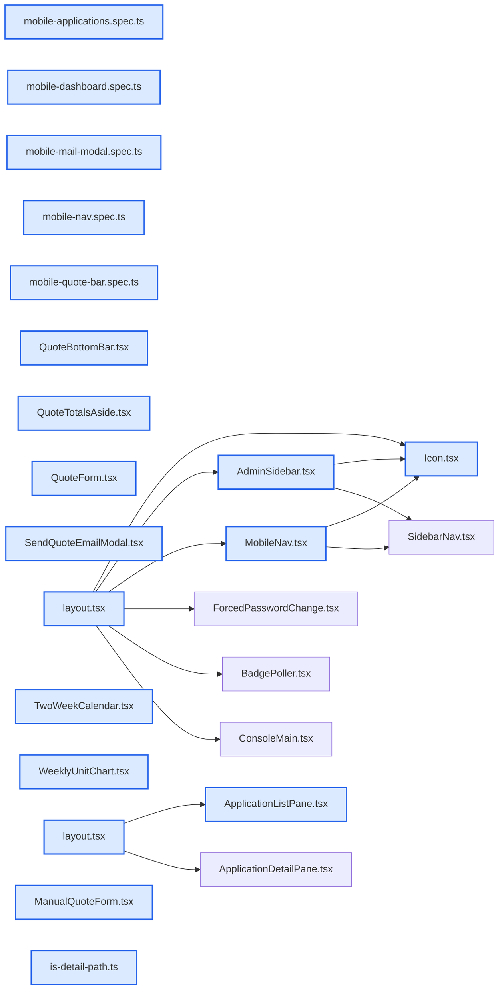

# jhtechsaas — Dev Note: 관리자-모바일-대응

> **📅 Date:** 2026-06-18 · **🗂️ Project:** jhtechsaas · **🏷️ Main Task:** 관리자-모바일-대응
> **👤 Author:** — · **🔖 Tags:** mobile, responsive, tailwind, nextjs, playwright, subagent-driven

---

## TL;DR

관리자 콘솔 모바일 대응 Phase 1~5 완료·머지(#143·#144·#145)·프로덕션 배포(200). 데스크톱 무손상 원칙(모든 분기 lg=1024px)으로 햄버거 드로어·의뢰관리 master-detail·견적 하단 고정 바·대시보드 가로스크롤·메일 모달 폴리시 추가. brainstorming→spec→writing-plans→subagent-driven 파이프라인.

---

## Code Structure

오늘 변경된 파일 간 의존 관계 (자동 분석):



---

## Today's Work

### ✨ `feat(admin-shell)`: Phase 1 — 공통 셸 햄버거 드로어

**Status:** `completed`  
**Files changed:** `apps/web/src/app/admin/_components/MobileNav.tsx`, `apps/web/src/app/admin/_components/Icon.tsx`, `apps/web/src/app/admin/_components/AdminSidebar.tsx`, `apps/web/src/app/admin/layout.tsx`, `apps/web/e2e/mobile-nav.spec.ts`

#### 📋 Context (왜)

고정 사이드바(224px)가 폰 폭에 안 들어가 모바일 콘솔 진입 자체 불가.

#### 🔨 Implementation (무엇을 어떻게)

lg 미만에서 AdminSidebar를 hidden lg:flex로 숨기고 상단바에 ☰+왼쪽 슬라이드 드로어(SidebarNav 재사용)를 MobileNav로 추가. role=dialog/aria-modal/aria-expanded, body 스크롤 잠금, Esc·배경탭·메뉴선택 닫힘.

#### 📐 Architecture Decisions (ADR)

**Decision:** 드로어 열림 상태는 전환용 → 매 로드 닫힘, 쿠키 안 씀(hydration mismatch 회피)


**Decision:** focus-trap은 기존 모달도 미구현 → 앱 전역 후속 보류(YAGNI)


#### 💡 Learnings

- 햄버거 아이콘이 Icon.tsx PATHS에 없어 추가(menu)

---

### ✨ `feat(applications)`: Phase 2 — 의뢰관리 모바일 목록↔상세(master-detail)

**Status:** `completed`  
**Files changed:** `apps/web/src/lib/applications/is-detail-path.ts`, `apps/web/src/app/admin/applications/[id]/_components/ApplicationDetailPane.tsx`, `apps/web/src/app/admin/applications/_components/ApplicationListPane.tsx`, `apps/web/src/app/admin/applications/layout.tsx`, `apps/web/e2e/mobile-applications.spec.ts`

#### 📋 Context (왜)

의뢰관리 2분할(목록 300px+상세)이 폰 폭에 동시에 안 들어감.

#### 🔨 Implementation (무엇을 어떻게)

순수함수 isApplicationDetailPath(TDD)로 상세 라우트 판정. lg 미만: 목록 라우트=목록만 풀폭, 상세 라우트=상세만+‹목록 뒤로가기. lg+는 2분할 유지. 판정 로직 lib/ 분리.

#### 📐 Architecture Decisions (ADR)

**Decision:** 목록 aside는 기존 activeId 재사용해 모바일 숨김(usePathname 중복 안 함)


**Decision:** activeId와 isApplicationDetailPath가 모든 경로서 일치 검증(blank/double 방지)


#### 💡 Learnings

- e2e가 clean 게이트서 skip 안 되게 REST service_role로 의뢰 1건 자체 시드+afterAll cleanup(고유 biz_no)

---

### ✨ `feat(quotes)`: Phase 3 — 견적 작성 모바일 하단 고정 합계 바

**Status:** `completed`  
**Files changed:** `apps/web/src/app/admin/_components/QuoteBottomBar.tsx`, `apps/web/src/app/admin/applications/[id]/_components/QuoteForm.tsx`, `apps/web/src/app/admin/quotes/_components/ManualQuoteForm.tsx`, `apps/web/src/app/admin/_components/QuoteTotalsAside.tsx`, `apps/web/e2e/mobile-quote-bar.spec.ts`

#### 📋 Context (왜)

우측 320px 요약(합계+발행)이 모바일선 맨 아래로 밀려 작성 중 합계·발행 안 보임.

#### 🔨 Implementation (무엇을 어떻게)

공용 QuoteBottomBar(supplyPrice/pending/onSave/onIssue/error)를 두 폼에 추가. 두 폼 모두 totals·submit·pending·error를 같은 클로저에 보유 → prop 위임으로 중복 0. 모바일은 QuoteTotalsAside를 hidden lg:block으로 숨김. 모바일 에러는 바에 표시.

#### 📐 Architecture Decisions (ADR)

**Decision:** 공급가(supply_price, VAT 별도) 표시 — E8 규칙


**Decision:** QuoteLinesEditor는 flex-wrap이라 가로스크롤 불필요


#### 🐛 Problems & Solutions

**Problem:** 우측 요약 숨기니 validation 에러가 안 보임 → QuoteBottomBar에 error prop 추가로 해결


---

### ✨ `feat(dashboard)`: Phase 4 — 대시보드 캘린더·차트 가로 스크롤

**Status:** `completed`  
**Files changed:** `apps/web/src/app/admin/dashboard/_components/TwoWeekCalendar.tsx`, `apps/web/src/app/admin/dashboard/_components/WeeklyUnitChart.tsx`, `apps/web/e2e/mobile-dashboard.spec.ts`

#### 📋 Context (왜)

2주 캘린더·주간 차트가 grid-cols-7 고정이라 폰서 칸 뭉개짐.

#### 🔨 Implementation (무엇을 어떻게)

7열 그리드를 overflow-x-auto 래퍼+min-width(캘린더 680·차트 480)로 감싸 모바일선 가로 스크롤. lg+는 컨테이너 채워 스크롤 없음. e2e: scrollWidth>clientWidth + clientWidth≤viewport.

#### 📐 Architecture Decisions (ADR)

**Decision:** 가로 스크롤 채택(agenda 대안 보류) — 디자인 유지+단순


---

### ✨ `feat(quote-email)`: Phase 5 — 메일 모달 모바일 폴리시

**Status:** `completed`  
**Files changed:** `apps/web/src/app/admin/applications/[id]/_components/quote-frame/SendQuoteEmailModal.tsx`, `apps/web/e2e/mobile-mail-modal.spec.ts`

#### 📋 Context (왜)

메일 모달이 max-h/스크롤 없어 키보드·짧은 화면서 발송 버튼 가려질 수 있음.

#### 🔨 Implementation (무엇을 어떻게)

모달 패널에 max-h-[90dvh] overflow-y-auto. e2e(390x480 키보드 모사): 발행 견적 자체 시드 → 패널 갇힘+스크롤+발송 도달.

#### 📐 Architecture Decisions (ADR)

**Decision:** 고객 상세는 이미 반응형(wrap/truncate+title/flex-wrap/grid-cols-1) → 무변경(YAGNI)


---

## 🎯 Prompt Library

> 오늘 Claude Code에게 보낸 프롬프트 중 학습 가치가 있는 것들.

### ✅ 잘 통한 프롬프트: 모바일 문제 프레이밍(현황+왜+맥락)

```
지금 관리자 페이지에서 견적작성, 수기견적작성, 메일보내기, 고객정보 확인 및 응대를 모바일로 진행하는 경우가 더 많을 것 같아. 관리자 페이지는 사이드바도 있고 견적페이지가 2단 사이드바라 반응형이라고해도 모바일에서 전혀 사용을 못할 상황이야. 모바일에서도 사용하려면 어떻게 하는게 좋을까?
```

**교훈:** 현황(2단 사이드바)+제약(모바일 불가)+사용맥락(외근 빈도)을 함께 줘서 brainstorming이 정확한 설계로 직행. '반응형인데 왜 못 쓰는지' 명시가 핵심.

### ✅ 잘 통한 프롬프트: 실데이터로 직접 확인 요청

```
로컬이니까 장비데이터 2건하고 견적정보 2건만 샘플로 넣어줘. 내가 실제도 정상적으로 동작하는 확인할 수 있게
```

**교훈:** 테스트 통과만으론 부족, 실데이터로 직접 확인. 단 공유 로컬 supabase라 db reset 금지·마커([데모])로 정확 삭제 가능하게.

---

## 📋 Changes Summary

### Added

- MobileNav(드로어)
- QuoteBottomBar(하단바)
- ApplicationDetailPane
- isApplicationDetailPath 순수함수
- e2e 5종(mobile-nav·applications·quote-bar·dashboard·mail-modal)
- menu 아이콘

### Changed

- AdminSidebar/admin layout(드로어 연결)
- ApplicationListPane/applications layout(master-detail)
- QuoteForm/ManualQuoteForm/QuoteTotalsAside(하단바+요약 숨김)
- TwoWeekCalendar/WeeklyUnitChart(가로스크롤)
- SendQuoteEmailModal(max-h+스크롤)

### Fixed

- set-state-in-effect lint(드로어 닫힘을 렌더 중 경로감지로)
- 모바일 견적 validation 에러 미표시

---

## ⏭️ Next Steps

- [ ] 출고의뢰서 모바일 대응(다른 세션 — 설계문서에 '모바일 반응형 필수' 조항 추가됨, 폼 만들 때 처음부터)
- [ ] 신규 모바일 실사용 점검(영업담당 외근 시나리오)
- [ ] 후속: focus-trap(앱 전역 a11y)·MobileNav/AdminSidebar 브랜드·푸터 공통추출(DRY)

---

## 🤖 Claude Code Hints

> **For future Claude Code sessions reading this note:**
> 모바일 대응=데스크톱 무손상 원칙: 모든 분기를 Tailwind lg(1024px)로, 모바일 전용=lg:hidden·데스크톱 전용=hidden lg:block/flex. 전환용 UI 상태(드로어·탭)는 쿠키/localStorage 금지(hydration), 영속 필요만 쿠키. 컴포넌트 판정 로직은 lib/ 순수함수+TDD로 분리. e2e는 clean 게이트서 skip 안 되게 REST service_role 자체 시드+cleanup(고유 biz_no). 공유 로컬 supabase는 db reset 금지(동시 세션 작업 날림).

**Reusable patterns introduced today:**

- `lg 분기 모드전환` — 데스크톱 코드 경로 그대로, lg 미만에서만 레이아웃 모드 전환(드로어/master-detail/하단바/가로스크롤). 회귀 위험 최소.
    - 파일: `apps/web/src/app/admin/_components/MobileNav.tsx`
- `렌더 중 setState로 경로변화 반응` — useEffect setState 금지(set-state-in-effect lint). 렌더 중 prev!==now 가드로 조정(수렴). nav-close·prop동기화에.
    - 파일: `apps/web/src/app/admin/_components/MobileNav.tsx`
- `자가 시드 e2e` — beforeAll REST service_role로 고유 biz_no 시드, afterAll cleanup. clean 게이트서도 skip 없이 검증, 전역카운트 오염 없음.
    - 파일: `apps/web/e2e/mobile-applications.spec.ts`
- `off-base 서브에이전트 복구` — rebase된 worktree서 구현 서브에이전트가 원본 repo 체크아웃에 커밋하는 문제 → 쓰기는 인라인, 리뷰만 읽기전용 서브에이전트. 이탈 커밋은 cherry-pick 복구.
    - 파일: `docs/superpowers/plans/2026-06-17-mobile-admin.md`
