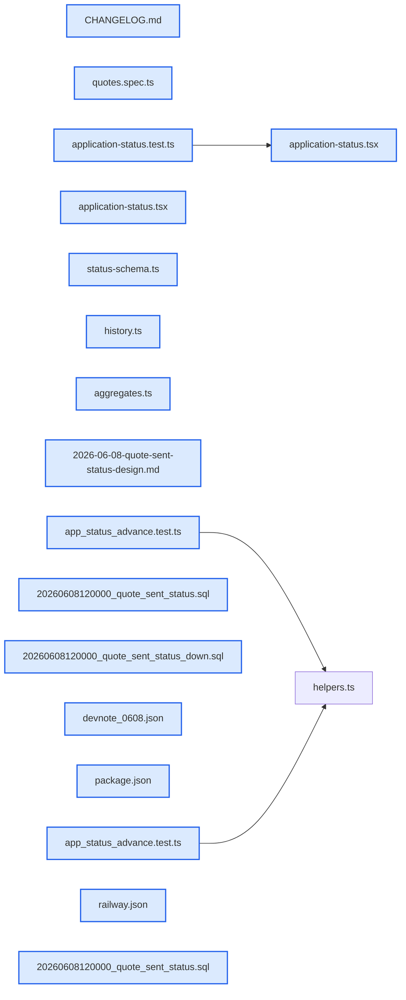

# jhtechsaas — Dev Note: 상태5단계-Railway-라이브QA

> **📅 Date:** 2026-06-08 · **🗂️ Project:** jhtechsaas · **🏷️ Main Task:** 상태5단계-Railway-라이브QA
> **👤 Author:** — · **🔖 Tags:** E5, 상태머신, Railway, Next.js, QA, TDD

---

## TL;DR

E5 후속 + 인프라/QA. 워커 Railway 배포 설정(tsx 런타임), 의뢰 상태 5단계(견적발송 추가), 라이브 도그푸딩으로 발견한 함정 2건 해결. PR #65~#67.

---

## Code Structure

오늘 변경된 파일 간 의존 관계 (자동 분석):



---

## Today's Work

### ✨ `feat(worker)`: 워커 Railway 배포 설정(tsx 런타임 전환)

**Status:** `completed`  
**Files changed:** `apps/worker/package.json`, `railway.json`

#### 📋 Context (왜)

PDF 워커(#63)를 Railway에 띄우려는데 start가 작동 안 함.

#### 🔨 Implementation (무엇을 어떻게)

start: node dist/index.js → tsx src/index.ts. tsx를 dependencies로 이동. railway.json(startCommand, ON_FAILURE).

#### 🐛 Problems & Solutions

**Problem:** node dist/index.js로는 워커가 import에서 죽음 — @jhtechsaas/shared가 빌드 없이 TS 소스(./src/index.ts)로 export돼 node가 .ts를 못 읽음

- **Solution:** tsx 런타임으로 실행(seed:admin과 동일 방식). tsx를 runtime dependency로

#### 💡 Learnings

- monorepo에서 워크스페이스 패키지를 TS 소스로 export하면(빌드 dist 없음) 소비 측은 node dist로 못 돌린다 → tsx 런타임 필요. Railway Root Directory=repo 루트라야 workspace 해석됨

---

### ✨ `feat(db+web)`: 의뢰 상태 5단계 — 견적발송 추가 + 발행 자동 전이

**Status:** `completed`  
**Files changed:** `supabase/migrations/20260608120000_quote_sent_status.sql`, `apps/web/src/lib/application-status.tsx`, `packages/db-tests/src/app_status_advance.test.ts`

#### 📋 Context (왜)

실사용 피드백 — 견적 발행해도 목록이 '견적중'(작성중처럼 읽힘)에 머물거나, 의뢰에서 작성하면 상태가 아예 안 바뀜(수기와 불일치).

#### 🔨 Implementation (무엇을 어떻게)

접수→배정→견적중(작성중)→견적발송(발행됨)→완료(종결). _quote_insert가 draft→견적중, issued→견적발송 자동 전이(앞으로만, quote_sent/closed 보존). CHECK에 quote_sent 추가+백필. 색: 견적발송=초록·완료=네이비. 단일출처(APPLICATION_STATUSES)라 StatusControl·필터·도넛 자동 반영.

#### 📐 Architecture Decisions (ADR)

**Decision:** 견적중=작성중(draft 존재, 발행 직전까지), 견적발송=발행됨


**Decision:** 완료는 자동 아님 — 영업이 직접(시스템이 고객 수주 여부 모름)


**Decision:** 상태는 앞으로만 자동 전진, 다운그레이드·재오픈 안 함


#### 💡 Learnings

- enum/Record를 단일출처(상수배열+타입)로 두면 새 상태 추가 시 UI(드롭다운·필터·차트)가 자동 반영되고, TS exhaustiveness가 누락을 강제로 잡아준다

---

### 🐛 `fix(web)`: 라이브 도그푸딩 — Next 프로덕션 빌드 env 함정

**Status:** `completed`  
**Files changed:** _(미지정)_

#### 📋 Context (왜)

로컬에서 프로덕션 빌드로 서빙 중 로그인이 '비밀번호 틀림'. 계정·비번은 직접 인증하면 정상.

#### 🔨 Implementation (무엇을 어떻게)

원인=pnpm build를 NEXT_PUBLIC env 없이 돌려 .env.local의 프로덕션 Supabase URL이 빌드에 인라인됨. 브라우저가 프로덕션 Supabase로 로그인→로컬 계정 없음→실패. 로컬 env 주입해 재빌드로 해결.

#### 🐛 Problems & Solutions

**Problem:** next prod build는 NEXT_PUBLIC_*를 빌드타임에 인라인 → 로컬 서빙하려면 build 시점에 로컬 env를 줘야 함(런타임 주입은 클라 번들엔 안 먹힘)

- **Solution:** NEXT_PUBLIC_SUPABASE_URL 등을 pnpm build 명령에 함께 주입해 재빌드

#### 💡 Learnings

- NEXT_PUBLIC_*는 빌드타임 인라인. 로컬 DB로 prod build를 서빙하려면 dev처럼 start만 env 주면 안 되고 BUILD에 env를 줘야 한다
- Turbopack dev의 'unexpected response' Server Action 에러는 dev 모드 staleness(코드/프로덕션 정상) — 새 서버+E2E로 검증해 오진 회피

---

## 🎯 Prompt Library

> 오늘 Claude Code에게 보낸 프롬프트 중 학습 가치가 있는 것들.

### ✅ 잘 통한 프롬프트: 라이브 QA 버그 제보→오진 회피

```
견적상세 -> 재발생 -> 발행하기 누르니까 이미지처럼 에러가나네
```

**교훈:** 사용자 화면 에러를 받으면 서버 로그·DB 재현·E2E로 코드 vs 환경(dev staleness/빌드 env)을 갈라낸다. '재시작하면 됨' 단정 전에 헤드리스로 직접 재현해 검증.

---

## 📋 Changes Summary

### Added

- 워커 Railway 배포 설정(tsx 런타임·railway.json)
- 의뢰 상태 5단계(견적발송) + 발행 자동 전이
- CLAUDE.md 게이트에 db reset→seed 함정 명시

### Changed

- 완료 상태 색 네이비, 견적발송 초록
- applications CHECK에 quote_sent

### Fixed

- 로컬 prod-build 로그인 실패(빌드 env에 프로덕션 URL 인라인된 것)

---

## ⏭️ Next Steps

- [ ] Railway 워커 대시보드 실제 배포(Root=repo루트, env 2종) — 코드는 준비됨
- [ ] 의뢰사 견적서 양식 수령 시 render-quote-pdf.ts 교체(+한글 폰트)
- [ ] 레이아웃 전체 정비(상태 변경 컨트롤 위치 등) — 기능 우선 후 일괄
- [ ] 짧은 이월: 전화 placeholder·브랜드색·KPI 실집계

---

## 🤖 Claude Code Hints

> **For future Claude Code sessions reading this note:**
> 로컬에서 prod build를 로컬 Supabase로 서빙하려면 pnpm build 시점에 NEXT_PUBLIC_SUPABASE_URL 등 로컬 env를 주입해야 한다(런타임 주입은 클라 번들에 안 먹힘). Turbopack dev의 'An unexpected response' Server Action 에러는 dev staleness지 코드 버그 아님 — 새 서버/E2E로 검증. 레이아웃은 사용자가 나중에 일괄 정비 예정이라 개별 UI 위치 개선은 보류.

**Reusable patterns introduced today:**

- `단일출처 상태 enum` — 상태값을 상수배열+타입+META Record 단일출처로 두면 새 상태 추가가 UI(드롭다운·필터·차트)에 자동 반영되고 TS가 누락을 강제
    - 파일: `apps/web/src/lib/application-status.tsx`
- `상태 자동 전진(forward-only)` — 도메인 이벤트(발행)가 부모 상태를 앞으로만 전진(where status in (...) 로 다운그레이드/재오픈 차단)
    - 파일: `supabase/migrations/20260608120000_quote_sent_status.sql`
