# jhtechsaas — Dev Note: 장비출고의뢰서-Phase3-4

> **📅 Date:** 2026-06-17 · **🗂️ Project:** jhtechsaas · **🏷️ Main Task:** 장비출고의뢰서-Phase3-4
> **👤 Author:** — · **🔖 Tags:** release-order, supabase-rpc, nextjs, worker-pdf, puppeteer, e2e

---

## TL;DR

장비출고의뢰서 기능을 Phase 3a(작성/발행 RPC)→3b(작성 폼 UI)→4(워커 PDF·다운로드)까지 완성하고, 라이브 검증서 발견한 PDF 양식 충실도·임시저장 안내 2건을 수정해 프로덕션 배포. PR #140·#141·#142 머지, 3a는 DB push.

---

## Code Structure

오늘 변경된 파일 간 의존 관계 (자동 분석):

```mermaid
flowchart LR
    N0["release-orders.spec.ts"]
    N1["ReleaseOrderForm.tsx"]
    N2["ReleaseOrderPdfButton.tsx"]
    N3["page.tsx"]
    N4["page.tsx"]
    N5["route.ts"]
    N6["guard.ts"]
    N7["actions.ts"]
    N8["form.test.ts"]
    N9["form.ts"]
    N10["queries.ts"]
    N11["_render-release-check.ts"]
    N12["release-html.test.ts"]
    N13["release-html.ts"]
    N14["release-pdf.ts"]
    N15["render-release-pdf.ts"]
    N16["runner.ts"]
    N17["release_orders.test.ts"]
    N18["release-order.ts"]
    N19["20260617160000_release_order_rpc.sql"]
    N20["devnote_jh_data.json"]
    N21["release-orders.spec.ts"]
    N22["AssignControl.tsx"]
    N23["RegisterCustomerButton.tsx"]
    N24["ReleaseOrderForm.tsx"]
    N25["ReleaseOrderPdfButton.tsx"]
    N26["StatusControl.tsx"]
    N27["ApplicantInfo.tsx"]
    N28["DeleteQuoteButton.tsx"]
    N29["InstallSurvey.tsx"]
    N30["OptionLists.tsx"]
    N31["Placeholders.tsx"]
    N32["QuoteHero.tsx"]
    N33["QuoteSummaryPanel.tsx"]
    N34["SelectedEquipment.tsx"]
    N35["SitePhotos.tsx"]
    N36["VersionDiff.tsx"]
    N37["VersionHistory.tsx"]
    N38["VersionInfoModal.tsx"]
    N39["page.tsx"]
    N40["route.ts"]
    N41["actions.ts"]
    N42["form.ts"]
    N43["queries.ts"]
    N44["assets.ts"]
    N45["browser.ts"]
    N46["email.ts"]
    N47["queue.ts"]
    N48["quote-pdf.ts"]
    N49["release-html.ts"]
    N50["release-pdf.ts"]
    N51["render-release-pdf.ts"]
    N52["runner.ts"]
    N53["helpers.ts"]
    N54["release_orders.test.ts"]
    N55["release-order.ts"]
    N56["20260617160000_release_order_rpc.sql"]
    N57["20260617160000_release_order_rpc_down.sql"]
    N54 --> N53
    N39 --> N24
    N24 --> N25
    N51 --> N45
    N51 --> N49
    N50 --> N51
    N50 --> N44
    N50 --> N49
    N52 --> N47
    N52 --> N48
    N52 --> N50
    N52 --> N46
    N17 --> N53
    N8 --> N42
    N1 --> N25
    N4 --> N24
    N3 --> N26
    N3 --> N22
    N3 --> N23
    N3 --> N32
    N3 --> N37
    N3 --> N36
    N3 --> N38
    N3 --> N28
    N3 --> N27
    N3 --> N29
    N3 --> N35
    N3 --> N34
    N3 --> N30
    N3 --> N33
    N3 --> N31
    N15 --> N45
    N15 --> N49
    N14 --> N51
    N14 --> N44
    N14 --> N49
    N16 --> N47
    N16 --> N48
    N16 --> N50
    N16 --> N46
    N12 --> N49
    N11 --> N51
    N11 --> N44
    N11 --> N49
    style N25 fill:#dbeafe,stroke:#2563eb,stroke-width:2px
    style N9 fill:#dbeafe,stroke:#2563eb,stroke-width:2px
    style N56 fill:#dbeafe,stroke:#2563eb,stroke-width:2px
    style N40 fill:#dbeafe,stroke:#2563eb,stroke-width:2px
    style N57 fill:#dbeafe,stroke:#2563eb,stroke-width:2px
    style N49 fill:#dbeafe,stroke:#2563eb,stroke-width:2px
    style N55 fill:#dbeafe,stroke:#2563eb,stroke-width:2px
    style N51 fill:#dbeafe,stroke:#2563eb,stroke-width:2px
    style N50 fill:#dbeafe,stroke:#2563eb,stroke-width:2px
    style N21 fill:#dbeafe,stroke:#2563eb,stroke-width:2px
    style N24 fill:#dbeafe,stroke:#2563eb,stroke-width:2px
    style N7 fill:#dbeafe,stroke:#2563eb,stroke-width:2px
    style N11 fill:#dbeafe,stroke:#2563eb,stroke-width:2px
    style N16 fill:#dbeafe,stroke:#2563eb,stroke-width:2px
    style N12 fill:#dbeafe,stroke:#2563eb,stroke-width:2px
    style N52 fill:#dbeafe,stroke:#2563eb,stroke-width:2px
    style N2 fill:#dbeafe,stroke:#2563eb,stroke-width:2px
    style N14 fill:#dbeafe,stroke:#2563eb,stroke-width:2px
    style N20 fill:#dbeafe,stroke:#2563eb,stroke-width:2px
    style N17 fill:#dbeafe,stroke:#2563eb,stroke-width:2px
    style N18 fill:#dbeafe,stroke:#2563eb,stroke-width:2px
    style N39 fill:#dbeafe,stroke:#2563eb,stroke-width:2px
    style N42 fill:#dbeafe,stroke:#2563eb,stroke-width:2px
    style N15 fill:#dbeafe,stroke:#2563eb,stroke-width:2px
    style N8 fill:#dbeafe,stroke:#2563eb,stroke-width:2px
    style N41 fill:#dbeafe,stroke:#2563eb,stroke-width:2px
    style N0 fill:#dbeafe,stroke:#2563eb,stroke-width:2px
    style N1 fill:#dbeafe,stroke:#2563eb,stroke-width:2px
    style N4 fill:#dbeafe,stroke:#2563eb,stroke-width:2px
    style N10 fill:#dbeafe,stroke:#2563eb,stroke-width:2px
    style N43 fill:#dbeafe,stroke:#2563eb,stroke-width:2px
    style N54 fill:#dbeafe,stroke:#2563eb,stroke-width:2px
    style N6 fill:#dbeafe,stroke:#2563eb,stroke-width:2px
    style N5 fill:#dbeafe,stroke:#2563eb,stroke-width:2px
    style N13 fill:#dbeafe,stroke:#2563eb,stroke-width:2px
    style N3 fill:#dbeafe,stroke:#2563eb,stroke-width:2px
    style N19 fill:#dbeafe,stroke:#2563eb,stroke-width:2px
```



---

## Today's Work

### ✨ `feat(release-orders)`: 출고의뢰서 작성/발행 RPC (Phase 3a)

**Status:** `completed`  
**Files changed:** `supabase/migrations/20260617160000_release_order_rpc.sql`, `supabase/rollback/20260617160000_release_order_rpc_down.sql`, `packages/db-tests/src/release_orders.test.ts`

#### 📋 Context (왜)

Phase 1(DB)·2(shared Zod·프리필) 위에 작성/발행 결선이 필요. 발행 시 PDF 잡을 큐에 넣어야 함.

#### 🔨 Implementation (무엇을 어떻게)

upsert_release_order(application 1:1)·issue_release_order(draft→issued) SECURITY DEFINER RPC. 스냅샷(회사·장비명·설치일 등)은 서버가 application/최신 발행견적에서 채움(클라 미신뢰). 1:1은 INSERT ON CONFLICT로 원자화. details 형태+20KB 캡. 발행 가드(견적·설치일 없으면 거부). release_pdf enqueue 트리거. db-tests 17종.

#### 💻 Key Code

**`supabase/migrations/20260617160000_release_order_rpc.sql`**

```sql
if v_row.quote_id is null then
  raise exception '연결된 견적이 없어 발행할 수 없습니다';
end if;
if v_row.install_at is null then
  raise exception '설치 일시가 없어 발행할 수 없습니다';
end if;
```

_I1 발행 가드 — 서버 RPC가 권위(클라 버튼 disable은 미러)_

#### 📐 Architecture Decisions (ADR)

**Decision:** 발행 가드(견적·설치일)는 issue RPC가 서버 강제 — 클라 버튼만 막으면 약함


**Decision:** 1:1 upsert는 부분UNIQUE가 아닌 전체 제약이라 ON CONFLICT 정상 작동


**Decision:** PR을 3a / 3b+4로 분할(리뷰 단위·RLS 선확립)


#### 🐛 Problems & Solutions

**Problem:** 코드리뷰서 동시 upsert가 raw 23505 → ON CONFLICT 원자화


**Problem:** details 서버 미검증 → 20KB 크기 캡 추가


**Problem:** 로컬 anon db-test가 connection terminated(환경 이슈) → has_function_privilege 결정적 단언으로 회피


#### 💡 Learnings

- SECURITY DEFINER는 RLS 우회 → 권한·행스코프를 함수에서 명시 재검사
- 스냅샷=서버가 채움, details(작업입력)=클라 Zod 경계(견적 items와 동일)

---

### ✨ `feat(web)`: 출고의뢰서 작성 폼 UI (Phase 3b)

**Status:** `completed`  
**Files changed:** `apps/web/src/lib/release-orders/actions.ts`, `apps/web/src/lib/release-orders/queries.ts`, `apps/web/src/lib/release-orders/form.ts`, `apps/web/src/app/admin/applications/[id]/release-order/page.tsx`, `apps/web/src/app/admin/applications/[id]/_components/ReleaseOrderForm.tsx`, `apps/web/e2e/release-orders.spec.ts`

#### 📋 Context (왜)

RPC 위에 종이 양식 그대로의 작성 화면 필요. 자동채움·프린터/커팅기 분기.

#### 🔨 Implementation (무엇을 어떻게)

프리필 로더(의뢰+최신 발행견적+기존 출고서, device_kind 자동판별=장비 대분류 quote_logo_kind 폴백 printer), 서버액션(save/issue, 가드 재호출), 작성 페이지+의뢰상세 진입 버튼, 폼 컴포넌트(4섹션·민트 자동채움·발행 disable=I1 미러). e2e 진입→발행→복귀.

#### 📐 Architecture Decisions (ADR)

**Decision:** device_kind 자동판별은 best-effort, 폼 토글로 수정 가능


**Decision:** 발행 견적 있을 때만 진입 버튼 노출


#### 🐛 Problems & Solutions

**Problem:** e2e에서 회사명이 h1+자동채움 둘에 잡혀 strict-mode 충돌 → heading 단언으로 좁힘


#### 💡 Learnings

- apps/web는 Next.js 16 — AGENTS.md대로 닥 선독, 단 기존 견적 폼이 검증된 패턴이라 미러가 안전

---

### ✨ `feat(worker)`: 워커 PDF + 다운로드 (Phase 4)

**Status:** `completed`  
**Files changed:** `apps/worker/src/jobs/release-html.ts`, `apps/worker/src/jobs/render-release-pdf.ts`, `apps/worker/src/jobs/release-pdf.ts`, `apps/worker/src/jobs/runner.ts`, `apps/web/src/app/admin/applications/[id]/release-order/pdf/route.ts`, `apps/web/src/app/admin/applications/[id]/_components/ReleaseOrderPdfButton.tsx`

#### 📋 Context (왜)

발행 시 enqueue된 release_pdf 잡을 워커가 처리해 PDF 생성·다운로드 제공 필요.

#### 🔨 Implementation (무엇을 어떻게)

release-html(A4 인쇄형, NotoSansKR @font-face 임베드)→render-release-pdf(puppeteer, 견적 PDF 인프라 재사용)→processReleasePdfJob(조회→렌더→release-orders 버킷→pdf_url). runner에 release_pdf 케이스. 다운로드 라우트(서명URL)+폴링 버튼. 시각검증=tsx 하니스→Read 대조.

#### 💡 Learnings

- Railway 크롬은 시스템폰트 0 → 폰트 base64 @font-face 임베드 필수
- PDF 시각검증은 Read 도구로(cat/grep 금지)

---

### 🐛 `fix(release-orders)`: PDF 양식 충실도 + 임시저장 안내 (라이브 검증 fix)

**Status:** `completed`  
**Files changed:** `packages/shared/src/release-order.ts`, `apps/web/src/lib/release-orders/form.ts`, `apps/worker/src/jobs/release-html.ts`, `apps/web/src/app/admin/applications/[id]/_components/ReleaseOrderForm.tsx`

#### 📋 Context (왜)

프로덕션 라이브 스모크서 PDF가 간소화된 표 형태로 목업과 크게 다름 + 임시저장 안내가 안 보임을 사용자가 발견.

#### 🔨 Implementation (무엇을 어떻게)

PDF를 목업 그대로 재구성(프린터/커팅기 2분할·체크박스 ✓/빈박스·민트 자동채움·준비사항 2×2). 고정 체크박스 목록 RELEASE_OPTIONS를 shared로 이동(화면·PDF 공용, web은 재export). 안내/에러를 폼 상단뿐 아니라 버튼 옆에도 노출.

#### 📐 Architecture Decisions (ADR)

**Decision:** 출고의뢰서 PDF의 양식 충실도 기준 = 승인 목업 HTML(2026-06-17-release-order-mockup.html)


#### 🐛 Problems & Solutions

**Problem:** 설계의 '양식 전체 재현'을 PDF에서 간소화해 어김 → 목업 대조 누락이 원인


#### 💡 Learnings

- PDF 시각검증 시 '렌더 성공'이 아니라 '목업과 동일한가'를 봐야 함

---

## 🎯 Prompt Library

> 오늘 Claude Code에게 보낸 프롬프트 중 학습 가치가 있는 것들.

### ✅ 잘 통한 프롬프트: 발행 가드 위치

```
I1은 견적이나 설치일이 없는 경우에는 발행버튼을 막아줘.
```

**교훈:** '버튼을 막아줘'라도 서버 RPC가 권위여야 안전 — 클라 disable은 UX 미러. 단일테넌트라도 SECURITY DEFINER는 명시 검증.

### ✅ 잘 통한 프롬프트: PDF 충실도 지적

```
만들어진 PDF가 내가 보여준 샘플과 디자인이 너무 많이 다른데?
```

**교훈:** 설계가 '양식 전체 재현'이면 PDF 시각검증을 '렌더 성공'이 아니라 '승인 목업과 1:1'로 판정해야 했다. 간소화는 설계 위반.

---

## 📋 Changes Summary

### Added

- 장비출고의뢰서 작성/발행 RPC
- 출고의뢰서 작성 폼 + 의뢰상세 진입
- 워커 release_pdf PDF 생성 + 다운로드 라우트

### Changed

- RELEASE_OPTIONS 고정 체크박스 목록을 shared로 이동(화면·PDF 공용)

### Fixed

- 출고의뢰서 PDF를 종이 양식(목업) 그대로 재구성
- 임시저장 안내를 버튼 옆에도 노출

---

## ⏭️ Next Steps

- [ ] 출고의뢰서 PDF 디자인 미세조정(백로그 — 천천히)
- [ ] 출고의뢰서 삭제 UI(현재 없음, Phase 5 후보)
- [ ] 프로덕션 잔여 테스트 출고의뢰서 1건 정리(구 디자인 PDF)
- [ ] 2차 라이브 스모크: 새 출고의뢰서 발행으로 새 PDF 디자인 확인
- [ ] 운영 후속(이월): 장비별 카탈로그 업로드·기존 사용자 직책연락처·견적 로고 설정

---

## 🤖 Claude Code Hints

> **For future Claude Code sessions reading this note:**
> 출고의뢰서 PDF의 양식 충실도 기준은 docs/superpowers/specs/2026-06-17-release-order-mockup.html — apps/worker/src/jobs/release-html.ts 수정 시 반드시 목업과 대조하고 tsx 하니스로 렌더→Read 도구로 PDF 확인(cat/grep 금지). 화면·PDF 공용 고정목록은 shared RELEASE_OPTIONS. 발행 가드(견적·설치일)는 issue_release_order RPC가 권위, 클라 버튼 disable은 미러일 뿐.

**Reusable patterns introduced today:**

- `발행 가드 서버 권위 + 클라 미러` — 발행 전제 검증은 SECURITY DEFINER RPC가 강제, 클라 버튼 disable은 같은 규칙 미러
    - 파일: `supabase/migrations/20260617160000_release_order_rpc.sql`
- `화면·PDF 공용 로직 shared` — 고정 체크박스 목록·프리필 순수함수를 shared에 두고 web 폼·worker PDF가 공유
    - 파일: `packages/shared/src/release-order.ts`
- `PDF 시각검증 하니스` — tsx로 샘플 렌더→/tmp 저장→Read 도구로 목업 대조
    - 파일: `apps/worker/src/jobs/_render-release-check.ts`
